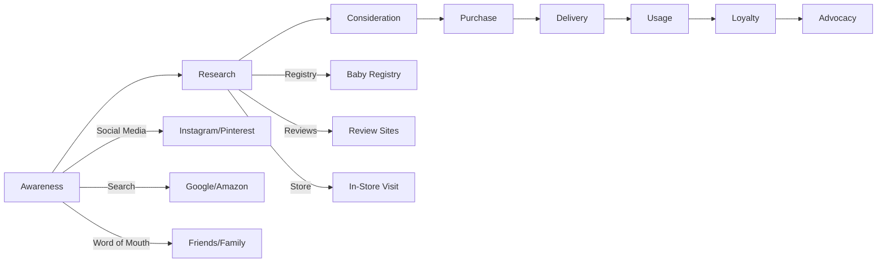

# Competitive Analysis: Baby Clothing E-Commerce Platform

**Document Version:** 1.0  
**Date:** February 2026  
**Author:** Product & Architecture Team  
**Status:** Final

---

## Executive Summary

This document provides a comprehensive competitive analysis of the baby clothing e-commerce market, focusing on major players like Carter's and H&M Kids, along with emerging competitors. The analysis informs our brand positioning, feature prioritization, and technical architecture decisions.

---

## 1. Market Overview

### 1.1 Global Baby Clothing Market

The global baby clothing market is valued at approximately $62.4 billion in 2025, with projected CAGR of 6.2% through 2030. Key market drivers include:

- Rising disposable income in emerging markets
- Increasing preference for organic and sustainable materials
- Growth in online shopping adoption (accelerated post-pandemic)
- Premiumization trend in baby products
- Social media influence on parenting purchases

### 1.2 Market Segmentation

| Segment | Market Share | Growth Rate | Key Players |
|---------|-------------|-------------|-------------|
| Mass Market | 45% | 4.5% | Carter's, H&M, Target |
| Premium | 25% | 7.8% | Petit Bateau, Bonpoint |
| Sustainable/Organic | 18% | 12.3% | Burt's Bees, Pact |
| Fast Fashion | 12% | 5.1% | Shein, Temu |

---

## 2. Primary Competitor Analysis

### 2.1 Carter's

**Company Overview:**
- Founded: 1865 (Atlanta, Georgia)
- Revenue: $3.2 billion (2024)
- Market Position: #1 baby clothing retailer in North America
- Brands: Carter's, OshKosh B'gosh, Skip Hop, Little Planet

**Brand Positioning:**
- Tagline: "Everything babies need"
- Core Value: Trusted quality at affordable prices
- Target Audience: Value-conscious parents, gift-givers
- Price Range: $8-40 per item (mass market)

**Digital Presence:**
- Website: carters.com
- Monthly Traffic: ~25 million visits
- Mobile App: Yes (iOS/Android)
- Loyalty Program: Carter's Rewards

**Key Strengths:**
1. **Brand Recognition:** 90%+ awareness among US parents
2. **Omnichannel Presence:** 1,000+ retail locations + robust e-commerce
3. **Product Breadth:** Complete baby wardrobe solution
4. **Size Consistency:** Reliable sizing across product lines
5. **Gift Registry:** Established registry platform

**Key Weaknesses:**
1. **Legacy Technology:** Slower site performance vs. modern platforms
2. **Limited Personalization:** Basic recommendation engine
3. **International Presence:** Primarily North America focused
4. **Sustainability:** Perceived as lagging in eco-friendly options

**E-Commerce Features:**
- Product filtering by size, color, price, category
- Size guide with measurement tools
- Customer reviews with photo uploads
- Store pickup and same-day delivery options
- Gift card and e-gift card support
- Registry with universal wishlist feature

**Technical Stack (Estimated):**
- E-commerce Platform: Salesforce Commerce Cloud
- CMS: Custom/AEM
- CDN: Akamai
- Analytics: Adobe Analytics
- Personalization: Adobe Target

---

### 2.2 H&M Kids

**Company Overview:**
- Founded: 1947 (Stockholm, Sweden)
- Revenue: $22 billion total (Kids ~15% of revenue)
- Market Position: Global fast-fashion leader
- Brands: H&M, H&M Kids, & Other Stories, COS

**Brand Positioning:**
- Tagline: "Fashion and quality at the best price"
- Core Value: Trendy, affordable fashion for all
- Target Audience: Fashion-forward parents, style-conscious families
- Price Range: $5-35 per item (value fashion)

**Digital Presence:**
- Website: hm.com
- Monthly Traffic: ~150 million visits (global)
- Mobile App: Yes (iOS/Android)
- Loyalty Program: H&M Membership

**Key Strengths:**
1. **Global Reach:** 4,800+ stores in 75+ markets
2. **Fashion-Forward:** Trendy designs, frequent new arrivals
3. **Sustainability Initiatives:** Conscious Collection, garment recycling
4. **Price Competitiveness:** Aggressive pricing strategy
5. **Supply Chain Efficiency:** Fast inventory turnover

**Key Weaknesses:**
1. **Quality Perception:** Fast fashion stigma
2. **Size Inconsistency:** Variable sizing across collections
3. **Baby-Specific Features:** Less specialized than dedicated baby brands
4. **Customer Service:** Limited personalized support

**E-Commerce Features:**
- Virtual try-on (AR)
- Style boards and outfit combinations
- Member-exclusive prices and early access
- Click & collect service
- Free returns extended period
- Sustainability ratings on products

**Technical Stack (Estimated):**
- E-commerce Platform: Custom (microservices)
- CMS: Custom headless
- CDN: Cloudflare
- Analytics: Google Analytics 360 + custom
- Search: Algolia

---

### 2.3 Secondary Competitors

#### 2.3.1 Target (Cat & Jack)

**Overview:**
- Private label brand: Cat & Jack
- Revenue: $15 billion (children's category)
- Known for: Trendy designs, 1-year guarantee

**Key Differentiators:**
- In-store experience integration
- Drive-up and order pickup
- Target Circle loyalty program
- Exclusive designer collaborations

#### 2.3.2 Amazon (Amazon Family)

**Overview:**
- Amazon Family program
- Subscribe & Save for baby products
- Prime delivery advantages

**Key Differentiators:**
- Vast product selection
- Fast shipping (Prime)
- Customer review ecosystem
- Baby Registry with completion discount

#### 2.3.3 Zara Kids

**Overview:**
- Spanish fast-fashion giant
- Mini-me collections
- Premium positioning within fast fashion

**Key Differentiators:**
- Fashion-forward designs
- Limited edition drops
- Premium store experience
- Strong Instagram presence

#### 2.3.4 Patagonia Kids

**Overview:**
- Outdoor apparel focus
- Worn Wear resale program
- Strong sustainability mission

**Key Differentiators:**
- Durability and quality
- Environmental commitment
- Repair and reuse programs
- Premium pricing justified by longevity

---

## 3. Feature Comparison Matrix

| Feature | Carter's | H&M | Target | Amazon | Our Target |
|---------|----------|-----|--------|--------|------------|
| Product Catalog Size | 5,000+ | 3,000+ | 10,000+ | 100,000+ | 2,000-3,000 |
| Size Guide | ✅ Basic | ✅ Basic | ✅ Basic | ⚠️ Variable | ✅ AI-Powered |
| Gift Registry | ✅ Full | ❌ None | ✅ Full | ✅ Full | ✅ AI-Enhanced |
| Virtual Try-On | ❌ | ✅ AR | ⚠️ Limited | ❌ | ✅ AI-Powered |
| Personalization | ⚠️ Basic | ⚠️ Basic | ✅ Good | ✅ Advanced | ✅ AI-First |
| Sustainability Info | ⚠️ Limited | ✅ Good | ⚠️ Basic | ⚠️ Basic | ✅ Comprehensive |
| Mobile App | ✅ | ✅ | ✅ | ✅ | Phase 2 |
| Loyalty Program | ✅ | ✅ | ✅ | ✅ | ✅ |
| Live Chat | ✅ | ✅ | ✅ | ✅ Bot | ✅ AI + Human |
| Same-Day Delivery | ✅ | ⚠️ Select | ✅ | ✅ | ✅ |
| International Shipping | ⚠️ Limited | ✅ Global | ❌ | ✅ Global | Phase 2 |

---

## 4. Pricing Strategy Analysis

### 4.1 Price Point Distribution

```
Budget (<$10):     [████████████] 30%
Value ($10-20):    [████████████████████] 45%
Mid-Premium ($20-35): [████████] 18%
Premium ($35+):    [████] 7%
```

### 4.2 Competitive Pricing Examples

| Item Category | Carter's | H&M | Target | Market Average |
|---------------|----------|-----|--------|----------------|
| Bodysuit (3-pack) | $15-20 | $12-18 | $12-15 | $14-17 |
| Footie Pajamas | $18-28 | $15-22 | $15-20 | $16-23 |
| Dress | $20-35 | $18-30 | $18-25 | $19-30 |
| Outerwear | $30-50 | $25-45 | $25-40 | $27-45 |
| Accessories | $8-15 | $6-12 | $6-10 | $7-12 |

### 4.3 Recommended Pricing Strategy

**Positioning:** Value-oriented with premium quality perception

| Tier | Price Range | Margin Target | Volume |
|------|-------------|---------------|--------|
| Essentials | $8-15 | 45% | 50% |
| Core | $15-25 | 55% | 35% |
| Premium | $25-40 | 60% | 12% |
| Exclusive | $40+ | 65% | 3% |

---

## 5. Customer Journey Analysis

### 5.1 Primary User Personas

#### Persona 1: First-Time Parent (Sarah)
- Age: 28-35
- Income: $75,000-120,000
- Behavior: Research-heavy, quality-focused, registry-dependent
- Pain Points: Overwhelmed by choices, uncertain about sizing
- Opportunity: AI-powered recommendations, predictive sizing

#### Persona 2: Value-Conscious Parent (Maria)
- Age: 25-40
- Income: $50,000-80,000
- Behavior: Deal-seeker, bulk buyer, seasonal shopper
- Pain Points: Budget constraints, timing purchases for sales
- Opportunity: Loyalty rewards, bundle deals, price alerts

#### Persona 3: Gift Giver (Jennifer)
- Age: 25-55
- Income: Variable
- Behavior: Registry shopper, seasonal (holidays, showers)
- Pain Points: Finding right size/style, gift presentation
- Opportunity: Curated gift sets, smart registry suggestions

#### Persona 4: Fashion-Forward Parent (Alex)
- Age: 25-35
- Income: $100,000+
- Behavior: Trend-conscious, Instagram-influenced
- Pain Points: Finding stylish options, quality concerns
- Opportunity: Limited editions, style collections

### 5.2 Customer Journey Map



---

## 6. Gap Analysis & Opportunities

### 6.1 Market Gaps Identified

| Gap | Current State | Opportunity | Priority |
|-----|---------------|-------------|----------|
| AI-Powered Sizing | Basic size charts | Predictive sizing based on baby growth data | High |
| Smart Registry | Static wishlists | AI-curated registry with growth predictions | High |
| Sustainability Transparency | Limited info | Full supply chain visibility | Medium |
| Personalization | Basic recommendations | AI-driven style and size recommendations | High |
| Post-Purchase Engagement | Minimal | Growth tracking, re-order reminders | Medium |
| Community Features | None | Parent community, style sharing | Low |

### 6.2 Competitive Advantages to Pursue

1. **AI-First Approach**
   - Predictive sizing algorithm
   - Smart registry recommendations
   - Personalized shopping experience
   - Automated inventory management

2. **Value + Quality Positioning**
   - Premium quality at accessible prices
   - Transparent pricing model
   - Sustainability without premium markup

3. **Modern Technology Stack**
   - Headless architecture for flexibility
   - Fast, mobile-first experience
   - Real-time inventory and personalization

4. **Enhanced Customer Experience**
   - Proactive customer service
   - Seamless omnichannel (future)
   - Community and content integration

---

## 7. Brand Positioning Framework

### 7.1 Positioning Statement

> "For value-conscious parents who want premium quality baby clothing without the premium price tag, [Brand Name] is the modern baby clothing brand that combines AI-powered personalization with sustainable practices. Unlike traditional retailers, we use smart technology to predict your baby's needs and deliver perfectly timed recommendations, making parenting easier while saving you money."

### 7.2 Brand Archetype

**Primary:** The Caregiver  
**Secondary:** The Creator

Values: Nurturing, Trustworthy, Innovative, Accessible

### 7.3 Unique Value Propositions

1. **Smart Shopping:** AI-powered sizing and recommendations
2. **Honest Value:** Premium quality at fair, transparent prices
3. **Sustainable Future:** Eco-conscious without the markup
4. **Modern Experience:** Fast, intuitive, mobile-first

### 7.4 Brand Personality Traits

| Trait | Description | Voice Example |
|-------|-------------|---------------|
| Warm | Caring, nurturing, supportive | "We're here to help your little one grow" |
| Smart | Intelligent, innovative, helpful | "Our AI knows what your baby needs next" |
| Honest | Transparent, authentic, trustworthy | "No hidden costs, just honest value" |
| Modern | Fresh, current, stylish | "Baby clothes that keep up with your lifestyle" |

---

## 8. Key Success Metrics

### 8.1 Business KPIs

| Metric | Year 1 Target | Year 3 Target |
|--------|---------------|---------------|
| Revenue | $2M | $15M |
| Average Order Value | $65 | $75 |
| Customer Acquisition Cost | $25 | $18 |
| Customer Lifetime Value | $180 | $250 |
| Repeat Purchase Rate | 35% | 50% |
| Net Promoter Score | 45 | 60 |

### 8.2 Digital KPIs

| Metric | Target |
|--------|--------|
| Site Load Time | <2 seconds |
| Mobile Conversion Rate | 2.5% |
| Cart Abandonment Rate | <65% |
| Search Conversion Rate | 4% |
| App Store Rating | 4.5+ (Phase 2) |

---

## 9. Recommendations Summary

### 9.1 Product Strategy

1. Launch with curated essentials collection (500-800 SKUs)
2. Focus on 0-24 months initially, expand to 5T
3. Emphasize quality basics with seasonal fashion accents
4. Develop exclusive "smart" product lines

### 9.2 Technology Strategy

1. Build on modern headless architecture
2. Invest in AI/ML capabilities from day one
3. Prioritize mobile experience
4. Design for global scalability

### 9.3 Marketing Strategy

1. Content-led customer acquisition
2. Influencer partnerships (micro-influencers)
3. Registry-focused campaigns
4. Loyalty program from launch

---

## 10. Appendix

### 10.1 Competitor Website Screenshots
*[To be added during detailed analysis]*

### 10.2 Social Media Analysis
*[To be added during detailed analysis]*

### 10.3 Customer Review Analysis
*[To be added during detailed analysis]*

---

**Document Control:**
- Created: February 2026
- Last Updated: February 2026
- Next Review: March 2026
