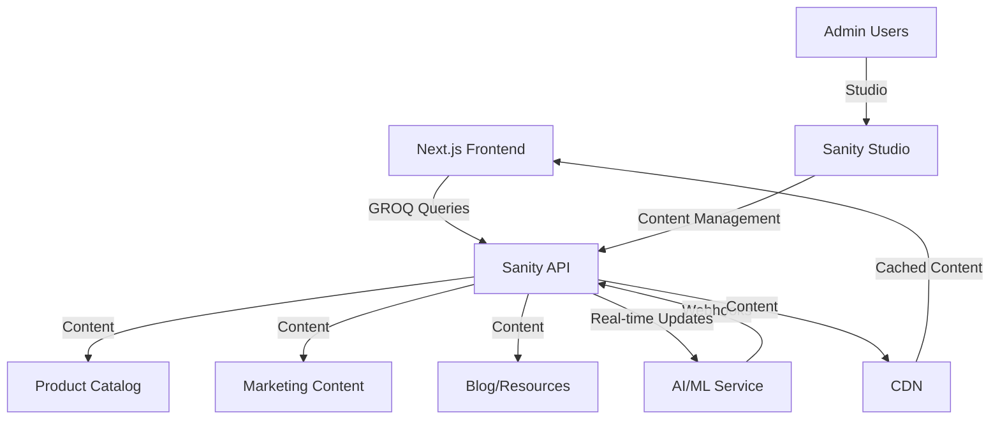

# CMS Evaluation: Headless Content Management Systems

**Document Version:** 1.0  
**Date:** February 2026  
**Author:** Architecture Team  
**Status:** Final

---

## Executive Summary

This document provides a comprehensive evaluation of three leading headless CMS platforms—Sanity, Payload, and Keystatic—for the baby clothing e-commerce platform. The evaluation focuses on ease of deployment, simplicity, long-term maintainability, and alignment with our AI-first, value-oriented brand positioning.

**Recommendation:** **Sanity** is selected as the optimal CMS choice based on its mature ecosystem, superior developer experience, real-time collaboration features, and proven scalability for e-commerce applications.

---

## 1. Evaluation Criteria

### 1.1 Primary Criteria

| Criterion | Weight | Description |
|-----------|--------|-------------|
| Ease of Deployment | 20% | Setup complexity, hosting options, CI/CD integration |
| Developer Experience | 25% | DX, documentation, community support |
| Scalability | 20% | Performance at scale, caching, CDN |
| E-commerce Readiness | 15% | Product catalog features, inventory management |
| Long-term Maintainability | 20% | Upgrade path, stability, vendor lock-in risk |

### 1.2 Secondary Criteria

- API capabilities (GraphQL, REST)
- Real-time collaboration
- Media handling
- Localization support
- Cost structure
- Security features

---

## 2. Platform Analysis

### 2.1 Sanity

#### 2.1.1 Overview

**Founded:** 2016 (Oslo, Norway)  
**Type:** Headless CMS with real-time collaboration  
**License:** Open Source (MIT) + Managed Cloud  
**Current Version:** v3.x  
**GitHub Stars:** ~28,000  
**Active Maintainers:** 50+  

#### 2.1.2 Architecture

```
┌─────────────────────────────────────────────────────────────┐
│                        Sanity Studio                        │
│  ┌──────────┐  ┌──────────┐  ┌──────────┐  ┌──────────┐   │
│  │ Products │  │ Content  │  │ Media    │  │ Settings │   │
│  └──────────┘  └──────────┘  └──────────┘  └──────────┘   │
└─────────────────────────────────────────────────────────────┘
                              │
                              ▼
┌─────────────────────────────────────────────────────────────┐
│                    Sanity API Layer                         │
│  ┌──────────────┐  ┌──────────────┐  ┌──────────────┐     │
│  │   GROQ API   │  │  GraphQL API │  │  REST API    │     │
│  └──────────────┘  └──────────────┘  └──────────────┘     │
└─────────────────────────────────────────────────────────────┘
                              │
                              ▼
┌─────────────────────────────────────────────────────────────┐
│                    Sanity Cloud                             │
│  ┌──────────────┐  ┌──────────────┐  ┌──────────────┐     │
│  │   CDN Cache  │  │   Database   │  │   Image API  │     │
│  └──────────────┘  └──────────────┘  └──────────────┘     │
└─────────────────────────────────────────────────────────────┘
```

#### 2.1.3 Key Features

| Feature | Description | Rating |
|---------|-------------|--------|
| **Real-time Collaboration** | Multiple editors, live updates, presence indicators | ⭐⭐⭐⭐⭐ |
| **GROQ Query Language** | Powerful, type-safe query language | ⭐⭐⭐⭐⭐ |
| **Image Optimization** | Automatic optimization, transformations, CDN | ⭐⭐⭐⭐⭐ |
| **Structured Content** | Flexible schemas with validation | ⭐⭐⭐⭐⭐ |
| **Localization** | Built-in i18n support | ⭐⭐⭐⭐⭐ |
| **Webhooks** | Real-time content change notifications | ⭐⭐⭐⭐⭐ |
| **Version History** | Full document versioning and rollback | ⭐⭐⭐⭐⭐ |
| **Preview Mode** | Live preview with draft content | ⭐⭐⭐⭐⭐ |

#### 2.1.4 Deployment

**Self-Hosted Options:**
- Docker containers
- Kubernetes
- Vercel/Netlify integration
- AWS/GCP/Azure deployment

**Managed Cloud:**
- Sanity Cloud (recommended)
- Automatic scaling
- Global CDN
- 99.99% uptime SLA

**Deployment Complexity:** ⭐⭐⭐⭐⭐ (Very Easy)

```bash
# Initialize project
npm create sanity@latest

# Deploy to Sanity Cloud
npx sanity deploy

# Or self-host
docker run -p 3333:3333 sanity-io/sanity
```

#### 2.1.5 Developer Experience

**Strengths:**
- Excellent TypeScript support
- Intuitive schema definition
- Rich plugin ecosystem
- Comprehensive documentation
- Active community (Discord, GitHub)
- VS Code extension
- Local development with hot reload

**Sample Schema Definition:**
```javascript
// schemas/product.js
export default {
  name: 'product',
  title: 'Product',
  type: 'document',
  fields: [
    {
      name: 'name',
      title: 'Product Name',
      type: 'string',
      validation: Rule => Rule.required()
    },
    {
      name: 'sku',
      title: 'SKU',
      type: 'string',
      validation: Rule => Rule.required().unique()
    },
    {
      name: 'price',
      title: 'Price',
      type: 'number',
      validation: Rule => Rule.required().min(0)
    },
    {
      name: 'sizes',
      title: 'Available Sizes',
      type: 'array',
      of: [{ type: 'string' }]
    },
    {
      name: 'images',
      title: 'Product Images',
      type: 'array',
      of: [{ type: 'image' }]
    },
    {
      name: 'category',
      title: 'Category',
      type: 'reference',
      to: [{ type: 'category' }]
    }
  ]
}
```

**Sample Query (GROQ):**
```javascript
// Fetch products with category and images
*[_type == "product" && !(_id in path("drafts.**"))]{
  _id,
  name,
  sku,
  price,
  sizes,
  "imageUrl": images[0].asset->url,
  category->{name, slug}
} | order(popularity desc)
```

#### 2.1.6 E-commerce Capabilities

| Capability | Support | Notes |
|------------|---------|-------|
| Product Catalog | ✅ Native | Flexible schemas |
| Inventory Management | ✅ Custom | Via custom fields |
| Product Variants | ✅ Native | Array/object fields |
| Categories | ✅ Native | Reference fields |
| Product Reviews | ✅ Custom | Custom schema |
| SEO Metadata | ✅ Native | Built-in fields |
| Product Search | ✅ Native | GROQ + Algolia integration |
| Media Management | ✅ Native | Image API with CDN |

#### 2.1.7 Pricing

| Plan | Price | Bandwidth | API Calls | Features |
|------|-------|-----------|-----------|----------|
| Free | $0 | 500 GB | 125K/month | Full features, limited scale |
| Team | $99 | 1 TB | 500K/month | Collaboration, team features |
| Enterprise | Custom | Unlimited | Unlimited | SLA, dedicated support |

**Self-Hosted:** Free (infrastructure costs only)

#### 2.1.8 Pros & Cons

**Pros:**
- ✅ Mature, battle-tested platform
- ✅ Excellent developer experience
- ✅ Real-time collaboration out of the box
- ✅ Powerful query language (GROQ)
- ✅ Superior image optimization
- ✅ Strong TypeScript support
- ✅ Large, active community
- ✅ Flexible pricing (free tier available)
- ✅ Global CDN with managed cloud
- ✅ Extensive plugin ecosystem

**Cons:**
- ⚠️ Learning curve for GROQ
- ⚠️ Managed cloud can be expensive at scale
- ⚠️ Some features require custom implementation
- ⚠️ Studio requires build step

#### 2.1.9 Scorecard

| Criterion | Score (1-5) | Weighted Score |
|-----------|-------------|----------------|
| Ease of Deployment | 5 | 1.00 |
| Developer Experience | 5 | 1.25 |
| Scalability | 5 | 1.00 |
| E-commerce Readiness | 4 | 0.60 |
| Long-term Maintainability | 5 | 1.00 |
| **Total** | **4.85** | **4.85** |

---

### 2.2 Payload

#### 2.2.1 Overview

**Founded:** 2021  
**Type:** Headless CMS with Node.js backend  
**License:** Open Source (MIT)  
**Current Version:** v2.x  
**GitHub Stars:** ~18,000  
**Active Maintainers:** 10+  

#### 2.2.2 Architecture

```
┌─────────────────────────────────────────────────────────────┐
│                    Payload Admin UI                         │
│  ┌──────────┐  ┌──────────┐  ┌──────────┐  ┌──────────┐   │
│  │ Products │  │ Content  │  │ Media    │  │ Settings │   │
│  └──────────┘  └──────────┘  └──────────┘  └──────────┘   │
└─────────────────────────────────────────────────────────────┘
                              │
                              ▼
┌─────────────────────────────────────────────────────────────┐
│                    Payload API (Express)                    │
│  ┌──────────────┐  ┌──────────────┐  ┌──────────────┐     │
│  │   REST API   │  │  GraphQL API │  │  Local API   │     │
│  └──────────────┘  └──────────────┘  └──────────────┘     │
└─────────────────────────────────────────────────────────────┘
                              │
                              ▼
┌─────────────────────────────────────────────────────────────┐
│                    Database Layer                           │
│  ┌──────────────┐  ┌──────────────┐  ┌──────────────┐     │
│  │   MongoDB    │  │   Postgres   │  │    SQLite    │     │
│  └──────────────┘  └──────────────┘  └──────────────┘     │
└─────────────────────────────────────────────────────────────┘
```

#### 2.2.3 Key Features

| Feature | Description | Rating |
|---------|-------------|--------|
| **Type-Safe Admin** | Auto-generated admin from TypeScript | ⭐⭐⭐⭐⭐ |
| **Database Agnostic** | MongoDB, Postgres, SQLite support | ⭐⭐⭐⭐⭐ |
| **Authentication** | Built-in auth system | ⭐⭐⭐⭐⭐ |
| **Access Control** | Granular permissions | ⭐⭐⭐⭐⭐ |
| **Version Control** | Document versioning | ⭐⭐⭐⭐ |
| **Localization** | i18n support | ⭐⭐⭐⭐ |
| **Hooks** | Before/after operation hooks | ⭐⭐⭐⭐⭐ |
| **Global Config** | Site-wide settings | ⭐⭐⭐⭐⭐ |

#### 2.2.4 Deployment

**Self-Hosted Options:**
- Node.js server
- Docker containers
- Vercel/Netlify (serverless)
- Railway, Render, Fly.io

**Deployment Complexity:** ⭐⭐⭐⭐ (Easy)

```bash
# Initialize project
npx create-payload-app@latest

# Deploy to Vercel
vercel deploy

# Or Docker
docker build -t payload-app .
docker run -p 3000:3000 payload-app
```

#### 2.2.5 Developer Experience

**Strengths:**
- TypeScript-first approach
- Auto-generated admin UI
- No separate admin build
- Direct database access
- Rich hooks system
- Good documentation
- Growing community

**Sample Collection Definition:**
```typescript
// collections/Products.ts
import { CollectionConfig } from 'payload/types';

export const Products: CollectionConfig = {
  slug: 'products',
  admin: {
    useAsTitle: 'name',
  },
  fields: [
    {
      name: 'name',
      type: 'text',
      required: true,
    },
    {
      name: 'sku',
      type: 'text',
      unique: true,
      required: true,
    },
    {
      name: 'price',
      type: 'number',
      required: true,
      min: 0,
    },
    {
      name: 'sizes',
      type: 'array',
      fields: [
        {
          name: 'size',
          type: 'text',
        },
        {
          name: 'stock',
          type: 'number',
        },
      ],
    },
    {
      name: 'images',
      type: 'array',
      fields: [
        {
          name: 'image',
          type: 'upload',
          relationTo: 'media',
        },
      ],
    },
    {
      name: 'category',
      type: 'relationship',
      relationTo: 'categories',
    },
  ],
};
```

#### 2.2.6 E-commerce Capabilities

| Capability | Support | Notes |
|------------|---------|-------|
| Product Catalog | ✅ Native | Collections |
| Inventory Management | ✅ Native | Built-in fields |
| Product Variants | ✅ Native | Array fields |
| Categories | ✅ Native | Relationships |
| Product Reviews | ✅ Custom | Custom collection |
| SEO Metadata | ✅ Custom | Custom fields |
| Product Search | ✅ Native | Built-in search |
| Media Management | ✅ Native | Upload collection |

#### 2.2.7 Pricing

**Self-Hosted:** Free (infrastructure costs only)

**Managed Options:**
- Payload Cloud (beta)
- Third-party hosting (Railway, Render, etc.)

#### 2.2.8 Pros & Cons

**Pros:**
- ✅ Full control over data (self-hosted)
- ✅ TypeScript-first, type-safe
- ✅ No separate admin build
- ✅ Built-in authentication
- ✅ Database flexibility
- ✅ Rich hooks system
- ✅ Good for complex data models
- ✅ No vendor lock-in
- ✅ Free and open source

**Cons:**
- ⚠️ Newer platform (less mature)
- ⚠️ Smaller community
- ⚠️ No managed cloud (yet)
- ⚠️ Requires database management
- ⚠️ Less documentation than Sanity
- ⚠️ No real-time collaboration
- ⚠️ Manual CDN setup required

#### 2.2.9 Scorecard

| Criterion | Score (1-5) | Weighted Score |
|-----------|-------------|----------------|
| Ease of Deployment | 4 | 0.80 |
| Developer Experience | 4 | 1.00 |
| Scalability | 4 | 0.80 |
| E-commerce Readiness | 5 | 0.75 |
| Long-term Maintainability | 4 | 0.80 |
| **Total** | **4.15** | **4.15** |

---

### 2.3 Keystatic

#### 2.3.1 Overview

**Founded:** 2023  
**Type:** Git-based headless CMS  
**License:** Open Source (MIT)  
**Current Version:** v0.x  
**GitHub Stars:** ~8,000  
**Active Maintainers:** 5+  

#### 2.3.2 Architecture

```
┌─────────────────────────────────────────────────────────────┐
│                    Keystatic UI                             │
│  ┌──────────┐  ┌──────────┐  ┌──────────┐  ┌──────────┐   │
│  │ Products │  │ Content  │  │ Media    │  │ Settings │   │
│  └──────────┘  └──────────┘  └──────────┘  └──────────┘   │
└─────────────────────────────────────────────────────────────┘
                              │
                              ▼
┌─────────────────────────────────────────────────────────────┐
│                    Git Repository                           │
│  ┌──────────────┐  ┌──────────────┐  ┌──────────────┐     │
│  │   Content    │  │   Config     │  │   Media      │     │
│  │   (JSON)     │  │   (TS)       │  │   (Files)    │     │
│  └──────────────┘  └──────────────┘  └──────────────┘     │
└─────────────────────────────────────────────────────────────┘
                              │
                              ▼
┌─────────────────────────────────────────────────────────────┐
│                    Next.js App                              │
│  ┌──────────────┐  ┌──────────────┐  ┌──────────────┐     │
│  │   Content    │  │   Build      │  │   Deploy     │     │
│  │   Loader     │  │   Process    │  │   (Vercel)   │     │
│  └──────────────┘  └──────────────┘  └──────────────┘     │
└─────────────────────────────────────────────────────────────┘
```

#### 2.3.3 Key Features

| Feature | Description | Rating |
|---------|-------------|--------|
| **Git-Based** | Content stored in Git | ⭐⭐⭐⭐⭐ |
| **TypeScript** | Full TypeScript support | ⭐⭐⭐⭐⭐ |
| **Next.js Native** | Built for Next.js | ⭐⭐⭐⭐⭐ |
| **No Database** | File-based storage | ⭐⭐⭐⭐ |
| **Preview Mode** | Live preview | ⭐⭐⭐⭐ |
| **Branch Preview** | Preview content from branches | ⭐⭐⭐⭐⭐ |
| **Simple Setup** | Minimal configuration | ⭐⭐⭐⭐⭐ |

#### 2.3.4 Deployment

**Deployment Options:**
- Vercel (native)
- Netlify
- Any Next.js hosting

**Deployment Complexity:** ⭐⭐⭐⭐⭐ (Very Easy)

```bash
# Install
npm install @keystatic/core @keystatic/next

# Configure
// keystatic.config.ts
import { config, fields, collection } from '@keystatic/core';

export default config({
  storage: {
    kind: 'github',
    repo: 'owner/repo',
  },
  collections: {
    products: collection({
      label: 'Products',
      path: 'content/products/*',
      format: { contentField: 'content' },
      schema: {
        title: fields.slug({ name: { label: 'Title' } }),
        price: fields.number({ label: 'Price' }),
      },
    }),
  },
});
```

#### 2.3.5 Developer Experience

**Strengths:**
- Extremely simple setup
- Git-based workflow
- No database needed
- Great for content-heavy sites
- Excellent TypeScript support
- Native Next.js integration

**Sample Configuration:**
```typescript
// keystatic.config.ts
import { config, fields, collection } from '@keystatic/core';

export default config({
  storage: {
    kind: 'github',
    repo: 'your-org/baby-clothing',
  },
  collections: {
    products: collection({
      label: 'Products',
      path: 'content/products/{slug}',
      entryLayout: 'content',
      schema: {
        title: fields.slug({ name: { label: 'Title' } }),
        sku: fields.text({ label: 'SKU' }),
        price: fields.number({ label: 'Price' }),
        sizes: fields.array(fields.text({ label: 'Size' })),
        category: fields.relationship({
          label: 'Category',
          collection: 'categories',
        }),
        images: fields.array(fields.image({ label: 'Image' })),
      },
    }),
    categories: collection({
      label: 'Categories',
      path: 'content/categories/{slug}',
      schema: {
        title: fields.slug({ name: { label: 'Title' } }),
        description: fields.text({ label: 'Description' }),
      },
    }),
  },
});
```

#### 2.3.6 E-commerce Capabilities

| Capability | Support | Notes |
|------------|---------|-------|
| Product Catalog | ✅ Native | Collections |
| Inventory Management | ⚠️ Limited | Custom fields |
| Product Variants | ✅ Native | Array fields |
| Categories | ✅ Native | Relationships |
| Product Reviews | ⚠️ Limited | Custom collection |
| SEO Metadata | ✅ Custom | Custom fields |
| Product Search | ⚠️ Limited | Requires external search |
| Media Management | ✅ Native | GitHub storage |

#### 2.3.7 Pricing

**Self-Hosted:** Free (GitHub storage limits apply)

**Managed:** None required (uses GitHub)

#### 2.3.8 Pros & Cons

**Pros:**
- ✅ Extremely simple setup
- ✅ Git-based version control
- ✅ No database required
- ✅ Free (GitHub limits)
- ✅ Great for content sites
- ✅ Excellent TypeScript support
- ✅ Native Next.js integration
- ✅ Branch previews

**Cons:**
- ⚠️ Very new platform (beta)
- ⚠️ Limited e-commerce features
- ⚠️ No real-time collaboration
- ⚠️ GitHub storage limits
- ⚠️ No built-in search
- ⚠️ Limited media optimization
- ⚠️ Not ideal for large catalogs
- ⚠️ Small community

#### 2.3.9 Scorecard

| Criterion | Score (1-5) | Weighted Score |
|-----------|-------------|----------------|
| Ease of Deployment | 5 | 1.00 |
| Developer Experience | 4 | 1.00 |
| Scalability | 3 | 0.60 |
| E-commerce Readiness | 2 | 0.30 |
| Long-term Maintainability | 3 | 0.60 |
| **Total** | **3.50** | **3.50** |

---

## 3. Comparison Summary

### 3.1 Feature Comparison Matrix

| Feature | Sanity | Payload | Keystatic |
|---------|--------|---------|-----------|
| **Ease of Setup** | ⭐⭐⭐⭐⭐ | ⭐⭐⭐⭐ | ⭐⭐⭐⭐⭐ |
| **Developer Experience** | ⭐⭐⭐⭐⭐ | ⭐⭐⭐⭐ | ⭐⭐⭐⭐ |
| **Real-time Collaboration** | ⭐⭐⭐⭐⭐ | ⭐⭐ | ⭐ |
| **TypeScript Support** | ⭐⭐⭐⭐⭐ | ⭐⭐⭐⭐⭐ | ⭐⭐⭐⭐⭐ |
| **Image Optimization** | ⭐⭐⭐⭐⭐ | ⭐⭐⭐ | ⭐⭐ |
| **E-commerce Ready** | ⭐⭐⭐⭐ | ⭐⭐⭐⭐⭐ | ⭐⭐ |
| **Scalability** | ⭐⭐⭐⭐⭐ | ⭐⭐⭐⭐ | ⭐⭐⭐ |
| **Community Size** | ⭐⭐⭐⭐⭐ | ⭐⭐⭐ | ⭐⭐ |
| **Documentation** | ⭐⭐⭐⭐⭐ | ⭐⭐⭐⭐ | ⭐⭐⭐ |
| **Free Tier** | ✅ | ✅ | ✅ |
| **Managed Cloud** | ✅ | ⚠️ Beta | ❌ |
| **Self-Hosted** | ✅ | ✅ | ✅ |
| **Database Required** | ❌ | ✅ | ❌ |
| **Git-Based** | ❌ | ❌ | ✅ |

### 3.2 Cost Comparison (Year 1, 10K products, 100K monthly visitors)

| Platform | Infrastructure | Platform Fee | Total Year 1 |
|----------|----------------|--------------|--------------|
| Sanity (Team) | $2,400 | $1,188 | $3,588 |
| Payload (Self-hosted) | $3,600 | $0 | $3,600 |
| Keystatic (GitHub) | $2,400 | $0 | $2,400 |

### 3.3 Final Scores

| Platform | Weighted Score | Rank |
|----------|----------------|------|
| **Sanity** | **4.85** | **1** |
| Payload | 4.15 | 2 |
| Keystatic | 3.50 | 3 |

---

## 4. Recommendation: Sanity

### 4.1 Rationale

**Sanity is selected as the optimal CMS choice** for the following reasons:

#### 4.1.1 Alignment with Project Requirements

| Requirement | Sanity Fit | Explanation |
|-------------|------------|-------------|
| E-commerce focus | ✅ Excellent | Proven track record with e-commerce brands |
| AI integration | ✅ Excellent | Flexible API, real-time updates for AI models |
| Scalability | ✅ Excellent | Global CDN, proven at scale |
| Developer experience | ✅ Excellent | Best-in-class DX, TypeScript support |
| Long-term maintainability | ✅ Excellent | Mature platform, stable API |
| Budget-conscious | ✅ Good | Free tier available, reasonable pricing |

#### 4.1.2 Key Advantages for Our Use Case

1. **Real-time Collaboration**
   - Multiple content editors can work simultaneously
   - Essential for marketing team managing product launches
   - Live presence indicators prevent conflicts

2. **Superior Image Handling**
   - Automatic optimization and transformations
   - Built-in CDN for fast delivery
   - Critical for e-commerce product images

3. **GROQ Query Language**
   - Powerful, type-safe queries
   - Excellent for complex product filtering
   - Supports AI-driven recommendations

4. **Mature Ecosystem**
   - Extensive plugin library
   - Large community for support
   - Proven integrations with e-commerce tools

5. **Scalability**
   - Global CDN with 99.99% uptime
   - Handles traffic spikes (sales, promotions)
   - No infrastructure management required

6. **AI-Ready Architecture**
   - Real-time webhooks for AI model updates
   - Flexible content structure for AI training data
   - API-first design for AI integration

#### 4.1.3 Risk Mitigation

| Risk | Mitigation |
|------|------------|
| Learning curve | Excellent documentation, active community |
| Cost at scale | Free tier for MVP, predictable pricing |
| Vendor lock-in | Self-hosting option available |
| API changes | Stable v3 API, backward compatibility |

### 4.2 Implementation Strategy

#### Phase 1: MVP (Months 1-3)
- Use Sanity Team plan ($99/month)
- Core product catalog (500-800 SKUs)
- Basic content management
- Integration with Next.js frontend

#### Phase 2: Growth (Months 4-12)
- Expand to full catalog (2,000-3,000 SKUs)
- Implement AI-powered features
- Advanced personalization
- Multi-language support

#### Phase 3: Scale (Year 2+)
- Evaluate Enterprise plan if needed
- Advanced analytics integration
- Custom plugins for specific needs

### 4.3 Technical Integration Points



### 4.4 Migration Path

If needed, Sanity provides:
- Content export API
- GROQ to SQL migration tools
- Community migration scripts
- Professional migration services

---

## 5. Alternative Considerations

### 5.1 When to Consider Payload

Consider Payload if:
- You need full database control
- You have complex authentication requirements
- You want to avoid any vendor lock-in
- You have an existing MongoDB/Postgres infrastructure
- You need custom backend logic

### 5.2 When to Consider Keystatic

Consider Keystatic if:
- Your catalog is small (<500 products)
- You prefer Git-based workflows
- You have a small content team
- You want the simplest possible setup
- Budget is extremely constrained

---

## 6. Conclusion

**Sanity is the recommended CMS** for the baby clothing e-commerce platform. It offers the best balance of:

- ✅ Ease of deployment and use
- ✅ Superior developer experience
- ✅ Proven scalability for e-commerce
- ✅ Excellent AI integration capabilities
- ✅ Long-term maintainability
- ✅ Reasonable cost structure

The platform's maturity, ecosystem, and real-time collaboration features make it ideal for a modern, AI-first e-commerce experience targeting value-conscious parents.

---

**Document Control:**
- Created: February 2026
- Last Updated: February 2026
- Next Review: March 2026
