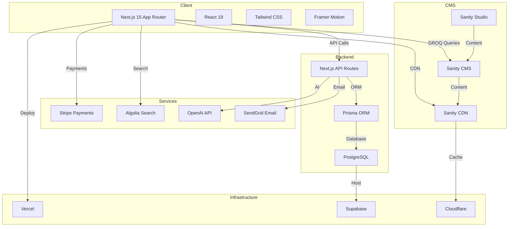

# Technical Stack Selection

**Document Version:** 1.0  
**Date:** February 2026  
**Author:** Architecture Team  
**Status:** Final

---

## Executive Summary

This document defines the complete technology stack for the baby clothing e-commerce platform. The stack is designed to support our AI-first approach, value-oriented positioning, and long-term scalability goals. All technologies are selected based on maturity, community support, developer experience, and alignment with modern best practices.

**Primary Stack:** Next.js 15, Sanity CMS, PostgreSQL, Prisma, Stripe, Vercel

---

## 1. Technology Stack Overview

### 1.1 Stack Diagram



### 1.2 Technology Summary

| Layer | Technology | Version | Purpose |
|-------|-----------|---------|---------|
| **Frontend Framework** | Next.js | 15.x | React framework with App Router |
| **UI Library** | React | 19.x | Component library |
| **Styling** | Tailwind CSS | 4.x | Utility-first CSS |
| **Animations** | Framer Motion | 12.x | Declarative animations |
| **CMS** | Sanity | 3.x | Headless content management |
| **Database** | PostgreSQL | 16.x | Primary database |
| **ORM** | Prisma | 6.x | Type-safe database client |
| **Payments** | Stripe | 17.x | Payment processing |
| **Search** | Algolia | 5.x | Product search |
| **Email** | SendGrid | 8.x | Transactional emails |
| **AI/ML** | OpenAI | 5.x | AI recommendations |
| **Hosting** | Vercel | - | Frontend & API hosting |
| **Database Hosting** | Supabase | - | Managed PostgreSQL |
| **CDN** | Cloudflare | - | Global CDN |
| **Analytics** | Vercel Analytics | - | Performance analytics |
| **Error Tracking** | Sentry | 8.x | Error monitoring |

---

## 2. Frontend Stack

### 2.1 Next.js 15 (App Router)

**Selection Rationale:**
- Industry-leading React framework with excellent performance
- Built-in server components for optimal performance
- App Router provides modern routing and data fetching
- Excellent TypeScript support
- Strong ecosystem and community
- Vercel integration for seamless deployment

**Key Features Utilized:**
- Server Components for data-heavy pages
- Client Components for interactive features
- Server Actions for mutations
- Route Handlers for API endpoints
- Image optimization
- Font optimization
- Streaming for progressive rendering

**Configuration:**
```typescript
// next.config.ts
import type { NextConfig } from 'next';

const nextConfig: NextConfig = {
  images: {
    domains: ['cdn.sanity.io'],
    formats: ['image/avif', 'image/webp'],
  },
  experimental: {
    serverActions: {
      allowedOrigins: ['localhost:3000', 'baby-clothing.com'],
    },
  },
  env: {
    NEXT_PUBLIC_SANITY_PROJECT_ID: process.env.NEXT_PUBLIC_SANITY_PROJECT_ID,
    NEXT_PUBLIC_STRIPE_PUBLISHABLE_KEY: process.env.NEXT_PUBLIC_STRIPE_PUBLISHABLE_KEY,
  },
};

export default nextConfig;
```

### 2.2 React 19

**Selection Rationale:**
- Latest React with performance improvements
- Server Components support
- Improved Suspense and concurrent features
- Better TypeScript integration

**Key Features:**
- Server Components for static content
- Client Components for interactivity
- Suspense for loading states
- use() for data fetching in Server Components

### 2.3 Tailwind CSS 4.x

**Selection Rationale:**
- Utility-first approach for rapid development
- Excellent performance with JIT compiler
- Easy customization
- Great for responsive design
- Built-in dark mode support

**Configuration:**
```javascript
// tailwind.config.ts
import type { Config } from 'tailwindcss';

const config: Config = {
  content: [
    './src/pages/**/*.{js,ts,jsx,tsx,mdx}',
    './src/components/**/*.{js,ts,jsx,tsx,mdx}',
    './src/app/**/*.{js,ts,jsx,tsx,mdx}',
  ],
  theme: {
    extend: {
      colors: {
        primary: {
          50: '#FFF5F5',
          100: '#FED7D7',
          200: '#FEB2B2',
          300: '#FC8181',
          400: '#F56565',
          500: '#E53E3E',
          600: '#C53030',
          700: '#9B2C2C',
          800: '#742A2A',
          900: '#63171B',
        },
        secondary: {
          50: '#F0F9FF',
          100: '#E0F2FE',
          200: '#BAE6FD',
          300: '#7DD3FC',
          400: '#38BDF8',
          500: '#0EA5E9',
          600: '#0284C7',
          700: '#0369A1',
          800: '#075985',
          900: '#0C4A6E',
        },
      },
      fontFamily: {
        sans: ['var(--font-inter)', 'system-ui', 'sans-serif'],
        display: ['var(--font-playfair)', 'serif'],
      },
    },
  },
  plugins: [
    require('@tailwindcss/forms'),
    require('@tailwindcss/typography'),
  ],
};

export default config;
```

### 2.4 Framer Motion

**Selection Rationale:**
- Declarative animation API
- Excellent performance
- Gesture support
- Layout animations
- Great for micro-interactions

**Usage Examples:**
```typescript
// Product card hover animation
import { motion } from 'framer-motion';

export function ProductCard({ product }: { product: Product }) {
  return (
    <motion.div
      whileHover={{ scale: 1.02 }}
      whileTap={{ scale: 0.98 }}
      initial={{ opacity: 0, y: 20 }}
      animate={{ opacity: 1, y: 0 }}
      transition={{ duration: 0.2 }}
    >
      {/* Product content */}
    </motion.div>
  );
}
```

### 2.5 Additional Frontend Libraries

| Library | Purpose | Version |
|---------|---------|---------|
| Zustand | State management | 5.x |
| React Hook Form | Form handling | 7.x |
| Zod | Schema validation | 4.x |
| TanStack Query | Data fetching | 5.x |
| React Hot Toast | Notifications | 2.x |
| Lucide React | Icons | 0.400+ |
| clsx/tailwind-merge | Class utilities | 2.x |

---

## 3. Content Management Stack

### 3.1 Sanity CMS

**Selection Rationale:**
- Proven headless CMS with excellent DX
- Real-time collaboration
- Powerful GROQ query language
- Superior image optimization
- Global CDN
- Strong TypeScript support

**Configuration:**
```typescript
// sanity.config.ts
import { defineConfig } from 'sanity';
import { structureTool } from 'sanity/structure';
import { visionTool } from '@sanity/vision';
import { schemaTypes } from './schemaTypes';

export default defineConfig({
  name: 'baby-clothing',
  title: 'Baby Clothing',
  projectId: process.env.SANITY_PROJECT_ID!,
  dataset: 'production',
  plugins: [structureTool(), visionTool()],
  schema: {
    types: schemaTypes,
  },
});
```

**Key Schemas:**
- Product (with variants, sizes, inventory)
- Category
- Collection
- Banner/Hero
- Blog Post
- Page Content
- Settings

### 3.2 Sanity Studio

**Features:**
- Customizable admin interface
- Real-time collaboration
- Image editing
- Preview mode
- Internationalization support

---

## 4. Backend Stack

### 4.1 Next.js API Routes / Server Actions

**Selection Rationale:**
- Built into Next.js, no separate backend needed
- Server Actions for mutations
- Route Handlers for REST APIs
- Edge runtime support
- TypeScript support

**Example Server Action:**
```typescript
// app/actions/cart.ts
'use server';

import { revalidatePath } from 'next/cache';
import { prisma } from '@/lib/prisma';

export async function addToCart(
  userId: string,
  productId: string,
  variantId: string,
  quantity: number
) {
  const cart = await prisma.cart.upsert({
    where: { userId },
    create: { userId },
    update: {},
  });

  const cartItem = await prisma.cartItem.upsert({
    where: {
      cartId_variantId: {
        cartId: cart.id,
        variantId,
      },
    },
    create: {
      cartId: cart.id,
      variantId,
      quantity,
    },
    update: {
      quantity: { increment: quantity },
    },
  });

  revalidatePath('/cart');
  return cartItem;
}
```

### 4.2 PostgreSQL

**Selection Rationale:**
- Most advanced open-source relational database
- ACID compliance
- Excellent for e-commerce data models
- Strong JSON support
- Full-text search capabilities
- Excellent performance at scale

**Hosting:** Supabase (managed PostgreSQL)

### 4.3 Prisma ORM

**Selection Rationale:**
- Type-safe database access
- Excellent TypeScript support
- Auto-generated types
- Migration system
- Great DX
- Active development

**Schema Example:**
```prisma
// schema.prisma
generator client {
  provider = "prisma-client-js"
}

datasource db {
  provider = "postgresql"
  url      = env("DATABASE_URL")
}

model Product {
  id          String    @id @default(cuid())
  name        String
  slug        String    @unique
  description String?
  price       Decimal
  compareAtPrice Decimal?
  sku         String    @unique
  isActive    Boolean   @default(true)
  categoryId  String
  category    Category  @relation(fields: [categoryId], references: [id])
  variants    Variant[]
  images      Image[]
  createdAt   DateTime  @default(now())
  updatedAt   DateTime  @updatedAt
}

model Variant {
  id          String    @id @default(cuid())
  productId   String
  product     Product   @relation(fields: [productId], references: [id])
  size        String
  color       String?
  sku         String    @unique
  price       Decimal
  inventory   Int       @default(0)
  cartItems   CartItem[]
  orderItems  OrderItem[]
  createdAt   DateTime  @default(now())
  updatedAt   DateTime  @updatedAt
}

model Cart {
  id        String     @id @default(cuid())
  userId    String     @unique
  items     CartItem[]
  createdAt DateTime   @default(now())
  updatedAt DateTime   @updatedAt
}

model CartItem {
  id        String   @id @default(cuid())
  cartId    String
  cart      Cart     @relation(fields: [cartId], references: [id])
  variantId String
  variant   Variant  @relation(fields: [variantId], references: [id])
  quantity  Int
  createdAt DateTime @default(now())
  updatedAt DateTime @updatedAt

  @@unique([cartId, variantId])
}

model Order {
  id              String      @id @default(cuid())
  orderNumber     String      @unique
  userId          String
  user            User        @relation(fields: [userId], references: [id])
  items           OrderItem[]
  subtotal        Decimal
  shipping        Decimal
  tax             Decimal
  total           Decimal
  status          OrderStatus @default(PENDING)
  paymentStatus   PaymentStatus @default(PENDING)
  shippingAddress Json
  billingAddress  Json
  createdAt       DateTime    @default(now())
  updatedAt       DateTime    @updatedAt
}

model OrderItem {
  id        String   @id @default(cuid())
  orderId   String
  order     Order    @relation(fields: [orderId], references: [id])
  variantId String
  variant   Variant  @relation(fields: [variantId], references: [id])
  quantity  Int
  price     Decimal
  createdAt DateTime @default(now())
}

model User {
  id            String    @id @default(cuid())
  email         String    @unique
  name          String?
  password      String
  phone         String?
  addresses     Address[]
  orders        Order[]
  registry      Registry?
  createdAt     DateTime  @default(now())
  updatedAt     DateTime  @updatedAt
}

model Registry {
  id          String   @id @default(cuid())
  userId      String   @unique
  user        User     @relation(fields: [userId], references: [id])
  name        String
  dueDate     DateTime
  items       RegistryItem[]
  isPublic    Boolean  @default(true)
  shareUrl    String   @unique
  createdAt   DateTime @default(now())
  updatedAt   DateTime @updatedAt
}

model RegistryItem {
  id         String   @id @default(cuid())
  registryId String
  registry   Registry @relation(fields: [registryId], references: [id])
  productId  String
  quantity   Int
  purchased  Int      @default(0)
  priority   Int      @default(0)
  createdAt  DateTime @default(now())
  updatedAt  DateTime @updatedAt
}

model Category {
  id          String    @id @default(cuid())
  name        String
  slug        String    @unique
  description String?
  products    Product[]
  order       Int       @default(0)
  createdAt   DateTime  @default(now())
  updatedAt   DateTime @updatedAt
}

model Image {
  id        String   @id @default(cuid())
  productId String
  product   Product  @relation(fields: [productId], references: [id])
  url       String
  alt       String?
  order     Int      @default(0)
  createdAt DateTime @default(now())
}

model Address {
  id        String   @id @default(cuid())
  userId    String
  user      User     @relation(fields: [userId], references: [id])
  firstName String
  lastName  String
  line1     String
  line2     String?
  city      String
  state     String
  zip       String
  country   String
  isDefault Boolean  @default(false)
  createdAt DateTime  @default(now())
  updatedAt DateTime @updatedAt
}

enum OrderStatus {
  PENDING
  CONFIRMED
  PROCESSING
  SHIPPED
  DELIVERED
  CANCELLED
  REFUNDED
}

enum PaymentStatus {
  PENDING
  PROCESSING
  COMPLETED
  FAILED
  REFUNDED
}
```

---

## 5. Third-Party Services

### 5.1 Stripe (Payments)

**Selection Rationale:**
- Industry standard for payments
- Excellent documentation
- Strong security (PCI compliance)
- Support for multiple payment methods
- Subscription support (future)
- Webhooks for real-time updates

**Features Used:**
- Checkout Sessions
- Payment Intents
- Customer management
- Webhooks
- Tax calculation
- Shipping rate calculation

**Configuration:**
```typescript
// lib/stripe.ts
import Stripe from 'stripe';

export const stripe = new Stripe(process.env.STRIPE_SECRET_KEY!, {
  apiVersion: '2025-01-27.acacia',
  typescript: true,
});

export async function createCheckoutSession(
  items: CartItem[],
  customerEmail: string
) {
  const session = await stripe.checkout.sessions.create({
    customer_email: customerEmail,
    mode: 'payment',
    payment_method_types: ['card'],
    line_items: items.map(item => ({
      price_data: {
        currency: 'usd',
        product_data: {
          name: item.variant.product.name,
          description: `${item.variant.size} - ${item.variant.color || 'Default'}`,
        },
        unit_amount: Math.round(Number(item.variant.price) * 100),
      },
      quantity: item.quantity,
    })),
    success_url: `${process.env.NEXT_PUBLIC_BASE_URL}/checkout/success?session_id={CHECKOUT_SESSION_ID}`,
    cancel_url: `${process.env.NEXT_PUBLIC_BASE_URL}/checkout/cancel`,
    shipping_address_collection: {
      allowed_countries: ['US', 'CA'],
    },
    metadata: {
      userId: items[0].cart.userId,
    },
  });

  return session;
}
```

### 5.2 Algolia (Search)

**Selection Rationale:**
- Fast, relevant search
- Excellent typo tolerance
- Faceted search support
- Real-time indexing
- Great analytics
- Easy integration

**Configuration:**
```typescript
// lib/algolia.ts
import algoliasearch from 'algoliasearch';

const client = algoliasearch(
  process.env.NEXT_PUBLIC_ALGOLIA_APP_ID!,
  process.env.ALGOLIA_ADMIN_KEY!
);

export const productsIndex = client.initIndex('products');

// Configure index
productsIndex.setSettings({
  searchableAttributes: ['name', 'description', 'category'],
  attributesForFaceting: ['category', 'size', 'color', 'price'],
  ranking: ['typo', 'geo', 'words', 'filters', 'proximity', 'attribute', 'exact', 'custom'],
  customRanking: ['desc(popularity)', 'desc(createdAt)'],
});
```

### 5.3 SendGrid (Email)

**Selection Rationale:**
- Reliable email delivery
- Excellent templates
- Good analytics
- Transactional email focus
- Reasonable pricing

**Email Types:**
- Order confirmation
- Shipping notifications
- Password reset
- Registry updates
- Marketing emails

### 5.4 OpenAI (AI/ML)

**Selection Rationale:**
- Leading AI platform
- GPT-4 for recommendations
- Embeddings for similarity search
- API-first approach
- Strong documentation

**Use Cases:**
- Product recommendations
- Size predictions
- Registry suggestions
- Customer support chatbot
- Content generation

**Configuration:**
```typescript
// lib/openai.ts
import OpenAI from 'openai';

const openai = new OpenAI({
  apiKey: process.env.OPENAI_API_KEY,
});

export async function getProductRecommendations(
  userPreferences: UserPreferences,
  babyAge: number,
  season: string
) {
  const response = await openai.chat.completions.create({
    model: 'gpt-4-turbo-preview',
    messages: [
      {
        role: 'system',
        content: 'You are a baby clothing recommendation engine. Suggest products based on baby age, season, and preferences.',
      },
      {
        role: 'user',
        content: JSON.stringify({ userPreferences, babyAge, season }),
      },
    ],
    functions: [
      {
        name: 'recommend_products',
        description: 'Recommend baby clothing products',
        parameters: {
          type: 'object',
          properties: {
            categories: {
              type: 'array',
              items: { type: 'string' },
            },
            sizes: {
              type: 'array',
              items: { type: 'string' },
            },
            reasoning: {
              type: 'string',
            },
          },
          required: ['categories', 'sizes', 'reasoning'],
        },
      },
    ],
    function_call: { name: 'recommend_products' },
  });

  return response.choices[0].message.function_call?.arguments;
}
```

### 5.5 Sentry (Error Tracking)

**Selection Rationale:**
- Comprehensive error tracking
- Performance monitoring
- Release tracking
- Good alerting
- Strong integrations

### 5.6 Vercel Analytics

**Selection Rationale:**
- Built into Vercel
- Privacy-focused
- Web vitals tracking
- No additional setup needed

---

## 6. Infrastructure Stack

### 6.1 Vercel (Frontend & API Hosting)

**Selection Rationale:**
- Best-in-class Next.js hosting
- Automatic deployments
- Edge network
- Preview deployments
- Environment variables management
- Built-in analytics

**Features:**
- Automatic HTTPS
- Edge functions
- Image optimization
- Incremental Static Regeneration
- Serverless functions

### 6.2 Supabase (Database Hosting)

**Selection Rationale:**
- Managed PostgreSQL
- Real-time subscriptions
- Authentication (optional)
- Storage (optional)
- Good free tier
- Easy backups

**Features:**
- Automatic backups
- Point-in-time recovery
- Connection pooling
- Read replicas (paid)

### 6.3 Cloudflare (CDN)

**Selection Rationale:**
- Global CDN
- DDoS protection
- Edge computing
- Free tier available
- Fast performance

**Usage:**
- Static asset caching
- API response caching
- Image optimization
- DDoS protection

---

## 7. Development Tools

### 7.1 Package Manager

**Selection:** pnpm

**Rationale:**
- Fast installation
- Disk space efficient
- Strict dependency management
- Monorepo support

### 7.2 Code Quality

| Tool | Purpose | Version |
|------|---------|---------|
| ESLint | Linting | 9.x |
| Prettier | Formatting | 3.x |
| TypeScript | Type checking | 5.x |
| Husky | Git hooks | 9.x |
| lint-staged | Pre-commit linting | 15.x |

### 7.3 Testing

| Tool | Purpose | Version |
|------|---------|---------|
| Vitest | Unit testing | 2.x |
| Playwright | E2E testing | 1.x |
| React Testing Library | Component testing | 14.x |

### 7.4 Cron Job Scheduling

**Selection:** Vercel Cron Jobs (recommended for Vercel hosting)

**Configuration:**
```json
// vercel.json
{
  "crons": [
    {
      "path": "/api/cron/inventory-check",
      "schedule": "0 9 * * *"
    },
    {
      "path": "/api/cron/price-monitor",
      "schedule": "0 */6 * * *"
    }
  ]
}
```

**Alternative:** node-cron for self-hosted deployments

### 7.5 CI/CD

**Platform:** GitHub Actions

**Workflow:**
```yaml
# .github/workflows/ci.yml
name: CI

on:
  push:
    branches: [main, develop]
  pull_request:
    branches: [main, develop]

jobs:
  test:
    runs-on: ubuntu-latest
    steps:
      - uses: actions/checkout@v4
      - uses: pnpm/action-setup@v2
        with:
          version: 9
      - uses: actions/setup-node@v4
        with:
          node-version: 20
          cache: 'pnpm'
      - run: pnpm install
      - run: pnpm lint
      - run: pnpm type-check
      - run: pnpm test
      - run: pnpm build

  deploy:
    needs: test
    if: github.ref == 'refs/heads/main'
    runs-on: ubuntu-latest
    steps:
      - uses: actions/checkout@v4
      - uses: amondnet/vercel-action@v25
        with:
          vercel-token: ${{ secrets.VERCEL_TOKEN }}
          vercel-org-id: ${{ secrets.ORG_ID }}
          vercel-project-id: ${{ secrets.PROJECT_ID }}
          vercel-args: '--prod'
```

---

## 8. Security Considerations

### 8.1 Authentication

**Solution:** NextAuth.js v5 (Auth.js)

**Features:**
- Email/password authentication
- OAuth providers (Google, Facebook)
- Session management
- CSRF protection
- Secure cookies

### 8.2 Data Protection

- All passwords hashed with bcrypt
- Environment variables for secrets
- HTTPS everywhere
- Input validation with Zod
- SQL injection prevention via Prisma
- XSS prevention via React

### 8.3 Payment Security

- Stripe handles all card data
- PCI compliance via Stripe
- No card data stored on our servers
- Webhook signature verification

---

## 9. Performance Optimization

### 9.1 Frontend Optimization

- Server Components for static content
- Image optimization with Next.js Image
- Code splitting and lazy loading
- Font optimization
- Streaming for progressive rendering
- Edge caching with Vercel

### 9.2 Backend Optimization

- Database indexing
- Query optimization
- Connection pooling
- Response caching
- CDN for static assets

### 9.3 Monitoring

- Vercel Analytics for web vitals
- Sentry for error tracking
- Custom logging
- Performance budgets

---

## 10. Scalability Considerations

### 10.1 Horizontal Scaling

- Vercel automatically scales
- Serverless functions scale independently
- Database read replicas (future)
- CDN for global distribution

### 10.2 Database Scaling

- Connection pooling
- Read replicas for read-heavy operations
- Partitioning for large tables (future)
- Caching layer (Redis, future)

### 10.3 Cost Optimization

- Serverless pricing (pay per use)
- CDN caching reduces bandwidth
- Database query optimization
- Image optimization reduces storage

---

## 11. Migration Path

### 11.1 Phase 1: MVP (Months 1-3)

**Scope:**
- Core e-commerce functionality
- Basic product catalog
- Simple checkout
- Basic recommendations

**Infrastructure:**
- Vercel Pro plan
- Supabase Pro plan
- Sanity Team plan
- Stripe standard

### 11.2 Phase 2: Growth (Months 4-12)

**Additions:**
- Advanced AI features
- Enhanced search
- Email marketing
- Loyalty program

**Infrastructure:**
- Consider Vercel Enterprise
- Redis for caching
- Dedicated search infrastructure

### 11.3 Phase 3: Scale (Year 2+)

**Additions:**
- International markets
- Mobile app
- Advanced analytics

**Infrastructure:**
- Multi-region deployment
- Dedicated database instances
- Custom CDN configuration

---

## 12. Technology Alternatives Considered

| Category | Selected | Alternative | Reason for Selection |
|----------|----------|-------------|---------------------|
| Framework | Next.js | Remix, Nuxt | Best ecosystem, Vercel integration |
| Database | PostgreSQL | MongoDB, MySQL | Relational model fits e-commerce |
| ORM | Prisma | Drizzle, TypeORM | Best DX, TypeScript support |
| CMS | Sanity | Contentful, Strapi | Best balance of features and DX |
| Payments | Stripe | PayPal, Adyen | Best developer experience |
| Search | Algolia | Meilisearch, Typesense | Best features, easy setup |
| Email | SendGrid | Postmark, Mailgun | Good balance of features and price |
| Hosting | Vercel | Netlify, AWS | Best Next.js support |

---

## 13. Conclusion

The selected technology stack provides:

✅ **Modern, Future-Ready:** Latest versions of industry-leading tools  
✅ **Developer Experience:** Excellent DX with TypeScript support  
✅ **Scalability:** Proven at scale for e-commerce  
✅ **AI-First:** Built-in support for AI/ML features  
✅ **Cost-Effective:** Serverless pricing, pay-as-you-go  
✅ **Maintainable:** Strong community, long-term support  

This stack is production-ready and can support the platform from MVP through enterprise scale.

---

**Document Control:**
- Created: February 2026
- Last Updated: February 2026
- Next Review: March 2026
