# System Architecture

**Document Version:** 1.0  
**Date:** February 2026  
**Author:** Architecture Team  
**Status:** Final

---

## Executive Summary

This document defines the complete system architecture for the Kids Petite baby clothing e-commerce platform. The architecture is designed to be scalable, maintainable, and aligned with our AI-first approach. It follows modern best practices including headless architecture, microservices principles, and cloud-native deployment.

---

## 1. Architecture Overview

### 1.1 High-Level Architecture

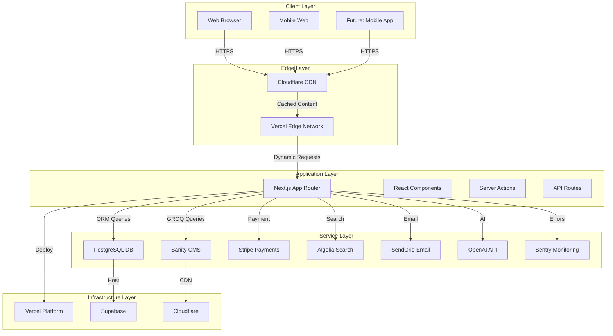

### 1.2 Architecture Principles

| Principle | Description | Implementation |
|-----------|-------------|----------------|
| **Headless** | Decouple frontend from backend | Sanity CMS, API-first design |
| **Serverless** | Scale automatically, pay per use | Vercel, serverless functions |
| **Edge-First** | Serve content from edge locations | Cloudflare CDN, Vercel Edge |
| **AI-First** | Built-in AI capabilities | OpenAI integration, smart features |
| **Security-First** | Security at every layer | HTTPS, input validation, secrets management |
| **Observability** | Monitor everything | Sentry, Vercel Analytics, logging |
| **Scalability** | Handle growth without re-architecture | Horizontal scaling, caching, CDN |

---

## 2. Infrastructure Map

### 2.1 Infrastructure Components

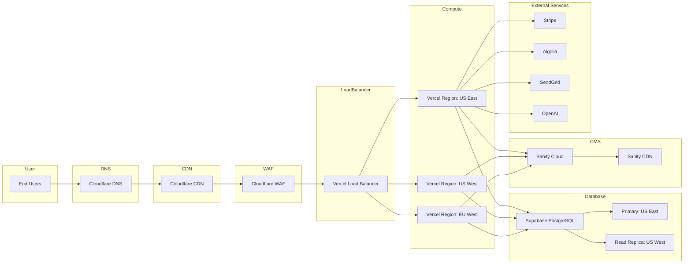

### 2.2 Infrastructure Details

#### 2.2.1 DNS & CDN

| Component | Provider | Purpose |
|-----------|----------|---------|
| DNS | Cloudflare | Domain resolution, DNSSEC |
| CDN | Cloudflare | Static asset caching, DDoS protection |
| WAF | Cloudflare | Web Application Firewall, security rules |

**Configuration:**
- DNS TTL: 300 seconds
- CDN Cache TTL: 1 hour (static), 5 minutes (dynamic)
- WAF Rules: OWASP Top 10 protection
- DDoS Protection: Always on

#### 2.2.2 Compute Layer

| Component | Provider | Specs |
|-----------|----------|-------|
| Platform | Vercel | Serverless functions, Edge functions |
| Regions | 3+ | US East, US West, EU West |
| Runtime | Node.js 20 | Latest LTS |
| Max Execution | 60s | API routes |
| Max Memory | 1GB | Per function |

**Auto-Scaling:**
- Zero to thousands of requests
- Cold start: <500ms
- Warm start: <50ms
- Concurrent requests: Unlimited

#### 2.2.3 Database Layer

| Component | Provider | Specs |
|-----------|----------|-------|
| Database | Supabase | PostgreSQL 16 |
| Primary Region | US East | Active |
| Read Replica | US West | Passive |
| Connection Pooling | PgBouncer | 20 connections |
| Backups | Daily | 30-day retention |

**Database Configuration:**
```sql
-- Connection pool settings
max_connections = 100
shared_buffers = 256MB
effective_cache_size = 1GB
maintenance_work_mem = 64MB
checkpoint_completion_target = 0.9
wal_buffers = 16MB
default_statistics_target = 100
random_page_cost = 1.1
effective_io_concurrency = 200
work_mem = 2621kB
min_wal_size = 1GB
max_wal_size = 4GB
```

#### 2.2.4 CMS Layer

| Component | Provider | Specs |
|-----------|----------|-------|
| CMS | Sanity | Managed cloud |
| CDN | Sanity | Global CDN |
| API | Sanity | GROQ + GraphQL |
| Storage | Sanity | Image optimization |

**Sanity Configuration:**
- Project: Kids Petite
- Dataset: Production
- API Version: v2024-01-01
- CDN: Global edge locations

#### 2.2.5 External Services

| Service | Provider | SLA | Rate Limits |
|---------|----------|-----|-------------|
| Payments | Stripe | 99.99% | 100 req/sec |
| Search | Algolia | 99.9% | 1,000 req/sec |
| Email | SendGrid | 99.9% | 100 req/sec |
| AI | OpenAI | 99.5% | 3,500 TPM |
| Monitoring | Sentry | 99.9% | Unlimited |

---

## 3. API Structure

### 3.1 API Overview

The platform uses a hybrid API approach:

1. **Sanity GROQ API** - Content and product data
2. **Next.js API Routes** - Business logic and mutations
3. **Server Actions** - Form submissions and mutations
4. **Third-party APIs** - Payments, search, email, AI

### 3.2 API Architecture Diagram

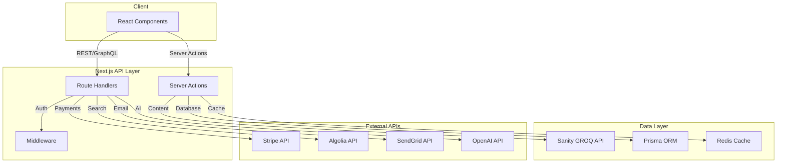

### 3.3 API Endpoints

#### 3.3.1 Public Endpoints

| Method | Endpoint | Description | Auth |
|--------|----------|-------------|------|
| GET | `/api/products` | List products | None |
| GET | `/api/products/[slug]` | Get product details | None |
| GET | `/api/categories` | List categories | None |
| GET | `/api/search` | Search products | None |
| GET | `/api/registry/[shareUrl]` | View public registry | None |

#### 3.3.2 Authenticated Endpoints

| Method | Endpoint | Description | Auth |
|--------|----------|-------------|------|
| GET | `/api/user` | Get current user | Required |
| PUT | `/api/user` | Update user profile | Required |
| GET | `/api/cart` | Get user cart | Required |
| POST | `/api/cart/items` | Add to cart | Required |
| PUT | `/api/cart/items/[id]` | Update cart item | Required |
| DELETE | `/api/cart/items/[id]` | Remove from cart | Required |
| POST | `/api/checkout` | Create checkout session | Required |
| GET | `/api/orders` | List user orders | Required |
| GET | `/api/orders/[id]` | Get order details | Required |
| GET | `/api/registry` | Get user registry | Required |
| POST | `/api/registry` | Create registry | Required |
| PUT | `/api/registry` | Update registry | Required |
| POST | `/api/registry/items` | Add registry item | Required |
| DELETE | `/api/registry/items/[id]` | Remove registry item | Required |
| GET | `/api/addresses` | List addresses | Required |
| POST | `/api/addresses` | Create address | Required |
| PUT | `/api/addresses/[id]` | Update address | Required |
| DELETE | `/api/addresses/[id]` | Delete address | Required |

#### 3.3.3 Webhook Endpoints

| Method | Endpoint | Description | Auth |
|--------|----------|-------------|------|
| POST | `/api/webhooks/stripe` | Stripe payment events | Signature |
| POST | `/api/webhooks/sanity` | Sanity content changes | Signature |
| POST | `/api/webhooks/algolia` | Algolia sync events | Signature |

### 3.4 API Response Format

#### Success Response

```json
{
  "success": true,
  "data": {
    // Response data
  },
  "meta": {
    "timestamp": "2026-02-11T08:00:00Z",
    "requestId": "req_abc123"
  }
}
```

#### Error Response

```json
{
  "success": false,
  "error": {
    "code": "VALIDATION_ERROR",
    "message": "Invalid input data",
    "details": [
      {
        "field": "email",
        "message": "Invalid email format"
      }
    ]
  },
  "meta": {
    "timestamp": "2026-02-11T08:00:00Z",
    "requestId": "req_abc123"
  }
}
```

### 3.5 API Rate Limiting

| Endpoint Type | Rate Limit | Window |
|---------------|------------|--------|
| Public | 100 requests | 1 minute |
| Authenticated | 500 requests | 1 minute |
| Webhooks | 1000 requests | 1 minute |

**Rate Limit Headers:**
```
X-RateLimit-Limit: 100
X-RateLimit-Remaining: 95
X-RateLimit-Reset: 1707628800
```

### 3.6 API Authentication

#### JWT Token Structure

```json
{
  "header": {
    "alg": "HS256",
    "typ": "JWT"
  },
  "payload": {
    "sub": "user_abc123",
    "email": "user@example.com",
    "role": "customer",
    "iat": 1707628800,
    "exp": 1707715200
  }
}
```

#### Authentication Flow

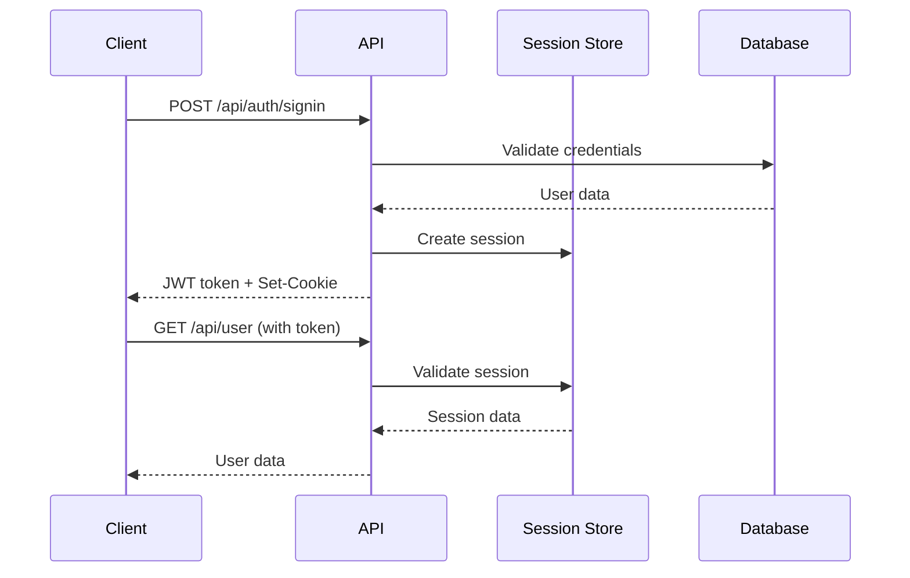

---

## 4. Data Flow

### 4.1 Product Catalog Data Flow

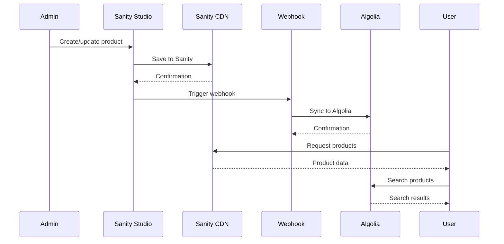

### 4.2 Checkout Data Flow

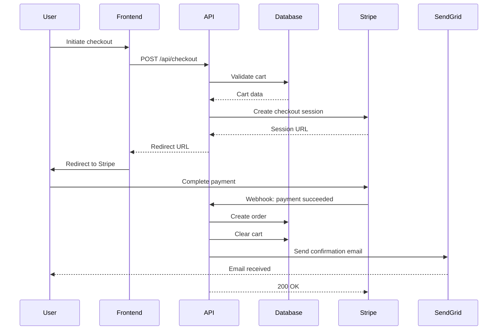

### 4.3 AI Recommendation Data Flow

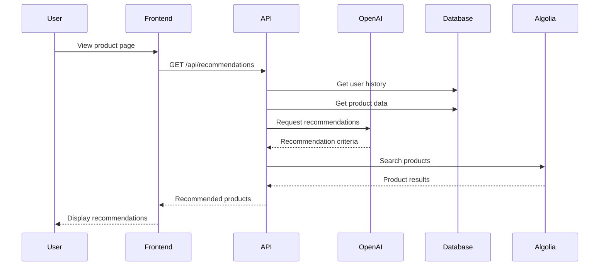

---

## 5. Security Architecture

### 5.1 Security Layers

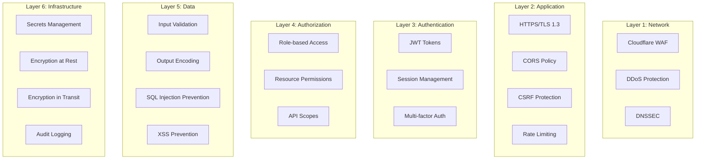

### 5.2 Security Measures

#### 5.2.1 Network Security

| Measure | Implementation |
|---------|----------------|
| WAF | Cloudflare WAF with OWASP rules |
| DDoS Protection | Cloudflare always-on |
| TLS | TLS 1.3, HSTS enabled |
| DNSSEC | Cloudflare DNSSEC |

#### 5.2.2 Application Security

| Measure | Implementation |
|---------|----------------|
| CORS | Strict origin policy |
| CSRF | Token-based protection |
| Rate Limiting | Per-IP and per-user |
| Input Validation | Zod schemas |
| Output Encoding | React auto-escaping |

#### 5.2.3 Authentication & Authorization

| Measure | Implementation |
|---------|----------------|
| Password Hashing | bcrypt (cost 12) |
| JWT | HS256, 1-hour expiry |
| Session Store | Encrypted cookies |
| MFA | Optional TOTP |

#### 5.2.4 Data Security

| Measure | Implementation |
|---------|----------------|
| Encryption at Rest | Supabase encryption |
| Encryption in Transit | TLS 1.3 |
| PII Protection | Data minimization |
| PCI Compliance | Stripe handles card data |

### 5.3 Secrets Management

```typescript
// Environment variables (never committed)
NEXT_PUBLIC_SANITY_PROJECT_ID=xxx
NEXT_PUBLIC_STRIPE_PUBLISHABLE_KEY=pk_xxx
SANITY_API_TOKEN=xxx
STRIPE_SECRET_KEY=sk_xxx
DATABASE_URL=xxx
OPENAI_API_KEY=xxx
SENDGRID_API_KEY=xxx
ALGOLIA_API_KEY=xxx
NEXTAUTH_SECRET=xxx
```

**Secrets Storage:**
- Vercel Environment Variables
- Encrypted at rest
- Rotated quarterly
- Access logged

---

## 6. Performance Architecture

### 6.1 Performance Optimization Layers

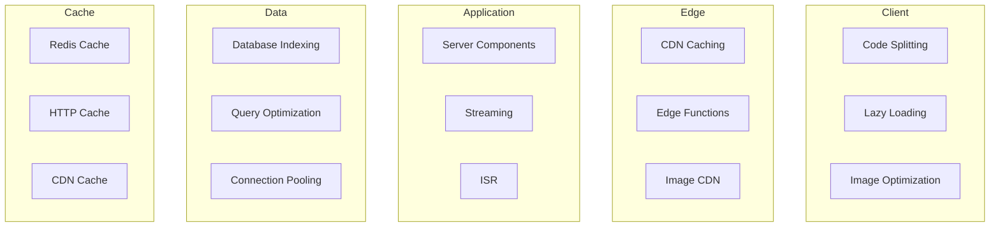

### 6.2 Caching Strategy

| Cache Type | TTL | Invalidation |
|------------|-----|--------------|
| Static Assets | 1 year | Content hash |
| Product Pages | 5 minutes | Webhook |
| Category Pages | 10 minutes | Webhook |
| API Responses | 1 minute | Time-based |
| Search Results | 5 minutes | Time-based |
| User Data | No cache | N/A |

### 6.3 Performance Targets

| Metric | Target | Measurement |
|--------|--------|-------------|
| First Contentful Paint | <1.5s | Lighthouse |
| Largest Contentful Paint | <2.5s | Lighthouse |
| Time to Interactive | <3.5s | Lighthouse |
| Cumulative Layout Shift | <0.1 | Lighthouse |
| First Input Delay | <100ms | Lighthouse |
| API Response Time | <200ms | Monitoring |
| Database Query Time | <50ms | Monitoring |

---

## 7. Monitoring & Observability

### 7.1 Monitoring Stack

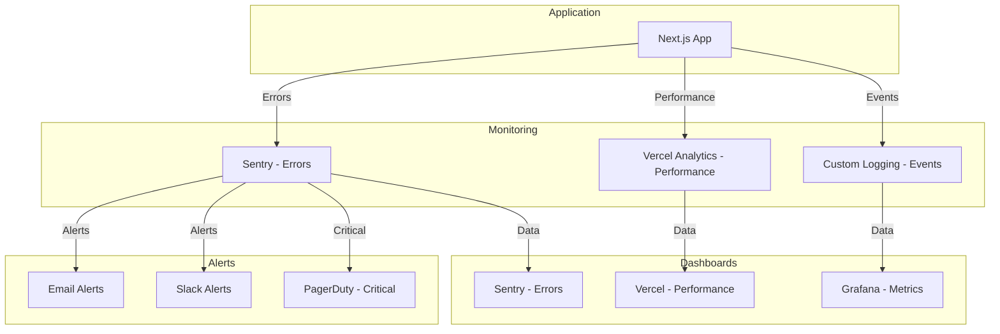

### 7.2 Monitoring Metrics

| Category | Metrics | Alert Threshold |
|----------|---------|-----------------|
| **Errors** | Error rate, unhandled exceptions | >1% error rate |
| **Performance** | Response time, throughput | >500ms p95 |
| **Availability** | Uptime, downtime | <99.9% uptime |
| **Business** | Orders, revenue, conversion | <50% of baseline |
| **Infrastructure** | CPU, memory, disk | >80% utilization |

### 7.3 Logging Strategy

```typescript
// Structured logging example
import { logger } from '@/lib/logger';

logger.info('Order created', {
  orderId: 'ord_abc123',
  userId: 'user_xyz789',
  total: 99.99,
  items: 3,
  timestamp: new Date().toISOString(),
});

logger.error('Payment failed', {
  orderId: 'ord_abc123',
  error: 'card_declined',
  stripeErrorId: 'err_123',
  timestamp: new Date().toISOString(),
});
```

**Log Levels:**
- ERROR: Critical errors requiring attention
- WARN: Warning conditions
- INFO: Informational messages
- DEBUG: Detailed debugging information

---

## 8. Disaster Recovery & Business Continuity

### 8.1 Backup Strategy

| Data Type | Backup Frequency | Retention | Location |
|-----------|------------------|-----------|----------|
| Database | Daily | 30 days | Supabase |
| Database | Weekly | 1 year | Supabase |
| CMS Content | Real-time | Unlimited | Sanity |
| User Uploads | Real-time | Unlimited | Cloudflare R2 |
| Logs | Daily | 90 days | Vercel |

### 8.2 Recovery Procedures

#### Database Recovery

```bash
# Point-in-time recovery
supabase db restore --timestamp "2026-02-10T12:00:00Z"

# From backup
supabase db restore --file backup_2026-02-10.sql
```

#### CMS Recovery

```bash
# Export content
npx sanity@latest dataset export production backup.json

# Import content
npx sanity@latest dataset import backup.json production
```

### 8.3 Incident Response Plan

| Severity | Response Time | Escalation |
|----------|---------------|------------|
| P1 - Critical | 15 minutes | CTO, CEO |
| P2 - High | 1 hour | Engineering Lead |
| P3 - Medium | 4 hours | Team Lead |
| P4 - Low | 24 hours | On-call engineer |

---

## 9. Scalability Plan

### 9.1 Horizontal Scaling

| Component | Scaling Strategy |
|-----------|------------------|
| Frontend | Vercel auto-scaling |
| API Routes | Serverless functions |
| Database | Read replicas, connection pooling |
| CDN | Global edge locations |
| Search | Algolia auto-scaling |

### 9.2 Vertical Scaling Triggers

| Metric | Threshold | Action |
|--------|-----------|--------|
| Database CPU | >80% | Add read replica |
| Database Memory | >80% | Upgrade instance |
| API Response Time | >500ms | Add regions |
| CDN Bandwidth | >80% | Upgrade plan |

### 9.3 Capacity Planning

| Metric | Year 1 | Year 2 | Year 3 |
|--------|--------|--------|--------|
| Monthly Visitors | 100K | 500K | 2M |
| Orders/Day | 100 | 500 | 2,000 |
| Database Size | 10GB | 50GB | 200GB |
| API Calls/Day | 1M | 5M | 20M |

---

## 10. Technology Stack Summary

| Layer | Technology | Purpose |
|-------|-----------|---------|
| **Frontend** | Next.js 15, React 19 | Application framework |
| **Styling** | Tailwind CSS 4.x | UI styling |
| **CMS** | Sanity 3.x | Content management |
| **Database** | PostgreSQL 16 | Primary database |
| **ORM** | Prisma 6.x | Database client |
| **Payments** | Stripe 17.x | Payment processing |
| **Search** | Algolia 5.x | Product search |
| **Email** | SendGrid 8.x | Email delivery |
| **AI** | OpenAI 5.x | AI/ML features |
| **Hosting** | Vercel | Application hosting |
| **Database Hosting** | Supabase | Database hosting |
| **CDN** | Cloudflare | Content delivery |
| **Monitoring** | Sentry 8.x | Error tracking |
| **Analytics** | Vercel Analytics | Performance analytics |

---

## 11. Deployment Architecture

### 11.1 Deployment Pipeline

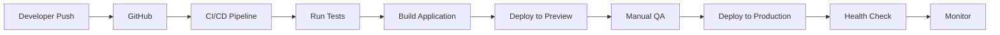

### 11.2 Deployment Environments

| Environment | Purpose | URL |
|-------------|---------|-----|
| Development | Local development | localhost:3000 |
| Preview | Pull request previews | *.vercel.app |
| Staging | Pre-production testing | staging.littlesprout.com |
| Production | Live application | littlesprout.com |

### 11.3 Deployment Strategy

- **Blue-Green Deployment:** Zero-downtime deployments
- **Canary Releases:** Gradual rollout for critical changes
- **Feature Flags:** Toggle features without deployment
- **Rollback:** Instant rollback capability

---

## 12. API Documentation

### 12.1 OpenAPI Specification

The API follows OpenAPI 3.1 specification. Full documentation available at:
- Internal: `/api/docs`
- Public: `https://docs.littlesprout.com/api`

### 12.2 API Versioning

- Current version: v1
- Version in URL: `/api/v1/...`
- Backward compatibility: Guaranteed for 12 months
- Deprecation notice: 6 months before removal

---

## 13. Conclusion

The Kids Petite system architecture is designed to be:

✅ **Scalable:** Handles growth from MVP to enterprise  
✅ **Secure:** Multiple layers of protection  
✅ **Performant:** Fast response times and optimized caching  
✅ **Maintainable:** Clean architecture and clear separation of concerns  
✅ **Observable:** Comprehensive monitoring and logging  
✅ **Resilient:** Disaster recovery and business continuity planning  

This architecture supports our AI-first approach and provides a solid foundation for long-term growth.

---

**Document Control:**
- Created: February 2026
- Last Updated: February 2026
- Next Review: August 2026
- Approved By: CTO
