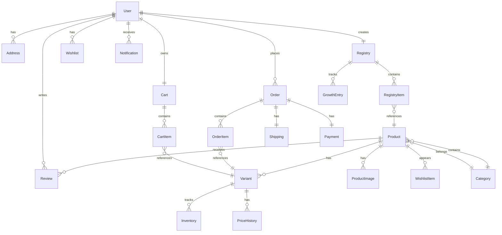

# Database Schema

**Document Version:** 1.0  
**Date:** February 2026  
**Author:** Architecture Team  
**Status:** Final

---

## Executive Summary

This document defines the complete database schema for the Baby Petite baby clothing e-commerce platform. The schema is designed using PostgreSQL with Prisma ORM, providing type-safe database access and excellent performance. The schema supports all e-commerce functionality including products, inventory, users, orders, registries, and AI-powered features.

---

## 1. Schema Overview

### 1.1 Entity Relationship Diagram



### 1.2 Schema Statistics

| Metric | Value |
|--------|-------|
| Total Tables | 20 |
| Total Relationships | 28 |
| Indexes | 55+ |
| Enums | 6 |
| Estimated Rows (Year 1) | 500K+ |

---

## 2. Core Tables

### 2.1 User

**Purpose:** Store user account information and authentication data.

```prisma
model User {
  id            String    @id @default(cuid())
  email         String    @unique
  emailVerified DateTime?
  name          String?
  password      String
  phone         String?
  avatar        String?
  role          UserRole  @default(CUSTOMER)
  
  // Relationships
  cart          Cart?
  addresses     Address[]
  orders        Order[]
  registry      Registry?
  reviews       Review[]
  wishlist      Wishlist?
  
  // Timestamps
  createdAt     DateTime  @default(now())
  updatedAt     DateTime  @updatedAt
  lastLoginAt   DateTime?
  
  // Indexes
  @@index([email])
  @@index([role])
}

enum UserRole {
  CUSTOMER
  ADMIN
  STAFF
}
```

**Fields:**

| Field | Type | Description | Constraints |
|-------|------|-------------|-------------|
| `id` | String | Primary key | CUID format |
| `email` | String | User email address | Unique, required |
| `emailVerified` | DateTime | Email verification timestamp | Nullable |
| `name` | String | User's full name | Nullable |
| `password` | String | Hashed password | Required, bcrypt |
| `phone` | String | Phone number | Nullable |
| `avatar` | String | Avatar image URL | Nullable |
| `role` | UserRole | User role | Default: CUSTOMER |
| `createdAt` | DateTime | Account creation timestamp | Auto |
| `updatedAt` | DateTime | Last update timestamp | Auto |
| `lastLoginAt` | DateTime | Last login timestamp | Nullable |

**Indexes:**
- `idx_user_email` on `email`
- `idx_user_role` on `role`

---

### 2.2 Address

**Purpose:** Store user shipping and billing addresses.

```prisma
model Address {
  id          String   @id @default(cuid())
  userId      String
  user        User     @relation(fields: [userId], references: [id], onDelete: Cascade)
  
  firstName   String
  lastName    String
  company     String?
  line1       String
  line2       String?
  city        String
  state       String
  zip         String
  country     String   @default("US")
  phone       String?
  
  isDefault   Boolean  @default(false)
  type        AddressType @default(SHIPPING)
  
  createdAt   DateTime @default(now())
  updatedAt   DateTime @updatedAt
  
  @@index([userId])
  @@index([userId, isDefault])
}

enum AddressType {
  SHIPPING
  BILLING
  BOTH
}
```

**Fields:**

| Field | Type | Description | Constraints |
|-------|------|-------------|-------------|
| `id` | String | Primary key | CUID format |
| `userId` | String | Foreign key to User | Required |
| `firstName` | String | First name | Required |
| `lastName` | String | Last name | Required |
| `company` | String | Company name | Nullable |
| `line1` | String | Address line 1 | Required |
| `line2` | String | Address line 2 | Nullable |
| `city` | String | City | Required |
| `state` | String | State/Province | Required |
| `zip` | String | Postal code | Required |
| `country` | String | Country code | Default: US |
| `phone` | String | Phone number | Nullable |
| `isDefault` | Boolean | Default address flag | Default: false |
| `type` | AddressType | Address type | Default: SHIPPING |
| `createdAt` | DateTime | Creation timestamp | Auto |
| `updatedAt` | DateTime | Update timestamp | Auto |

**Indexes:**
- `idx_address_userId` on `userId`
- `idx_address_userId_default` on `userId, isDefault`

---

### 2.3 Category

**Purpose:** Organize products into hierarchical categories.

```prisma
model Category {
  id          String    @id @default(cuid())
  name        String
  slug        String    @unique
  description String?
  
  parentId    String?
  parent      Category? @relation("CategoryHierarchy", fields: [parentId], references: [id])
  children    Category[] @relation("CategoryHierarchy")
  
  products    Product[]
  
  order       Int       @default(0)
  isActive    Boolean   @default(true)
  
  createdAt   DateTime  @default(now())
  updatedAt   DateTime  @updatedAt
  
  @@index([slug])
  @@index([parentId])
  @@index([isActive])
}
```

**Fields:**

| Field | Type | Description | Constraints |
|-------|------|-------------|-------------|
| `id` | String | Primary key | CUID format |
| `name` | String | Category name | Required |
| `slug` | String | URL-friendly slug | Unique, required |
| `description` | String | Category description | Nullable |
| `parentId` | String | Parent category ID | Nullable (self-referencing) |
| `order` | Int | Display order | Default: 0 |
| `isActive` | Boolean | Active status | Default: true |
| `createdAt` | DateTime | Creation timestamp | Auto |
| `updatedAt` | DateTime | Update timestamp | Auto |

**Indexes:**
- `idx_category_slug` on `slug`
- `idx_category_parentId` on `parentId`
- `idx_category_isActive` on `isActive`

---

### 2.4 Product

**Purpose:** Store product information and metadata.

```prisma
model Product {
  id              String    @id @default(cuid())
  name            String
  slug            String    @unique
  description     String?
  shortDescription String?
  
  // Pricing
  basePrice       Decimal   @db.Decimal(10, 2)
  compareAtPrice  Decimal?  @db.Decimal(10, 2)
  costPrice       Decimal?  @db.Decimal(10, 2)
  
  // Product details
  sku             String    @unique
  barcode         String?
  
  // Categorization
  categoryId      String
  category        Category  @relation(fields: [categoryId], references: [id])
  tags            String[]
  
  // Status
  isActive        Boolean   @default(true)
  isFeatured      Boolean   @default(false)
  isNew           Boolean   @default(false)
  isOnSale        Boolean   @default(false)
  
  // SEO
  metaTitle       String?
  metaDescription String?
  metaKeywords    String?
  
  // AI/ML
  popularityScore Float     @default(0)
  aiTags          String[]
  recommendationScore Float @default(0)
  
  // Relationships
  variants        Variant[]
  images          ProductImage[]
  reviews         Review[]
  wishlistItems   WishlistItem[]
  
  // Timestamps
  createdAt       DateTime  @default(now())
  updatedAt       DateTime  @updatedAt
  publishedAt     DateTime?
  
  @@index([slug])
  @@index([categoryId])
  @@index([sku])
  @@index([isActive])
  @@index([isFeatured])
  @@index([isOnSale])
  @@index([popularityScore])
}
```

**Fields:**

| Field | Type | Description | Constraints |
|-------|------|-------------|-------------|
| `id` | String | Primary key | CUID format |
| `name` | String | Product name | Required |
| `slug` | String | URL-friendly slug | Unique, required |
| `description` | String | Full description | Nullable |
| `shortDescription` | String | Short description | Nullable |
| `basePrice` | Decimal | Base price | Required |
| `compareAtPrice` | Decimal | Original price (for sales) | Nullable |
| `costPrice` | Decimal | Cost price | Nullable |
| `sku` | String | Stock keeping unit | Unique, required |
| `barcode` | String | UPC/EAN barcode | Nullable |
| `categoryId` | String | Category ID | Required |
| `tags` | String[] | Product tags | Array |
| `isActive` | Boolean | Active status | Default: true |
| `isFeatured` | Boolean | Featured flag | Default: false |
| `isNew` | Boolean | New arrival flag | Default: false |
| `isOnSale` | Boolean | Sale flag | Default: false |
| `metaTitle` | String | SEO title | Nullable |
| `metaDescription` | String | SEO description | Nullable |
| `metaKeywords` | String | SEO keywords | Nullable |
| `popularityScore` | Float | AI-calculated popularity | Default: 0 |
| `aiTags` | String[] | AI-generated tags | Array |
| `recommendationScore` | Float | AI recommendation score | Default: 0 |
| `createdAt` | DateTime | Creation timestamp | Auto |
| `updatedAt` | DateTime | Update timestamp | Auto |
| `publishedAt` | DateTime | Publication timestamp | Nullable |

**Indexes:**
- `idx_product_slug` on `slug`
- `idx_product_categoryId` on `categoryId`
- `idx_product_sku` on `sku`
- `idx_product_isActive` on `isActive`
- `idx_product_isFeatured` on `isFeatured`
- `idx_product_isOnSale` on `isOnSale`
- `idx_product_popularityScore` on `popularityScore`

---

### 2.5 Variant

**Purpose:** Store product variants (size, color, etc.).

```prisma
model Variant {
  id          String    @id @default(cuid())
  productId   String
  product     Product   @relation(fields: [productId], references: [id], onDelete: Cascade)
  
  // Variant attributes
  name        String
  size        String
  color       String?
  colorCode   String?
  
  // Pricing
  price       Decimal   @db.Decimal(10, 2)
  compareAtPrice Decimal? @db.Decimal(10, 2)
  
  // Inventory
  sku         String    @unique
  barcode     String?
  weight      Float?    @db.Float
  dimensions  Json?
  
  // Status
  isActive    Boolean   @default(true)
  
  // Relationships
  inventory   Inventory?
  priceHistory PriceHistory[]
  cartItems   CartItem[]
  orderItems  OrderItem[]
  
  createdAt   DateTime  @default(now())
  updatedAt   DateTime  @updatedAt
  
  @@index([productId])
  @@index([sku])
  @@index([size])
  @@index([color])
  @@index([isActive])
}
```

**Fields:**

| Field | Type | Description | Constraints |
|-------|------|-------------|-------------|
| `id` | String | Primary key | CUID format |
| `productId` | String | Product ID | Required |
| `name` | String | Variant name | Required |
| `size` | String | Size (e.g., "0-3M", "6-9M") | Required |
| `color` | String | Color name | Nullable |
| `colorCode` | String | Color hex code | Nullable |
| `price` | Decimal | Variant price | Required |
| `compareAtPrice` | Decimal | Original price | Nullable |
| `sku` | String | Variant SKU | Unique, required |
| `barcode` | String | UPC/EAN barcode | Nullable |
| `weight` | Float | Weight in grams | Nullable |
| `dimensions` | Json | Dimensions (LxWxH) | Nullable |
| `isActive` | Boolean | Active status | Default: true |
| `createdAt` | DateTime | Creation timestamp | Auto |
| `updatedAt` | DateTime | Update timestamp | Auto |

**Indexes:**
- `idx_variant_productId` on `productId`
- `idx_variant_sku` on `sku`
- `idx_variant_size` on `size`
- `idx_variant_color` on `color`
- `idx_variant_isActive` on `isActive`

---

### 2.6 ProductImage

**Purpose:** Store product image URLs and metadata.

```prisma
model ProductImage {
  id          String   @id @default(cuid())
  productId   String
  product     Product  @relation(fields: [productId], references: [id], onDelete: Cascade)
  
  url         String
  alt         String?
  width       Int?
  height      Int?
  
  order       Int      @default(0)
  isPrimary   Boolean  @default(false)
  
  createdAt   DateTime @default(now())
  
  @@index([productId])
  @@index([productId, isPrimary])
}
```

**Fields:**

| Field | Type | Description | Constraints |
|-------|------|-------------|-------------|
| `id` | String | Primary key | CUID format |
| `productId` | String | Product ID | Required |
| `url` | String | Image URL | Required |
| `alt` | String | Alt text | Nullable |
| `width` | Int | Image width | Nullable |
| `height` | Int | Image height | Nullable |
| `order` | Int | Display order | Default: 0 |
| `isPrimary` | Boolean | Primary image flag | Default: false |
| `createdAt` | DateTime | Creation timestamp | Auto |

**Indexes:**
- `idx_productImage_productId` on `productId`
- `idx_productImage_productId_primary` on `productId, isPrimary`

---

### 2.7 Inventory

**Purpose:** Track inventory levels for variants.

```prisma
model Inventory {
  id              String   @id @default(cuid())
  variantId       String   @unique
  variant         Variant  @relation(fields: [variantId], references: [id], onDelete: Cascade)
  
  quantity        Int      @default(0)
  reserved        Int      @default(0)
  available       Int      @default(0)
  
  lowStockThreshold Int    @default(10)
  reorderPoint    Int      @default(20)
  reorderQuantity Int      @default(50)
  
  location        String?
  warehouseId     String?
  
  lastRestockedAt DateTime?
  nextRestockAt   DateTime?
  
  createdAt       DateTime @default(now())
  updatedAt       DateTime @updatedAt
  
  @@index([variantId])
  @@index([available])
}
```

**Fields:**

| Field | Type | Description | Constraints |
|-------|------|-------------|-------------|
| `id` | String | Primary key | CUID format |
| `variantId` | String | Variant ID | Unique, required |
| `quantity` | Int | Total quantity | Default: 0 |
| `reserved` | Int | Reserved quantity | Default: 0 |
| `available` | Int | Available quantity | Default: 0 |
| `lowStockThreshold` | Int | Low stock threshold | Default: 10 |
| `reorderPoint` | Int | Reorder point | Default: 20 |
| `reorderQuantity` | Int | Reorder quantity | Default: 50 |
| `location` | String | Warehouse location | Nullable |
| `warehouseId` | String | Warehouse ID | Nullable |
| `lastRestockedAt` | DateTime | Last restock timestamp | Nullable |
| `nextRestockAt` | DateTime | Next restock timestamp | Nullable |
| `createdAt` | DateTime | Creation timestamp | Auto |
| `updatedAt` | DateTime | Update timestamp | Auto |

**Indexes:**
- `idx_inventory_variantId` on `variantId`
- `idx_inventory_available` on `available`

---

### 2.8 PriceHistory

**Purpose:** Track price changes for variants.

```prisma
model PriceHistory {
  id          String   @id @default(cuid())
  variantId   String
  variant     Variant  @relation(fields: [variantId], references: [id], onDelete: Cascade)
  
  oldPrice    Decimal  @db.Decimal(10, 2)
  newPrice    Decimal  @db.Decimal(10, 2)
  
  reason      String?
  changedBy   String?
  
  createdAt   DateTime @default(now())
  
  @@index([variantId])
  @@index([createdAt])
}
```

**Fields:**

| Field | Type | Description | Constraints |
|-------|------|-------------|-------------|
| `id` | String | Primary key | CUID format |
| `variantId` | String | Variant ID | Required |
| `oldPrice` | Decimal | Previous price | Required |
| `newPrice` | Decimal | New price | Required |
| `reason` | String | Change reason | Nullable |
| `changedBy` | String | User who changed | Nullable |
| `createdAt` | DateTime | Creation timestamp | Auto |

**Indexes:**
- `idx_priceHistory_variantId` on `variantId`
- `idx_priceHistory_createdAt` on `createdAt`

---

## 3. Cart & Checkout Tables

### 3.1 Cart

**Purpose:** Store user shopping carts.

```prisma
model Cart {
  id        String     @id @default(cuid())
  userId    String     @unique
  user      User       @relation(fields: [userId], references: [id], onDelete: Cascade)
  
  items     CartItem[]
  
  createdAt DateTime   @default(now())
  updatedAt DateTime   @updatedAt
  
  @@index([userId])
}
```

**Fields:**

| Field | Type | Description | Constraints |
|-------|------|-------------|-------------|
| `id` | String | Primary key | CUID format |
| `userId` | String | User ID | Unique, required |
| `createdAt` | DateTime | Creation timestamp | Auto |
| `updatedAt` | DateTime | Update timestamp | Auto |

**Indexes:**
- `idx_cart_userId` on `userId`

---

### 3.2 CartItem

**Purpose:** Store items in user's cart.

```prisma
model CartItem {
  id        String   @id @default(cuid())
  cartId    String
  cart      Cart     @relation(fields: [cartId], references: [id], onDelete: Cascade)
  
  variantId String
  variant   Variant  @relation(fields: [variantId], references: [id])
  
  quantity  Int
  
  createdAt DateTime @default(now())
  updatedAt DateTime @updatedAt
  
  @@unique([cartId, variantId])
  @@index([cartId])
  @@index([variantId])
}
```

**Fields:**

| Field | Type | Description | Constraints |
|-------|------|-------------|-------------|
| `id` | String | Primary key | CUID format |
| `cartId` | String | Cart ID | Required |
| `variantId` | String | Variant ID | Required |
| `quantity` | Int | Quantity | Required |
| `createdAt` | DateTime | Creation timestamp | Auto |
| `updatedAt` | DateTime | Update timestamp | Auto |

**Indexes:**
- `idx_cartItem_cartId` on `cartId`
- `idx_cartItem_variantId` on `variantId`
- `unique_cartItem_cart_variant` on `cartId, variantId`

---

## 4. Order Tables

### 4.1 Order

**Purpose:** Store customer orders.

```prisma
model Order {
  id              String      @id @default(cuid())
  orderNumber     String      @unique
  
  userId          String
  user            User        @relation(fields: [userId], references: [id])
  
  items           OrderItem[]
  
  // Pricing
  subtotal        Decimal     @db.Decimal(10, 2)
  discountAmount  Decimal     @db.Decimal(10, 2) @default(0)
  shippingAmount  Decimal     @db.Decimal(10, 2)
  taxAmount       Decimal     @db.Decimal(10, 2)
  total           Decimal     @db.Decimal(10, 2)
  
  // Status
  status          OrderStatus @default(PENDING)
  paymentStatus   PaymentStatus @default(PENDING)
  fulfillmentStatus FulfillmentStatus @default(UNFULFILLED)
  
  // Addresses
  shippingAddress Json
  billingAddress  Json
  
  // Customer info
  customerEmail   String
  customerPhone   String?
  customerNotes   String?
  
  // Discounts
  couponCode      String?
  discountId      String?
  
  // Timestamps
  createdAt       DateTime    @default(now())
  updatedAt       DateTime    @updatedAt
  confirmedAt     DateTime?
  shippedAt       DateTime?
  deliveredAt     DateTime?
  cancelledAt     DateTime?
  
  // Relationships
  shipping        Shipping?
  payment         Payment?
  
  @@index([userId])
  @@index([orderNumber])
  @@index([status])
  @@index([paymentStatus])
  @@index([createdAt])
}

enum OrderStatus {
  PENDING
  CONFIRMED
  PROCESSING
  SHIPPED
  DELIVERED
  CANCELLED
  REFUNDED
}

enum PaymentStatus {
  PENDING
  PROCESSING
  COMPLETED
  FAILED
  REFUNDED
  PARTIALLY_REFUNDED
}

enum FulfillmentStatus {
  UNFULFILLED
  PARTIALLY_FULFILLED
  FULFILLED
  RESTOCKED
}
```

**Fields:**

| Field | Type | Description | Constraints |
|-------|------|-------------|-------------|
| `id` | String | Primary key | CUID format |
| `orderNumber` | String | Order number | Unique, required |
| `userId` | String | User ID | Required |
| `subtotal` | Decimal | Subtotal | Required |
| `discountAmount` | Decimal | Discount amount | Default: 0 |
| `shippingAmount` | Decimal | Shipping amount | Required |
| `taxAmount` | Decimal | Tax amount | Required |
| `total` | Decimal | Total | Required |
| `status` | OrderStatus | Order status | Default: PENDING |
| `paymentStatus` | PaymentStatus | Payment status | Default: PENDING |
| `fulfillmentStatus` | FulfillmentStatus | Fulfillment status | Default: UNFULFILLED |
| `shippingAddress` | Json | Shipping address | Required |
| `billingAddress` | Json | Billing address | Required |
| `customerEmail` | String | Customer email | Required |
| `customerPhone` | String | Customer phone | Nullable |
| `customerNotes` | String | Customer notes | Nullable |
| `couponCode` | String | Coupon code | Nullable |
| `discountId` | String | Discount ID | Nullable |
| `createdAt` | DateTime | Creation timestamp | Auto |
| `updatedAt` | DateTime | Update timestamp | Auto |
| `confirmedAt` | DateTime | Confirmation timestamp | Nullable |
| `shippedAt` | DateTime | Shipping timestamp | Nullable |
| `deliveredAt` | DateTime | Delivery timestamp | Nullable |
| `cancelledAt` | DateTime | Cancellation timestamp | Nullable |

**Indexes:**
- `idx_order_userId` on `userId`
- `idx_order_orderNumber` on `orderNumber`
- `idx_order_status` on `status`
- `idx_order_paymentStatus` on `paymentStatus`
- `idx_order_createdAt` on `createdAt`

---

### 4.2 OrderItem

**Purpose:** Store items in an order.

```prisma
model OrderItem {
  id          String   @id @default(cuid())
  orderId     String
  order       Order    @relation(fields: [orderId], references: [id], onDelete: Cascade)
  
  variantId   String
  variant     Variant  @relation(fields: [variantId], references: [id])
  
  productName String
  variantName String
  sku         String
  
  quantity    Int
  price       Decimal  @db.Decimal(10, 2)
  total       Decimal  @db.Decimal(10, 2)
  
  createdAt   DateTime @default(now())
  
  @@index([orderId])
  @@index([variantId])
}
```

**Fields:**

| Field | Type | Description | Constraints |
|-------|------|-------------|-------------|
| `id` | String | Primary key | CUID format |
| `orderId` | String | Order ID | Required |
| `variantId` | String | Variant ID | Required |
| `productName` | String | Product name | Required |
| `variantName` | String | Variant name | Required |
| `sku` | String | SKU | Required |
| `quantity` | Int | Quantity | Required |
| `price` | Decimal | Unit price | Required |
| `total` | Decimal | Line total | Required |
| `createdAt` | DateTime | Creation timestamp | Auto |

**Indexes:**
- `idx_orderItem_orderId` on `orderId`
- `idx_orderItem_variantId` on `variantId`

---

### 4.3 Shipping

**Purpose:** Store shipping information for orders.

```prisma
model Shipping {
  id              String   @id @default(cuid())
  orderId         String   @unique
  order           Order    @relation(fields: [orderId], references: [id], onDelete: Cascade)
  
  carrier         String?
  service         String?
  trackingNumber  String?
  trackingUrl     String?
  
  estimatedDelivery DateTime?
  actualDelivery  DateTime?
  
  shippingLabel   String?
  
  createdAt       DateTime @default(now())
  updatedAt       DateTime @updatedAt
  
  @@index([trackingNumber])
}
```

**Fields:**

| Field | Type | Description | Constraints |
|-------|------|-------------|-------------|
| `id` | String | Primary key | CUID format |
| `orderId` | String | Order ID | Unique, required |
| `carrier` | String | Shipping carrier | Nullable |
| `service` | String | Shipping service | Nullable |
| `trackingNumber` | String | Tracking number | Nullable |
| `trackingUrl` | String | Tracking URL | Nullable |
| `estimatedDelivery` | DateTime | Estimated delivery | Nullable |
| `actualDelivery` | DateTime | Actual delivery | Nullable |
| `shippingLabel` | String | Shipping label URL | Nullable |
| `createdAt` | DateTime | Creation timestamp | Auto |
| `updatedAt` | DateTime | Update timestamp | Auto |

**Indexes:**
- `idx_shipping_trackingNumber` on `trackingNumber`

---

### 4.4 Payment

**Purpose:** Store payment information for orders.

```prisma
model Payment {
  id              String   @id @default(cuid())
  orderId         String   @unique
  order           Order    @relation(fields: [orderId], references: [id], onDelete: Cascade)
  
  provider        String
  providerId      String?
  
  amount          Decimal  @db.Decimal(10, 2)
  currency        String   @default("USD")
  
  status          PaymentStatus @default(PENDING)
  
  paymentMethod   String?
  cardLast4       String?
  cardBrand       String?
  
  failureReason   String?
  failureCode     String?
  
  createdAt       DateTime @default(now())
  updatedAt       DateTime @updatedAt
  
  @@index([providerId])
  @@index([status])
}
```

**Fields:**

| Field | Type | Description | Constraints |
|-------|------|-------------|-------------|
| `id` | String | Primary key | CUID format |
| `orderId` | String | Order ID | Unique, required |
| `provider` | String | Payment provider | Required |
| `providerId` | String | Provider payment ID | Nullable |
| `amount` | Decimal | Payment amount | Required |
| `currency` | String | Currency code | Default: USD |
| `status` | PaymentStatus | Payment status | Default: PENDING |
| `paymentMethod` | String | Payment method | Nullable |
| `cardLast4` | String | Card last 4 digits | Nullable |
| `cardBrand` | String | Card brand | Nullable |
| `failureReason` | String | Failure reason | Nullable |
| `failureCode` | String | Failure code | Nullable |
| `createdAt` | DateTime | Creation timestamp | Auto |
| `updatedAt` | DateTime | Update timestamp | Auto |

**Indexes:**
- `idx_payment_providerId` on `providerId`
- `idx_payment_status` on `status`

---

## 5. Registry Tables

### 5.1 Registry

**Purpose:** Store baby registry information.

```prisma
model Registry {
  id          String   @id @default(cuid())
  userId      String   @unique
  user        User     @relation(fields: [userId], references: [id], onDelete: Cascade)
  
  name        String
  dueDate     DateTime
  babyName    String?
  babyGender  String?
  
  shareUrl    String   @unique
  isPublic    Boolean  @default(true)
  
  // AI predictions
  predictedSizes Json?
  recommendedProducts String[]
  
  // Relationships
  items          RegistryItem[]
  growthEntries  GrowthEntry[]
  
  createdAt   DateTime @default(now())
  updatedAt   DateTime @updatedAt
  
  @@index([userId])
  @@index([shareUrl])
  @@index([dueDate])
}
```

**Fields:**

| Field | Type | Description | Constraints |
|-------|------|-------------|-------------|
| `id` | String | Primary key | CUID format |
| `userId` | String | User ID | Unique, required |
| `name` | String | Registry name | Required |
| `dueDate` | DateTime | Baby due date | Required |
| `babyName` | String | Baby name | Nullable |
| `babyGender` | String | Baby gender | Nullable |
| `shareUrl` | String | Share URL | Unique, required |
| `isPublic` | Boolean | Public visibility | Default: true |
| `predictedSizes` | Json | AI-predicted sizes | Nullable |
| `recommendedProducts` | String[] | AI-recommended products | Array |
| `createdAt` | DateTime | Creation timestamp | Auto |
| `updatedAt` | DateTime | Update timestamp | Auto |

**Indexes:**
- `idx_registry_userId` on `userId`
- `idx_registry_shareUrl` on `shareUrl`
- `idx_registry_dueDate` on `dueDate`

---

### 5.2 RegistryItem

**Purpose:** Store items in a registry.

```prisma
model RegistryItem {
  id          String   @id @default(cuid())
  registryId  String
  registry    Registry @relation(fields: [registryId], references: [id], onDelete: Cascade)
  
  productId   String
  productName String
  productSlug String
  
  // Variant support
  variantId   String?  // Optional variant reference
  variantName String?  // Store variant name for display
  
  quantity    Int
  purchased   Int      @default(0)
  
  priority    Int      @default(0)
  notes       String?
  
  createdAt   DateTime @default(now())
  updatedAt   DateTime @updatedAt
  
  @@index([registryId])
  @@index([productId])
  @@index([variantId])
}
```

**Fields:**

| Field | Type | Description | Constraints |
|-------|------|-------------|-------------|
| `id` | String | Primary key | CUID format |
| `registryId` | String | Registry ID | Required |
| `productId` | String | Product ID | Required |
| `productName` | String | Product name | Required |
| `productSlug` | String | Product slug | Required |
| `variantId` | String | Variant ID | Nullable |
| `variantName` | String | Variant name for display | Nullable |
| `quantity` | Int | Desired quantity | Required |
| `purchased` | Int | Purchased quantity | Default: 0 |
| `priority` | Int | Priority level | Default: 0 |
| `notes` | String | Notes | Nullable |
| `createdAt` | DateTime | Creation timestamp | Auto |
| `updatedAt` | DateTime | Update timestamp | Auto |

**Indexes:**
- `idx_registryItem_registryId` on `registryId`
- `idx_registryItem_productId` on `productId`
- `idx_registryItem_variantId` on `variantId`

---

### 5.3 GrowthEntry

**Purpose:** Track baby growth measurements over time.

```prisma
model GrowthEntry {
  id                String   @id @default(cuid())
  registryId        String
  registry          Registry @relation(fields: [registryId], references: [id], onDelete: Cascade)
  
  date              DateTime @default(now())
  weight            Float    // in kg
  length            Float    // in cm
  headCircumference Float?   // in cm, optional
  notes             String?
  
  createdAt         DateTime @default(now())
  
  @@index([registryId])
  @@index([date])
}
```

**Fields:**

| Field | Type | Description | Constraints |
|-------|------|-------------|-------------|
| `id` | String | Primary key | CUID format |
| `registryId` | String | Registry ID | Required |
| `date` | DateTime | Measurement date | Default: now() |
| `weight` | Float | Weight in kg | Required |
| `length` | Float | Length in cm | Required |
| `headCircumference` | Float | Head circumference in cm | Nullable |
| `notes` | String | Additional notes | Nullable |
| `createdAt` | DateTime | Creation timestamp | Auto |

**Indexes:**
- `idx_growthEntry_registryId` on `registryId`
- `idx_growthEntry_date` on `date`

---

## 6. Review & Wishlist Tables

### 6.1 Review

**Purpose:** Store product reviews.

```prisma
model Review {
  id          String   @id @default(cuid())
  productId   String
  product     Product  @relation(fields: [productId], references: [id], onDelete: Cascade)
  
  userId      String
  user        User     @relation(fields: [userId], references: [id])
  
  rating      Int
  title       String?
  content     String?
  
  isVerified  Boolean  @default(false)
  isApproved  Boolean  @default(true)
  
  helpfulCount Int     @default(0)
  
  createdAt   DateTime @default(now())
  updatedAt   DateTime @updatedAt
  
  @@index([productId])
  @@index([userId])
  @@index([rating])
  @@index([isApproved])
}
```

**Fields:**

| Field | Type | Description | Constraints |
|-------|------|-------------|-------------|
| `id` | String | Primary key | CUID format |
| `productId` | String | Product ID | Required |
| `userId` | String | User ID | Required |
| `rating` | Int | Rating (1-5) | Required |
| `title` | String | Review title | Nullable |
| `content` | String | Review content | Nullable |
| `isVerified` | Boolean | Verified purchase | Default: false |
| `isApproved` | Boolean | Approved status | Default: true |
| `helpfulCount` | Int | Helpful votes | Default: 0 |
| `createdAt` | DateTime | Creation timestamp | Auto |
| `updatedAt` | DateTime | Update timestamp | Auto |

**Indexes:**
- `idx_review_productId` on `productId`
- `idx_review_userId` on `userId`
- `idx_review_rating` on `rating`
- `idx_review_isApproved` on `isApproved`

---

### 6.2 Wishlist

**Purpose:** Store user wishlists.

```prisma
model Wishlist {
  id        String         @id @default(cuid())
  userId    String         @unique
  user      User           @relation(fields: [userId], references: [id], onDelete: Cascade)
  
  items     WishlistItem[]
  
  createdAt DateTime       @default(now())
  updatedAt DateTime       @updatedAt
  
  @@index([userId])
}
```

**Fields:**

| Field | Type | Description | Constraints |
|-------|------|-------------|-------------|
| `id` | String | Primary key | CUID format |
| `userId` | String | User ID | Unique, required |
| `createdAt` | DateTime | Creation timestamp | Auto |
| `updatedAt` | DateTime | Update timestamp | Auto |

**Indexes:**
- `idx_wishlist_userId` on `userId`

---

### 6.3 WishlistItem

**Purpose:** Store items in a wishlist.

```prisma
model WishlistItem {
  id        String   @id @default(cuid())
  wishlistId String
  wishlist  Wishlist @relation(fields: [wishlistId], references: [id], onDelete: Cascade)
  
  productId String
  product   Product  @relation(fields: [productId], references: [id], onDelete: Cascade)
  
  createdAt DateTime @default(now())
  
  @@unique([wishlistId, productId])
  @@index([wishlistId])
  @@index([productId])
}
```

**Fields:**

| Field | Type | Description | Constraints |
|-------|------|-------------|-------------|
| `id` | String | Primary key | CUID format |
| `wishlistId` | String | Wishlist ID | Required |
| `productId` | String | Product ID | Required |
| `createdAt` | DateTime | Creation timestamp | Auto |

**Indexes:**
- `idx_wishlistItem_wishlistId` on `wishlistId`
- `idx_wishlistItem_productId` on `productId`
- `unique_wishlistItem_wishlist_product` on `wishlistId, productId`

---

## 7. AI/ML Tables

### 7.1 UserBehavior

**Purpose:** Track user behavior for AI recommendations.

```prisma
model UserBehavior {
  id          String   @id @default(cuid())
  userId      String?
  
  eventType   String
  eventData   Json
  
  sessionId   String?
  ipAddress   String?
  userAgent   String?
  
  createdAt   DateTime @default(now())
  
  @@index([userId])
  @@index([eventType])
  @@index([createdAt])
}
```

**Fields:**

| Field | Type | Description | Constraints |
|-------|------|-------------|-------------|
| `id` | String | Primary key | CUID format |
| `userId` | String | User ID | Nullable |
| `eventType` | String | Event type | Required |
| `eventData` | Json | Event data | Required |
| `sessionId` | String | Session ID | Nullable |
| `ipAddress` | String | IP address | Nullable |
| `userAgent` | String | User agent | Nullable |
| `createdAt` | DateTime | Creation timestamp | Auto |

**Indexes:**
- `idx_userBehavior_userId` on `userId`
- `idx_userBehavior_eventType` on `eventType`
- `idx_userBehavior_createdAt` on `createdAt`

---

### 7.2 RecommendationLog

**Purpose:** Log AI recommendations for analysis.

```prisma
model RecommendationLog {
  id          String   @id @default(cuid())
  userId      String?
  
  model       String
  version     String
  
  inputData   Json
  outputData  Json
  
  confidence  Float?
  
  clicked     Boolean  @default(false)
  purchased   Boolean  @default(false)
  
  createdAt   DateTime @default(now())
  
  @@index([userId])
  @@index([model])
  @@index([createdAt])
}
```

**Fields:**

| Field | Type | Description | Constraints |
|-------|------|-------------|-------------|
| `id` | String | Primary key | CUID format |
| `userId` | String | User ID | Nullable |
| `model` | String | Model name | Required |
| `version` | String | Model version | Required |
| `inputData` | Json | Input data | Required |
| `outputData` | Json | Output data | Required |
| `confidence` | Float | Confidence score | Nullable |
| `clicked` | Boolean | Clicked flag | Default: false |
| `purchased` | Boolean | Purchased flag | Default: false |
| `createdAt` | DateTime | Creation timestamp | Auto |

**Indexes:**
- `idx_recommendationLog_userId` on `userId`
- `idx_recommendationLog_model` on `model`
- `idx_recommendationLog_createdAt` on `createdAt`

---

## 8. Notification Tables

### 8.1 Notification

**Purpose:** Store user notifications for alerts, updates, and reminders.

```prisma
model Notification {
  id          String    @id @default(cuid())
  userId      String
  
  type        String    // 'inventory_alert', 'price_drop', 'discontinued', etc.
  title       String
  message     String
  actionUrl   String?
  
  isRead      Boolean   @default(false)
  readAt      DateTime?
  
  createdAt   DateTime  @default(now())
  
  @@index([userId])
  @@index([isRead])
  @@index([createdAt])
}
```

**Fields:**

| Field | Type | Description | Constraints |
|-------|------|-------------|-------------|
| `id` | String | Primary key | CUID format |
| `userId` | String | User ID | Required |
| `type` | String | Notification type | Required |
| `title` | String | Notification title | Required |
| `message` | String | Notification message | Required |
| `actionUrl` | String | URL for action | Nullable |
| `isRead` | Boolean | Read status | Default: false |
| `readAt` | DateTime | Read timestamp | Nullable |
| `createdAt` | DateTime | Creation timestamp | Auto |

**Indexes:**
- `idx_notification_userId` on `userId`
- `idx_notification_isRead` on `isRead`
- `idx_notification_createdAt` on `createdAt`

---

## 9. Database Constraints

### 9.1 Foreign Key Constraints

All foreign key relationships include:
- `ON DELETE CASCADE` for dependent records
- `ON UPDATE CASCADE` for primary key changes

### 9.2 Unique Constraints

| Table | Constraint | Fields |
|-------|------------|--------|
| User | `unique_user_email` | email |
| Product | `unique_product_slug` | slug |
| Product | `unique_product_sku` | sku |
| Variant | `unique_variant_sku` | sku |
| Cart | `unique_cart_userId` | userId |
| CartItem | `unique_cartItem_cart_variant` | cartId, variantId |
| Order | `unique_order_orderNumber` | orderNumber |
| Registry | `unique_registry_userId` | userId |
| Registry | `unique_registry_shareUrl` | shareUrl |
| Wishlist | `unique_wishlist_userId` | userId |
| WishlistItem | `unique_wishlistItem_wishlist_product` | wishlistId, productId |

### 9.3 Check Constraints

```sql
-- Review rating must be between 1 and 5
ALTER TABLE Review ADD CONSTRAINT check_review_rating 
CHECK (rating >= 1 AND rating <= 5);

-- Order item quantity must be positive
ALTER TABLE OrderItem ADD CONSTRAINT check_orderitem_quantity 
CHECK (quantity > 0);

-- Cart item quantity must be positive
ALTER TABLE CartItem ADD CONSTRAINT check_cartitem_quantity 
CHECK (quantity > 0);

-- Inventory available cannot be negative
ALTER TABLE Inventory ADD CONSTRAINT check_inventory_available 
CHECK (available >= 0);
```

---

## 10. Database Views

### 10.1 ProductSummary View

```sql
CREATE VIEW product_summary AS
SELECT 
  p.id,
  p.name,
  p.slug,
  p.base_price,
  p.compare_at_price,
  p.is_active,
  p.is_featured,
  p.is_on_sale,
  p.popularity_score,
  c.name as category_name,
  c.slug as category_slug,
  COUNT(DISTINCT v.id) as variant_count,
  COUNT(DISTINCT pi.id) as image_count,
  COALESCE(AVG(r.rating), 0) as avg_rating,
  COUNT(DISTINCT r.id) as review_count
FROM products p
LEFT JOIN categories c ON p.category_id = c.id
LEFT JOIN variants v ON p.id = v.product_id AND v.is_active = true
LEFT JOIN product_images pi ON p.id = pi.product_id
LEFT JOIN reviews r ON p.id = r.product_id AND r.is_approved = true
WHERE p.is_active = true
GROUP BY p.id, c.name, c.slug;
```

### 10.2 InventoryStatus View

```sql
CREATE VIEW inventory_status AS
SELECT 
  v.id as variant_id,
  v.product_id,
  v.sku,
  v.size,
  v.color,
  v.price,
  i.quantity,
  i.reserved,
  i.available,
  CASE 
    WHEN i.available = 0 THEN 'OUT_OF_STOCK'
    WHEN i.available <= i.low_stock_threshold THEN 'LOW_STOCK'
    ELSE 'IN_STOCK'
  END as stock_status
FROM variants v
LEFT JOIN inventory i ON v.id = i.variant_id
WHERE v.is_active = true;
```

### 10.3 OrderSummary View

```sql
CREATE VIEW order_summary AS
SELECT 
  o.id,
  o.order_number,
  o.user_id,
  o.status,
  o.payment_status,
  o.total,
  o.created_at,
  COUNT(oi.id) as item_count,
  SUM(oi.quantity) as total_quantity
FROM orders o
LEFT JOIN order_items oi ON o.id = oi.order_id
GROUP BY o.id;
```

---

## 11. Database Triggers

### 11.1 Update Inventory Trigger

```sql
CREATE OR REPLACE FUNCTION update_inventory_available()
RETURNS TRIGGER AS $$
BEGIN
  NEW.available := NEW.quantity - NEW.reserved;
  RETURN NEW;
END;
$$ LANGUAGE plpgsql;

CREATE TRIGGER trigger_update_inventory_available
BEFORE INSERT OR UPDATE ON inventory
FOR EACH ROW
EXECUTE FUNCTION update_inventory_available();
```

### 11.2 Update Product Popularity Trigger

```sql
CREATE OR REPLACE FUNCTION update_product_popularity()
RETURNS TRIGGER AS $$
BEGIN
  UPDATE products
  SET popularity_score = (
    SELECT COALESCE(SUM(quantity), 0) * 0.5 +
           COALESCE(AVG(rating), 0) * 10 +
           COALESCE(COUNT(DISTINCT o.id), 0) * 2
    FROM order_items oi
    JOIN orders o ON oi.order_id = o.id
    LEFT JOIN reviews r ON oi.product_id = r.id
    WHERE oi.product_id = NEW.product_id
  )
  WHERE id = NEW.product_id;
  RETURN NEW;
END;
$$ LANGUAGE plpgsql;

CREATE TRIGGER trigger_update_product_popularity
AFTER INSERT OR UPDATE ON order_items
FOR EACH ROW
EXECUTE FUNCTION update_product_popularity();
```

---

## 12. Database Functions

### 12.1 Get Product Recommendations

```sql
CREATE OR REPLACE FUNCTION get_product_recommendations(
  user_id_param VARCHAR,
  limit_param INT DEFAULT 10
)
RETURNS TABLE (
  product_id VARCHAR,
  product_name VARCHAR,
  score FLOAT
) AS $$
BEGIN
  RETURN QUERY
  SELECT 
    p.id,
    p.name,
    (
      p.popularity_score * 0.3 +
      COALESCE(AVG(r.rating), 0) * 20 +
      CASE WHEN p.is_on_sale THEN 10 ELSE 0 END +
      CASE WHEN p.is_new THEN 5 ELSE 0 END
    ) as score
  FROM products p
  LEFT JOIN reviews r ON p.id = r.product_id AND r.is_approved = true
  WHERE p.is_active = true
  GROUP BY p.id
  ORDER BY score DESC
  LIMIT limit_param;
END;
$$ LANGUAGE plpgsql;
```

### 12.2 Calculate Order Total

```sql
CREATE OR REPLACE FUNCTION calculate_order_total(order_id_param VARCHAR)
RETURNS DECIMAL AS $$
DECLARE
  total DECIMAL;
BEGIN
  SELECT SUM(oi.quantity * oi.price) INTO total
  FROM order_items oi
  WHERE oi.order_id = order_id_param;
  
  RETURN COALESCE(total, 0);
END;
$$ LANGUAGE plpgsql;
```

---

## 13. Migration Strategy

### 13.1 Initial Migration

```bash
# Generate initial migration
npx prisma migrate dev --name init

# Apply to database
npx prisma migrate deploy

# Generate Prisma Client
npx prisma generate
```

### 13.2 Migration Workflow

1. **Development:**
   ```bash
   npx prisma migrate dev --name <description>
   ```

2. **Staging:**
   ```bash
   npx prisma migrate deploy
   ```

3. **Production:**
   ```bash
   npx prisma migrate deploy
   ```

### 13.3 Rollback Strategy

```bash
# View migration history
npx prisma migrate status

# Resolve migration (manual intervention required)
npx prisma migrate resolve --rolled-back <migration-name>
```

---

## 14. Performance Optimization

### 14.1 Indexing Strategy

- All foreign keys indexed
- All unique constraints indexed
- Frequently queried columns indexed
- Composite indexes for common query patterns

### 14.2 Query Optimization

- Use views for complex queries
- Use materialized views for heavy aggregations
- Implement connection pooling
- Use prepared statements

### 14.3 Partitioning Strategy (Future)

- Partition `orders` by year
- Partition `user_behavior` by month
- Partition `recommendation_log` by month

---

## 15. Backup & Recovery

### 15.1 Backup Strategy

| Type | Frequency | Retention |
|------|-----------|-----------|
| Full Backup | Daily | 30 days |
| Incremental | Hourly | 7 days |
| WAL Archive | Continuous | 30 days |

### 15.2 Recovery Procedures

```bash
# Point-in-time recovery
pg_restore --dbname=littlesprout --verbose backup.dump

# From specific timestamp
pg_restore --dbname=littlesprout --verbose --use-list=restore.list backup.dump
```

---

## 16. Security Considerations

### 16.1 Row-Level Security

```sql
-- Enable RLS
ALTER TABLE users ENABLE ROW LEVEL SECURITY;

-- User can only see their own data
CREATE POLICY user_isolation ON users
  FOR ALL
  USING (id = current_user_id());

-- User can only see their own orders
CREATE POLICY order_isolation ON orders
  FOR SELECT
  USING (user_id = current_user_id());
```

### 16.2 Data Encryption

- Passwords: bcrypt (cost 12)
- Sensitive data: Application-level encryption
- Data at rest: Supabase encryption
- Data in transit: TLS 1.3

---

## 17. Conclusion

The Baby Petite database schema provides:

✅ **Complete Coverage:** All e-commerce functionality supported  
✅ **Type Safety:** Prisma ORM ensures type-safe queries  
✅ **Performance:** Optimized indexes and views  
✅ **Scalability:** Designed for growth  
✅ **Data Integrity:** Constraints and triggers ensure consistency  
✅ **AI-Ready:** Tables for behavior tracking and recommendations  

This schema is production-ready and can support the platform from MVP through enterprise scale.

---

**Document Control:**
- Created: February 2026
- Last Updated: February 2026
- Next Review: August 2026
- Approved By: CTO
