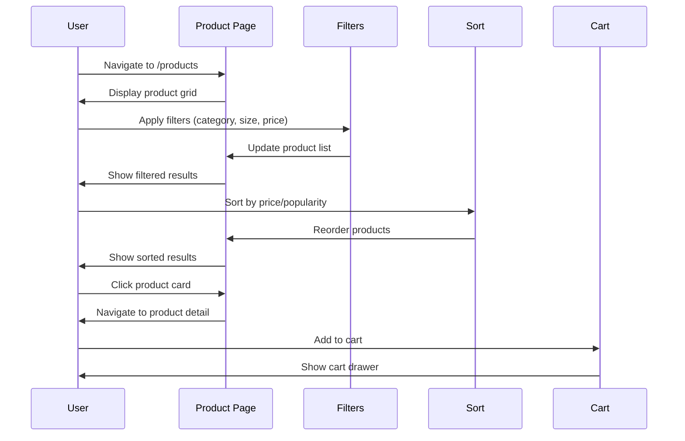
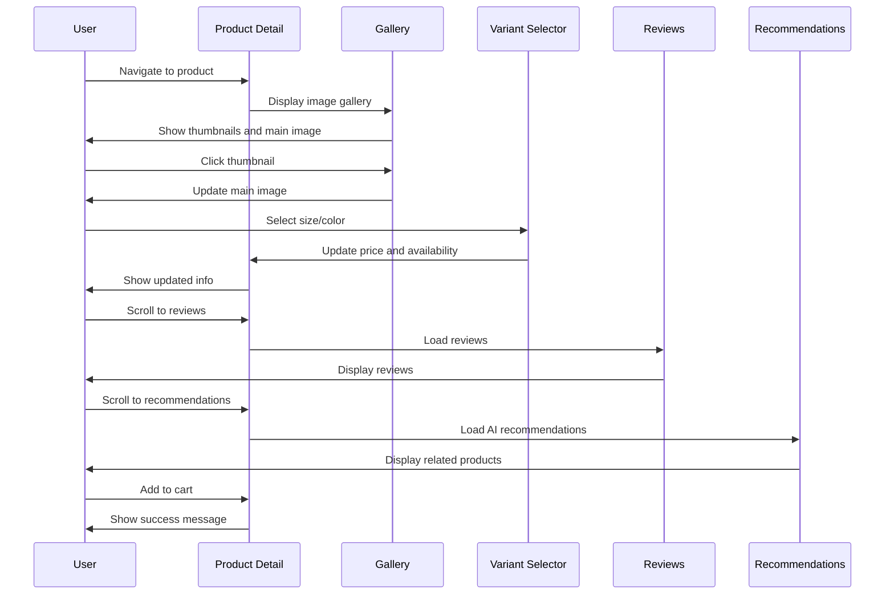
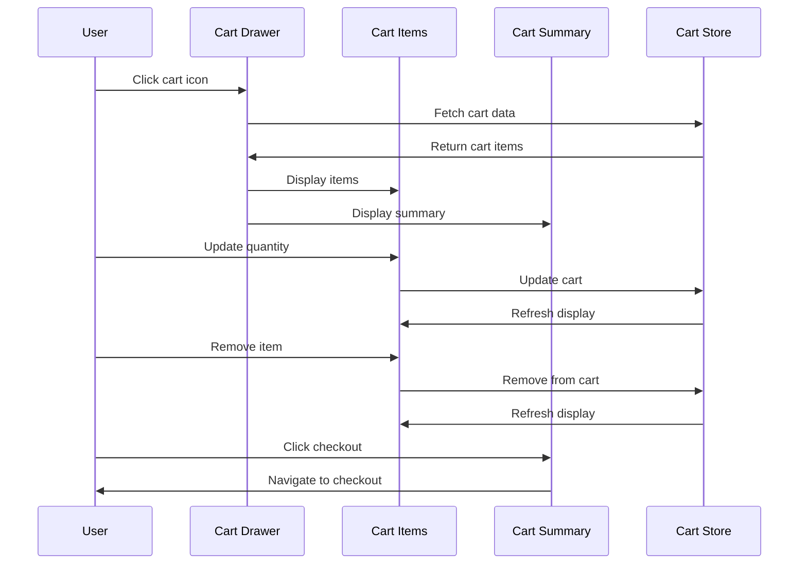
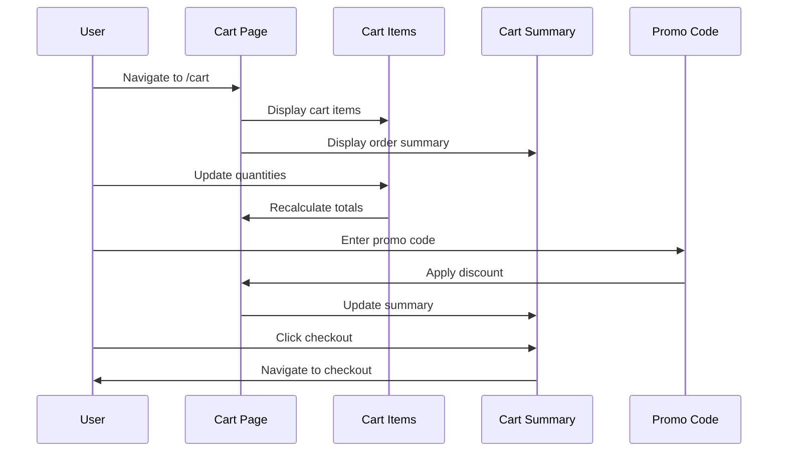
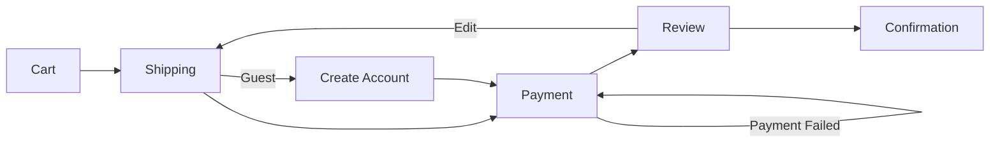
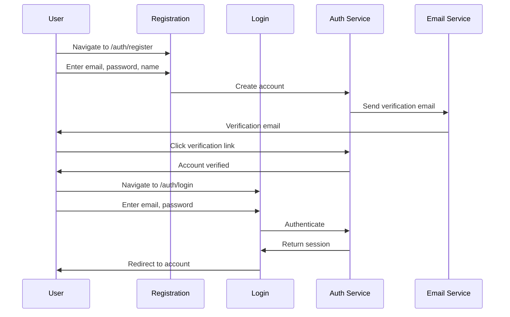

# E-Commerce Features Specification

**Document Version:** 2.0  
**Date:** February 2026  
**Author:** Product & Engineering Team  
**Status:** Final

---

## Executive Summary

This document defines the complete e-commerce features for the Baby Petite children's clothing platform. It covers detailed user journeys for browsing, checkout, payments, and account management. Each feature is specified with user flows, requirements, and acceptance criteria. The platform emphasizes high-density product display, minimalist interface, and efficient shopping experience.

---

## 1. Feature Overview

### 1.1 Feature Matrix

| Feature | Priority | Phase | Status |
|---------|----------|-------|--------|
| Product Browsing | P0 | MVP | Specified |
| Product Search | P0 | MVP | Specified |
| Shopping Cart | P0 | MVP | Specified |
| Guest Checkout | P0 | MVP | Specified |
| User Registration | P0 | MVP | Specified |
| Payment Processing | P0 | MVP | Specified |
| Order Management | P0 | MVP | Specified |
| Account Dashboard | P1 | MVP | Specified |
| Address Management | P1 | MVP | Specified |
| Order History | P1 | MVP | Specified |
| Wishlist | P1 | Phase 2 | Specified |
| Product Reviews | P1 | Phase 2 | Specified |
| Gift Registry | P0 | MVP | Specified |
| Promo Codes | P1 | Phase 2 | Specified |
| Order Tracking | P1 | Phase 2 | Specified |
| Returns & Exchanges | P2 | Phase 3 | Specified |

---

## 2. Product Browsing

### 2.1 Product Listing Page

**User Journey:**

**Requirements:**

| ID | Requirement | Priority |
|----|-------------|----------|
| BR-001 | Display products in responsive grid layout | P0 |
| BR-002 | Show product image, name, price, rating | P0 |
| BR-003 | Support pagination or infinite scroll | P0 |
| BR-004 | Filter by category, size, color, price range | P0 |
| BR-005 | Sort by relevance, price, popularity, newest | P0 |
| BR-006 | Show product count and active filters | P1 |
| BR-007 | Quick add to cart from listing | P1 |
| BR-008 | Wishlist toggle on product cards | P1 |
| BR-009 | Show sale badges and discount percentages | P0 |
| BR-010 | Display "New" badges for new arrivals | P1 |

**Acceptance Criteria:**

- [ ] Products display in 1 column on mobile, 2 on tablet, 3-4 on desktop
- [ ] Each product card shows: image, name, price, rating, sale badge
- [ ] Filters update URL query parameters for shareability
- [ ] Pagination loads 24 products per page
- [ ] Sort options: Featured, Price: Low to High, Price: High to Low, Newest, Best Selling
- [ ] Filter sidebar collapses on mobile
- [ ] Clear all filters button available
- [ ] Active filters displayed as removable chips

### 2.2 Product Detail Page

**User Journey:**

**Requirements:**

| ID | Requirement | Priority |
|----|-------------|----------|
| PDR-001 | Display product images in gallery with thumbnails | P0 |
| PDR-002 | Show product name, price, description | P0 |
| PDR-003 | Variant selector for size and color | P0 |
| PDR-004 | Display stock availability | P0 |
| PDR-005 | Add to cart with quantity selector | P0 |
| PDR-006 | Wishlist toggle | P1 |
| PDR-007 | Product reviews with rating breakdown | P1 |
| PDR-008 | AI-powered product recommendations | P1 |
| PDR-009 | Size guide modal | P0 |
| PDR-010 | Shipping and returns information | P0 |
| PDR-011 | Product specifications table | P1 |
| PDR-012 | Social sharing buttons | P2 |
| PDR-013 | Recently viewed products | P2 |
| PDR-014 | Breadcrumb navigation | P0 |

**Acceptance Criteria:**

- [ ] Image gallery supports zoom on hover
- [ ] Thumbnails update main image on click
- [ ] Variant selector shows available options
- [ ] Out of stock variants are disabled
- [ ] Stock level shown (e.g., "Only 3 left!")
- [ ] Size guide opens modal with measurements
- [ ] Reviews show average rating and count
- [ ] Reviews can be filtered by rating
- [ ] Recommendations load after page render
- [ ] Add to cart shows loading state
- [ ] Success toast appears after adding to cart

---

## 3. Shopping Cart

### 3.1 Cart Drawer

**User Journey:**

**Requirements:**

| ID | Requirement | Priority |
|----|-------------|----------|
| CD-001 | Slide-out cart drawer from right | P0 |
| CD-002 | Display all cart items with images | P0 |
| CD-003 | Quantity adjustment (+/-) | P0 |
| CD-004 | Remove item button | P0 |
| CD-005 | Show subtotal, shipping, tax, total | P0 |
| CD-006 | Free shipping threshold indicator | P1 |
| CD-007 | Promo code input field | P1 |
| CD-008 | Continue shopping button | P0 |
| CD-009 | Checkout button | P0 |
| CD-010 | Empty cart state with CTA | P0 |
| CD-011 | Save for later option | P2 |
| CD-012 | Estimated delivery date | P1 |

**Acceptance Criteria:**

- [ ] Cart drawer opens on cart icon click
- [ ] Cart drawer closes on backdrop click or escape key
- [ ] Each item shows: image, name, variant, price, quantity
- [ ] Quantity updates with +/- buttons
- [ ] Quantity can be manually entered
- [ ] Remove item shows confirmation
- [ ] Subtotal updates in real-time
- [ ] Free shipping progress bar shows amount needed
- [ ] Promo code applies discount immediately
- [ ] Checkout button disabled if cart is empty

### 3.2 Cart Page

**User Journey:**

**Requirements:**

| ID | Requirement | Priority |
|----|-------------|----------|
| CP-001 | Full-page cart view | P0 |
| CP-002 | Editable quantities | P0 |
| CP-003 | Remove items | P0 |
| CP-004 | Move to wishlist | P1 |
| CP-005 | Promo code application | P1 |
| CP-006 | Order summary with breakdown | P0 |
| CP-007 | Continue shopping link | P0 |
| CP-008 | Secure checkout CTA | P0 |
| CP-009 | Trust badges | P1 |
| CP-010 | Product recommendations | P2 |

**Acceptance Criteria:**

- [ ] All cart items displayed in table format
- [ ] Quantity input accepts manual entry
- [ ] Remove button shows confirmation modal
- [ ] Move to wishlist available for logged-in users
- [ ] Promo code validates before applying
- [ ] Invalid promo codes show error message
- [ ] Order summary shows: subtotal, discount, shipping, tax, total
- [ ] Trust badges display at bottom
- [ ] Recommendations show below cart

---

## 4. Checkout Flow

### 4.1 Checkout Overview

**User Journey:**

**Requirements:**

| ID | Requirement | Priority |
|----|-------------|----------|
| CO-001 | Multi-step checkout process | P0 |
| CO-002 | Progress indicator | P0 |
| CO-003 | Guest checkout option | P0 |
| CO-004 | Account creation during checkout | P0 |
| CO-005 | Address validation | P0 |
| CO-006 | Multiple payment methods | P0 |
| CO-007 | Order review before submission | P0 |
| CO-008 | Order confirmation page | P0 |
| CO-009 | Confirmation email | P0 |
| CO-010 | Cart persistence | P0 |

### 4.2 Shipping Step

**Requirements:**

| ID | Requirement | Priority |
|----|-------------|----------|
| SH-001 | Email address input | P0 |
| SH-002 | Shipping address form | P0 |
| SH-003 | Address autocomplete | P1 |
| SH-004 | Save address option | P1 |
| SH-005 | Shipping method selection | P0 |
| SH-006 | Estimated delivery dates | P1 |
| SH-007 | Gift message option | P2 |
| SH-008 | Different billing address option | P1 |

**Form Fields:**

| Field | Type | Required | Validation |
|-------|------|----------|------------|
| Email | Email | Yes | Valid email format |
| First Name | Text | Yes | 2-50 characters |
| Last Name | Text | Yes | 2-50 characters |
| Address Line 1 | Text | Yes | 5-100 characters |
| Address Line 2 | Text | No | 0-100 characters |
| City | Text | Yes | 2-50 characters |
| State | Select | Yes | Valid state |
| ZIP | Text | Yes | Valid ZIP format |
| Country | Select | Yes | Valid country |
| Phone | Phone | Yes | Valid phone format |

**Acceptance Criteria:**

- [ ] Form validates on blur and submit
- [ ] Error messages display inline
- [ ] Address autocomplete suggests addresses
- [ ] Saved addresses can be selected
- [ ] Shipping methods show: name, price, delivery date
- [ ] Default shipping method selected
- [ ] Continue button disabled until valid
- [ ] Progress indicator shows current step

### 4.3 Payment Step

**Requirements:**

| ID | Requirement | Priority |
|----|-------------|----------|
| PY-001 | Credit card payment | P0 |
| PY-002 | Apple Pay | P1 |
| PY-003 | Google Pay | P1 |
| PY-004 | PayPal | P1 |
| PY-005 | Card number validation | P0 |
| PY-006 | Expiry date validation | P0 |
| PY-007 | CVV validation | P0 |
| PY-008 | Save card option | P1 |
| PY-009 | Billing address | P0 |
| PY-010 | Order summary | P0 |

**Payment Form Fields:**

| Field | Type | Required | Validation |
|-------|------|----------|------------|
| Card Number | Text | Yes | Luhn algorithm |
| Expiry Date | Text | Yes | MM/YY format, future date |
| CVV | Text | Yes | 3-4 digits |
| Cardholder Name | Text | Yes | 2-50 characters |
| Save Card | Checkbox | No | N/A |

**Acceptance Criteria:**

- [ ] Card number formats with spaces
- [ ] Card type detected automatically
- [ ] Expiry date validates format and future date
- [ ] CVV masked after entry
- [ ] Billing address defaults to shipping
- [ ] Different billing address can be entered
- [ ] Saved cards can be selected
- [ ] Pay button shows loading state
- [ ] Payment errors display clearly
- [ ] Order summary shows on right side

### 4.4 Review Step

**Requirements:**

| ID | Requirement | Priority |
|----|-------------|----------|
| RS-001 | Order items summary | P0 |
| RS-002 | Shipping address review | P0 |
| RS-003 | Billing address review | P0 |
| RS-004 | Payment method review | P0 |
| RS-005 | Order total breakdown | P0 |
| RS-006 | Edit buttons for each section | P0 |
| RS-007 | Terms and conditions checkbox | P0 |
| RS-008 | Place order button | P0 |

**Acceptance Criteria:**

- [ ] All order items listed with quantities
- [ ] Shipping address displayed with edit option
- [ ] Billing address displayed with edit option
- [ ] Payment method displayed with edit option
- [ ] Order total shows: subtotal, discount, shipping, tax, total
- [ ] Terms checkbox required to place order
- [ ] Place order button shows loading state
- [ ] Order cannot be modified after submission

### 4.5 Order Confirmation

**Requirements:**

| ID | Requirement | Priority |
|----|-------------|----------|
| OC-001 | Order number display | P0 |
| OC-002 | Order summary | P0 |
| OC-003 | Shipping information | P0 |
| OC-004 | Estimated delivery date | P0 |
| OC-005 | Order tracking link | P0 |
| OC-006 | Continue shopping button | P0 |
| OC-007 | Create account prompt (guest) | P1 |
| OC-008 | Share order option | P2 |

**Acceptance Criteria:**

- [ ] Order number prominently displayed
- [ ] Order items listed with images
- [ ] Shipping address shown
- [ ] Estimated delivery date shown
- [ ] Order tracking link provided
- [ ] Confirmation email sent
- [ ] Cart cleared after order
- [ ] Guest users prompted to create account

---

## 5. User Account

### 5.1 Registration & Login

**User Journey:**

**Requirements:**

| ID | Requirement | Priority |
|----|-------------|----------|
| AU-001 | Email/password registration | P0 |
| AU-002 | Email verification | P0 |
| AU-003 | Password strength requirements | P0 |
| AU-004 | Login with email/password | P0 |
| AU-005 | Remember me option | P1 |
| AU-006 | Forgot password flow | P0 |
| AU-007 | Password reset | P0 |
| AU-008 | Social login (Google, Facebook) | P1 |
| AU-009 | Session management | P0 |
| AU-010 | Logout functionality | P0 |

**Registration Form Fields:**

| Field | Type | Required | Validation |
|-------|------|----------|------------|
| Email | Email | Yes | Valid email, unique |
| Password | Password | Yes | 8+ chars, 1 uppercase, 1 lowercase, 1 number |
| Confirm Password | Password | Yes | Matches password |
| First Name | Text | Yes | 2-50 characters |
| Last Name | Text | Yes | 2-50 characters |
| Agree to Terms | Checkbox | Yes | Must be checked |

**Acceptance Criteria:**

- [ ] Email validation checks format and uniqueness
- [ ] Password strength indicator shows requirements
- [ ] Password confirmation must match
- [ ] Verification email sent after registration
- [ ] Unverified accounts have limited access
- [ ] Login validates credentials
- [ ] Remember me extends session
- [ ] Forgot password sends reset email
- [ ] Reset link expires in 24 hours
- [ ] Social login creates or links account

### 5.2 Account Dashboard

**Requirements:**

| ID | Requirement | Priority |
|----|-------------|----------|
| AD-001 | Account overview | P0 |
| AD-002 | Profile management | P0 |
| AD-003 | Order history | P0 |
| AD-004 | Address management | P0 |
| AD-005 | Payment methods | P1 |
| AD-006 | Wishlist | P1 |
| AD-007 | Registry management | P0 |
| AD-008 | Account settings | P0 |
| AD-009 | Notification preferences | P1 |
| AD-010 | Account deletion | P2 |

**Dashboard Sections:**

| Section | Description |
|---------|-------------|
| Overview | Welcome message, quick stats, recent orders |
| Profile | Name, email, phone, avatar |
| Orders | Order history with status and tracking |
| Addresses | Saved shipping and billing addresses |
| Payment | Saved payment methods |
| Wishlist | Saved products |
| Registry | Baby registry management |
| Settings | Password, notifications, preferences |

**Acceptance Criteria:**

- [ ] Dashboard shows user's name and avatar
- [ ] Quick stats: total orders, total spent, registry progress
- [ ] Recent orders displayed with status
- [ ] Navigation menu on left side
- [ ] Mobile menu collapses to hamburger
- [ ] Each section accessible via navigation

### 5.3 Profile Management

**Requirements:**

| ID | Requirement | Priority |
|----|-------------|----------|
| PM-001 | Update name | P0 |
| PM-002 | Update email | P0 |
| PM-003 | Update phone | P1 |
| PM-004 | Upload avatar | P1 |
| PM-005 | Change password | P0 |
| PM-006 | Email verification required for change | P0 |

**Acceptance Criteria:**

- [ ] Name updates immediately
- [ ] Email change requires verification
- [ ] Phone number validates format
- [ ] Avatar upload supports JPG, PNG
- [ ] Avatar cropped to square
- [ ] Password change requires current password
- [ ] New password meets strength requirements
- [ ] Success message shown after update

### 5.4 Order History

**Requirements:**

| ID | Requirement | Priority |
|----|-------------|----------|
| OH-001 | List all orders | P0 |
| OH-002 | Order status display | P0 |
| OH-003 | Order detail view | P0 |
| OH-004 | Order tracking | P0 |
| OH-005 | Reorder functionality | P1 |
| OH-006 | Cancel order (if eligible) | P1 |
| OH-007 | Return request (if eligible) | P2 |
| OH-008 | Download invoice | P1 |
| OH-009 | Filter by status | P1 |
| OH-010 | Search orders | P2 |

**Order Statuses:**

| Status | Description | Actions |
|--------|-------------|---------|
| Pending | Order received, processing | None |
| Confirmed | Order confirmed, preparing | None |
| Processing | Being prepared for shipment | None |
| Shipped | Shipped, tracking available | Track |
| Delivered | Delivered successfully | Reorder, Return |
| Cancelled | Order cancelled | Reorder |
| Refunded | Order refunded | Reorder |

**Acceptance Criteria:**

- [ ] Orders listed in reverse chronological order
- [ ] Each order shows: number, date, status, total
- [ ] Status color-coded (green=delivered, yellow=processing, red=cancelled)
- [ ] Clicking order shows detail view
- [ ] Detail view shows: items, shipping, payment, tracking
- [ ] Tracking link opens carrier website
- [ ] Reorder adds items to cart
- [ ] Cancel available within 1 hour
- [ ] Return available within 30 days
- [ ] Invoice downloads as PDF

### 5.5 Address Management

**Requirements:**

| ID | Requirement | Priority |
|----|-------------|----------|
| AM-001 | Add new address | P0 |
| AM-002 | Edit existing address | P0 |
| AM-003 | Delete address | P0 |
| AM-004 | Set default address | P0 |
| AM-005 | Address validation | P0 |
| AM-006 | Address autocomplete | P1 |

**Acceptance Criteria:**

- [ ] All addresses listed in cards
- [ ] Default address marked
- [ ] Add button opens form modal
- [ ] Edit button pre-fills form
- [ ] Delete shows confirmation
- [ ] Default address cannot be deleted (must set another first)
- [ ] Address validates on save
- [ ] Autocomplete suggests addresses

---

## 6. Wishlist

### 6.1 Wishlist Features

**Requirements:**

| ID | Requirement | Priority |
|----|-------------|----------|
| WL-001 | Add products to wishlist | P1 |
| WL-002 | Remove from wishlist | P1 |
| WL-003 | View wishlist page | P1 |
| WL-004 | Move wishlist to cart | P1 |
| WL-005 | Share wishlist | P2 |
| WL-006 | Wishlist count in header | P1 |
| WL-007 | Wishlist persists across sessions | P1 |
| WL-008 | Out of stock indicators | P1 |

**Acceptance Criteria:**

- [ ] Heart icon toggles wishlist status
- [ ] Wishlist page shows all saved products
- [ ] Each item shows: image, name, price, availability
- [ ] Add to cart button on each item
- [ ] Add all to cart button
- [ ] Remove button on each item
- [ ] Share button generates shareable link
- [ ] Wishlist count updates in header
- [ ] Out of stock items marked
- [ ] Wishlist saved to user account

---

## 7. Product Reviews

### 7.1 Review Features

**Requirements:**

| ID | Requirement | Priority |
|----|-------------|----------|
| RV-001 | Submit product review | P1 |
| RV-002 | Rate with stars (1-5) | P1 |
| RV-003 | Write review title and content | P1 |
| RV-004 | Upload review photos | P2 |
| RV-005 | Verified purchase badge | P1 |
| RV-006 | Helpful voting | P1 |
| RV-007 | Report inappropriate reviews | P2 |
| RV-008 | Filter reviews by rating | P1 |
| RV-009 | Sort reviews | P1 |
| RV-010 | Review moderation | P0 |

**Acceptance Criteria:**

- [ ] Only verified purchasers can review
- [ ] Rating required (1-5 stars)
- [ ] Review title required (5-100 characters)
- [ ] Review content required (20-1000 characters)
- [ ] Photos optional (max 5, max 5MB each)
- [ ] Reviews display with: rating, title, content, date, verified badge
- [ ] Helpful vote increments count
- [ ] Report option available
- [ ] Reviews filtered by rating
- [ ] Reviews sorted by: most helpful, most recent, highest rated
- [ ] Reviews moderated before publishing

---

## 8. Promo Codes

### 8.1 Promo Code Features

**Requirements:**

| ID | Requirement | Priority |
|----|-------------|----------|
| PC-001 | Apply promo code at checkout | P1 |
| PC-002 | Validate promo code | P0 |
| PC-003 | Show discount amount | P0 |
| PC-004 | Multiple promo codes | P2 |
| PC-005 | Promo code expiration | P0 |
| PC-006 | Usage limits | P0 |
| PC-007 | Minimum order value | P0 |
| PC-008 | Product/category restrictions | P1 |
| PC-009 | First-time customer codes | P1 |
| PC-010 | Referral codes | P2 |

**Acceptance Criteria:**

- [ ] Promo code input in cart and checkout
- [ ] Apply button validates code
- [ ] Invalid codes show error message
- [ ] Expired codes show error message
- [ ] Discount applied to order total
- [ ] Discount amount displayed
- [ ] Promo code cannot be combined (unless allowed)
- [ ] Minimum order value enforced
- [ ] Product/category restrictions enforced
- [ ] Usage limits enforced

---

## 9. Order Tracking

### 9.1 Tracking Features

**Requirements:**

| ID | Requirement | Priority |
|----|-------------|----------|
| OT-001 | Track order by order number | P1 |
| OT-002 | Track order by email | P1 |
| OT-003 | Display tracking history | P1 |
| OT-004 | Show estimated delivery | P1 |
| OT-005 | Carrier tracking link | P0 |
| OT-006 | SMS tracking updates | P2 |
| OT-007 | Email tracking updates | P1 |

**Acceptance Criteria:**

- [ ] Tracking page accessible from order detail
- [ ] Enter order number and email to track
- [ ] Tracking history shows: date, status, location
- [ ] Current status highlighted
- [ ] Estimated delivery date shown
- [ ] Carrier link opens tracking page
- [ ] Email updates sent at each status change
- [ ] SMS updates optional

---

## 10. Returns & Exchanges

### 10.1 Return Features

**Requirements:**

| ID | Requirement | Priority |
|----|-------------|----------|
| RE-001 | Initiate return request | P2 |
| RE-002 | Select items to return | P2 |
| RE-003 | Select return reason | P2 |
| RE-004 | Upload return photos | P2 |
| RE-005 | Print return label | P2 |
| RE-006 | Return status tracking | P2 |
| RE-007 | Refund to original payment | P2 |
| RE-008 | Store credit option | P2 |
| RE-009 | Exchange for different size | P2 |
| RE-010 | 30-day return window | P0 |

**Acceptance Criteria:**

- [ ] Return request available within 30 days
- [ ] Select items from order
- [ ] Select return reason from dropdown
- [ ] Upload photos of issue
- [ ] Return label generated as PDF
- [ ] Return status tracked in order history
- [ ] Refund processed to original payment
- [ ] Store credit option available
- [ ] Exchange for different size/color
- [ ] Return shipping free for defective items

---

## 11. Mobile Experience

### 11.1 Mobile Requirements

| ID | Requirement | Priority |
|----|-------------|----------|
| ME-001 | Responsive design | P0 |
| ME-002 | Touch-friendly buttons | P0 |
| ME-003 | Mobile navigation | P0 |
| ME-004 | Mobile checkout | P0 |
| ME-005 | Mobile-optimized images | P0 |
| ME-006 | Swipe gestures for gallery | P1 |
| ME-007 | Bottom navigation | P1 |
| ME-008 | Mobile-specific features | P2 |

**Acceptance Criteria:**

- [ ] Layout adapts to all screen sizes
- [ ] Buttons minimum 44x44px for touch
- [ ] Hamburger menu on mobile
- [ ] Cart drawer optimized for mobile
- [ ] Checkout flow works on mobile
- [ ] Images load appropriate sizes
- [ ] Swipe gestures for image gallery
- [ ] Bottom navigation for key sections

---

## 12. Performance Requirements

| Metric | Target | Measurement |
|--------|--------|-------------|
| Page Load Time | <2s | Lighthouse |
| Time to Interactive | <3.5s | Lighthouse |
| First Contentful Paint | <1.5s | Lighthouse |
| Cart Add Response | <500ms | API monitoring |
| Checkout Submit | <2s | API monitoring |
| Search Response | <300ms | API monitoring |

---

## 13. Security Requirements

| Requirement | Implementation |
|-------------|----------------|
| HTTPS | All pages use TLS 1.3 |
| PCI Compliance | Stripe handles card data |
| CSRF Protection | Token-based protection |
| XSS Prevention | Input sanitization, output encoding |
| Rate Limiting | API endpoints limited |
| Session Security | Secure cookies, httpOnly |
| Password Security | bcrypt hashing, strength requirements |

---

## 14. Conclusion

The Baby Petite e-commerce features specification provides:

✅ **Complete Feature Set:** All essential e-commerce functionality  
✅ **Detailed User Journeys:** Clear flows for each feature  
✅ **Acceptance Criteria:** Testable requirements  
✅ **Priority Levels:** Phased implementation approach  
✅ **Mobile-First:** Responsive design throughout  
✅ **Security Focus:** PCI compliance and data protection  

This specification is production-ready and provides a comprehensive guide for feature development.

---

**Document Control:**
- Created: February 2026
- Last Updated: February 2026
- Next Review: August 2026
- Approved By: Product Manager
