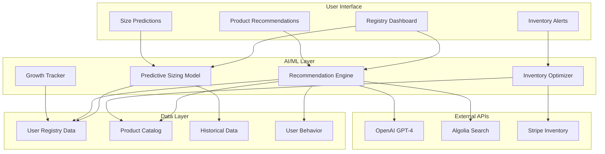

# AI-Powered Registry Specification

**Document Version:** 2.0  
**Date:** February 2026  
**Author:** AI/ML & Product Team  
**Status:** Final

---

## Executive Summary

This document defines the AI-powered Registry service for the Baby Petite children's clothing platform. The registry leverages machine learning to provide predictive sizing, smart product recommendations, and automated inventory management. This differentiates Baby Petite from competitors by offering a truly intelligent registry experience that anticipates parents' needs.

---

## 1. Overview

### 1.1 Value Proposition

The AI-Powered Baby Registry provides:

| Feature | Benefit | Differentiation |
|---------|---------|-----------------|
| **Predictive Sizing** | Know what sizes to buy when | No more guessing or returns |
| **Smart Recommendations** | Curated product suggestions | Personalized based on baby's needs |
| **Automated Inventory** | Real-time stock alerts | Never miss out on wanted items |
| **Growth Tracking** | Follow baby's development | Registry evolves with baby |
| **Community Insights** | Learn from other parents | Data-driven product choices |

### 1.2 System Architecture



---

## 2. Predictive Sizing

### 2.1 Overview

The predictive sizing model uses baby growth data to recommend the appropriate clothing sizes at each stage of development. This helps parents and gift-givers purchase the right sizes at the right time.

### 2.2 Data Inputs

| Input | Source | Description |
|-------|--------|-------------|
| Due Date | User input | Expected birth date |
| Baby Gender | User input | Boy, girl, or unknown |
| Parent Height | User input | Mother and father height |
| Birth Weight | User input (after birth) | Actual birth weight |
| Birth Length | User input (after birth) | Actual birth length |
| Growth Milestones | User updates | Weight/length measurements |
| Historical Data | Database | Growth patterns from similar babies |

### 2.3 Growth Model

**Growth Percentile Calculation:**

```typescript
// Growth model based on WHO child growth standards
interface GrowthData {
  ageInMonths: number;
  weight: number; // kg
  length: number; // cm
  gender: 'male' | 'female';
}

interface SizePrediction {
  ageRange: string;
  recommendedSize: string;
  confidence: number;
  nextSize: string;
  nextSizeDate: Date;
}

function calculateGrowthPercentile(data: GrowthData): number {
  // WHO growth standards for weight-for-age
  const whoStandards = getWHOStandards(data.gender, data.ageInMonths);
  
  // Calculate z-score
  const mean = whoStandards.weightMean;
  const sd = whoStandards.weightSD;
  const zScore = (data.weight - mean) / sd;
  
  // Convert z-score to percentile
  return normalCDF(zScore) * 100;
}

function predictClothingSize(
  dueDate: Date,
  gender: 'male' | 'female',
  parentHeight: { mother: number; father: number }
): SizePrediction[] {
  const predictions: SizePrediction[] = [];
  const birthDate = dueDate;
  
  // Predict size for each age range
  const ageRanges = [
    { months: 0, size: 'Newborn' },
    { months: 3, size: '0-3M' },
    { months: 6, size: '3-6M' },
    { months: 9, size: '6-9M' },
    { months: 12, size: '12M' },
    { months: 18, size: '18M' },
    { months: 24, size: '24M' },
  ];
  
  for (let i = 0; i < ageRanges.length; i++) {
    const current = ageRanges[i];
    const next = ageRanges[i + 1];
    
    const targetDate = addMonths(birthDate, current.months);
    const nextDate = next ? addMonths(birthDate, next.months) : null;
    
    predictions.push({
      ageRange: `${current.months} months`,
      recommendedSize: current.size,
      confidence: calculateConfidence(current.months, gender),
      nextSize: next?.size || null,
      nextSizeDate: nextDate,
    });
  }
  
  return predictions;
}
```

### 2.4 Size Mapping

**Baby Clothing Size Chart:**

| Age Range | Weight (lbs) | Length (in) | Size Label |
|-----------|--------------|-------------|------------|
| Preemie | < 5 | < 17 | Preemie |
| Newborn | 5-8 | 17-20 | Newborn |
| 0-3 Months | 8-12 | 20-23 | 0-3M |
| 3-6 Months | 12-16 | 23-26 | 3-6M |
| 6-9 Months | 16-18 | 26-28 | 6-9M |
| 9-12 Months | 18-21 | 28-30 | 9-12M |
| 12-18 Months | 21-24 | 30-32 | 12-18M |
| 18-24 Months | 24-27 | 32-34 | 18-24M |
| 2T | 27-30 | 34-36 | 2T |
| 3T | 30-33 | 36-39 | 3T |
| 4T | 33-36 | 39-42 | 4T |
| 5T | 36-40 | 42-45 | 5T |

### 2.5 Size Prediction Algorithm

```typescript
interface SizePredictionAlgorithm {
  predictSize: (
    currentAge: number,
    currentWeight: number,
    currentLength: number,
    gender: 'male' | 'female'
  ) => {
    currentSize: string;
    nextSize: string;
    transitionDate: Date;
    confidence: number;
  };
}

const sizePredictionAlgorithm: SizePredictionAlgorithm = {
  predictSize: (currentAge, currentWeight, currentLength, gender) => {
    // Calculate growth rate
    const growthRate = calculateGrowthRate(currentAge, currentWeight, gender);
    
    // Predict weight at 3 months
    const predictedWeight3M = currentWeight + (growthRate * 3);
    
    // Predict weight at 6 months
    const predictedWeight6M = predictedWeight3M + (growthRate * 3);
    
    // Map to sizes
    const currentSize = mapWeightToSize(currentWeight, currentLength);
    const nextSize = mapWeightToSize(predictedWeight3M, currentLength + 2);
    
    // Calculate transition date
    const transitionDate = calculateTransitionDate(
      currentWeight,
      predictedWeight3M,
      growthRate
    );
    
    // Calculate confidence based on data quality
    const confidence = calculatePredictionConfidence(
      currentAge,
      currentWeight,
      gender
    );
    
    return {
      currentSize,
      nextSize,
      transitionDate,
      confidence,
    };
  },
};
```

### 2.6 User Interface

**Registry Size Timeline:**

```
┌─────────────────────────────────────────────────────────────┐
│  Size Predictions for Baby Smith                            │
│  Due: March 15, 2026                                        │
├─────────────────────────────────────────────────────────────┤
│                                                             │
│  ┌─────────────────────────────────────────────────────┐   │
│  │ Newborn (0-3M)                                      │   │
│  │ Recommended: 8-12 lbs                               │   │
│  │ Confidence: 95%                                     │   │
│  │ Items needed: 12 onesies, 6 pajamas, 4 outfits     │   │
│  │ Status: ✅ Complete                                 │   │
│  └─────────────────────────────────────────────────────┘   │
│                                                             │
│  ┌─────────────────────────────────────────────────────┐   │
│  │ 3-6 Months                                           │   │
│  │ Recommended: 12-16 lbs                              │   │
│  │ Confidence: 90%                                     │   │
│  │ Items needed: 8 onesies, 4 pajamas, 3 outfits      │   │
│  │ Status: ⚠️ 3 items remaining                        │   │
│  │ [Add Items]                                         │   │
│  └─────────────────────────────────────────────────────┘   │
│                                                             │
│  ┌─────────────────────────────────────────────────────┐   │
│  │ 6-9 Months                                           │   │
│  │ Recommended: 16-18 lbs                              │   │
│  │ Confidence: 85%                                     │   │
│  │ Items needed: 6 onesies, 3 pajamas, 2 outfits      │   │
│  │ Status: ❌ Not started                              │   │
│  │ [Add Items]                                         │   │
│  └─────────────────────────────────────────────────────┘   │
│                                                             │
└─────────────────────────────────────────────────────────────┘
```

---

## 3. Smart Recommendations

### 3.1 Overview

The recommendation engine uses multiple AI models to suggest products based on:

- Baby's age and predicted growth
- Season and weather patterns
- Parent preferences and budget
- Popular items among similar parents
- Registry completion status

### 3.2 Recommendation Models

#### 3.2.1 Collaborative Filtering

```typescript
interface CollaborativeFilteringModel {
  findSimilarUsers: (userId: string) => string[];
  recommendFromSimilarUsers: (
    userId: string,
    similarUsers: string[]
  ) => Product[];
}

const collaborativeFilteringModel: CollaborativeFilteringModel = {
  findSimilarUsers: (userId) => {
    // Find users with similar:
    // - Due date (within 2 months)
    // - Baby gender
    // - Geographic location
    // - Budget range
    const user = getUserById(userId);
    
    return db.user.findMany({
      where: {
        id: { not: userId },
        registry: {
          dueDate: {
            gte: subMonths(user.registry.dueDate, 2),
            lte: addMonths(user.registry.dueDate, 2),
          },
          babyGender: user.registry.babyGender,
        },
      },
      take: 50,
    });
  },
  
  recommendFromSimilarUsers: (userId, similarUsers) => {
    // Get products frequently added by similar users
    const productFrequency = db.registryItem.groupBy({
      by: ['productId'],
      where: {
        registry: {
          userId: { in: similarUsers.map(u => u.id) },
        },
      },
      orderBy: {
        _count: {
          productId: 'desc',
        },
      },
      take: 20,
    });
    
    // Filter out products already in user's registry
    const userRegistry = getUserRegistry(userId);
    const existingProductIds = userRegistry.items.map(i => i.productId);
    
    return productFrequency
      .filter(p => !existingProductIds.includes(p.productId))
      .slice(0, 10);
  },
};
```

#### 3.2.2 Content-Based Filtering

```typescript
interface ContentBasedModel {
  recommendByAttributes: (
    userPreferences: UserPreferences,
    registryItems: RegistryItem[]
  ) => Product[];
}

interface UserPreferences {
  preferredColors: string[];
  preferredStyles: string[];
  budgetRange: { min: number; max: number };
  organicPreference: boolean;
  sustainabilityImportance: number; // 1-10
}

const contentBasedModel: ContentBasedModel = {
  recommendByAttributes: (preferences, registryItems) => {
    // Analyze existing registry items
    const existingCategories = registryItems.map(i => i.product.category);
    const existingColors = registryItems.flatMap(i => i.product.colors);
    
    // Find complementary products
    const recommendations = db.product.findMany({
      where: {
        AND: [
          { price: { gte: preferences.budgetRange.min } },
          { price: { lte: preferences.budgetRange.max } },
          { isActive: true },
          {
            OR: [
              { colors: { hasSome: preferences.preferredColors } },
              { category: { in: existingCategories } },
            ],
          },
        ],
      },
      take: 20,
    });
    
    // Score and rank recommendations
    return scoreRecommendations(recommendations, preferences);
  },
};

function scoreRecommendations(
  products: Product[],
  preferences: UserPreferences
): Product[] {
  return products.map(product => ({
    ...product,
    score: calculateRecommendationScore(product, preferences),
  })).sort((a, b) => b.score - a.score);
}

function calculateRecommendationScore(
  product: Product,
  preferences: UserPreferences
): number {
  let score = 0;
  
  // Color match (30 points)
  const colorMatch = product.colors.some(c => 
    preferences.preferredColors.includes(c)
  );
  if (colorMatch) score += 30;
  
  // Price alignment (20 points)
  const priceScore = 20 - Math.abs(
    (product.price - preferences.budgetRange.min) / 
    (preferences.budgetRange.max - preferences.budgetRange.min)
  ) * 20;
  score += priceScore;
  
  // Sustainability (20 points)
  if (product.isOrganic && preferences.organicPreference) score += 20;
  score += product.sustainabilityScore * (preferences.sustainabilityImportance / 10) * 20;
  
  // Popularity (15 points)
  score += product.popularityScore * 15;
  
  // Rating (15 points)
  score += product.averageRating * 3;
  
  return score;
}
```

#### 3.2.3 AI-Powered Recommendations (OpenAI)

```typescript
interface AIRecommendationModel {
  generateRecommendations: (
    context: RecommendationContext
  ) => Promise<AIRecommendation[]>;
}

interface RecommendationContext {
  baby: {
    dueDate: Date;
    gender: string;
    season: string;
  };
  registry: {
    items: RegistryItem[];
    completionPercentage: number;
  };
  parent: {
    preferences: UserPreferences;
    budget: number;
  };
}

interface AIRecommendation {
  productId: string;
  reason: string;
  priority: 'high' | 'medium' | 'low';
  category: string;
}

const aiRecommendationModel: AIRecommendationModel = {
  generateRecommendations: async (context) => {
    const prompt = `
You are a baby clothing expert. Based on the following information, recommend 10 products for a baby registry:

Baby Information:
- Due Date: ${context.baby.dueDate.toISOString()}
- Gender: ${context.baby.gender}
- Season: ${context.baby.season}

Current Registry:
- Items: ${context.registry.items.length}
- Completion: ${context.registry.completionPercentage}%

Parent Preferences:
- Budget: $${context.parent.budget}
- Preferred Colors: ${context.parent.preferences.preferredColors.join(', ')}
- Organic Preference: ${context.parent.preferences.organicPreference}

Provide recommendations in JSON format with:
- productId (use placeholder like "prod_001")
- reason (why this product is recommended)
- priority (high/medium/low)
- category (onesies, pajamas, etc.)
`;

    // Note: Model version configurable via environment variable
    // Recommended: gpt-4-turbo (latest stable)
    const response = await openai.chat.completions.create({
      model: process.env.OPENAI_MODEL || 'gpt-4-turbo',
      messages: [
        {
          role: 'system',
          content: 'You are a baby clothing recommendation engine. Provide recommendations in valid JSON format.',
        },
        {
          role: 'user',
          content: prompt,
        },
      ],
      response_format: { type: 'json_object' },
      temperature: 0.7,
    });

    const recommendations = JSON.parse(
      response.choices[0].message.content
    ) as AIRecommendation[];

    // Map AI recommendations to actual products
    return mapToProducts(recommendations);
  },
};
```

### 3.3 Recommendation Categories

| Category | Trigger | Products |
|----------|---------|----------|
| **Essentials** | New registry | Onesies, sleepers, socks |
| **Seasonal** | Weather-based | Lightweight/heavy clothing |
| **Growth Milestones** | Age-based | Size transitions |
| **Trending** | Popular items | Best-sellers, new arrivals |
| **Complementary** | Based on registry | Matching sets, accessories |
| **Budget-Friendly** | Price-based | Value packs, sale items |
| **Premium** | Quality-focused | Organic, designer items |

### 3.4 Recommendation Display

**Smart Recommendations Widget:**

```
┌─────────────────────────────────────────────────────────────┐
│  Smart Recommendations for Your Registry                    │
│  Based on your due date and preferences                     │
├─────────────────────────────────────────────────────────────┤
│                                                             │
│  🎯 High Priority - Essentials You Need                    │
│  ┌─────────────────────────────────────────────────────┐   │
│  │ [Image]  Organic Cotton Onesie 3-Pack               │   │
│  │          $24.99                                     │   │
│  │          Why: Essential for newborn period          │   │
│  │          [Add to Registry]                          │   │
│  └─────────────────────────────────────────────────────┘   │
│                                                             │
│  🌱 Seasonal - Spring Collection                           │
│  ┌─────────────────────────────────────────────────────┐   │
│  │ [Image]  Lightweight Romper                          │   │
│  │          $18.99                                     │   │
│  │          Why: Perfect for spring weather            │   │
│  │          [Add to Registry]                          │   │
│  └─────────────────────────────────────────────────────┘   │
│                                                             │
│  📈 Growth - 3-6 Month Essentials                          │
│  ┌─────────────────────────────────────────────────────┐   │
│  │ [Image]  Stretchy Pajamas 2-Pack                     │   │
│  │          $32.99                                     │   │
│  │          Why: Your baby will need these at 4 months │   │
│  │          [Add to Registry]                          │   │
│  └─────────────────────────────────────────────────────┘   │
│                                                             │
│  [View All Recommendations] [Refresh Suggestions]          │
└─────────────────────────────────────────────────────────────┘
```

---

## 4. Automated Inventory Management

### 4.1 Overview

The inventory management system automatically tracks registry items and alerts parents and gift-givers about stock availability, price changes, and discontinued items.

### 4.2 Inventory Monitoring

```typescript
interface InventoryMonitor {
  checkAvailability: (registryId: string) => Promise<InventoryAlert[]>;
  monitorPriceChanges: (registryId: string) => Promise<PriceAlert[]>;
  checkDiscontinuedItems: (registryId: string) => Promise<DiscontinuedAlert[]>;
}

interface InventoryAlert {
  registryItemId: string;
  productId: string;
  productName: string;
  variant: string;
  alertType: 'low_stock' | 'out_of_stock' | 'backordered';
  currentStock: number;
  neededQuantity: number;
  suggestedAction: string;
}

const inventoryMonitor: InventoryMonitor = {
  checkAvailability: async (registryId) => {
    const registry = await getRegistry(registryId);
    const alerts: InventoryAlert[] = [];
    
    for (const item of registry.items) {
      const inventory = await getInventory(item.variantId);
      const neededQuantity = item.quantity - item.purchased;
      
      if (inventory.available === 0) {
        alerts.push({
          registryItemId: item.id,
          productId: item.productId,
          productName: item.productName,
          variant: item.variantName,
          alertType: 'out_of_stock',
          currentStock: 0,
          neededQuantity,
          suggestedAction: 'Consider alternative products or wait for restock',
        });
      } else if (inventory.available < neededQuantity) {
        alerts.push({
          registryItemId: item.id,
          productId: item.productId,
          productName: item.productName,
          variant: item.variantName,
          alertType: 'low_stock',
          currentStock: inventory.available,
          neededQuantity,
          suggestedAction: `${inventory.available} available, ${neededQuantity - inventory.available} more needed`,
        });
      }
    }
    
    return alerts;
  },
  
  monitorPriceChanges: async (registryId) => {
    const registry = await getRegistry(registryId);
    const alerts: PriceAlert[] = [];
    
    for (const item of registry.items) {
      const currentPrice = await getCurrentPrice(item.variantId);
      const originalPrice = item.priceAtAddition;
      
      if (currentPrice < originalPrice) {
        alerts.push({
          registryItemId: item.id,
          productId: item.productId,
          productName: item.productName,
          originalPrice,
          currentPrice,
          savings: originalPrice - currentPrice,
          savingsPercentage: ((originalPrice - currentPrice) / originalPrice) * 100,
        });
      }
    }
    
    return alerts;
  },
  
  checkDiscontinuedItems: async (registryId) => {
    const registry = await getRegistry(registryId);
    const alerts: DiscontinuedAlert[] = [];
    
    for (const item of registry.items) {
      const product = await getProduct(item.productId);
      
      if (!product.isActive) {
        alerts.push({
          registryItemId: item.id,
          productId: item.productId,
          productName: item.productName,
          discontinuedDate: product.discontinuedAt,
          alternatives: await findAlternatives(item.productId),
        });
      }
    }
    
    return alerts;
  },
};
```

### 4.3 Alert System

```typescript
interface AlertSystem {
  sendInventoryAlert: (alert: InventoryAlert, userId: string) => Promise<void>;
  sendPriceAlert: (alert: PriceAlert, userId: string) => Promise<void>;
  sendDiscontinuedAlert: (alert: DiscontinuedAlert, userId: string) => Promise<void>;
  scheduleDailyChecks: () => void;
}

const alertSystem: AlertSystem = {
  sendInventoryAlert: async (alert, userId) => {
    const user = await getUser(userId);
    
    await sendEmail({
      to: user.email,
      template: 'inventory-alert',
      data: {
        productName: alert.productName,
        variant: alert.variant,
        alertType: alert.alertType,
        currentStock: alert.currentStock,
        suggestedAction: alert.suggestedAction,
        registryUrl: `${process.env.APP_URL}/registry/${user.registry.shareUrl}`,
      },
    });
    
    // Also send in-app notification
    await createNotification({
      userId,
      type: 'inventory_alert',
      title: `${alert.productName} - ${alert.alertType.replace('_', ' ')}`,
      message: alert.suggestedAction,
      actionUrl: `/registry/${user.registry.shareUrl}`,
    });
  },
  
  sendPriceAlert: async (alert, userId) => {
    const user = await getUser(userId);
    
    await sendEmail({
      to: user.email,
      template: 'price-drop',
      data: {
        productName: alert.productName,
        originalPrice: formatPrice(alert.originalPrice),
        currentPrice: formatPrice(alert.currentPrice),
        savings: formatPrice(alert.savings),
        savingsPercentage: alert.savingsPercentage.toFixed(0),
        registryUrl: `${process.env.APP_URL}/registry/${user.registry.shareUrl}`,
      },
    });
  },
  
  sendDiscontinuedAlert: async (alert, userId) => {
    const user = await getUser(userId);
    
    await sendEmail({
      to: user.email,
      template: 'discontinued-item',
      data: {
        productName: alert.productName,
        discontinuedDate: formatDate(alert.discontinuedDate),
        alternatives: alert.alternatives,
        registryUrl: `${process.env.APP_URL}/registry/${user.registry.shareUrl}`,
      },
    });
  },
  
  scheduleDailyChecks: () => {
    // Run inventory checks daily at 9 AM
    cron.schedule('0 9 * * *', async () => {
      const activeRegistries = await getActiveRegistries();
      
      for (const registry of activeRegistries) {
        const alerts = await inventoryMonitor.checkAvailability(registry.id);
        
        for (const alert of alerts) {
          await alertSystem.sendInventoryAlert(alert, registry.userId);
        }
      }
    });
  },
};
```

### 4.4 Inventory Dashboard

**Registry Inventory Status:**

```
┌─────────────────────────────────────────────────────────────┐
│  Inventory Status for Baby Smith Registry                   │
│  Last checked: 5 minutes ago                                │
├─────────────────────────────────────────────────────────────┤
│                                                             │
│  ✅ All items in stock (24/24)                             │
│                                                             │
│  📊 Stock Levels                                            │
│  ┌─────────────────────────────────────────────────────┐   │
│  │ Organic Cotton Onesie 3-Pack                         │   │
│  │ Stock: 45 available | Needed: 3                     │   │
│  │ Status: ✅ In Stock                                  │   │
│  └─────────────────────────────────────────────────────┘   │
│                                                             │
│  ⚠️ Low Stock Alerts (2 items)                             │
│  ┌─────────────────────────────────────────────────────┐   │
│  │ Floral Romper - Pink                                 │   │
│  │ Stock: 3 available | Needed: 2                      │   │
│  │ Status: ⚠️ Low Stock - Only 1 extra available       │   │
│  │ [Notify Gift Givers]                                 │   │
│  └─────────────────────────────────────────────────────┘   │
│                                                             │
│  💰 Price Drops (1 item)                                   │
│  ┌─────────────────────────────────────────────────────┐   │
│  │ Knit Sweater - Navy                                  │   │
│  │ Was: $34.99 | Now: $24.99                            │   │
│  │ Savings: $10.00 (29%)                                │   │
│  │ [Share with Gift Givers]                             │   │
│  └─────────────────────────────────────────────────────┘   │
│                                                             │
└─────────────────────────────────────────────────────────────┘
```

---

## 5. Growth Tracking

### 5.1 Overview

The growth tracking feature allows parents to log their baby's measurements and receive updated size predictions and product recommendations.

### 5.2 Growth Data Model

```typescript
interface GrowthEntry {
  id: string;
  registryId: string;
  date: Date;
  weight: number; // kg
  length: number; // cm
  headCircumference?: number; // cm
  notes?: string;
  createdAt: Date;
}

interface GrowthMilestone {
  ageInMonths: number;
  weightPercentile: number;
  lengthPercentile: number;
  expectedSize: string;
  nextSize: string;
  nextSizeDate: Date;
}
```

### 5.3 Growth Tracking UI

**Growth Timeline:**

```
┌─────────────────────────────────────────────────────────────┐
│  Growth Tracking - Baby Smith                               │
│  Born: March 15, 2026 | Current Age: 4 months              │
├─────────────────────────────────────────────────────────────┤
│                                                             │
│  📏 Current Measurements                                    │
│  ┌─────────────────────────────────────────────────────┐   │
│  │ Weight: 7.2 kg (15.8 lbs) | 50th percentile        │   │
│  │ Length: 65 cm (25.6 in) | 55th percentile          │   │
│  │ Head: 42 cm (16.5 in) | 48th percentile            │   │
│  │                                                       │   │
│  │ [Log New Measurements]                               │   │
│  └─────────────────────────────────────────────────────┘   │
│                                                             │
│  📈 Growth Chart                                           │
│  ┌─────────────────────────────────────────────────────┐   │
│  │  Weight (kg)                                         │   │
│  │  10 |                                              │   │
│  │   8 |           ●                                   │   │
│  │   6 |       ●       ●                               │   │
│  │   4 |   ●                                           │   │
│  │   2 |●                                              │   │
│  │    0├─────────────────────────────────              │   │
│  │      0   1   2   3   4   5   6   (months)          │   │
│  └─────────────────────────────────────────────────────┘   │
│                                                             │
│  👕 Size Predictions (Updated)                             │
│  ┌─────────────────────────────────────────────────────┐   │
│  │ Current: 3-6M (fits well) ✅                        │   │
│  │ Next: 6-9M (recommended in 2 months)                │   │
│  │                                                       │   │
│  │ Based on growth rate, baby is growing               │   │
│  │ slightly faster than average. Consider              │   │
│  │ buying 6-9M sizes soon.                             │   │
│  │                                                       │   │
│  │ [View 6-9M Products]                                │   │
│  └─────────────────────────────────────────────────────┘   │
│                                                             │
└─────────────────────────────────────────────────────────────┘
```

---

## 6. Registry Sharing & Collaboration

### 6.1 Share Features

| Feature | Description |
|---------|-------------|
| **Public Link** | Shareable URL for gift-givers |
| **QR Code** | Scan to access registry |
| **Social Sharing** | Share to Facebook, Instagram, etc. |
| **Email Invites** | Send registry via email |
| **Gift Giver Updates** | Notify when items are purchased |
| **Thank You Notes** | Track and send thank-you notes |

### 6.2 Gift Giver Experience

**Public Registry View:**

```
┌─────────────────────────────────────────────────────────────┐
│  🌱 Baby Smith's Registry                                   │
│  Due: March 15, 2026 | 75% Complete                        │
├─────────────────────────────────────────────────────────────┤
│                                                             │
│  👶 About Baby                                              │
│  Baby Smith is expected on March 15, 2026.                 │
│  Parents are excited to welcome their first child!         │
│                                                             │
│  🎁 Gift Guide                                             │
│  ┌─────────────────────────────────────────────────────┐   │
│  │ 💡 Smart Suggestion: Based on the due date,         │   │
│  │ 3-6 month sizes would be perfect gifts!             │   │
│  │                                                       │   │
│  │ [View 3-6M Products]                                │   │
│  └─────────────────────────────────────────────────────┘   │
│                                                             │
│  📋 Registry Items                                          │
│  ┌─────────────────────────────────────────────────────┐   │
│  │ ✅ Organic Cotton Onesie 3-Pack                      │   │
│  │    Purchased by Aunt Sarah | Thank you sent ✅      │   │
│  └─────────────────────────────────────────────────────┘   │
│  ┌─────────────────────────────────────────────────────┐   │
│  │ ⚠️ Floral Romper - Pink (2 remaining)               │   │
│  │    $18.99 | [Gift This]                             │   │
│  └─────────────────────────────────────────────────────┘   │
│  ┌─────────────────────────────────────────────────────┐   │
│  │ ❌ Knit Sweater - Navy                              │   │
│  │    $24.99 | [Gift This]                             │   │
│  └─────────────────────────────────────────────────────┘   │
│                                                             │
│  [View All Items] [Filter by Size] [Filter by Category]    │
│                                                             │
└─────────────────────────────────────────────────────────────┘
```

---

## 7. API Endpoints

### 7.1 Registry Endpoints

| Method | Endpoint | Description |
|--------|----------|-------------|
| GET | `/api/registry` | Get user's registry |
| POST | `/api/registry` | Create registry |
| PUT | `/api/registry` | Update registry |
| GET | `/api/registry/[shareUrl]` | Get public registry |
| POST | `/api/registry/items` | Add item to registry |
| PUT | `/api/registry/items/[id]` | Update registry item |
| DELETE | `/api/registry/items/[id]` | Remove item from registry |
| GET | `/api/registry/[id]/predictions` | Get size predictions |
| GET | `/api/registry/[id]/recommendations` | Get AI recommendations |
| GET | `/api/registry/[id]/inventory` | Get inventory status |
| POST | `/api/registry/[id]/growth` | Log growth entry |
| GET | `/api/registry/[id]/growth` | Get growth history |

### 7.2 AI Endpoints

| Method | Endpoint | Description |
|--------|----------|-------------|
| POST | `/api/ai/predict-sizes` | Generate size predictions |
| POST | `/api/ai/recommend` | Generate product recommendations |
| POST | `/api/ai/analyze-registry` | Analyze registry completeness |
| GET | `/api/ai/trending` | Get trending products |

---

## 8. Performance Requirements

| Metric | Target | Measurement |
|--------|--------|-------------|
| Size Prediction Response | <500ms | API monitoring |
| Recommendation Generation | <2s | API monitoring |
| Inventory Check | <300ms | API monitoring |
| Growth Chart Rendering | <1s | Frontend monitoring |
| Registry Page Load | <2s | Lighthouse |

---

## 9. Privacy & Data Security

| Requirement | Implementation |
|-------------|----------------|
| Baby Data Protection | Encrypted storage, access controls |
| Parental Consent | Explicit consent for data collection |
| Data Retention | 2 years after registry completion |
| Third-Party Sharing | No sharing without consent |
| GDPR Compliance | Right to deletion, data export |

---

## 10. Success Metrics

| Metric | Target | Measurement |
|--------|--------|-------------|
| Registry Completion Rate | 85% | Analytics |
| Average Registry Value | $500 | Analytics |
| Size Prediction Accuracy | 90% | User feedback |
| Recommendation Click Rate | 15% | Analytics |
| Inventory Alert Response Rate | 60% | Analytics |
| Gift Giver Conversion | 40% | Analytics |

---

## 11. Conclusion

The AI-Powered Baby Registry provides:

✅ **Predictive Sizing:** Data-driven size recommendations  
✅ **Smart Recommendations:** AI-curated product suggestions  
✅ **Automated Inventory:** Real-time stock and price alerts  
✅ **Growth Tracking:** Monitor baby's development  
✅ **Collaborative Sharing:** Easy sharing with gift-givers  

This feature differentiates Baby Petite from competitors by offering a truly intelligent registry experience that anticipates parents' needs and helps them prepare for their baby's arrival.

---

**Document Control:**
- Created: February 2026
- Last Updated: February 2026
- Next Review: August 2026
- Approved By: Product Manager & AI/ML Lead
