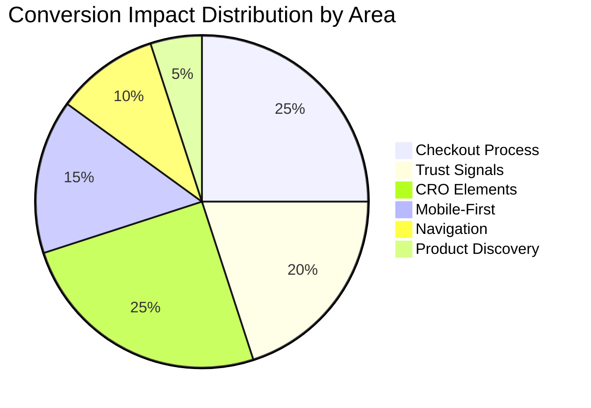

# E-Commerce UX Gap Analysis

**Document Version:** 1.0  
**Date:** February 12, 2026  
**Author:** UX Research Team  
**Status:** Complete

---

## Executive Summary

This document provides a detailed gap analysis comparing industry best practices against the current Baby Petite e-commerce implementation. The analysis identifies friction points that impact user experience and conversion rates across six key areas.

### Gap Summary by Severity

| Severity | Count | Key Areas |
|----------|-------|-----------|
| **Critical** | 6 | Guest checkout visibility, security badges, live chat, urgency indicators, exit-intent, mobile bottom nav |
| **High** | 14 | Schema.org markup, predictive search in header, mobile filter UX, stock indicators, cart upsells |
| **Medium** | 18 | Hover delay, color swatches, second image hover, CVV tooltip, review sorting |
| **Low** | 8 | Popular searches, show more filters, back to top button, recently viewed |

### Estimated Conversion Impact

| Impact Level | Gaps | Potential Revenue Effect |
|--------------|------|--------------------------|
| **High Impact** | 12 | 15-30% conversion improvement potential |
| **Medium Impact** | 18 | 5-15% conversion improvement potential |
| **Low Impact** | 16 | 1-5% conversion improvement potential |

---

## 1. Navigation Gaps

### 1.1 Mega Menu Implementation

| Aspect | Best Practice | Current State | Gap Severity | Conversion Impact |
|--------|---------------|---------------|--------------|-------------------|
| **Integration** | Integrated into header navigation | CategoryMenu component exists but not integrated into header | **High** | Medium - Users miss discoverability |
| **Featured Products** | Display featured products/promotions within mega menu | Not supported | **Medium** | Low - Enhanced engagement lost |
| **Hover Delay** | 150-300ms delay to prevent accidental triggers | No delay implemented | **Low** | Low - Accidental triggers cause frustration |
| **Keyboard Navigation** | Full support (Tab, Arrow keys, Enter) | Only Escape key supported | **Medium** | Low - Accessibility gap |

#### Friction Points
1. Users cannot discover the mega menu from the main header - must navigate through separate category links
2. Accidental menu closures due to lack of hover delay frustrates desktop users
3. Keyboard-only users have limited navigation capabilities

### 1.2 Breadcrumb Implementation

| Aspect | Best Practice | Current State | Gap Severity | Conversion Impact |
|--------|---------------|---------------|--------------|-------------------|
| **Schema.org Markup** | BreadcrumbList structured data for SEO | Not implemented | **High** | Medium - Lost SEO rich snippets |
| **Mobile Truncation** | Automatic truncation for small screens | Not implemented | **Low** | Low - Minor UX issue |
| **Category Page Display** | Present on all product/category pages | Not explicitly rendered on category pages | **Medium** | Medium - Navigation confusion |

#### Friction Points
1. Search engines cannot display breadcrumb trails in search results, reducing click-through from SERPs
2. Mobile users see full breadcrumb trails that may wrap or truncate poorly
3. Category page visitors lack orientation context for navigation

### 1.3 Search Functionality

| Aspect | Best Practice | Current State | Gap Severity | Conversion Impact |
|--------|---------------|---------------|--------------|-------------------|
| **Header Integration** | Predictive search with autocomplete in header | Basic input in header; SearchBar component not integrated | **High** | High - 12% conversion lift missed |
| **Popular Searches** | Display trending search terms | Not implemented | **Low** | Low - Discovery opportunity lost |
| **Fuzzy Matching** | Typo tolerance with 1-2 character fuzziness | Not explicitly implemented | **Medium** | Medium - Zero-result frustration |
| **Category Suggestions** | Prominently displayed alongside products | Supported in type but not prominently shown | **Low** | Low - Navigation opportunity lost |

#### Friction Points
1. Users must navigate to a separate search page to get autocomplete suggestions
2. Typos like "bottel" instead of "bottle" may return zero results
3. New users cannot discover popular products through trending searches

### 1.4 Mobile Navigation

| Aspect | Best Practice | Current State | Gap Severity | Conversion Impact |
|--------|---------------|---------------|--------------|-------------------|
| **Bottom Navigation** | Fixed bottom nav for key actions | Not implemented | **Critical** | High - Thumb-friendly access missing |
| **Search in Mobile Menu** | Search bar at top of mobile menu | Not implemented | **High** | Medium - Search discoverability reduced |
| **Sticky Header** | Always visible with cart count | Implemented | ✅ N/A | N/A |
| **Swipe Gestures** | Swipe for cart drawer, delete items | Not implemented | **Medium** | Low - Modern interaction expectation |

#### Friction Points
1. Mobile users must stretch to top of screen for navigation actions
2. Search requires opening separate page rather than being accessible from menu
3. Cart management lacks intuitive swipe-to-delete functionality

---

## 2. Product Discovery Gaps

### 2.1 Filter and Sort Capabilities

| Aspect | Best Practice | Current State | Gap Severity | Conversion Impact |
|--------|---------------|---------------|--------------|-------------------|
| **Mobile Filter Drawer** | Modal/drawer with Apply button | Instant filtering on mobile | **High** | Medium - Performance and UX issues |
| **Filter Count Badge** | Active filter count on mobile button | Not implemented | **Medium** | Low - State visibility issue |
| **Show More/Less** | Truncation for long filter lists | Not implemented | **Low** | Low - Visual clutter |
| **Instant Filtering** | No Apply button needed on desktop | Implemented | ✅ N/A | N/A |

#### Friction Points
1. Mobile users experience lag as filters apply immediately on each selection
2. Users cannot see how many filters are active without opening the filter panel
3. Long filter lists (e.g., 20+ brands) create excessive scrolling

### 2.2 Product Card Design

| Aspect | Best Practice | Current State | Gap Severity | Conversion Impact |
|--------|---------------|---------------|--------------|-------------------|
| **Color Swatches** | Display available color options | Not implemented | **Medium** | Medium - Variant discovery issue |
| **Stock Level Indicator** | "Only X left" messaging | Not implemented | **High** | High - Urgency/scarcity missing |
| **Second Image on Hover** | Alternate product image | Scale effect only | **Medium** | Medium - Product detail opportunity |
| **Quick Add** | Add to cart without leaving page | Implemented | ✅ N/A | N/A |
| **Star Rating** | Display with review count | Implemented | ✅ N/A | N/A |

#### Friction Points
1. Users must click through to product page to discover color variants
2. No urgency created for low-stock items, reducing purchase motivation
3. Desktop users cannot see alternate product views without clicking

### 2.3 Category Page Optimization

| Aspect | Best Practice | Current State | Gap Severity | Conversion Impact |
|--------|---------------|---------------|--------------|-------------------|
| **Pagination Style** | Infinite scroll or Load More button | Traditional pagination | **Medium** | Medium - Friction in browsing |
| **Back to Top Button** | Button on long product lists | Not implemented | **Low** | Low - Navigation convenience |
| **Recently Viewed** | Section showing recent products | Not implemented | **Low** | Low - Return navigation aid |
| **Explicit Breadcrumbs** | Visible breadcrumb trail | Not rendered on category pages | **Medium** | Medium - Orientation issue |

#### Friction Points
1. Users must click through page numbers rather than smoothly loading more products
2. After scrolling through many products, users must manually scroll back to filters
3. Users cannot easily return to previously viewed products

### 2.4 Recommendation Engine

| Aspect | Best Practice | Current State | Gap Severity | Conversion Impact |
|--------|---------------|---------------|--------------|-------------------|
| **Frequently Bought Together** | Bundle suggestions on product page | Not implemented | **High** | High - 5-10% AOV increase missed |
| **Cart Recommendations** | "You may also like" in cart | Not implemented | **High** | High - Cross-sell opportunity lost |
| **Complete the Look** | Styled outfit recommendations | Not implemented | **Medium** | Medium - Cross-sell opportunity |
| **Related Products** | Similar items on product page | Implemented | ✅ N/A | N/A |

#### Friction Points
1. Users miss complementary products that would enhance their purchase
2. Cart page lacks discovery opportunities for additional items
3. No bundled savings opportunities presented to increase order value

---

## 3. Checkout Process Gaps

### 3.1 Guest Checkout Visibility

| Aspect | Best Practice | Current State | Gap Severity | Conversion Impact |
|--------|---------------|---------------|--------------|-------------------|
| **Explicit Option** | Clear "Continue as Guest" button | No explicit guest checkout option | **Critical** | High - 25-35% abandonment increase |
| **Default Selection** | Guest as default option | Not implemented | **Critical** | High - Forces account creation perception |
| **Post-Purchase Account** | Offer account creation after order | Not visible in audit | **High** | Medium - 30-40% capture opportunity lost |

#### Friction Points
1. First-time buyers may abandon if they perceive account creation is required
2. No clear path for one-time gift purchasers who don't want accounts
3. Lost opportunity to capture account signups after successful purchase

### 3.2 Form Optimization

| Aspect | Best Practice | Current State | Gap Severity | Conversion Impact |
|--------|---------------|---------------|--------------|-------------------|
| **Address Autocomplete** | Google Places API integration | Implemented | ✅ N/A | N/A |
| **Inline Validation** | Real-time feedback on blur | Implemented | ✅ N/A | N/A |
| **Input Types** | Appropriate types (tel, email, number) | Implemented | ✅ N/A | N/A |
| **Saved Addresses** | Selection for returning customers | Implemented | ✅ N/A | N/A |

### 3.3 Progress Indicators

| Aspect | Best Practice | Current State | Gap Severity | Conversion Impact |
|--------|---------------|---------------|--------------|-------------------|
| **Step Names** | Clear labels with numbers | Implemented | ✅ N/A | N/A |
| **Clickable Steps** | Navigate back to completed steps | Implemented | ✅ N/A | N/A |
| **Visual States** | Completed, Current, Upcoming | Implemented | ✅ N/A | N/A |
| **Mobile Condensed View** | Simplified progress on small screens | Not explicitly implemented | **Low** | Low - Space optimization |

### 3.4 Payment Presentation

| Aspect | Best Practice | Current State | Gap Severity | Conversion Impact |
|--------|---------------|---------------|--------------|-------------------|
| **Digital Wallets** | Apple Pay, Google Pay prominent | Implemented | ✅ N/A | N/A |
| **Card Type Detection** | Visual indicator from card number | Not implemented | **Low** | Low - User confidence |
| **CVV Tooltip** | Explanation of CVV location | Not implemented | **Medium** | Low - User confusion |
| **Saved Cards** | Show last 4 digits, card type | Implemented | ✅ N/A | N/A |
| **Security Badges** | SSL, PCI compliance visible | Not implemented | **Critical** | High - Trust deficit |

#### Friction Points
1. Users uncertain where CVV is located on their card may abandon
2. No visual confirmation of card type during entry reduces confidence
3. Missing security badges create trust concerns during payment

---

## 4. Trust Signal Gaps

### 4.1 Security Badges

| Aspect | Best Practice | Current State | Gap Severity | Conversion Impact |
|--------|---------------|---------------|--------------|-------------------|
| **Third-Party Seals** | Norton, McAfee, BBB badges | Not implemented | **Critical** | High - 4-6% conversion lift missed |
| **PCI Compliance Badge** | Visible PCI DSS indicator | Not implemented | **Critical** | High - Payment trust issue |
| **SSL Certificate Badge** | HTTPS indicator | Not implemented | **High** | Medium - Security visibility |
| **Money-Back Guarantee** | Visible guarantee badge | Not implemented | **High** | Medium - Risk reduction |

#### Friction Points
1. Security-conscious customers lack visible trust signals during checkout
2. No third-party validation to reassure first-time buyers
3. Missing guarantee indicators increase perceived purchase risk

### 4.2 Reviews and Ratings

| Aspect | Best Practice | Current State | Gap Severity | Conversion Impact |
|--------|---------------|---------------|--------------|-------------------|
| **Star Rating Display** | On product cards with count | Implemented | ✅ N/A | N/A |
| **Rating Distribution** | Bar chart breakdown | Implemented | ✅ N/A | N/A |
| **Verified Purchase Badge** | Clear indicator | Implemented | ✅ N/A | N/A |
| **Review Sorting** | By newest, oldest, most helpful | Not implemented | **Medium** | Low - Review discovery |
| **Merchant Responses** | Display responses to reviews | Not implemented | **Medium** | Medium - Trust building |

#### Friction Points
1. Users cannot sort reviews to find most relevant feedback
2. No visibility into how the merchant handles negative feedback
3. Long review lists lack navigation aids

### 4.3 Return Policy Visibility

| Aspect | Best Practice | Current State | Gap Severity | Conversion Impact |
|--------|---------------|---------------|--------------|-------------------|
| **Policy Link in Footer** | Easy access from any page | Partial - Terms link exists | **Medium** | Medium - Policy discoverability |
| **Dedicated Returns Page** | Standalone page with details | Not implemented | **High** | Medium - Policy clarity |
| **Return Process Steps** | Visual guide for returns | Not implemented | **Medium** | Low - Process clarity |
| **Return Window on Product** | Display return eligibility | Implemented | ✅ N/A | N/A |

#### Friction Points
1. Users must search for return policy details rather than finding dedicated page
2. No visual guide explaining the return process steps
3. Return policy buried in terms rather than prominently accessible

### 4.4 Customer Service Accessibility

| Aspect | Best Practice | Current State | Gap Severity | Conversion Impact |
|--------|---------------|---------------|--------------|-------------------|
| **Live Chat Widget** | Prominent with proactive triggers | Not implemented | **Critical** | High - 10-20% chat user conversion |
| **Chatbot** | Automated for common questions | Not implemented | **High** | Medium - Self-service gap |
| **Help Center** | Searchable knowledge base | Not implemented | **High** | Medium - Support scalability |
| **Contact Page** | Multiple contact options | Implemented | ✅ N/A | N/A |

#### Friction Points
1. Users with questions during checkout have no immediate help option
2. Common questions require email/phone support instead of self-service
3. No proactive chat to assist users who may be struggling

---

## 5. Mobile-First Design Gaps

### 5.1 Touch Target Sizes

| Aspect | Best Practice | Current State | Gap Severity | Conversion Impact |
|--------|---------------|---------------|--------------|-------------------|
| **Minimum 44x44px** | All interactive elements | Small buttons at ~36px | **High** | Medium - Mis-tap frustration |
| **Touch Target Spacing** | 8-16px between targets | Not explicitly implemented | **Medium** | Low - Accidental taps |
| **Input Heights** | 44px minimum | Small inputs at 36px | **Medium** | Low - Form entry difficulty |

#### Friction Points
1. Users with larger fingers may struggle to tap small buttons accurately
2. Closely spaced targets lead to accidental wrong selections
3. Form inputs on mobile may be difficult to interact with

### 5.2 Mobile Navigation Patterns

| Aspect | Best Practice | Current State | Gap Severity | Conversion Impact |
|--------|---------------|---------------|--------------|-------------------|
| **Bottom Navigation Bar** | Fixed nav for key actions | Not implemented | **Critical** | High - Thumb-friendly access |
| **Sticky Mobile CTA** | Fixed Add to Cart on product pages | Not implemented | **High** | High - 5-10% mobile conversion lift |
| **Hamburger Menu** | Standard pattern | Implemented | ✅ N/A | N/A |
| **Swipe Gestures** | Swipe for common actions | Not implemented | **Medium** | Low - Modern interaction |

#### Friction Points
1. Mobile users must scroll to top or bottom to access key navigation
2. Product page requires scrolling to find Add to Cart button
3. No swipe-to-delete in cart requires precise tap on remove button

### 5.3 Mobile Payment Optimization

| Aspect | Best Practice | Current State | Gap Severity | Conversion Impact |
|--------|---------------|---------------|--------------|-------------------|
| **Apple Pay** | Prominent express checkout | Implemented | ✅ N/A | N/A |
| **Google Pay** | Visible option | Implemented | ✅ N/A | N/A |
| **Biometric Auth** | Support for Face ID/Touch ID | Implemented via digital wallets | ✅ N/A | N/A |
| **Numeric Keyboard** | For card/phone entry | Implemented | ✅ N/A | N/A |

### 5.4 Responsive Design

| Aspect | Best Practice | Current State | Gap Severity | Conversion Impact |
|--------|---------------|---------------|--------------|-------------------|
| **Responsive Grid** | 2 cols mobile, 3-4 desktop | Implemented | ✅ N/A | N/A |
| **Mobile Filter Layout** | Full-width drawer | Partial - instant filtering | **High** | Medium - UX issue |
| **Image Optimization** | WebP with responsive sizes | Implemented via Next.js Image | ✅ N/A | N/A |

---

## 6. CRO Element Gaps

### 6.1 CTA Optimization

| Aspect | Best Practice | Current State | Gap Severity | Conversion Impact |
|--------|---------------|---------------|--------------|-------------------|
| **Primary CTA Styling** | High contrast, brand-aligned | Implemented | ✅ N/A | N/A |
| **Sticky Mobile CTA** | Fixed Add to Cart on product pages | Not implemented | **High** | High - 5-10% conversion lift |
| **Above-Fold Placement** | Primary CTA visible without scroll | Implemented | ✅ N/A | N/A |
| **Disabled State Messaging** | Clear message when unavailable | Partial | **Low** | Low - User expectation |

#### Friction Points
1. Mobile users must scroll to find Add to Cart button on long product pages
2. No persistent CTA creates friction for purchase-ready users

### 6.2 Urgency and Scarcity Indicators

| Aspect | Best Practice | Current State | Gap Severity | Conversion Impact |
|--------|---------------|---------------|--------------|-------------------|
| **Stock Level Display** | "Only X left in stock" | Not implemented | **Critical** | High - 10-15% add-to-cart lift |
| **Sale Countdown Timer** | Limited time offer timer | Not implemented | **High** | Medium - 15-20% faster decisions |
| **"X People Viewing"** | Real-time viewer count | Not implemented | **Medium** | Medium - Social proof |
| **"X Purchased Today"** | Purchase activity notifications | Not implemented | **Medium** | Medium - Social proof |
| **Sale/NEW Badges** | Visual product indicators | Implemented | ✅ N/A | N/A |

#### Friction Points
1. No urgency created for low-stock items
2. Sales lack time pressure to encourage faster decisions
3. No social proof showing product popularity

### 6.3 Cart Abandonment Prevention

| Aspect | Best Practice | Current State | Gap Severity | Conversion Impact |
|--------|---------------|---------------|--------------|-------------------|
| **Exit-Intent Popup** | Offer on exit intent | Not implemented | **Critical** | High - 5-10% capture rate |
| **Cart Abandonment Emails** | 1-3 emails over 72 hours | Not implemented | **Critical** | High - 10-15% recovery |
| **Save Cart for Later** | Email cart link | Not implemented | **High** | Medium - 15-20% return rate |
| **Stock Warning in Cart** | Low stock alerts | Not implemented | **High** | Medium - Purchase motivation |
| **Cart Persistence** | Server-side cart | Implemented | ✅ N/A | N/A |

#### Friction Points
1. Users leaving cart have no incentive to complete purchase
2. No follow-up mechanism to recover abandoned carts
3. Items may sell out while in cart without warning

### 6.4 Upsell and Cross-Sell

| Aspect | Best Practice | Current State | Gap Severity | Conversion Impact |
|--------|---------------|---------------|--------------|-------------------|
| **Frequently Bought Together** | Bundle suggestions | Not implemented | **High** | High - 5-10% AOV increase |
| **Cart Cross-Sell** | "You may also like" in cart | Not implemented | **High** | High - Cross-sell opportunity |
| **Post-Purchase Offers** | Confirmation page upsells | Not implemented | **Medium** | Medium - Additional revenue |
| **Quantity Discounts** | "Buy 2, Save 10%" | Not implemented | **Medium** | Medium - AOV increase |
| **Related Products** | On product page | Implemented | ✅ N/A | N/A |

#### Friction Points
1. Users miss complementary products that enhance their purchase
2. No incentive to buy multiples for discount
3. Post-purchase opportunity for additional sales lost

---

## 7. Prioritization Matrix

### 7.1 Critical Priority (P0) - Immediate Action Required

| Gap | Area | Impact | Effort | Friction Severity |
|-----|------|--------|--------|-------------------|
| Guest Checkout Visibility | Checkout | High | Low | Users abandon believing account required |
| Security Badges | Trust | High | Low | Trust deficit at payment step |
| Live Chat Widget | Trust | High | Medium | No help during purchase decision |
| Stock Level Indicators | CRO | High | Low | No urgency for purchase decisions |
| Exit-Intent Popup | CRO | High | Medium | Lost recovery opportunity |
| Cart Abandonment Emails | CRO | High | Medium | No cart recovery mechanism |
| Mobile Bottom Navigation | Mobile | High | Medium | Poor mobile navigation UX |

### 7.2 High Priority (P1) - Near-Term Action

| Gap | Area | Impact | Effort | Friction Severity |
|-----|------|--------|--------|-------------------|
| Schema.org BreadcrumbList | Navigation | Medium | Low | Lost SEO visibility |
| Predictive Search in Header | Navigation | High | Medium | Poor search discoverability |
| Mobile Filter Drawer | Product Discovery | Medium | Medium | Mobile filtering friction |
| Frequently Bought Together | Product Discovery | High | Medium | Lost cross-sell revenue |
| Cart Recommendations | CRO | High | Medium | Lost cross-sell revenue |
| Save Cart for Later | CRO | Medium | Medium | No return mechanism |
| Dedicated Returns Page | Trust | Medium | Low | Policy accessibility |
| Help Center/Chatbot | Trust | Medium | High | Support scalability |
| Sticky Mobile CTA | Mobile | High | Low | Mobile conversion friction |
| Touch Target Sizes | Mobile | Medium | Low | Mis-tap frustration |
| Sale Countdown Timer | CRO | Medium | Medium | No urgency for sales |

### 7.3 Medium Priority (P2) - Planned Action

| Gap | Area | Impact | Effort | Friction Severity |
|-----|------|--------|--------|-------------------|
| Mega Menu Integration | Navigation | Medium | Medium | Category discoverability |
| Hover Delay | Navigation | Low | Low | Accidental triggers |
| Keyboard Navigation | Navigation | Low | Medium | Accessibility gap |
| Mobile Breadcrumb Truncation | Navigation | Low | Low | Visual clutter |
| Fuzzy Matching | Navigation | Medium | Medium | Zero-result frustration |
| Color Swatches on Cards | Product Discovery | Medium | Medium | Variant discovery |
| Second Image on Hover | Product Discovery | Medium | Medium | Product detail gap |
| Load More Pagination | Product Discovery | Medium | Medium | Browsing friction |
| Review Sorting | Trust | Low | Low | Review discovery |
| Merchant Review Responses | Trust | Medium | Medium | Trust building |
| Return Process Steps | Trust | Low | Low | Process clarity |
| CVV Tooltip | Checkout | Low | Low | User confusion |
| Card Type Detection | Checkout | Low | Low | User confidence |
| Post-Purchase Account Offer | Checkout | Medium | Low | Account capture |
| Swipe Gestures | Mobile | Low | Medium | Modern interaction |
| Quantity Discounts | CRO | Medium | Medium | AOV increase |
| Post-Purchase Offers | CRO | Medium | Medium | Additional revenue |

### 7.4 Low Priority (P3) - Future Consideration

| Gap | Area | Impact | Effort | Friction Severity |
|-----|------|--------|--------|-------------------|
| Popular Searches | Navigation | Low | Low | Discovery opportunity |
| Category Suggestions Prominence | Navigation | Low | Low | Navigation aid |
| Show More/Less for Filters | Product Discovery | Low | Low | Visual clutter |
| Back to Top Button | Product Discovery | Low | Low | Navigation convenience |
| Recently Viewed Section | Product Discovery | Low | Medium | Return navigation |
| Mobile Progress Condensed | Checkout | Low | Low | Space optimization |
| Disabled CTA Messaging | CRO | Low | Low | User expectation |

---

## 8. Conversion Impact Summary

### 8.1 Estimated Revenue Impact by Area

### 8.2 Quick Wins Summary

These gaps offer high impact with relatively low implementation effort:

| Gap | Current State | Impact | Effort |
|-----|---------------|--------|--------|
| Guest Checkout Option | Not visible | High | Low |
| Security Badge Placeholders | Missing | High | Low |
| Stock Level Indicators | Missing | High | Low |
| Schema.org BreadcrumbList | Missing | Medium | Low |
| Sticky Mobile CTA | Missing | High | Low |
| Touch Target Sizes | Inconsistent | Medium | Low |
| CVV Tooltip | Missing | Low | Low |

### 8.3 Strategic Investments

These gaps require more effort but offer significant returns:

| Gap | Current State | Impact | Effort |
|-----|---------------|--------|--------|
| Live Chat Widget | Missing | High | Medium |
| Exit-Intent Popup | Missing | High | Medium |
| Cart Abandonment Emails | Missing | High | Medium |
| Predictive Search in Header | Partial | High | Medium |
| Frequently Bought Together | Missing | High | Medium |
| Mobile Bottom Navigation | Missing | High | Medium |
| Help Center/Chatbot | Missing | Medium | High |

---

## 9. Friction Point Summary by User Journey Stage

### 9.1 Discovery Stage

| Friction Point | User Impact | Gap Source |
|----------------|-------------|------------|
| Cannot discover mega menu from header | Misses categories | Mega Menu Integration |
| No trending searches for discovery | Misses popular products | Popular Searches |
| Typos return zero results | Frustration, abandonment | Fuzzy Matching |
| No color options visible on cards | Extra clicks to discover variants | Color Swatches |

### 9.2 Consideration Stage

| Friction Point | User Impact | Gap Source |
|----------------|-------------|------------|
| No "Only X left" urgency | Delayed purchase decision | Stock Level Indicators |
| Cannot see alternate product views | Less informed decision | Second Image on Hover |
| No bundle suggestions | Misses complementary items | Frequently Bought Together |
| No countdown for sales | No urgency to act | Sale Countdown Timer |

### 9.3 Conversion Stage

| Friction Point | User Impact | Gap Source |
|----------------|-------------|------------|
| No clear guest checkout option | May abandon if thinks account required | Guest Checkout Visibility |
| No security badges visible | Trust concerns at payment | Security Badges |
| No live chat for questions | Abandon with unanswered questions | Live Chat Widget |
| No CVV location help | Confusion during payment | CVV Tooltip |

### 9.4 Retention Stage

| Friction Point | User Impact | Gap Source |
|----------------|-------------|------------|
| No exit-intent offer | Leaves without incentive | Exit-Intent Popup |
| No cart abandonment follow-up | No reminder to complete | Cart Abandonment Emails |
| No post-purchase account prompt | Misses account creation benefit | Post-Purchase Account |
| No post-purchase offers | Misses additional products | Post-Purchase Offers |

---

## 10. Document Control

| Version | Date | Author | Changes |
|---------|------|--------|---------|
| 1.0 | February 12, 2026 | UX Research Team | Initial gap analysis document |

---

**Last Updated:** February 12, 2026  
**Document Owner:** UX Research Team  
**Review Cycle:** After implementation milestones
