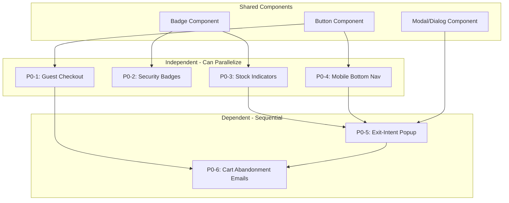
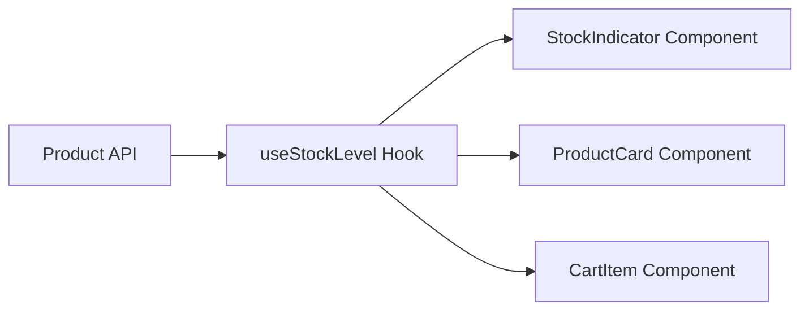

# Technical Implementation Strategy for UX Improvements

**Document Version:** 1.0  
**Date:** February 12, 2026  
**Status:** Draft  
**Related Documents:** 
- [E-Commerce UX Audit Report](./13-ecommerce-ux-audit-report.md)
- [UX Gap Analysis](./12-ux-gap-analysis.md)

---

## Table of Contents

1. [Executive Summary](#1-executive-summary)
2. [Dependency Graph](#2-dependency-graph)
3. [Component Architecture](#3-component-architecture)
4. [State Management Strategy](#4-state-management-strategy)
5. [API/Backend Requirements](#5-apibackend-requirements)
6. [Technical Specifications for P0 Items](#6-technical-specifications-for-p0-items)
7. [File Modification Map](#7-file-modification-map)
8. [Implementation Order](#8-implementation-order)

---

## 1. Executive Summary

This document defines the technical strategy for implementing UX improvements identified in the comprehensive e-commerce audit. The implementation focuses on **6 P0 (Critical)** and **14 P1 (High Priority)** improvements that together are projected to improve conversion rates by 15-30%.

### Technology Stack Reference

| Layer | Technology | Notes |
|-------|------------|-------|
| Framework | Next.js 15 | App Router |
| Frontend | React, TypeScript | Server Components + Client Components |
| Styling | Tailwind CSS | Mobile-first approach |
| State | Zustand + React Context | Zustand for cart, Context for checkout |
| Database | PostgreSQL + Prisma | Existing schema with Inventory model |
| CMS | Sanity | Product content management |
| Payments | Stripe | Apple Pay, Google Pay, Cards |

### Current Architecture Insights

Based on codebase analysis:

- **Checkout Flow**: [`src/app/checkout/page.tsx`](src/app/checkout/page.tsx) redirects directly to shipping step
- **Cart State**: Zustand store with localStorage persistence at [`src/store/cart-store.ts`](src/store/cart-store.ts)
- **Checkout State**: React Context with sessionStorage at [`src/context/checkout-context.tsx`](src/context/checkout-context.tsx)
- **Inventory Model**: Prisma schema includes `Inventory` model with `quantity`, `reservedQuantity`, `available`, `lowStockThreshold`

---

## 2. Dependency Graph

### 2.1 P0 Implementation Dependencies



### 2.2 Dependency Matrix

| Feature | Dependencies | Blocked By | Can Start Immediately |
|---------|-------------|------------|----------------------|
| **P0-1: Guest Checkout** | None | None | ✅ Yes |
| **P0-2: Security Badges** | None | None | ✅ Yes |
| **P0-3: Stock Indicators** | Inventory API | None | ✅ Yes |
| **P0-4: Mobile Bottom Nav** | Cart Store | None | ✅ Yes |
| **P0-5: Exit-Intent Popup** | Stock Indicators, Mobile Nav | P0-3, P0-4 | ❌ No |
| **P0-6: Cart Abandonment Emails** | Guest Checkout, Exit-Intent | P0-1, P0-5 | ❌ No |

### 2.3 Parallelization Strategy

**Wave 1 - All can start simultaneously:**
- P0-1: Guest Checkout Visibility
- P0-2: Security Badges
- P0-3: Stock Level Indicators
- P0-4: Mobile Bottom Navigation

**Wave 2 - After Wave 1 completion:**
- P0-5: Exit-Intent Popup (requires P0-3, P0-4 for urgency messaging)

**Wave 3 - After Wave 2 completion:**
- P0-6: Cart Abandonment Emails (requires P0-1 for guest email capture, P0-5 for exit-intent data)

---

## 3. Component Architecture

### 3.1 Security Badges Component Hierarchy

```
src/components/ui/security-badges.tsx (NEW)
├── SecurityBadges (main component)
│   ├── SecurityBadge (individual badge)
│   │   ├── SSLBadge
│   │   ├── PCIBadge
│   │   ├── NortonSeal
│   │   └── MoneyBackGuarantee
│   └── SecurityBadgesCompact (mobile variant)
```

**Component Props:**

```typescript
interface SecurityBadgesProps {
  variant?: 'full' | 'compact' | 'minimal';
  showLabels?: boolean;
  className?: string;
}

interface SecurityBadgeProps {
  type: 'ssl' | 'pci' | 'norton' | 'mcafee' | 'moneyback';
  size?: 'sm' | 'md' | 'lg';
  showLabel?: boolean;
}
```

### 3.2 Stock Indicator Component Integration

```
src/components/product/stock-indicator.tsx (NEW)
├── StockIndicator (main component)
│   ├── StockLevelBadge (urgency badge)
│   └── StockProgressBar (visual indicator)

Integration Points:
├── ProductCard (src/components/product/product-card.tsx)
├── ProductInfo (src/components/product/product-info.tsx)
└── CartItem (src/components/cart/cart-item.tsx)
```

**Component Props:**

```typescript
interface StockIndicatorProps {
  available: number;
  threshold?: number; // default: 5
  variant?: 'badge' | 'text' | 'progress';
  showCount?: boolean;
  className?: string;
}
```

### 3.3 Mobile Bottom Navigation Architecture

```
src/components/layout/mobile-bottom-nav.tsx (NEW)
├── MobileBottomNav (container)
│   ├── MobileNavItem (individual item)
│   ├── MobileNavBadge (cart count badge)
│   └── MobileNavActiveIndicator (active state)

Integration:
└── RootLayout (src/app/layout.tsx)
```

**Component Props:**

```typescript
interface MobileBottomNavProps {
  items: MobileNavItem[];
  activePath?: string;
  cartCount?: number;
  className?: string;
}

interface MobileNavItem {
  href: string;
  label: string;
  icon: React.ReactNode;
  badge?: number;
}
```

### 3.4 Exit-Intent Popup Implementation

```
src/components/exit-intent/ (NEW DIRECTORY)
├── exit-intent-provider.tsx (context provider)
├── exit-intent-modal.tsx (modal component)
├── exit-intent-form.tsx (email capture form)
└── use-exit-intent.ts (detection hook)

Integration Points:
├── CartPage (src/app/cart/page.tsx)
└── RootLayout (src/app/layout.tsx) - for provider
```

**Component Props:**

```typescript
interface ExitIntentModalProps {
  isOpen: boolean;
  onClose: () => void;
  variant?: 'discount' | 'email_capture' | 'save_cart';
  discountPercent?: number;
  onEmailSubmit: (email: string) => Promise<void>;
}

interface ExitIntentProviderProps {
  children: React.ReactNode;
  enabledRoutes?: string[];
  cooldownMinutes?: number;
}
```

### 3.5 Guest Checkout Flow Modification

```
Current Flow:
/checkout → redirect to /checkout/shipping

Modified Flow:
/checkout → Guest/SignIn choice page → /checkout/shipping

New Components:
src/components/checkout/guest-checkout-choice.tsx (NEW)
├── GuestCheckoutChoice
│   ├── SignInOption
│   └── GuestOption
```

**Component Props:**

```typescript
interface GuestCheckoutChoiceProps {
  onSignIn: () => void;
  onGuestCheckout: () => void;
  returnUrl?: string;
}
```

---

## 4. State Management Strategy

### 4.1 Stock Level State Tracking

**Approach: Cached with Revalidation**

Stock levels should be fetched at the product level and cached. Real-time updates are not critical for urgency indicators.

```typescript
// New hook: src/hooks/use-stock-level.ts
interface UseStockLevelReturn {
  available: number;
  isLowStock: boolean;
  isOutOfStock: boolean;
  refetch: () => void;
}

// Integration with existing patterns
// Uses React Query or SWR pattern similar to existing hooks
```

**Data Flow:**



**Caching Strategy:**
- Cache stock data for 60 seconds
- Revalidate on cart add/update
- Show cached value with disclaimer if stale

### 4.2 Cart State for Abandonment Prevention

**Extend Existing Cart Store:**

```typescript
// Additions to src/store/cart-store.ts
interface CartStore {
  // ... existing properties
  
  // NEW: Abandonment tracking
  lastActivityAt: number | null;
  exitIntentShown: boolean;
  exitIntentDismissedAt: number | null;
  emailCaptureShown: boolean;
  
  // NEW: Actions
  updateActivity: () => void;
  markExitIntentShown: () => void;
  markExitIntentDismissed: () => void;
  markEmailCaptureShown: () => void;
}
```

**Session Persistence:**
- Use existing Zustand persist middleware
- Add `lastActivityAt` to persisted state
- Track abandonment timestamp for email triggers

### 4.3 User Session Handling for Guest Checkout

**Extend Checkout Context:**

```typescript
// Additions to src/context/checkout-context.tsx
interface CheckoutState {
  // ... existing properties
  
  // NEW: Guest checkout tracking
  isGuestCheckout: boolean;
  guestEmail: string | null;
  accountOffered: boolean;
}

interface CheckoutContextActions {
  // ... existing actions
  
  // NEW: Guest checkout actions
  setGuestCheckout: (isGuest: boolean) => void;
  setGuestEmail: (email: string) => void;
  offerAccountCreation: () => void;
}
```

**Session Storage:**
- Guest status persisted in sessionStorage
- Email captured at checkout or via exit-intent
- Account creation offered post-purchase

### 4.4 Exit-Intent State Management

**New Context Provider:**

```typescript
// src/components/exit-intent/exit-intent-provider.tsx
interface ExitIntentState {
  hasShown: boolean;
  dismissedAt: number | null;
  triggerCount: number;
  lastTriggerAt: number | null;
}

interface ExitIntentContextValue {
  state: ExitIntentState;
  showPopup: () => void;
  dismissPopup: () => void;
  resetState: () => void;
}
```

**localStorage Keys:**
- `exit_intent_shown`: boolean
- `exit_intent_dismissed_at`: timestamp
- `exit_intent_email_captured`: boolean

---

## 5. API/Backend Requirements

### 5.1 New API Endpoints

| Endpoint | Method | Purpose | Priority |
|----------|--------|---------|----------|
| `/api/inventory/[variantId]` | GET | Get stock level for variant | P0-3 |
| `/api/cart/abandon` | POST | Mark cart as abandoned | P0-6 |
| `/api/cart/recover` | POST | Recover abandoned cart | P0-6 |
| `/api/email/capture` | POST | Store captured email | P0-5, P0-6 |
| `/api/newsletter/subscribe` | POST | Subscribe to newsletter | P0-5 |

### 5.2 Database Schema Changes

**No schema changes required.** The existing Prisma schema already supports all P0 features:

| Feature | Required Fields | Existing Model |
|---------|----------------|----------------|
| Stock Indicators | `quantity`, `available`, `lowStockThreshold` | `Inventory` model ✅ |
| Cart Abandonment | `sessionId`, `userId`, `updatedAt` | `Cart` model ✅ |
| Guest Checkout | `sessionId` on Cart | `Cart` model ✅ |

**Optional Enhancement - Cart Abandonment Tracking:**

```prisma
// Optional: Add to Cart model for better tracking
model Cart {
  // ... existing fields
  
  // NEW: Abandonment tracking
  abandonedAt     DateTime?
  abandonmentEmailSent Int      @default(0)
  lastActivityAt  DateTime?
}
```

### 5.3 Third-Party Integrations

#### Email Service for Cart Abandonment

**Recommended:** Resend or SendGrid

**Required Configuration:**

```typescript
// src/lib/email/config.ts
interface EmailConfig {
  provider: 'resend' | 'sendgrid';
  apiKey: string;
  fromEmail: string;
  templates: {
    cartAbandonment1h: string;  // 1 hour after abandonment
    cartAbandonment24h: string; // 24 hours after abandonment
    cartAbandonment72h: string; // 72 hours after abandonment
  };
}
```

**Email Sequence:**

| Email | Trigger | Content |
|-------|---------|---------|
| Email 1 | 1 hour after abandonment | Reminder with cart contents |
| Email 2 | 24 hours after abandonment | 10% discount offer |
| Email 3 | 72 hours after abandonment | Final offer, urgency messaging |

#### Live Chat Integration

**Recommended:** Crisp or Intercom

**Implementation:**

```typescript
// src/components/integrations/live-chat.tsx
// Script injection in layout or specific pages
// Configure proactive triggers on cart/checkout pages
```

---

## 6. Technical Specifications for P0 Items

### 6.1 P0-1: Guest Checkout Visibility

#### Current Flow Analysis

The current checkout entry point at [`src/app/checkout/page.tsx`](src/app/checkout/page.tsx):

```typescript
// Current implementation
export default async function CheckoutPage() {
  const cartResult = await getCart();
  if (!cartResult.success || !cartResult.data || cartResult.data.items.length === 0) {
    redirect('/cart');
  }
  redirect('/checkout/shipping'); // No guest option shown
}
```

#### Required Modifications

**1. Create Guest Choice Page:**

```typescript
// src/app/checkout/page.tsx (MODIFIED)
export default async function CheckoutPage() {
  const cartResult = await getCart();
  if (!cartResult.success || !cartResult.data || cartResult.data.items.length === 0) {
    redirect('/cart');
  }
  
  // Show guest/sign-in choice instead of redirecting
  return <GuestCheckoutChoice />;
}
```

**2. New Component:**

```typescript
// src/components/checkout/guest-checkout-choice.tsx (NEW)
export function GuestCheckoutChoice() {
  return (
    <div className="max-w-md mx-auto py-12">
      <h1>Checkout</h1>
      <div className="grid gap-4">
        <Button variant="outline" asChild>
          <Link href="/auth/signin?redirect=/checkout/shipping">
            Sign In for Faster Checkout
          </Link>
        </Button>
        <Button asChild>
          <Link href="/checkout/shipping?guest=true">
            Continue as Guest
          </Link>
        </Button>
      </div>
    </div>
  );
}
```

**3. Session Handling:**

- Add `isGuestCheckout` to checkout context
- Store guest status in sessionStorage
- Capture email during shipping step for guests

#### Files to Modify

| File | Change Type | Description |
|------|-------------|-------------|
| `src/app/checkout/page.tsx` | Modify | Show guest choice instead of redirect |
| `src/components/checkout/guest-checkout-choice.tsx` | Create | New component for guest/sign-in choice |
| `src/context/checkout-context.tsx` | Modify | Add `isGuestCheckout` state |
| `src/app/checkout/shipping/page.tsx` | Modify | Handle guest checkout query param |

---

### 6.2 P0-2: Security Badges

#### Badge Types and Placement

| Badge Type | Placement | Format |
|------------|-----------|--------|
| SSL Secured | Payment page, Footer | Icon + text |
| PCI DSS Compliant | Payment page | Icon + text |
| Norton/McAfee Seal | Payment page | Third-party seal |
| Money-Back Guarantee | Payment page, Product pages | Icon + text |

#### Component Structure

```typescript
// src/components/ui/security-badges.tsx (NEW)
import { Shield, Lock, CheckCircle } from 'lucide-react';

export function SecurityBadges({ variant = 'full', showLabels = true }: SecurityBadgesProps) {
  return (
    <div className="flex items-center justify-center gap-4 py-4">
      <SecurityBadge type="ssl" showLabel={showLabels} />
      <SecurityBadge type="pci" showLabel={showLabels} />
      <SecurityBadge type="norton" showLabel={showLabels} />
      {variant === 'full' && (
        <SecurityBadge type="moneyback" showLabel={showLabels} />
      )}
    </div>
  );
}

function SecurityBadge({ type, showLabel }: SecurityBadgeProps) {
  const badges = {
    ssl: { icon: Lock, label: 'SSL Secured' },
    pci: { icon: Shield, label: 'PCI Compliant' },
    norton: { icon: Shield, label: 'Norton Secured' },
    moneyback: { icon: CheckCircle, label: 'Money-Back Guarantee' },
  };
  
  const badge = badges[type];
  const Icon = badge.icon;
  
  return (
    <div className="flex items-center gap-2 text-sm text-muted-foreground">
      <Icon className="h-5 w-5" />
      {showLabel && <span>{badge.label}</span>}
    </div>
  );
}
```

#### Static vs Dynamic

- **Static Badges**: SSL, PCI, Money-Back Guarantee (always shown)
- **Third-Party Seals**: Norton/McAfee (requires account with provider)

For MVP, use static SVG badges. Third-party seals can be added later.

#### Files to Create/Modify

| File | Change Type | Description |
|------|-------------|-------------|
| `src/components/ui/security-badges.tsx` | Create | New component |
| `src/app/checkout/payment/page.tsx` | Modify | Add SecurityBadges below payment form |
| `src/components/layout/footer.tsx` | Modify | Add compact SecurityBadges |

---

### 6.3 P0-3: Stock Level Indicators

#### Data Source

The existing Prisma schema has the `Inventory` model:

```prisma
model Inventory {
  id                String   @id @default(cuid())
  variantId         String   @unique
  quantity          Int      @default(0)
  reservedQuantity  Int      @default(0)
  available         Int      @default(0)
  lowStockThreshold Int      @default(10)
  // ...
}
```

#### Implementation Approach

**Cached Approach (Recommended):**
- Fetch stock level with product data
- Cache for 60 seconds
- Revalidate on cart operations

**Real-time Approach (Future Enhancement):**
- WebSocket connection for live updates
- Only for high-traffic products

#### Threshold Configuration

```typescript
// src/lib/inventory/config.ts
export const STOCK_THRESHOLDS = {
  LOW_STOCK: 5,      // Show "Only X left!"
  VERY_LOW_STOCK: 3, // Show with red urgency styling
  OUT_OF_STOCK: 0,   // Show "Out of Stock"
} as const;
```

#### Component Implementation

```typescript
// src/components/product/stock-indicator.tsx (NEW)
export function StockIndicator({ 
  available, 
  threshold = 5,
  variant = 'badge',
  showCount = true 
}: StockIndicatorProps) {
  if (available > threshold) return null;
  
  if (available === 0) {
    return <Badge variant="secondary">Out of Stock</Badge>;
  }
  
  const isVeryLow = available <= 3;
  
  return (
    <Badge 
      variant={isVeryLow ? 'destructive' : 'warning'}
      className="animate-pulse"
    >
      {showCount ? `Only ${available} left!` : 'Low Stock'}
    </Badge>
  );
}
```

#### Files to Create/Modify

| File | Change Type | Description |
|------|-------------|-------------|
| `src/components/product/stock-indicator.tsx` | Create | New component |
| `src/lib/inventory/config.ts` | Create | Threshold configuration |
| `src/components/product/product-card.tsx` | Modify | Add StockIndicator |
| `src/components/product/product-info.tsx` | Modify | Add StockIndicator |
| `src/components/cart/cart-item.tsx` | Modify | Add stock warning |

---

### 6.4 P0-4: Mobile Bottom Navigation

#### Component Structure

```typescript
// src/components/layout/mobile-bottom-nav.tsx (NEW)
'use client';

import { Home, Search, ShoppingCart, User } from 'lucide-react';
import { useCart } from '@/hooks/use-cart';
import { usePathname } from 'next/navigation';

export function MobileBottomNav() {
  const { totalItems } = useCart();
  const pathname = usePathname();
  
  const items = [
    { href: '/', label: 'Home', icon: Home },
    { href: '/search', label: 'Search', icon: Search },
    { href: '/cart', label: 'Cart', icon: ShoppingCart, badge: totalItems },
    { href: '/account', label: 'Account', icon: User },
  ];
  
  return (
    <nav className="fixed bottom-0 left-0 right-0 z-50 bg-background border-t md:hidden">
      <div className="grid grid-cols-4 h-16">
        {items.map((item) => (
          <MobileNavItem
            key={item.href}
            {...item}
            isActive={pathname === item.href}
          />
        ))}
      </div>
    </nav>
  );
}

function MobileNavItem({ href, label, icon: Icon, badge, isActive }) {
  return (
    <Link
      href={href}
      className={cn(
        'flex flex-col items-center justify-center gap-1',
        'text-muted-foreground hover:text-foreground',
        isActive && 'text-primary'
      )}
    >
      <div className="relative">
        <Icon className="h-5 w-5" />
        {badge !== undefined && badge > 0 && (
          <span className="absolute -top-1 -right-1 h-4 w-4 rounded-full bg-primary text-primary-foreground text-xs flex items-center justify-center">
            {badge > 9 ? '9+' : badge}
          </span>
        )}
      </div>
      <span className="text-xs">{label}</span>
    </Link>
  );
}
```

#### Route Integration

- Show on all pages except checkout flow
- Hide on desktop (md:hidden)
- Add padding-bottom to main content for mobile

#### Files to Create/Modify

| File | Change Type | Description |
|------|-------------|-------------|
| `src/components/layout/mobile-bottom-nav.tsx` | Create | New component |
| `src/app/layout.tsx` | Modify | Add MobileBottomNav to layout |
| `src/app/globals.css` | Modify | Add padding-bottom for mobile nav |

---

### 6.5 P0-5: Exit-Intent Popup

#### Detection Mechanism

```typescript
// src/hooks/use-exit-intent.ts (NEW)
export function useExitIntent(options: ExitIntentOptions = {}) {
  const { 
    threshold = 20, // pixels from top
    cooldown = 24 * 60 * 60 * 1000, // 24 hours
    enabled = true 
  } = options;
  
  const [shouldShow, setShouldShow] = useState(false);
  
  useEffect(() => {
    if (!enabled) return;
    
    const lastDismissed = localStorage.getItem('exit_intent_dismissed_at');
    if (lastDismissed && Date.now() - parseInt(lastDismissed) < cooldown) {
      return;
    }
    
    const handleMouseLeave = (e: MouseEvent) => {
      if (e.clientY <= threshold) {
        setShouldShow(true);
      }
    };
    
    document.addEventListener('mouseleave', handleMouseLeave);
    return () => document.removeEventListener('mouseleave', handleMouseLeave);
  }, [enabled, threshold, cooldown]);
  
  return { shouldShow, dismiss: () => setShouldShow(false) };
}
```

#### Component Architecture

```typescript
// src/components/exit-intent/exit-intent-modal.tsx (NEW)
export function ExitIntentModal({ isOpen, onClose, onEmailSubmit }: ExitIntentModalProps) {
  const [email, setEmail] = useState('');
  const [isSubmitting, setIsSubmitting] = useState(false);
  
  const handleSubmit = async (e: FormEvent) => {
    e.preventDefault();
    setIsSubmitting(true);
    await onEmailSubmit(email);
    localStorage.setItem('exit_intent_email_captured', 'true');
    onClose();
  };
  
  return (
    <Dialog open={isOpen} onOpenChange={onClose}>
      <DialogContent>
        <DialogTitle>Wait! Don't Miss Out</DialogTitle>
        <DialogDescription>
          Get 10% off your first order when you sign up for our newsletter.
        </DialogDescription>
        <form onSubmit={handleSubmit}>
          <Input
            type="email"
            placeholder="Enter your email"
            value={email}
            onChange={(e) => setEmail(e.target.value)}
            required
          />
          <Button type="submit" loading={isSubmitting}>
            Get My 10% Off
          </Button>
        </form>
      </DialogContent>
    </Dialog>
  );
}
```

#### State Persistence

- Store dismissal timestamp in localStorage
- 24-hour cooldown between shows
- Never show again after email capture

#### Files to Create/Modify

| File | Change Type | Description |
|------|-------------|-------------|
| `src/hooks/use-exit-intent.ts` | Create | Detection hook |
| `src/components/exit-intent/exit-intent-modal.tsx` | Create | Modal component |
| `src/components/exit-intent/exit-intent-provider.tsx` | Create | Context provider |
| `src/app/cart/page.tsx` | Modify | Add exit-intent integration |
| `src/app/layout.tsx` | Modify | Add ExitIntentProvider |

---

### 6.6 P0-6: Cart Abandonment Emails

#### Backend Infrastructure

**Cron Job / Scheduled Task:**

```typescript
// src/lib/email/abandonment-job.ts
export async function processAbandonedCarts() {
  const now = new Date();
  
  // Find carts abandoned 1 hour ago
  const oneHourAgo = new Date(now.getTime() - 60 * 60 * 1000);
  const carts1h = await prisma.cart.findMany({
    where: {
      updatedAt: { lt: oneHourAgo },
      abandonedAt: null,
      abandonmentEmailSent: 0,
      items: { some: {} },
    },
  });
  
  for (const cart of carts1h) {
    await sendAbandonmentEmail(cart, 'reminder');
    await prisma.cart.update({
      where: { id: cart.id },
      data: { abandonedAt: now, abandonmentEmailSent: 1 },
    });
  }
  
  // Similar logic for 24h and 72h emails
}
```

#### Email Service Integration

```typescript
// src/lib/email/service.ts
import Resend from 'resend';

const resend = new Resend(process.env.RESEND_API_KEY);

export async function sendAbandonmentEmail(
  cart: Cart,
  type: 'reminder' | 'discount' | 'final'
) {
  const templates = {
    reminder: 'template_reminder',
    discount: 'template_discount_10',
    final: 'template_final_offer',
  };
  
  await resend.emails.send({
    from: 'Baby Petite <hello@babypetite.com>',
    to: cart.user?.email || cart.guestEmail,
    template: templates[type],
    data: {
      cartUrl: `https://babypetite.com/cart?recover=${cart.id}`,
      items: cart.items,
      total: calculateTotal(cart.items),
    },
  });
}
```

#### Trigger Conditions

| Condition | Action |
|-----------|--------|
| Cart not updated for 1 hour | Send reminder email |
| Cart not updated for 24 hours | Send 10% discount email |
| Cart not updated for 72 hours | Send final offer email |
| Cart converted | Stop all emails |
| User unsubscribed | Stop all emails |

#### Files to Create/Modify

| File | Change Type | Description |
|------|-------------|-------------|
| `src/lib/email/service.ts` | Create | Email service wrapper |
| `src/lib/email/abandonment-job.ts` | Create | Cron job logic |
| `src/lib/email/templates/` | Create | Email templates |
| `src/app/api/cart/abandon/route.ts` | Create | API endpoint |
| `src/app/api/cart/recover/route.ts` | Create | Recovery endpoint |
| `prisma/schema.prisma` | Modify | Add abandonment fields (optional) |

---

## 7. File Modification Map

### 7.1 New Files to Create

| File Path | Purpose | P0 Item |
|-----------|---------|---------|
| `src/components/checkout/guest-checkout-choice.tsx` | Guest/sign-in choice component | P0-1 |
| `src/components/ui/security-badges.tsx` | Security badges component | P0-2 |
| `src/components/product/stock-indicator.tsx` | Stock level indicator | P0-3 |
| `src/lib/inventory/config.ts` | Inventory thresholds config | P0-3 |
| `src/components/layout/mobile-bottom-nav.tsx` | Mobile bottom navigation | P0-4 |
| `src/hooks/use-exit-intent.ts` | Exit-intent detection hook | P0-5 |
| `src/components/exit-intent/exit-intent-modal.tsx` | Exit-intent modal | P0-5 |
| `src/components/exit-intent/exit-intent-provider.tsx` | Exit-intent context | P0-5 |
| `src/lib/email/service.ts` | Email service wrapper | P0-6 |
| `src/lib/email/abandonment-job.ts` | Abandonment cron job | P0-6 |
| `src/lib/email/templates/reminder.tsx` | Email template | P0-6 |
| `src/lib/email/templates/discount.tsx` | Email template | P0-6 |
| `src/lib/email/templates/final-offer.tsx` | Email template | P0-6 |
| `src/app/api/cart/abandon/route.ts` | Abandonment API | P0-6 |
| `src/app/api/cart/recover/route.ts` | Recovery API | P0-6 |
| `src/app/api/inventory/[variantId]/route.ts` | Stock level API | P0-3 |

### 7.2 Existing Files to Modify

| File Path | Changes | P0 Item |
|-----------|---------|---------|
| `src/app/checkout/page.tsx` | Show guest choice instead of redirect | P0-1 |
| `src/context/checkout-context.tsx` | Add guest checkout state | P0-1 |
| `src/app/checkout/shipping/page.tsx` | Handle guest query param | P0-1 |
| `src/app/checkout/payment/page.tsx` | Add SecurityBadges component | P0-2 |
| `src/components/layout/footer.tsx` | Add compact security badges | P0-2 |
| `src/components/product/product-card.tsx` | Add StockIndicator | P0-3 |
| `src/components/product/product-info.tsx` | Add StockIndicator | P0-3 |
| `src/components/cart/cart-item.tsx` | Add stock warning | P0-3 |
| `src/app/layout.tsx` | Add MobileBottomNav, ExitIntentProvider | P0-4, P0-5 |
| `src/app/globals.css` | Add padding for mobile nav | P0-4 |
| `src/app/cart/page.tsx` | Add exit-intent integration | P0-5 |
| `src/store/cart-store.ts` | Add abandonment tracking state | P0-6 |

### 7.3 Configuration Files to Update

| File Path | Changes | P0 Item |
|-----------|---------|---------|
| `.env.local` | Add RESEND_API_KEY or SENDGRID_API_KEY | P0-6 |
| `vercel.json` | Add cron job configuration | P0-6 |
| `package.json` | Add resend or @sendgrid/mail dependency | P0-6 |

---

## 8. Implementation Order

### Phase 1: Foundation (Wave 1)

**Order within wave (recommended):**

1. **P0-2: Security Badges** - Simplest, no dependencies
   - Create component
   - Add to payment page and footer

2. **P0-3: Stock Level Indicators** - Independent, uses existing schema
   - Create component
   - Create inventory API
   - Integrate into product components

3. **P0-1: Guest Checkout Visibility** - Independent, modifies checkout flow
   - Create guest choice component
   - Modify checkout entry page
   - Update checkout context

4. **P0-4: Mobile Bottom Navigation** - Independent, uses existing cart store
   - Create component
   - Add to layout
   - Update CSS for padding

### Phase 2: Dependent Features (Wave 2)

5. **P0-5: Exit-Intent Popup** - Depends on P0-3, P0-4
   - Create detection hook
   - Create modal component
   - Create context provider
   - Integrate into cart page

### Phase 3: Backend Integration (Wave 3)

6. **P0-6: Cart Abandonment Emails** - Depends on P0-1, P0-5
   - Set up email service
   - Create email templates
   - Create API endpoints
   - Configure cron job
   - Update cart store

### Summary Timeline

```
Wave 1 (Parallel):
├── P0-2: Security Badges
├── P0-3: Stock Indicators
├── P0-1: Guest Checkout
└── P0-4: Mobile Bottom Nav

Wave 2 (After Wave 1):
└── P0-5: Exit-Intent Popup

Wave 3 (After Wave 2):
└── P0-6: Cart Abandonment Emails
```

---

## Document Control

| Version | Date | Author | Changes |
|---------|------|--------|---------|
| 1.0 | February 12, 2026 | Technical Architecture Team | Initial strategy document |

---

**Last Updated:** February 12, 2026  
**Document Owner:** Technical Architecture Team  
**Review Cycle:** After each implementation phase
