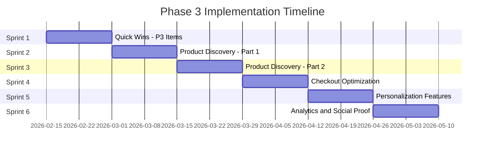
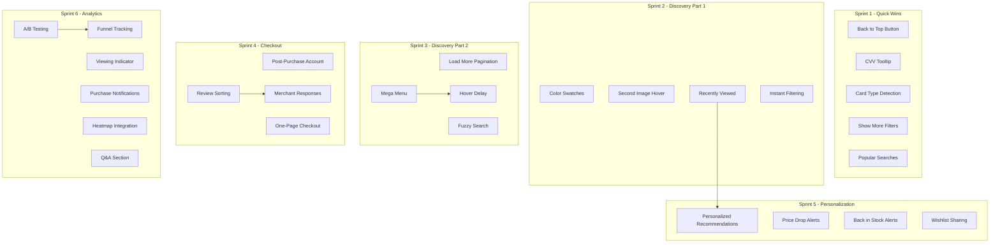

# Phase 3 Strategic UX Improvements Roadmap

**Document Version:** 1.0  
**Date:** February 12, 2026  
**Status:** Planning  
**Related Documents:**
- [UX Gap Analysis](./12-ux-gap-analysis.md)
- [E-Commerce UX Audit Report](./13-ecommerce-ux-audit-report.md)
- [Technical Implementation Strategy](./14-technical-implementation-strategy.md)

---

## Table of Contents

1. [Executive Summary](#1-executive-summary)
2. [Phase 3 Scope Analysis](#2-phase-3-scope-analysis)
3. [Feature Specifications](#3-feature-specifications)
4. [Implementation Timeline](#4-implementation-timeline)
5. [Technical Architecture](#5-technical-architecture)
6. [Success Metrics](#6-success-metrics)
7. [Risk Assessment](#7-risk-assessment)
8. [Appendix](#8-appendix)

---

## 1. Executive Summary

### 1.1 Phase 3 Objectives

Phase 3 focuses on **P2 (Medium Priority)** items and strategic optimizations that enhance user experience, increase conversion rates, and build customer loyalty. Building on the foundation established in Phases 1 and 2, Phase 3 targets:

1. **Enhanced Product Discovery** - Improve browsing experience with advanced filtering, visual cues, and navigation aids
2. **Checkout Optimization** - Streamline the payment process with smart defaults and user assistance
3. **Personalization** - Deliver tailored experiences through recommendations and user preferences
4. **Social Proof** - Build trust and urgency through real-time activity indicators
5. **Analytics Infrastructure** - Enable data-driven optimization through testing and monitoring

### 1.2 Expected Business Impact

| Impact Area | Current State | Phase 3 Target | Improvement |
|-------------|---------------|----------------|-------------|
| **Conversion Rate** | 2.2-2.5% | 2.8-3.2% | +25-35% |
| **Average Order Value** | Baseline | +8-12% | Cross-sell optimization |
| **Cart Abandonment** | ~60% | <50% | Enhanced recovery |
| **Mobile Conversion** | 2.0-2.5% | 2.5-3.0% | Mobile UX improvements |
| **Customer Retention** | Baseline | +15-20% | Personalization features |

### 1.3 Resource Requirements

| Resource Type | Allocation | Notes |
|---------------|------------|-------|
| **Frontend Development** | Primary | React/Next.js components |
| **Backend Development** | Secondary | API endpoints, database changes |
| **Third-Party Services** | Moderate | Analytics, testing platforms |
| **Design/UX** | Support | Component styling, UX review |

---

## 2. Phase 3 Scope Analysis

### 2.1 Completed Items Summary

**Phase 1 Completed (P0 - Critical):**
- ✅ Guest checkout visibility
- ✅ Security badges
- ✅ Stock level indicators
- ✅ Mobile bottom navigation
- ✅ Exit-intent popup
- ✅ Schema.org breadcrumbs

**Phase 2 Completed (P1 - High):**
- ✅ Predictive search in header
- ✅ Frequently bought together upsell
- ✅ Cart abandonment email infrastructure
- ✅ Live chat integration

### 2.2 P2 Items for Phase 3

| ID | Feature | Area | Impact | Effort | Priority |
|----|---------|------|--------|--------|----------|
| P2-01 | Mega Menu Integration | Navigation | Medium | Medium | High |
| P2-02 | Hover Delay on Menus | Navigation | Low | Low | Medium |
| P2-03 | Keyboard Navigation | Navigation | Low | Medium | Medium |
| P2-04 | Mobile Breadcrumb Truncation | Navigation | Low | Low | Low |
| P2-05 | Fuzzy Search Matching | Navigation | Medium | Medium | High |
| P2-06 | Color Swatches on Cards | Product Discovery | Medium | Medium | High |
| P2-07 | Second Image on Hover | Product Discovery | Medium | Medium | High |
| P2-08 | Load More Pagination | Product Discovery | Medium | Medium | Medium |
| P2-09 | Review Sorting/Filtering | Trust | Low | Low | Medium |
| P2-10 | Merchant Review Responses | Trust | Medium | Medium | Medium |
| P2-11 | Return Process Steps | Trust | Low | Low | Low |
| P2-12 | CVV Tooltip Helper | Checkout | Low | Low | Medium |
| P2-13 | Card Type Auto-Detection | Checkout | Low | Low | Medium |
| P2-14 | Post-Purchase Account Offer | Checkout | Medium | Low | High |
| P2-15 | Swipe Gestures | Mobile | Low | Medium | Low |
| P2-16 | Quantity Discounts | CRO | Medium | Medium | High |
| P2-17 | Post-Purchase Offers | CRO | Medium | Medium | Medium |

### 2.3 P3 Quick Wins

| ID | Feature | Area | Impact | Effort | Priority |
|----|---------|------|--------|--------|----------|
| P3-01 | Popular Searches Display | Navigation | Low | Low | Medium |
| P3-02 | Category Suggestions Prominence | Navigation | Low | Low | Low |
| P3-03 | Show More/Less for Filters | Product Discovery | Low | Low | Medium |
| P3-04 | Back to Top Button | Product Discovery | Low | Low | High |
| P3-05 | Recently Viewed Section | Product Discovery | Low | Medium | High |
| P3-06 | Mobile Progress Condensed | Checkout | Low | Low | Low |
| P3-07 | Disabled CTA Messaging | CRO | Low | Low | Medium |

### 2.4 New Strategic Features

| ID | Feature | Area | Impact | Effort | Priority |
|----|---------|------|--------|--------|----------|
| NEW-01 | Advanced Filtering with Instant Results | Product Discovery | High | Medium | High |
| NEW-02 | One-Page Checkout Option | Checkout | High | High | Medium |
| NEW-03 | Personalized Recommendations | Personalization | High | High | High |
| NEW-04 | Wishlist Sharing | Personalization | Medium | Medium | Medium |
| NEW-05 | Price Drop Alerts | Personalization | Medium | Medium | High |
| NEW-06 | Back in Stock Notifications | Personalization | Medium | Medium | High |
| NEW-07 | X People Viewing Indicator | Social Proof | Medium | Low | High |
| NEW-08 | Recently Purchased Notifications | Social Proof | Medium | Low | Medium |
| NEW-09 | Q&A Section on Product Pages | Social Proof | Medium | Medium | Medium |
| NEW-10 | A/B Testing Infrastructure | Analytics | High | High | High |
| NEW-11 | Conversion Funnel Tracking | Analytics | High | Medium | High |
| NEW-12 | Heatmap Integration | Analytics | Medium | Low | Medium |
| NEW-13 | Performance Monitoring Dashboard | Analytics | Medium | Medium | Medium |

---

## 3. Feature Specifications

### 3.1 Product Discovery Enhancements

#### 3.1.1 Advanced Filtering with Instant Results

| Attribute | Details |
|-----------|---------|
| **ID** | NEW-01 |
| **Priority** | High |
| **User Story** | As a shopper, I want to see filter results instantly so I can quickly find products that match my needs |
| **Business Value** | Reduces friction in product discovery, increases engagement |
| **Expected Impact** | 10-15% increase in filter usage, 5-8% improvement in product discovery conversion |

**Technical Approach:**
- Implement URL-based filter state for shareability
- Use React Query for cached filter results
- Debounce filter changes to prevent excessive API calls
- Show loading skeletons during filter updates

**Dependencies:**
- Existing filter panel component
- Product search API enhancement

**Files to Create/Modify:**
- `src/components/search/instant-filter-panel.tsx` (new)
- `src/app/api/products/search/route.ts` (enhance)
- `src/hooks/use-instant-filters.ts` (new)

---

#### 3.1.2 Color/Variant Swatches on Product Cards

| Attribute | Details |
|-----------|---------|
| **ID** | P2-06 |
| **Priority** | High |
| **User Story** | As a shopper, I want to see available color options on product cards so I can quickly identify variants |
| **Business Value** | Reduces clicks to discover variants, increases engagement |
| **Expected Impact** | 5-10% increase in product card clicks, reduced bounce rate |

**Technical Approach:**
- Add color swatches below product image on cards
- Show max 4-5 colors with "+X more" indicator
- Update product image on swatch hover
- Link to pre-selected variant on click

**Dependencies:**
- Product variant data from API
- Existing ProductCard component

**Files to Create/Modify:**
- `src/components/product/color-swatches.tsx` (new)
- `src/components/product/product-card.tsx` (modify)

---

#### 3.1.3 Second Image on Hover

| Attribute | Details |
|-----------|---------|
| **ID** | P2-07 |
| **Priority** | High |
| **User Story** | As a desktop shopper, I want to see an alternate product image on hover so I can get a better view without clicking |
| **Business Value** | Improves product discovery, reduces unnecessary page views |
| **Expected Impact** | 3-5% increase in add-to-cart from category pages |

**Technical Approach:**
- Preload second image on card mount
- Implement smooth crossfade transition
- Show second image after 300ms hover delay
- Mobile: Show carousel dots instead

**Dependencies:**
- Product images array from API
- Existing ProductCard component

**Files to Create/Modify:**
- `src/components/product/product-card.tsx` (modify)
- `src/hooks/use-hover-image.ts` (new)

---

#### 3.1.4 Back to Top Button

| Attribute | Details |
|-----------|---------|
| **ID** | P3-04 |
| **Priority** | High (Quick Win) |
| **User Story** | As a shopper browsing long category pages, I want a quick way to return to the top so I can access filters |
| **Business Value** | Improves navigation experience on long pages |
| **Expected Impact** | Improved user satisfaction, reduced scroll fatigue |

**Technical Approach:**
- Show button after scrolling 500px
- Smooth scroll animation to top
- Position in bottom-right corner
- Hide on mobile when bottom nav is visible

**Dependencies:**
- None

**Files to Create/Modify:**
- `src/components/ui/back-to-top.tsx` (new)
- `src/app/category/[slug]/page.tsx` (modify)

---

#### 3.1.5 Recently Viewed Products Section

| Attribute | Details |
|-----------|---------|
| **ID** | P3-05 |
| **Priority** | High |
| **User Story** | As a shopper, I want to see products I recently viewed so I can easily return to items I was considering |
| **Business Value** | Increases return visits, improves product rediscovery |
| **Expected Impact** | 5-8% of users engage with recently viewed, 2-3% conversion from section |

**Technical Approach:**
- Store last 10 viewed products in localStorage
- Display horizontal scrollable carousel
- Show on homepage, cart page, and product pages
- Clear option for privacy

**Dependencies:**
- Product card component
- LocalStorage persistence

**Files to Create/Modify:**
- `src/components/product/recently-viewed.tsx` (new)
- `src/hooks/use-recently-viewed.ts` (new)
- `src/app/page.tsx` (modify)
- `src/app/cart/page.tsx` (modify)

---

### 3.2 Checkout Optimization

#### 3.2.1 CVV Tooltip Helper

| Attribute | Details |
|-----------|---------|
| **ID** | P2-12 |
| **Priority** | Medium |
| **User Story** | As a customer entering payment, I want help finding my CVV so I can complete my purchase without confusion |
| **Business Value** | Reduces payment form abandonment |
| **Expected Impact** | 2-3% reduction in payment errors |

**Technical Approach:**
- Add tooltip trigger next to CVV field
- Show image indicating CVV location on card
- Different images for Amex vs other cards
- Dismiss on click outside

**Dependencies:**
- Existing payment form
- Tooltip component

**Files to Create/Modify:**
- `src/components/checkout/cvv-tooltip.tsx` (new)
- `src/app/checkout/payment/page.tsx` (modify)

---

#### 3.2.2 Card Type Auto-Detection

| Attribute | Details |
|-----------|---------|
| **ID** | P2-13 |
| **Priority** | Medium |
| **User Story** | As a customer entering my card number, I want to see the card type detected so I know I am entering it correctly |
| **Business Value** | Increases user confidence during payment |
| **Expected Impact** | 1-2% improvement in payment completion |

**Technical Approach:**
- Detect card type from first 4-6 digits
- Show card brand icon in input field
- Update CVV length hint based on card type
- Support Visa, Mastercard, Amex, Discover

**Dependencies:**
- Existing payment form
- Card brand icons

**Files to Create/Modify:**
- `src/components/checkout/card-type-detector.tsx` (new)
- `src/lib/payment/card-detection.ts` (new)
- `src/app/checkout/payment/page.tsx` (modify)

---

#### 3.2.3 Post-Purchase Account Offer

| Attribute | Details |
|-----------|---------|
| **ID** | P2-14 |
| **Priority** | High |
| **User Story** | As a guest customer who completed purchase, I want to easily create an account so I can track my order and save my information |
| **Business Value** | Converts guest customers to registered users |
| **Expected Impact** | 30-40% account creation rate from guests |

**Technical Approach:**
- Show account creation prompt on order confirmation
- Pre-fill with email from order
- Highlight benefits: order tracking, faster checkout, wishlist
- One-click account creation with password set

**Dependencies:**
- Guest checkout flow
- Order confirmation page

**Files to Create/Modify:**
- `src/components/checkout/account-offer.tsx` (new)
- `src/app/checkout/confirmation/page.tsx` (modify)
- `src/actions/auth.ts` (enhance)

---

#### 3.2.4 One-Page Checkout Option

| Attribute | Details |
|-----------|---------|
| **ID** | NEW-02 |
| **Priority** | Medium |
| **User Story** | As a customer, I want a single-page checkout option so I can complete my purchase faster |
| **Business Value** | Reduces checkout friction, improves completion rate |
| **Expected Impact** | 5-8% improvement in checkout completion |

**Technical Approach:**
- Create alternative single-page checkout route
- Collapsible sections for shipping, payment, review
- Real-time validation across all fields
- A/B test against multi-step checkout

**Dependencies:**
- Existing checkout components
- Checkout context

**Files to Create/Modify:**
- `src/app/checkout/one-page/page.tsx` (new)
- `src/components/checkout/one-page-form.tsx` (new)
- `src/context/checkout-context.tsx` (enhance)

---

### 3.3 Personalization

#### 3.3.1 Personalized Recommendations

| Attribute | Details |
|-----------|---------|
| **ID** | NEW-03 |
| **Priority** | High |
| **User Story** | As a returning customer, I want to see products recommended based on my browsing and purchase history |
| **Business Value** | Increases AOV, improves product discovery |
| **Expected Impact** | 10-15% of sales from recommendations, 5-8% AOV increase |

**Technical Approach:**
- Implement collaborative filtering algorithm
- Track user browsing history
- Consider purchase history for registered users
- Display on homepage, product pages, and cart

**Dependencies:**
- User behavior tracking
- Recommendation API enhancement
- Existing recommendation infrastructure

**Files to Create/Modify:**
- `src/lib/recommendations/personalized.ts` (new)
- `src/components/product/personalized-recommendations.tsx` (new)
- `src/app/api/recommendations/personalized/route.ts` (new)

---

#### 3.3.2 Price Drop Alerts

| Attribute | Details |
|-----------|---------|
| **ID** | NEW-05 |
| **Priority** | High |
| **User Story** | As a customer interested in a product, I want to be notified when the price drops so I can purchase at a better value |
| **Business Value** | Increases return visits, captures purchase intent |
| **Expected Impact** | 15-20% alert signup rate on product pages, 25-30% conversion on alerts |

**Technical Approach:**
- Add "Notify me of price drops" button on product pages
- Store price watch subscriptions in database
- Cron job to check price changes
- Send email notification on price drop

**Dependencies:**
- Email service
- Price tracking system
- User notification preferences

**Files to Create/Modify:**
- `src/components/product/price-alert-signup.tsx` (new)
- `src/app/api/price-alerts/route.ts` (new)
- `src/lib/price-tracking/check-prices.ts` (new)
- `prisma/schema.prisma` (add PriceAlert model)

---

#### 3.3.3 Back in Stock Notifications

| Attribute | Details |
|-----------|---------|
| **ID** | NEW-06 |
| **Priority** | High |
| **User Story** | As a customer interested in an out-of-stock product, I want to be notified when it is back in stock |
| **Business Value** | Captures lost sales, improves customer satisfaction |
| **Expected Impact** | 20-30% signup rate on OOS products, 40-50% conversion on alerts |

**Technical Approach:**
- Show notification signup on out-of-stock products
- Store stock notifications in database
- Trigger email on inventory restock
- Include variant-specific notifications

**Dependencies:**
- Inventory tracking system
- Email service
- User notification preferences

**Files to Create/Modify:**
- `src/components/product/stock-notification.tsx` (new)
- `src/app/api/stock-notifications/route.ts` (new)
- `prisma/schema.prisma` (add StockNotification model)

---

#### 3.3.4 Wishlist Sharing

| Attribute | Details |
|-----------|---------|
| **ID** | NEW-04 |
| **Priority** | Medium |
| **User Story** | As a customer with a wishlist, I want to share it with friends and family so they can see what I want |
| **Business Value** | Enables gift-giving, increases site traffic |
| **Expected Impact** | 5-10% of wishlists shared, viral acquisition channel |

**Technical Approach:**
- Generate unique shareable link for each wishlist
- Add social sharing buttons
- Create public wishlist view page
- Track referral source

**Dependencies:**
- Existing wishlist functionality
- Social sharing integration

**Files to Create/Modify:**
- `src/app/wishlist/[shareId]/page.tsx` (new)
- `src/components/wishlist/wishlist-share.tsx` (new)
- `src/app/api/wishlist/share/route.ts` (new)

---

### 3.4 Social Proof

#### 3.4.1 X People Viewing Indicator

| Attribute | Details |
|-----------|---------|
| **ID** | NEW-07 |
| **Priority** | High |
| **User Story** | As a shopper, I want to see how many people are viewing a product so I can gauge its popularity |
| **Business Value** | Creates urgency, validates purchase decisions |
| **Expected Impact** | 3-5% increase in add-to-cart for products with high viewership |

**Technical Approach:**
- Track active product page views
- Display "X people viewing this product" badge
- Use WebSocket or polling for real-time updates
- Show only when count > 2

**Dependencies:**
- Real-time tracking infrastructure
- Product page component

**Files to Create/Modify:**
- `src/components/product/viewing-indicator.tsx` (new)
- `src/lib/analytics/view-tracking.ts` (new)
- `src/app/api/products/[slug]/viewers/route.ts` (new)

---

#### 3.4.2 Recently Purchased Notifications

| Attribute | Details |
|-----------|---------|
| **ID** | NEW-08 |
| **Priority** | Medium |
| **User Story** | As a shopper, I want to see recent purchase activity so I know what products are popular |
| **Business Value** | Creates social proof, validates purchase decisions |
| **Expected Impact** | 2-4% increase in conversion for featured products |

**Technical Approach:**
- Show toast notifications of recent purchases
- Display product image and general location
- Rotate through recent orders
- Allow dismissal

**Dependencies:**
- Order data
- Toast notification system

**Files to Create/Modify:**
- `src/components/social-proof/purchase-notification.tsx` (new)
- `src/app/api/recent-purchases/route.ts` (new)

---

#### 3.4.3 Q&A Section on Product Pages

| Attribute | Details |
|-----------|---------|
| **ID** | NEW-09 |
| **Priority** | Medium |
| **User Story** | As a shopper with questions, I want to ask questions on the product page and see answers from other customers or staff |
| **Business Value** | Reduces purchase uncertainty, improves SEO |
| **Expected Impact** | 5-10% of product pages have Q&A, 3-5% conversion lift |

**Technical Approach:**
- Add Q&A section below reviews
- Allow authenticated users to ask questions
- Allow staff and verified purchasers to answer
- Display answered questions prominently

**Dependencies:**
- User authentication
- Content moderation system

**Files to Create/Modify:**
- `src/components/product/product-qa.tsx` (new)
- `src/app/api/products/[slug]/questions/route.ts` (new)
- `prisma/schema.prisma` (add ProductQuestion/Answer models)

---

### 3.5 Performance & Analytics

#### 3.5.1 A/B Testing Infrastructure

| Attribute | Details |
|-----------|---------|
| **ID** | NEW-10 |
| **Priority** | High |
| **User Story** | As a product manager, I want to run A/B tests so I can make data-driven decisions about UX changes |
| **Business Value** | Enables continuous optimization |
| **Expected Impact** | Foundation for ongoing CRO efforts |

**Technical Approach:**
- Implement feature flag system
- Create experiment assignment logic
- Build analytics event tracking
- Create admin dashboard for results

**Dependencies:**
- Analytics infrastructure
- Feature flag service (e.g., LaunchDarkly, Optimizely)

**Files to Create/Modify:**
- `src/lib/experiments/client.ts` (new)
- `src/lib/experiments/server.ts` (new)
- `src/hooks/use-experiment.ts` (new)
- `src/components/experiments/experiment-provider.tsx` (new)

---

#### 3.5.2 Conversion Funnel Tracking

| Attribute | Details |
|-----------|---------|
| **ID** | NEW-11 |
| **Priority** | High |
| **User Story** | As a product manager, I want to track conversion funnels so I can identify where users drop off |
| **Business Value** | Identifies optimization opportunities |
| **Expected Impact** | Data-driven prioritization of improvements |

**Technical Approach:**
- Define key funnel stages
- Track events at each stage
- Create funnel visualization dashboard
- Set up automated alerts for drop-offs

**Dependencies:**
- Analytics platform integration
- Event tracking infrastructure

**Files to Create/Modify:**
- `src/lib/analytics/funnel.ts` (new)
- `src/lib/analytics/events.ts` (enhance)
- `src/app/api/analytics/funnel/route.ts` (new)

---

#### 3.5.3 Heatmap Integration

| Attribute | Details |
|-----------|---------|
| **ID** | NEW-12 |
| **Priority** | Medium |
| **User Story** | As a UX designer, I want to see heatmaps of user interactions so I can optimize page layouts |
| **Business Value** | Visual insights into user behavior |
| **Expected Impact** | Informs layout and CTA optimization |

**Technical Approach:**
- Integrate Hotjar or Microsoft Clarity
- Add tracking script to layout
- Configure for key pages
- Set up session recordings

**Dependencies:**
- Third-party heatmap service
- Privacy compliance

**Files to Create/Modify:**
- `src/components/integrations/heatmap-script.tsx` (new)
- `src/app/layout.tsx` (modify)
- `.env.local` (add tracking ID)

---

#### 3.5.4 Performance Monitoring Dashboard

| Attribute | Details |
|-----------|---------|
| **ID** | NEW-13 |
| **Priority** | Medium |
| **User Story** | As a developer, I want a performance dashboard so I can monitor and optimize site speed |
| **Business Value** | Ensures optimal user experience |
| **Expected Impact** | Maintains Core Web Vitals compliance |

**Technical Approach:**
- Create internal dashboard page
- Display Core Web Vitals metrics
- Show historical trends
- Set up alerts for performance degradation

**Dependencies:**
- Vercel Analytics
- Sentry performance monitoring

**Files to Create/Modify:**
- `src/app/admin/performance/page.tsx` (new)
- `src/lib/performance/metrics.ts` (new)

---

## 4. Implementation Timeline

### 4.1 Sprint Overview

Phase 3 is organized into **6 two-week sprints**:



### 4.2 Sprint Breakdown

#### Sprint 1: Quick Wins (P3 Items)

| Feature | ID | Priority | Dependencies |
|---------|-----|----------|--------------|
| Back to Top Button | P3-04 | High | None |
| CVV Tooltip Helper | P2-12 | Medium | None |
| Card Type Auto-Detection | P2-13 | Medium | None |
| Show More/Less for Filters | P3-03 | Medium | None |
| Popular Searches Display | P3-01 | Medium | None |

**Sprint Goal:** Implement low-effort, high-visibility improvements to demonstrate quick progress.

---

#### Sprint 2: Product Discovery - Part 1

| Feature | ID | Priority | Dependencies |
|---------|-----|----------|--------------|
| Color Swatches on Cards | P2-06 | High | None |
| Second Image on Hover | P2-07 | High | None |
| Recently Viewed Section | P3-05 | High | None |
| Advanced Filtering - Instant Results | NEW-01 | High | None |

**Sprint Goal:** Enhance product discovery experience on category and product pages.

---

#### Sprint 3: Product Discovery - Part 2

| Feature | ID | Priority | Dependencies |
|---------|-----|----------|--------------|
| Load More Pagination | P2-08 | Medium | Sprint 2 |
| Fuzzy Search Matching | P2-05 | High | None |
| Mega Menu Integration | P2-01 | High | None |
| Hover Delay on Menus | P2-02 | Medium | P2-01 |

**Sprint Goal:** Complete product discovery enhancements and navigation improvements.

---

#### Sprint 4: Checkout Optimization

| Feature | ID | Priority | Dependencies |
|---------|-----|----------|--------------|
| Post-Purchase Account Offer | P2-14 | High | None |
| One-Page Checkout Option | NEW-02 | Medium | None |
| Review Sorting/Filtering | P2-09 | Medium | None |
| Merchant Review Responses | P2-10 | Medium | P2-09 |

**Sprint Goal:** Optimize checkout flow and enhance review system.

---

#### Sprint 5: Personalization Features

| Feature | ID | Priority | Dependencies |
|---------|-----|----------|--------------|
| Personalized Recommendations | NEW-03 | High | None |
| Price Drop Alerts | NEW-05 | High | None |
| Back in Stock Notifications | NEW-06 | High | None |
| Wishlist Sharing | NEW-04 | Medium | None |

**Sprint Goal:** Implement personalization and notification features.

---

#### Sprint 6: Analytics and Social Proof

| Feature | ID | Priority | Dependencies |
|---------|-----|----------|--------------|
| A/B Testing Infrastructure | NEW-10 | High | None |
| Conversion Funnel Tracking | NEW-11 | High | NEW-10 |
| X People Viewing Indicator | NEW-07 | High | None |
| Recently Purchased Notifications | NEW-08 | Medium | None |
| Heatmap Integration | NEW-12 | Medium | None |
| Q&A Section | NEW-09 | Medium | None |

**Sprint Goal:** Complete Phase 3 with analytics infrastructure and social proof features.

---

### 4.3 Dependency Graph



---

## 5. Technical Architecture

### 5.1 New Components Required

```
src/
├── components/
│   ├── product/
│   │   ├── color-swatches.tsx          # P2-06
│   │   ├── stock-notification.tsx      # NEW-06
│   │   ├── price-alert-signup.tsx      # NEW-05
│   │   ├── viewing-indicator.tsx       # NEW-07
│   │   └── product-qa.tsx              # NEW-09
│   ├── checkout/
│   │   ├── cvv-tooltip.tsx             # P2-12
│   │   ├── card-type-detector.tsx      # P2-13
│   │   ├── account-offer.tsx           # P2-14
│   │   └── one-page-form.tsx           # NEW-02
│   ├── search/
│   │   └── instant-filter-panel.tsx    # NEW-01
│   ├── social-proof/
│   │   └── purchase-notification.tsx   # NEW-08
│   ├── experiments/
│   │   └── experiment-provider.tsx     # NEW-10
│   ├── ui/
│   │   └── back-to-top.tsx             # P3-04
│   └── wishlist/
│       └── wishlist-share.tsx          # NEW-04
├── hooks/
│   ├── use-hover-image.ts              # P2-07
│   ├── use-recently-viewed.ts          # P3-05
│   └── use-experiment.ts               # NEW-10
└── lib/
    ├── experiments/
    │   ├── client.ts                   # NEW-10
    │   └── server.ts                   # NEW-10
    ├── recommendations/
    │   └── personalized.ts             # NEW-03
    ├── analytics/
    │   ├── funnel.ts                   # NEW-11
    │   └── view-tracking.ts            # NEW-07
    └── price-tracking/
        └── check-prices.ts             # NEW-05
```

### 5.2 API Enhancements

| Endpoint | Method | Purpose | Feature |
|----------|--------|---------|---------|
| `/api/products/search` | GET | Enhanced search with fuzzy matching | P2-05 |
| `/api/recommendations/personalized` | GET | Personalized product recommendations | NEW-03 |
| `/api/price-alerts` | POST/GET | Price drop alert management | NEW-05 |
| `/api/stock-notifications` | POST/GET | Back in stock notifications | NEW-06 |
| `/api/wishlist/share` | POST | Generate wishlist share link | NEW-04 |
| `/api/products/[slug]/viewers` | GET | Active viewer count | NEW-07 |
| `/api/products/[slug]/questions` | GET/POST | Q&A management | NEW-09 |
| `/api/recent-purchases` | GET | Recent purchase activity | NEW-08 |
| `/api/analytics/funnel` | GET | Funnel analytics data | NEW-11 |

### 5.3 Database Schema Changes

```prisma
// Price Drop Alerts
model PriceAlert {
  id          String   @id @default(cuid())
  userId      String?
  email       String
  productId   String
  product     Product  @relation(fields: [productId], references: [id])
  targetPrice Float?
  currentPrice Float
  notifiedAt  DateTime?
  createdAt   DateTime @default(now())
  updatedAt   DateTime @updatedAt
  
  @@index([productId])
  @@index([email])
}

// Stock Notifications
model StockNotification {
  id        String   @id @default(cuid())
  userId    String?
  email     String
  variantId String
  variant   ProductVariant @relation(fields: [variantId], references: [id])
  notifiedAt DateTime?
  createdAt DateTime @default(now())
  
  @@unique([email, variantId])
  @@index([variantId])
}

// Product Q&A
model ProductQuestion {
  id          String   @id @default(cuid())
  productId   String
  product     Product  @relation(fields: [productId], references: [id])
  userId      String
  user        User     @relation(fields: [userId], references: [id])
  question    String
  answers     ProductAnswer[]
  isPublic    Boolean  @default(true)
  createdAt   DateTime @default(now())
  
  @@index([productId])
}

model ProductAnswer {
  id          String   @id @default(cuid())
  questionId  String
  question    ProductQuestion @relation(fields: [questionId], references: [id])
  userId      String
  user        User     @relation(fields: [userId], references: [id])
  answer      String
  isStaff     Boolean  @default(false)
  isHelpful   Int      @default(0)
  createdAt   DateTime @default(now())
}

// Wishlist Sharing
model WishlistShare {
  id        String   @id @default(cuid())
  wishlistId String
  wishlist  Wishlist @relation(fields: [wishlistId], references: [id])
  shareCode String   @unique
  expiresAt DateTime?
  viewCount Int      @default(0)
  createdAt DateTime @default(now())
}

// A/B Experiments
model Experiment {
  id          String   @id @default(cuid())
  name        String   @unique
  description String?
  variants    ExperimentVariant[]
  isActive    Boolean  @default(true)
  startDate   DateTime?
  endDate     DateTime?
  createdAt   DateTime @default(now())
}

model ExperimentVariant {
  id           String   @id @default(cuid())
  experimentId String
  experiment   Experiment @relation(fields: [experimentId], references: [id])
  name         String
  weight       Float    @default(0.5)
  assignments  ExperimentAssignment[]
}

model ExperimentAssignment {
  id         String   @id @default(cuid())
  variantId  String
  variant    ExperimentVariant @relation(fields: [variantId], references: [id])
  userId     String?
  sessionId  String
  createdAt  DateTime @default(now())
  
  @@unique([sessionId, variantId])
}
```

### 5.4 Third-Party Integrations

| Service | Purpose | Feature | Configuration |
|---------|---------|---------|---------------|
| **LaunchDarkly / Optimizely** | Feature flags & A/B testing | NEW-10 | API key in env |
| **Hotjar / Microsoft Clarity** | Heatmaps & session recording | NEW-12 | Tracking script |
| **SendGrid / Resend** | Transactional emails | NEW-05, NEW-06 | Existing integration |
| **Algolia (Optional)** | Enhanced search with fuzzy matching | P2-05 | API keys if used |

---

## 6. Success Metrics

### 6.1 Primary KPIs

| Metric | Current Baseline | Phase 3 Target | Measurement Method |
|--------|------------------|----------------|-------------------|
| **Conversion Rate** | 2.2-2.5% | 2.8-3.2% | Analytics |
| **Average Order Value** | Baseline | +8-12% | Analytics |
| **Cart Abandonment Rate** | ~60% | <50% | Analytics |
| **Mobile Conversion** | 2.0-2.5% | 2.5-3.0% | Analytics |
| **Checkout Completion** | 60-65% | >70% | Funnel tracking |

### 6.2 Feature-Specific KPIs

| Feature | KPI | Target | Measurement |
|---------|-----|--------|-------------|
| Color Swatches | Click-through rate | +5% vs baseline | Event tracking |
| Second Image Hover | Engagement rate | 15-20% of hovers | Event tracking |
| Recently Viewed | Section engagement | 5-8% of users | Event tracking |
| Price Drop Alerts | Signup rate | 15-20% on products | Database |
| Back in Stock | Notification conversion | 40-50% | Database |
| Personalized Recs | Click-through rate | 8-12% | Event tracking |
| Viewing Indicator | Add-to-cart lift | +3-5% | A/B test |
| A/B Testing | Tests per quarter | 4-6 tests | Platform data |

### 6.3 A/B Test Hypotheses

| Test ID | Hypothesis | Primary Metric | Expected Outcome |
|---------|------------|----------------|------------------|
| TEST-01 | Color swatches on product cards increase click-through | Product page CTR | +5-10% |
| TEST-02 | One-page checkout increases completion rate | Checkout completion | +5-8% |
| TEST-03 | Viewing indicator increases add-to-cart | Add-to-cart rate | +3-5% |
| TEST-04 | Personalized recommendations increase AOV | Average order value | +5-8% |
| TEST-05 | Recently viewed section increases return visits | Return visit rate | +10-15% |

### 6.4 Monitoring Requirements

| Metric | Alert Threshold | Action |
|--------|-----------------|--------|
| Page Load Time | >3 seconds | Performance investigation |
| Error Rate | >1% | Debug and fix |
| Checkout Completion | <55% | UX review |
| Cart Abandonment | >65% | Recovery campaign review |

---

## 7. Risk Assessment

### 7.1 Technical Risks

| Risk | Probability | Impact | Mitigation |
|------|-------------|--------|------------|
| **Performance degradation from new features** | Medium | High | Implement lazy loading, monitor Core Web Vitals |
| **Database migration issues** | Low | High | Test migrations on staging, have rollback plan |
| **Third-party service outages** | Low | Medium | Implement fallbacks, use service status monitoring |
| **A/B testing implementation complexity** | Medium | Medium | Start with simple tests, use established platform |
| **Real-time features scalability** | Medium | Medium | Use polling for MVP, WebSocket for scale |

### 7.2 Business Risks

| Risk | Probability | Impact | Mitigation |
|------|-------------|--------|------------|
| **Feature adoption lower than expected** | Medium | Medium | User research, iterate based on feedback |
| **Email notification fatigue** | Medium | Medium | Implement notification preferences, rate limits |
| **Privacy concerns with tracking** | Low | High | Clear privacy policy, opt-out options |
| **Resource constraints** | Medium | Medium | Prioritize by impact/effort, defer low-priority items |

### 7.3 Mitigation Strategies

**Performance Mitigation:**
- Implement code splitting for new components
- Use React.lazy for heavy features
- Monitor bundle size increases
- Set performance budgets

**Feature Adoption Mitigation:**
- A/B test new features before full rollout
- Gather user feedback through surveys
- Monitor engagement metrics closely
- Iterate based on data

**Privacy Compliance:**
- Review GDPR/CCPA requirements
- Implement consent management
- Provide clear opt-out mechanisms
- Document data retention policies

---

## 8. Appendix

### 8.1 Reference Documents

| Document | Location | Purpose |
|----------|----------|---------|
| UX Gap Analysis | [`Docs/12-ux-gap-analysis.md`](./12-ux-gap-analysis.md) | Detailed gap analysis |
| UX Audit Report | [`Docs/13-ecommerce-ux-audit-report.md`](./13-ecommerce-ux-audit-report.md) | Complete audit findings |
| Technical Strategy | [`Docs/14-technical-implementation-strategy.md`](./14-technical-implementation-strategy.md) | Implementation approach |
| Action Plan | [`plans/action-plan.md`](../plans/action-plan.md) | Overall project plan |

### 8.2 Glossary

| Term | Definition |
|------|------------|
| **AOV** | Average Order Value - Total revenue divided by number of orders |
| **CRO** | Conversion Rate Optimization |
| **CTR** | Click-Through Rate |
| **P0/P1/P2/P3** | Priority levels: Critical, High, Medium, Low |
| **Core Web Vitals** | Google's metrics for user experience (LCP, FID, CLS) |

### 8.3 Document Control

| Version | Date | Author | Changes |
|---------|------|--------|---------|
| 1.0 | February 12, 2026 | Architecture Team | Initial Phase 3 roadmap |

---

**Last Updated:** February 12, 2026  
**Document Owner:** Architecture Team  
**Review Cycle:** After each sprint completion
