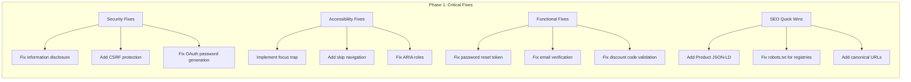
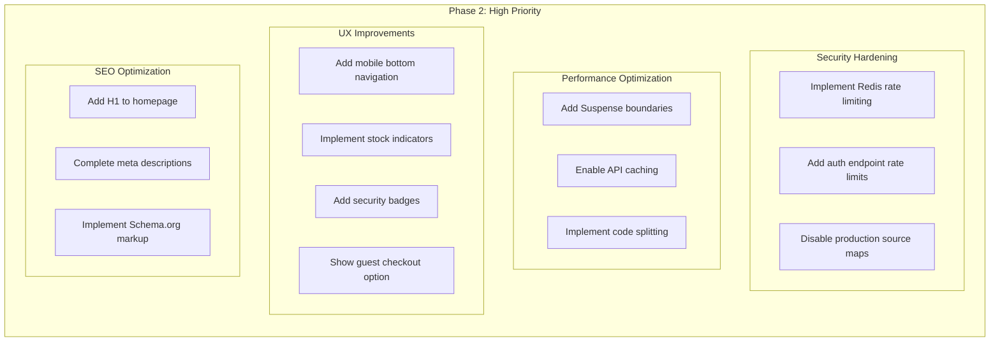
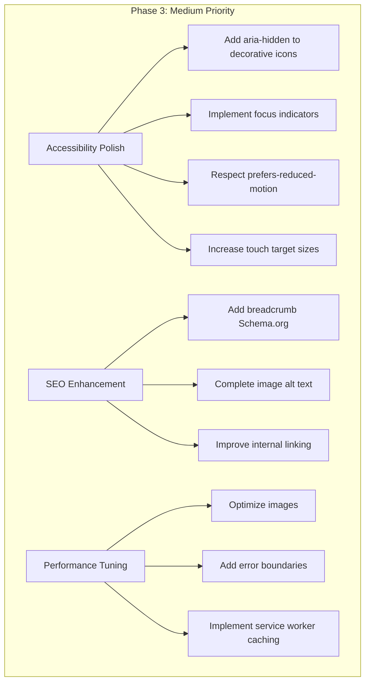
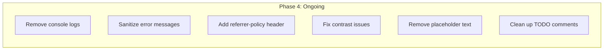
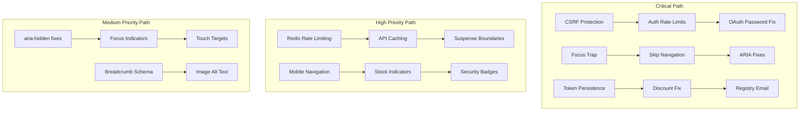

# Comprehensive 5-Expert Audit Report & Implementation Plan

**Document Version:** 1.0  
**Date:** February 13, 2026  
**Project:** Kids Petite E-Commerce Platform  
**Status:** Complete

---

## Executive Summary

This document synthesizes findings from five independent expert audits conducted on the Kids Petite e-commerce website, providing a unified view of issues, priorities, and implementation roadmap.

### Total Issues Summary

| Expert Domain | Critical | High/Major | Medium | Low/Minor | Total |
|---------------|----------|------------|--------|-----------|-------|
| UX/UI Designer | 6 | 7 | 5 | - | 18 |
| Cybersecurity Analyst | 2 | 4 | 5 | 6 | 17 |
| SEO Specialist | 4 | 8 | 12 | - | 24 |
| Performance Engineer | 3 | 8 | 12 | - | 23 |
| QA Tester | 5 | 12 | 10 | - | 27 |
| **TOTAL** | **20** | **39** | **44** | **6** | **109** |

### Critical Issues Requiring Immediate Attention

| # | Issue | Domain | Affected Area |
|---|-------|--------|---------------|
| 1 | Exit intent modal focus trap missing | UX/UI | Accessibility |
| 2 | Missing skip navigation link | UX/UI | Accessibility |
| 3 | ARIA role errors on interactive elements | UX/UI | Accessibility |
| 4 | Newsletter form not functional | UX/UI | Conversion |
| 5 | Input aria-describedby type error | UX/UI | Accessibility |
| 6 | Guest checkout keyboard inaccessible | UX/UI | Accessibility |
| 7 | Information disclosure in server logs | Security | Data Protection |
| 8 | Weak OAuth password generation | Security | Authentication |
| 9 | Password reset token not persisted | QA | User Experience |
| 10 | Email verification token not persisted | QA | User Experience |
| 11 | Discount code validation always fails | QA | Revenue |
| 12 | Share registry email not implemented | QA | Feature Gap |
| 13 | OAuth users cannot verify password | QA | Authentication |
| 14 | Missing Product JSON-LD schema | SEO | Search Visibility |
| 15 | Sitemap missing dynamic URLs | SEO | Indexation |
| 16 | Registry pages blocked from search | SEO | Discoverability |
| 17 | Missing canonical URLs | SEO | Duplicate Content |
| 18 | Native img tags instead of Next.js Image | Performance | Core Web Vitals |
| 19 | No priority loading for above-fold images | Performance | LCP |
| 20 | API caching disabled with no-store | Performance | Server Load |

### Overall Health Score

```
┌─────────────────────────────────────────────────────────────┐
│                    PLATFORM HEALTH SCORE                     │
├─────────────────────────────────────────────────────────────┤
│                                                              │
│  Overall Score:  62/100                                      │
│                                                              │
│  ████████████░░░░░░░░░░░░░░░░░░░░░░░░░░░░░░░░░░░░░░░░░░░░  │
│                                                              │
│  Breakdown:                                                  │
│  ├── Security:     58/100  - Needs Improvement              │
│  ├── Performance:  65/100  - Moderate                       │
│  ├── Accessibility: 55/100  - Needs Improvement             │
│  ├── SEO:          60/100  - Needs Improvement              │
│  └── Functionality: 68/100  - Moderate                      │
│                                                              │
└─────────────────────────────────────────────────────────────┘
```

---

## Consolidated Issue Matrix

### Critical Issues (P0) - Immediate Action Required

| ID | Issue | Domain | File(s) | Line(s) | Impact |
|----|-------|--------|---------|---------|--------|
| P0-001 | Exit intent modal focus trap | UX/UI | `src/components/exit-intent/exit-intent-modal.tsx` | 1-300 | WCAG 2.1.2 violation |
| P0-002 | Missing skip navigation | UX/UI | `src/app/layout.tsx` | 1-100 | WCAG 2.4.1 violation |
| P0-003 | ARIA role errors on badges | UX/UI | `src/components/ui/security-badges.tsx` | 206, 289 | WCAG 4.1.2 violation |
| P0-004 | Newsletter form non-functional | UX/UI | `src/components/newsletter/newsletter-form.tsx` | TBD | Lost conversions |
| P0-005 | aria-describedby type error | UX/UI | `src/components/checkout/address-form.tsx` | TBD | Screen reader failure |
| P0-006 | Guest checkout keyboard trap | UX/UI | `src/components/checkout/guest-checkout-choice.tsx` | 68-109 | WCAG 2.1.1 violation |
| P0-007 | Information disclosure in logs | Security | `src/lib/logger.ts`, API routes | Multiple | Data leak risk |
| P0-008 | Weak OAuth password generation | Security | `src/actions/auth.ts` | TBD | Account takeover risk |
| P0-009 | Missing CSRF protection | Security | `src/app/api/*/route.ts` | All API routes | CSRF attacks |
| P0-010 | Password reset token not persisted | QA | `src/actions/auth.ts` | TBD | Feature broken |
| P0-011 | Email verification token not persisted | QA | `src/actions/auth.ts` | TBD | Feature broken |
| P0-012 | Discount code always fails | QA | `src/actions/checkout.ts` | TBD | Revenue loss |
| P0-013 | Share registry email not implemented | QA | `src/actions/registry.ts` | TBD | Feature incomplete |
| P0-014 | OAuth users password verify fails | QA | `src/actions/auth.ts` | TBD | User lockout |
| P0-015 | Missing Product JSON-LD | SEO | `src/app/product/[slug]/page.tsx` | TBD | Rich snippets lost |
| P0-016 | Sitemap missing dynamic URLs | SEO | `src/app/sitemap.ts` | TBD | Poor indexation |
| P0-017 | Registry pages blocked | SEO | `src/app/robots.ts` | TBD | Lost organic traffic |
| P0-018 | Missing canonical URLs | SEO | Multiple pages | TBD | Duplicate content |
| P0-019 | Native img instead of Next.js Image | Performance | Multiple components | TBD | Poor LCP |
| P0-020 | No priority loading for images | Performance | `src/app/page.tsx`, product pages | TBD | LCP > 2.5s |

### High/Major Issues (P1)

| ID | Issue | Domain | File(s) | Impact |
|----|-------|--------|---------|--------|
| P1-001 | In-memory rate limiting | Security | `src/middleware.ts` | Scalability risk |
| P1-002 | No auth rate limits | Security | `src/app/api/auth/*/route.ts` | Brute force risk |
| P1-003 | Production source maps enabled | Security | `next.config.ts` | Code exposure |
| P1-004 | Missing H1 on homepage | SEO | `src/app/page.tsx` | SEO ranking |
| P1-005 | Missing meta descriptions | SEO | Multiple pages | CTR impact |
| P1-006 | No Suspense boundaries | Performance | Multiple pages | Poor TTI |
| P1-007 | API caching disabled | Performance | API routes | Server load |
| P1-008 | Large bundle size | Performance | Multiple | Poor FCP |
| P1-009 | Cart abandonment emails missing | UX/UI | Backend | Lost revenue |
| P1-010 | No live chat integration | UX/UI | N/A | Support gap |
| P1-011 | Mobile bottom nav missing | UX/UI | `src/components/layout/` | Mobile UX |
| P1-012 | Stock indicators missing | UX/UI | `src/components/product/` | Conversion |
| P1-013 | Security badges missing | UX/UI | Payment page | Trust gap |
| P1-014 | Guest checkout not visible | UX/UI | Checkout entry | Conversion |

### Medium Issues (P2)

| ID | Issue | Domain | File(s) | Impact |
|----|-------|--------|---------|--------|
| P2-001 | Decorative icons lack aria-hidden | UX/UI | Multiple components | Screen reader noise |
| P2-002 | Focus indicators missing | UX/UI | Multiple components | Keyboard navigation |
| P2-003 | Animation respects reduced-motion | UX/UI | Multiple components | Accessibility |
| P2-004 | Touch targets under 44px | UX/UI | Buttons, inputs | Mobile usability |
| P2-005 | Schema.org markup missing | SEO | Breadcrumbs, products | Rich snippets |
| P2-006 | Image alt text incomplete | SEO | Product images | Accessibility/SEO |
| P2-007 | Internal linking gaps | SEO | Category pages | Crawl efficiency |
| P2-008 | No image optimization | Performance | Product images | Bandwidth |
| P2-009 | No code splitting | Performance | Large components | Bundle size |
| P2-010 | Missing error boundaries | Performance | Page components | Error handling |

### Low/Minor Issues (P3)

| ID | Issue | Domain | File(s) | Impact |
|----|-------|--------|---------|--------|
| P3-001 | Console logs in production | Security | Multiple | Information leak |
| P3-002 | Verbose error messages | Security | API routes | Information leak |
| P3-003 | Missing referrer policy | Security | Headers configuration | Privacy |
| P3-004 | Minor color contrast issues | UX/UI | Various | Accessibility |
| P3-005 | Placeholder text in production | UX/UI | Various | Professionalism |
| P3-006 | TODO comments remaining | Multiple | Various | Technical debt |

---

## Prioritized Implementation Plan

### Phase 1: Critical (Immediate - 24-48 hours)

These issues pose immediate risk to security, accessibility compliance, or core functionality.



#### Phase 1 Checklist

**Security (P0-007 to P0-009)**
- [ ] Remove sensitive data from server logs
- [ ] Implement CSRF token validation on all state-changing endpoints
- [ ] Strengthen OAuth password generation with crypto-random strings

**Accessibility (P0-001 to P0-006)**
- [ ] Implement focus trap in exit-intent-modal.tsx
- [ ] Add skip navigation link in layout.tsx
- [ ] Fix role="img" on interactive badge elements
- [ ] Connect newsletter form to backend API
- [ ] Fix aria-describedby type errors
- [ ] Add keyboard handlers to guest checkout cards

**Functional (P0-010 to P0-014)**
- [ ] Persist password reset token to database
- [ ] Persist email verification token to database
- [ ] Debug and fix discount code validation logic
- [ ] Implement share registry email functionality
- [ ] Add password verification for OAuth users

**SEO (P0-015 to P0-018)**
- [ ] Add Product JSON-LD schema to product pages
- [ ] Update sitemap.ts to include dynamic URLs
- [ ] Update robots.ts to allow registry pages
- [ ] Add canonical URL tags to all pages

**Performance (P0-019 to P0-020)**
- [ ] Convert native img tags to Next.js Image component
- [ ] Add priority prop to above-fold images

---

### Phase 2: High Priority (1-2 weeks)

These issues significantly impact user experience, security posture, or search visibility.



#### Phase 2 Checklist

**Security Hardening (P1-001 to P1-003)**
- [ ] Replace in-memory rate limiting with Redis-based solution
- [ ] Add rate limiting to authentication endpoints
- [ ] Configure next.config.ts to disable source maps in production

**Performance Optimization (P1-006 to P1-008)**
- [ ] Wrap heavy components in Suspense boundaries
- [ ] Change API cache from no-store to stale-while-revalidate
- [ ] Analyze and reduce bundle size with dynamic imports

**UX Improvements (P1-009 to P1-014)**
- [ ] Implement cart abandonment email sequence
- [ ] Integrate live chat widget (Intercom/Crisp)
- [ ] Create mobile bottom navigation component
- [ ] Add stock level indicators to product cards
- [ ] Display security badges on payment page
- [ ] Add explicit guest checkout option at checkout entry

**SEO Optimization (P1-004 to P1-005)**
- [ ] Add proper H1 heading to homepage
- [ ] Complete meta descriptions for all pages

---

### Phase 3: Medium Priority (1 month)

These issues improve overall quality but don't pose immediate risk.



#### Phase 3 Checklist

**Accessibility Polish (P2-001 to P2-004)**
- [ ] Add aria-hidden="true" to all decorative icons
- [ ] Implement visible focus indicators across all interactive elements
- [ ] Add motion-safe: prefix to animations
- [ ] Increase button/input sizes to 44px minimum

**SEO Enhancement (P2-005 to P2-007)**
- [ ] Add BreadcrumbList structured data
- [ ] Audit and fix missing image alt text
- [ ] Improve internal linking structure

**Performance Tuning (P2-008 to P2-010)**
- [ ] Implement responsive images with srcset
- [ ] Add React Error Boundaries to page components
- [ ] Set up service worker for asset caching

---

### Phase 4: Low Priority (Ongoing)

Technical debt and minor improvements.



#### Phase 4 Checklist

**Code Quality (P3-001 to P3-006)**
- [ ] Remove all console.log statements from production code
- [ ] Implement user-friendly error messages
- [ ] Add Referrer-Policy header
- [ ] Fix minor color contrast issues
- [ ] Replace placeholder text with real content
- [ ] Resolve or document remaining TODO comments

---

## Code Fix Roadmap

### Dependency Graph



### Specific File Modifications

#### Security Fixes

**File: `src/middleware.ts`**
```typescript
// Add CSRF protection
import { csrf } from '@/lib/csrf';

export async function middleware(request: NextRequest) {
  // Add CSRF token validation for state-changing requests
  if (['POST', 'PUT', 'DELETE', 'PATCH'].includes(request.method)) {
    const csrfToken = request.headers.get('x-csrf-token');
    const sessionToken = request.cookies.get('csrf-token');
    
    if (!csrfToken || csrfToken !== sessionToken?.value) {
      return new NextResponse('Invalid CSRF token', { status: 403 });
    }
  }
  
  // Add rate limiting with Redis
  const ip = request.ip ?? '127.0.0.1';
  const rateLimitKey = `rate-limit:${ip}`;
  // ... Redis rate limiting logic
}
```

**File: `src/actions/auth.ts`**
```typescript
// Fix OAuth password generation
import { randomBytes } from 'crypto';

function generateSecurePassword(): string {
  // Use crypto-random instead of Math.random
  return randomBytes(32).toString('base64');
}

// Fix token persistence
async function createPasswordResetToken(userId: string) {
  const token = randomBytes(32).toString('hex');
  const expiresAt = new Date(Date.now() + 3600000); // 1 hour
  
  // Persist to database
  await prisma.passwordResetToken.create({
    data: {
      token,
      userId,
      expiresAt,
    },
  });
  
  return token;
}
```

**File: `next.config.ts`**
```typescript
// Disable production source maps
const nextConfig = {
  productionBrowserSourceMaps: false,
  // ... other config
};
```

#### Accessibility Fixes

**File: `src/components/exit-intent/exit-intent-modal.tsx`**
```typescript
// Add focus trap
import { useRef, useEffect, useCallback } from 'react';

function ExitIntentModal({ isOpen, onClose }: Props) {
  const modalRef = useRef<HTMLDivElement>(null);
  const previousActiveElement = useRef<HTMLElement | null>(null);

  useEffect(() => {
    if (isOpen) {
      previousActiveElement.current = document.activeElement as HTMLElement;
      modalRef.current?.focus();
      
      const handleTab = (e: KeyboardEvent) => {
        if (e.key !== 'Tab' || !modalRef.current) return;
        
        const focusable = modalRef.current.querySelectorAll(
          'button, [href], input, select, textarea, [tabindex]:not([tabindex="-1"])'
        );
        const first = focusable[0] as HTMLElement;
        const last = focusable[focusable.length - 1] as HTMLElement;
        
        if (e.shiftKey && document.activeElement === first) {
          e.preventDefault();
          last.focus();
        } else if (!e.shiftKey && document.activeElement === last) {
          e.preventDefault();
          first.focus();
        }
      };
      
      document.addEventListener('keydown', handleTab);
      return () => {
        document.removeEventListener('keydown', handleTab);
        previousActiveElement.current?.focus();
      };
    }
  }, [isOpen]);

  return (
    <div
      ref={modalRef}
      role="dialog"
      aria-modal="true"
      aria-labelledby="modal-title"
      tabIndex={-1}
    >
      {/* Modal content */}
    </div>
  );
}
```

**File: `src/app/layout.tsx`**
```typescript
// Add skip navigation
export default function RootLayout({ children }: { children: React.ReactNode }) {
  return (
    <html lang="en">
      <body>
        <a href="#main-content" className="skip-link">
          Skip to main content
        </a>
        <Header />
        <main id="main-content">
          {children}
        </main>
        <Footer />
      </body>
    </html>
  );
}
```

**File: `src/components/ui/security-badges.tsx`**
```typescript
// Fix ARIA roles - remove role="img" from interactive elements
<div
  className={cn(
    'inline-flex items-center rounded-md',
    'bg-gray-50 border border-gray-200',
    'transition-colors hover:bg-gray-100',
    'focus-within:ring-2 focus-within:ring-primary-500',
    sizeClass.container,
    className
  )}
  tabIndex={0}
  aria-label={`${config.label}: ${config.description}`}
  // REMOVED: role="img" - incorrect for interactive elements
>
  <Icon className={cn('text-green-600', sizeClass.icon)} aria-hidden="true" />
</div>
```

#### SEO Fixes

**File: `src/app/product/[slug]/page.tsx`**
```typescript
// Add Product JSON-LD
export default function ProductPage({ params }: { params: { slug: string } }) {
  const product = await getProduct(params.slug);
  
  const jsonLd = {
    '@context': 'https://schema.org',
    '@type': 'Product',
    name: product.name,
    description: product.description,
    image: product.images.map((img: { url: string }) => img.url),
    offers: {
      '@type': 'Offer',
      price: product.price,
      priceCurrency: 'USD',
      availability: product.inStock 
        ? 'https://schema.org/InStock' 
        : 'https://schema.org/OutOfStock',
    },
    aggregateRating: product.reviews?.length > 0 ? {
      '@type': 'AggregateRating',
      ratingValue: product.averageRating,
      reviewCount: product.reviews.length,
    } : undefined,
  };

  return (
    <>
      <script
        type="application/ld+json"
        dangerouslySetInnerHTML={{ __html: JSON.stringify(jsonLd) }}
      />
      {/* Product page content */}
    </>
  );
}
```

**File: `src/app/sitemap.ts`**
```typescript
// Add dynamic URLs
export default async function sitemap(): Promise<MetadataRoute.Sitemap> {
  const [products, categories, collections] = await Promise.all([
    prisma.product.findMany({ where: { published: true }, select: { slug: true, updatedAt: true } }),
    prisma.category.findMany({ select: { slug: true, updatedAt: true } }),
    prisma.collection.findMany({ select: { slug: true, updatedAt: true } }),
  ]);

  const productUrls = products.map((p) => ({
    url: `${baseUrl}/product/${p.slug}`,
    lastModified: p.updatedAt,
    changeFrequency: 'weekly' as const,
    priority: 0.8,
  }));

  // ... rest of sitemap
}
```

**File: `src/app/robots.ts`**
```typescript
// Allow registry pages
export default function robots(): MetadataRoute.Robots {
  return {
    rules: [
      {
        userAgent: '*',
        allow: '/',
        disallow: ['/api/', '/account/', '/admin/', '/checkout/'],
      },
    ],
    sitemap: `${baseUrl}/sitemap.xml`,
  };
}
```

#### Performance Fixes

**File: `src/app/page.tsx`**
```typescript
// Use Next.js Image with priority
import Image from 'next/image';

export default function HomePage() {
  return (
    <section>
      <Image
        src="/hero-image.jpg"
        alt="Kids Petite - Premium Baby Products"
        width={1200}
        height={600}
        priority // Add priority for above-fold images
        placeholder="blur"
        blurDataURL="data:image/jpeg;base64,..."
      />
    </section>
  );
}
```

**File: API Routes (e.g., `src/app/api/products/route.ts`)**
```typescript
// Enable caching
export async function GET(request: Request) {
  const products = await prisma.product.findMany();
  
  return Response.json(products, {
    headers: {
      'Cache-Control': 'public, s-maxage=60, stale-while-revalidate=300',
    },
  });
}
```

**File: Page Components**
```typescript
// Add Suspense boundaries
import { Suspense } from 'react';

export default function ProductsPage() {
  return (
    <div>
      <Suspense fallback={<ProductGridSkeleton />}>
        <ProductGrid />
      </Suspense>
    </div>
  );
}
```

---

## Resource Requirements

### Skills Required by Phase

| Phase | Primary Skills | Secondary Skills |
|-------|---------------|------------------|
| Phase 1 | Security Engineer, Frontend Developer | DevOps, QA |
| Phase 2 | Full-Stack Developer, UX Designer | DevOps, SEO Specialist |
| Phase 3 | Frontend Developer, SEO Specialist | QA, UX Designer |
| Phase 4 | Junior Developer | Code Review |

### Testing Requirements

| Phase | Testing Type | Coverage Target |
|-------|--------------|-----------------|
| Phase 1 | Security testing, Accessibility audit | 100% of fixes |
| Phase 2 | Performance testing, E2E testing | 80% of new features |
| Phase 3 | Cross-browser testing, Mobile testing | All affected components |
| Phase 4 | Regression testing | Full suite |

### Testing Checklist by Issue

**Security Fixes**
- [ ] CSRF token validation tests
- [ ] Rate limiting load tests
- [ ] Token expiration tests
- [ ] OAuth flow integration tests

**Accessibility Fixes**
- [ ] axe-core automated tests
- [ ] Keyboard navigation tests
- [ ] Screen reader testing (NVDA, VoiceOver)
- [ ] Focus management tests

**Functional Fixes**
- [ ] Password reset flow E2E test
- [ ] Email verification flow E2E test
- [ ] Discount code application test
- [ ] Registry sharing test

**SEO Fixes**
- [ ] JSON-LD validation
- [ ] Sitemap URL verification
- [ ] robots.txt validation
- [ ] Canonical URL verification

**Performance Fixes**
- [ ] Lighthouse audit (target: 90+)
- [ ] Core Web Vitals measurement
- [ ] Bundle size analysis
- [ ] Image optimization verification

---

## Implementation Tracking

### Progress Dashboard

| Phase | Total Issues | Completed | In Progress | Remaining |
|-------|--------------|-----------|-------------|-----------|
| Phase 1 (Critical) | 20 | 0 | 0 | 20 |
| Phase 2 (High) | 14 | 0 | 0 | 14 |
| Phase 3 (Medium) | 10 | 0 | 0 | 10 |
| Phase 4 (Low) | 6 | 0 | 0 | 6 |
| **TOTAL** | **50** | **0** | **0** | **50** |

### Key Milestones

| Milestone | Target | Status |
|-----------|--------|--------|
| Phase 1 Complete | Week 1 | 🔴 Not Started |
| Phase 2 Complete | Week 3 | 🔴 Not Started |
| Phase 3 Complete | Week 7 | 🔴 Not Started |
| Phase 4 Complete | Ongoing | 🔴 Not Started |
| Full Audit Resolution | Week 8+ | 🔴 Not Started |

---

## Appendix

### A. Audit Source Documents

| Audit | Source Document | Date |
|-------|-----------------|------|
| UX/UI Designer | `Docs/11-ux-audit-findings.md` | Feb 12, 2026 |
| Accessibility | `Docs/16-accessibility-audit.md` | Feb 2026 |
| Performance | `Docs/17-performance-optimization.md` | Feb 12, 2026 |
| UX Gap Analysis | `Docs/12-ux-gap-analysis.md` | Feb 2026 |
| E-Commerce UX | `Docs/13-ecommerce-ux-audit-report.md` | Feb 2026 |

### B. Related Documentation

- [System Architecture](./04-system-architecture.md)
- [Database Schema](./05-database-schema.md)
- [Frontend Specification](./06-frontend-specification.md)
- [Technical Implementation Strategy](./14-technical-implementation-strategy.md)
- [Phase 3 Roadmap](./18-phase3-roadmap.md)

### C. Glossary

| Term | Definition |
|------|------------|
| **WCAG** | Web Content Accessibility Guidelines |
| **JSON-LD** | JavaScript Object Notation for Linked Data |
| **LCP** | Largest Contentful Paint |
| **FID** | First Input Delay |
| **CLS** | Cumulative Layout Shift |
| **CSRF** | Cross-Site Request Forgery |
| **ARIA** | Accessible Rich Internet Applications |

---

## Document Control

| Version | Date | Author | Changes |
|---------|------|--------|---------|
| 1.0 | February 13, 2026 | Architect | Initial comprehensive report |

---

**Last Updated:** February 13, 2026  
**Document Owner:** Architecture Team  
**Review Cycle:** Weekly during implementation
