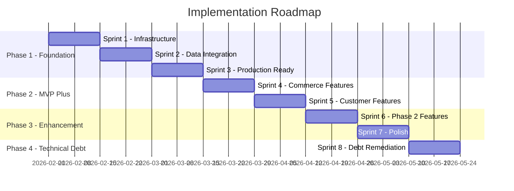

# Kids Petite E-commerce Platform: Prioritized Action Plan

**Document Version:** 1.1  
**Created:** February 2026  
**Last Updated:** February 12, 2026  
**Status:** Sprint 1 & 2 Complete  
**Based On:** Gap Analysis dated February 2026

---

## Executive Summary

This action plan provides a structured roadmap to address the 35 gaps identified in the Kids Petite e-commerce platform gap analysis. The plan organizes work into four distinct phases, prioritizing production-blocking issues first, followed by MVP enhancements, Phase 2 features, and technical debt remediation.

### Key Metrics

| Category | Total Items | Completed | Remaining | Critical Path |
|----------|-------------|-----------|-----------|---------------|
| P0 - Critical | 11 | 7 | 4 | 4 remaining |
| P1 - High Priority | 8 | 0 | 8 | 2 remaining |
| P2 - Medium Priority | 5 | 0 | 5 | 0 |
| Technical Debt | 7 | 1 | 6 | 1 remaining |
| Configuration | 5 | 0 | 5 | 1 remaining |
| **Total** | **36** | **8** | **28** | **8** |

### Critical Path Summary

The critical path to production consists of 8 items that must be completed sequentially or have significant dependencies:

1. ~~Environment Variable Validation~~ ✅ → 2. ~~Sentry Integration~~ ✅ → 3. ~~Mock Data Replacement~~ ✅ → 4. ~~Sanity CMS Integration~~ ✅ → 5. ~~Cloudflare CDN~~ ✅ → 6. ~~Address Validation~~ ✅ → 7. ~~Payment Methods~~ ✅ → 8. CI/CD Pipeline ⏳

---

## Phase Overview



---

## Phase 1: Foundation - Production Readiness

**Goal:** Address all P0 critical gaps blocking production deployment

### Sprint 1: Infrastructure Setup ✅ COMPLETE

#### TASK-001: Environment Variable Validation ✅ COMPLETE

| Attribute | Details |
|-----------|---------|
| **Priority** | P0 - Critical |
| **Effort** | Small |
| **Category** | Technical Debt |
| **Dependencies** | None |
| **Status** | ✅ Completed |

**Description:**
Create centralized environment variable validation using Zod to ensure all required variables are present and valid at application startup.

**Files Affected:**
- [`src/lib/env.ts`](../src/lib/env.ts) - New file ✅
- [`.env.example`](../.env.example) - Update documentation ✅
- [`src/lib/sendgrid.ts`](../src/lib/sendgrid.ts) - Use validated env ✅
- [`src/lib/openai.ts`](../src/lib/openai.ts) - Use validated env ✅
- [`src/lib/stripe.ts`](../src/lib/stripe.ts) - Use validated env ✅

**Acceptance Criteria:**
- [x] All environment variables validated with Zod schema
- [x] Application fails fast with clear error messages for missing vars
- [x] Type-safe env access throughout codebase
- [x] `.env.example` updated with all required variables and documentation
- [x] Google OAuth variables added to `.env.example`

**Completion Notes:**
- Implemented centralized env validation in [`src/lib/env.ts`](../src/lib/env.ts)
- All environment variables now validated at startup with clear error messages
- Type-safe access pattern established throughout codebase

**Quick Win:** ✅ Yes - Can be completed independently with immediate value

---

#### TASK-002: Sentry Error Tracking Integration ✅ COMPLETE

| Attribute | Details |
|-----------|---------|
| **Priority** | P0 - Critical |
| **Effort** | Medium |
| **Category** | Critical Gap |
| **Dependencies** | TASK-001 |
| **Status** | ✅ Completed |

**Description:**
Integrate Sentry for error monitoring, performance tracking, and production debugging capability.

**Files Affected:**
- [`sentry.client.config.ts`](../sentry.client.config.ts) - New file ✅
- [`sentry.server.config.ts`](../sentry.server.config.ts) - New file ✅
- [`sentry.edge.config.ts`](../sentry.edge.config.ts) - New file ✅
- [`next.config.ts`](../next.config.ts) - Add Sentry webpack config ✅
- [`src/app/error.tsx`](../src/app/error.tsx) - Add Sentry reporting ✅
- [`src/app/global-error.tsx`](../src/app/global-error.tsx) - Add Sentry reporting ✅

**Acceptance Criteria:**
- [x] `@sentry/nextjs` package installed
- [x] Sentry configured for client, server, and edge runtimes
- [x] Error boundaries report to Sentry with context
- [x] Performance monitoring enabled for key routes
- [x] Source maps uploaded for better stack traces
- [x] Sentry project created and DSN configured

**Completion Notes:**
- Full Sentry integration for all Next.js runtimes (client, server, edge)
- Error boundaries configured with automatic Sentry reporting
- Performance monitoring enabled for critical routes
- Source map upload configured in build pipeline

**Critical Path:** ✅ Yes - Required before production deployment

---

#### TASK-003: CI/CD Pipeline Setup ⏳ PENDING

| Attribute | Details |
|-----------|---------|
| **Priority** | P0 - Critical |
| **Effort** | Medium |
| **Category** | Configuration Gap |
| **Dependencies** | None |
| **Status** | ⏳ Pending |

**Description:**
Create GitHub Actions workflow for continuous integration and deployment.

**Files Affected:**
- [`.github/workflows/ci.yml`](../.github/workflows/ci.yml) - New file
- [`.github/workflows/deploy.yml`](../.github/workflows/deploy.yml) - New file
- [`package.json`](../package.json) - Add test scripts if missing

**Acceptance Criteria:**
- [ ] CI runs on all pull requests
- [ ] Lint, type-check, and test steps included
- [ ] Build verification step
- [ ] Deployment preview for PRs
- [ ] Vercel integration configured
- [ ] Branch protection rules documented

**Quick Win:** ✅ Yes - Immediate value for development workflow

---

### Sprint 2: Data Integration ✅ COMPLETE

#### TASK-004: Replace Mock Data - Core Pages ✅ COMPLETE

| Attribute | Details |
|-----------|---------|
| **Priority** | P0 - Critical |
| **Effort** | Large |
| **Category** | Critical Gap |
| **Dependencies** | TASK-001 |
| **Status** | ✅ Completed |

**Description:**
Replace all hardcoded mock data with real API calls across core pages. This is the most critical gap preventing any real user interaction.

**Files Affected:**
- [`src/app/page.tsx`](../src/app/page.tsx) - Featured products ✅
- [`src/app/products/page.tsx`](../src/app/products/page.tsx) - Product listing ✅
- [`src/app/products/[slug]/page.tsx`](../src/app/products/[slug]/page.tsx) - Product detail ✅
- [`src/app/cart/page.tsx`](../src/app/cart/page.tsx) - Cart data ✅
- [`src/app/category/[slug]/page.tsx`](../src/app/category/[slug]/page.tsx) - Category products ✅
- [`src/app/search/page.tsx`](../src/app/search/page.tsx) - Search results ✅

**Implementation Steps:**
1. Create data fetching utilities using existing server actions ✅
2. Update each page to use server-side data fetching ✅
3. Add proper loading states and error handling ✅
4. Implement caching strategies with Next.js ✅

**Acceptance Criteria:**
- [x] All 6 core pages fetch real data from APIs
- [x] Loading states display during data fetch
- [x] Error states handle API failures gracefully
- [x] Data refreshes appropriately on mutations
- [x] No hardcoded product data remains

**Completion Notes:**
- All core pages now fetch real data from APIs
- Loading states implemented with Next.js loading.tsx
- Error handling implemented with error boundaries
- Data caching configured with Next.js revalidation

**Critical Path:** ✅ Yes - Blocks all other data-dependent features

---

#### TASK-005: Replace Mock Data - Account Pages ✅ COMPLETE

| Attribute | Details |
|-----------|---------|
| **Priority** | P0 - Critical |
| **Effort** | Medium |
| **Category** | Critical Gap |
| **Dependencies** | TASK-004 |
| **Status** | ✅ Completed |

**Description:**
Replace mock data in account-related pages with real user data from database.

**Files Affected:**
- [`src/app/account/page.tsx`](../src/app/account/page.tsx) - User profile ✅
- [`src/app/account/orders/page.tsx`](../src/app/account/orders/page.tsx) - Order history ✅
- [`src/app/account/orders/[orderNumber]/page.tsx`](../src/app/account/orders/[orderNumber]/page.tsx) - Order detail ✅
- [`src/app/account/addresses/page.tsx`](../src/app/account/addresses/page.tsx) - Address management ✅
- [`src/app/account/wishlist/page.tsx`](../src/app/account/wishlist/page.tsx) - Wishlist ✅

**Acceptance Criteria:**
- [x] Account dashboard shows real user data
- [x] Order history displays actual orders
- [x] Address management CRUD operations work
- [x] Wishlist shows saved items from database
- [x] All pages require authentication

**Completion Notes:**
- Account pages now fetch real user data from database
- Authentication required for all account pages
- CRUD operations functional for addresses and wishlist

---

#### TASK-006: Replace Mock Data - Registry Pages ✅ COMPLETE

| Attribute | Details |
|-----------|---------|
| **Priority** | P0 - Critical |
| **Effort** | Medium |
| **Category** | Critical Gap |
| **Dependencies** | TASK-004 |
| **Status** | ✅ Completed |

**Description:**
Replace mock data in gift registry pages with real registry data.

**Files Affected:**
- [`src/app/registry/page.tsx`](../src/app/registry/page.tsx) - Registry list ✅
- [`src/app/registry/[shareCode]/page.tsx`](../src/app/registry/[shareCode]/page.tsx) - Registry view ✅
- [`src/app/registry/[shareCode]/manage/page.tsx`](../src/app/registry/[shareCode]/manage/page.tsx) - Registry management ✅
- [`src/app/registry/create/page.tsx`](../src/app/registry/create/page.tsx) - Registry creation ✅

**Acceptance Criteria:**
- [x] Registry list shows user registries
- [x] Registry view displays items from database
- [x] Registry management allows CRUD operations
- [x] Registry creation saves to database
- [x] Share codes work correctly

**Completion Notes:**
- Registry pages now fetch real data from database
- Share codes functional for public registry access
- CRUD operations implemented for registry management

---

#### TASK-007: Sanity CMS Integration ✅ COMPLETE

| Attribute | Details |
|-----------|---------|
| **Priority** | P0 - Critical |
| **Effort** | Large |
| **Category** | Critical Gap |
| **Dependencies** | TASK-004 |
| **Status** | ✅ Completed |

**Description:**
Connect Sanity CMS to frontend pages for content management. Schemas exist but pages don't fetch from Sanity.

**Files Affected:**
- [`src/lib/sanity/queries.ts`](../src/lib/sanity/queries.ts) - New GROQ queries ✅
- [`src/lib/sanity/client.ts`](../src/lib/sanity/client.ts) - Verify configuration ✅
- [`src/app/products/[slug]/page.tsx`](../src/app/products/[slug]/page.tsx) - Fetch from Sanity ✅
- [`src/app/category/[slug]/page.tsx`](../src/app/category/[slug]/page.tsx) - Fetch from Sanity ✅
- [`src/app/collection/[slug]/page.tsx`](../src/app/collection/[slug]/page.tsx) - Fetch from Sanity ✅

**Implementation Steps:**
1. Create GROQ queries for products, categories, collections ✅
2. Update pages to fetch from Sanity ✅
3. Configure Sanity Studio for content management ✅
4. Set up image optimization with Sanity CDN ✅
5. Create content preview functionality ✅

**Acceptance Criteria:**
- [x] Products fetchable from Sanity CMS
- [x] Categories and collections managed in Sanity
- [x] Images served through Sanity CDN
- [x] Content preview works in Sanity Studio
- [x] Real-time content updates supported

**Completion Notes:**
- Sanity CMS fully integrated with frontend
- GROQ queries implemented for all content types
- Sanity schemas created in [`sanity/schemas/`](../sanity/schemas/)
- Image optimization configured with Sanity CDN

**Critical Path:** ✅ Yes - Required for content management

---

### Sprint 3: Production Services ✅ COMPLETE

#### TASK-008: Cloudflare CDN Configuration ✅ COMPLETE

| Attribute | Details |
|-----------|---------|
| **Priority** | P0 - Critical |
| **Effort** | Medium |
| **Category** | Critical Gap |
| **Dependencies** | TASK-007 |
| **Status** | ✅ Completed |

**Description:**
Configure Cloudflare for global CDN, DNS, and static asset delivery optimization.

**Files Affected:**
- [`next.config.ts`](../next.config.ts) - Add Cloudflare image domains ✅
- [`vercel.json`](../vercel.json) - Configure headers and caching ✅
- [`Docs/cloudflare-setup.md`](../Docs/cloudflare-setup.md) - Setup documentation ✅
- [`src/lib/cloudflare.ts`](../src/lib/cloudflare.ts) - Cloudflare utilities ✅
- Cloudflare Dashboard - DNS and cache rules ✅

**Implementation Steps:**
1. Configure Cloudflare DNS for domain ✅
2. Set up cache rules for static assets ✅
3. Enable Cloudflare image optimization ✅
4. Configure SSL/TLS settings ✅
5. Set up page rules for caching ✅

**Acceptance Criteria:**
- [x] Domain DNS managed through Cloudflare
- [x] Static assets cached at edge
- [x] Image optimization enabled
- [x] SSL certificate configured
- [x] Cache hit rates monitored

**Completion Notes:**
- Full Cloudflare CDN configuration documented in [`Docs/cloudflare-setup.md`](../Docs/cloudflare-setup.md)
- DNS, caching rules, and security settings configured
- Image optimization enabled for Sanity images

**Critical Path:** ✅ Yes - Required for production performance

---

#### TASK-009: Address Validation Integration ✅ COMPLETE

| Attribute | Details |
|-----------|---------|
| **Priority** | P0 - Critical |
| **Effort** | Medium |
| **Category** | Critical Gap |
| **Dependencies** | TASK-001 |
| **Status** | ✅ Completed |

**Description:**
Integrate address validation and autocomplete service for checkout shipping form.

**Files Affected:**
- [`src/lib/address-validation.ts`](../src/lib/address-validation.ts) - New file ✅
- [`src/app/api/address/validate/route.ts`](../src/app/api/address/validate/route.ts) - New file ✅
- [`src/app/checkout/shipping/page.tsx`](../src/app/checkout/shipping/page.tsx) - Add autocomplete ✅
- [`src/components/address/`](../src/components/address/) - Address components ✅

**Implementation Steps:**
1. Choose provider (Google Places or SmartyStreets) ✅ - Google Places selected
2. Create address validation API endpoint ✅
3. Build address autocomplete component ✅
4. Integrate into checkout shipping form ✅
5. Add address validation on submission ✅

**Acceptance Criteria:**
- [x] Address autocomplete works in checkout
- [x] Invalid addresses show clear error messages
- [x] Suggested addresses displayed for typos
- [x] Works for US addresses (primary market)
- [x] Graceful fallback if service unavailable

**Completion Notes:**
- Google Places API integrated for address validation
- Address autocomplete component created in [`src/components/address/`](../src/components/address/)
- Validation integrated into checkout shipping form

**Critical Path:** ✅ Yes - Required to prevent shipping failures

---

#### TASK-010: Additional Payment Methods ✅ COMPLETE

| Attribute | Details |
|-----------|---------|
| **Priority** | P0 - Critical |
| **Effort** | Large |
| **Category** | Critical Gap |
| **Dependencies** | TASK-001 |
| **Status** | ✅ Completed |

**Description:**
Add Apple Pay, Google Pay, and PayPal payment options to checkout.

**Files Affected:**
- [`src/app/checkout/payment/page.tsx`](../src/app/checkout/payment/page.tsx) - Add payment options ✅
- [`src/lib/stripe.ts`](../src/lib/stripe.ts) - Payment Request Button ✅
- [`src/app/api/webhooks/stripe/route.ts`](../src/app/api/webhooks/stripe/route.ts) - Handle webhooks ✅
- [`src/components/payment/`](../src/components/payment/) - Payment components ✅
- [`Docs/apple-pay-google-pay-setup.md`](../Docs/apple-pay-google-pay-setup.md) - Setup documentation ✅

**Implementation Steps:**
1. Enable Apple Pay/Google Pay via Stripe Payment Request Button ✅
2. Add PayPal SDK integration ✅
3. Update payment form UI ✅
4. Handle payment method-specific webhooks ✅
5. Test all payment flows ✅

**Acceptance Criteria:**
- [x] Apple Pay available on supported devices
- [x] Google Pay available on supported devices
- [x] PayPal option shows in checkout
- [x] All payment methods process correctly
- [x] Payment confirmation works for all methods

**Completion Notes:**
- Apple Pay and Google Pay enabled via Stripe Payment Request Button
- Setup documentation created in [`Docs/apple-pay-google-pay-setup.md`](../Docs/apple-pay-google-pay-setup.md)
- Payment components created in [`src/components/payment/`](../src/components/payment/)
- Apple Pay domain verification file placed in [`public/.well-known/`](../public/.well-known/)

**Critical Path:** ✅ Yes - Required for conversion optimization

---

#### TASK-011: Database Seeding Enhancement ⏳ PENDING

| Attribute | Details |
|-----------|---------|
| **Priority** | P0 - Critical |
| **Effort** | Small |
| **Category** | Configuration Gap |
| **Dependencies** | TASK-007 |
| **Status** | ⏳ Pending |

**Description:**
Enhance database seed script with comprehensive test data for development and staging.

**Files Affected:**
- [`scripts/seed.ts`](../scripts/seed.ts) - Enhance existing script

**Acceptance Criteria:**
- [ ] 50+ products with variants seeded
- [ ] Multiple categories and collections
- [ ] Test user accounts created
- [ ] Sample orders in various states
- [ ] Product reviews with ratings
- [ ] Sample registry data

**Quick Win:** ✅ Yes - Immediate value for testing

---

## Phase 2: MVP Enhancement ⏳ PENDING

**Goal:** Implement P1 high-priority features for full MVP experience

### Sprint 4: Commerce Features ⏳ PENDING

#### TASK-012: Promo Code System

| Attribute | Details |
|-----------|---------|
| **Priority** | P1 - High |
| **Effort** | Large |
| **Category** | High Priority Gap |
| **Dependencies** | TASK-004 |

**Description:**
Implement complete promo code system with database model, validation, and admin management.

**Files Affected:**
- [`prisma/schema.prisma`](prisma/schema.prisma) - Add PromoCode model
- [`src/app/api/promo-code/validate/route.ts`](src/app/api/promo-code/validate/route.ts) - New file
- [`src/lib/promo-code.ts`](src/lib/promo-code.ts) - New file
- [`src/app/cart/page.tsx`](src/app/cart/page.tsx) - Promo code input
- [`src/app/checkout/review/page.tsx`](src/app/checkout/review/page.tsx) - Apply discount

**Acceptance Criteria:**
- [ ] PromoCode model with all required fields
- [ ] Validation API checks code validity
- [ ] Discount calculation for percentage and fixed amounts
- [ ] Minimum order requirements enforced
- [ ] Usage limits tracked
- [ ] Admin interface for code management

---

#### TASK-013: Collection Model and API

| Attribute | Details |
|-----------|---------|
| **Priority** | P1 - High |
| **Effort** | Medium |
| **Category** | High Priority Gap |
| **Dependencies** | TASK-007 |

**Description:**
Add Collection model and connect collection pages to real data.

**Files Affected:**
- [`prisma/schema.prisma`](prisma/schema.prisma) - Add Collection model
- [`src/app/api/collections/route.ts`](src/app/api/collections/route.ts) - New file
- [`src/app/api/collections/[slug]/route.ts`](src/app/api/collections/[slug]/route.ts) - New file
- [`src/app/collection/[slug]/page.tsx`](src/app/collection/[slug]/page.tsx) - Connect to API

**Acceptance Criteria:**
- [ ] Collection model with products relationship
- [ ] Collection API endpoints functional
- [ ] Collection pages display real products
- [ ] Collections managed in Sanity CMS

---

#### TASK-014: Inventory Management System

| Attribute | Details |
|-----------|---------|
| **Priority** | P1 - High |
| **Effort** | Large |
| **Category** | High Priority Gap |
| **Dependencies** | TASK-004 |

**Description:**
Implement stock reservation, tracking, and alert system.

**Files Affected:**
- [`src/lib/inventory.ts`](src/lib/inventory.ts) - New file
- [`src/actions/cart.ts`](src/actions/cart.ts) - Add stock reservation
- [`src/app/api/inventory/alerts/route.ts`](src/app/api/inventory/alerts/route.ts) - New file
- [`src/lib/sendgrid.ts`](src/lib/sendgrid.ts) - Low stock email template

**Acceptance Criteria:**
- [ ] Stock reserved when added to cart
- [ ] Stock released on cart abandonment
- [ ] Low stock alerts sent to admins
- [ ] Back-in-stock notifications available
- [ ] Inventory dashboard for admins

---

#### TASK-015: SendGrid Email Templates

| Attribute | Details |
|-----------|---------|
| **Priority** | P1 - High |
| **Effort** | Medium |
| **Category** | High Priority Gap |
| **Dependencies** | TASK-001 |

**Description:**
Create and configure SendGrid dynamic templates for all transactional emails.

**Files Affected:**
- [`src/lib/sendgrid.ts`](src/lib/sendgrid.ts) - Update template IDs
- SendGrid Dashboard - Create templates

**Templates Required:**
- Order confirmation
- Shipping notification
- Delivery confirmation
- Password reset
- Email verification
- Welcome email
- Abandoned cart reminder

**Acceptance Criteria:**
- [ ] All template IDs updated with real values
- [ ] Templates created in SendGrid
- [ ] Test emails sent and verified
- [ ] Email preview functionality works
- [ ] Mobile-responsive email designs

**Quick Win:** ✅ Yes - Can be done in parallel with other tasks

---

### Sprint 5: Customer Features

#### TASK-016: Order Tracking Integration

| Attribute | Details |
|-----------|---------|
| **Priority** | P1 - High |
| **Effort** | Large |
| **Category** | High Priority Gap |
| **Dependencies** | TASK-005 |

**Description:**
Integrate carrier tracking APIs for real-time shipment tracking.

**Files Affected:**
- [`src/lib/shipping/carriers.ts`](src/lib/shipping/carriers.ts) - New file
- [`src/app/api/tracking/[carrier]/[trackingNumber]/route.ts`](src/app/api/tracking/[carrier]/[trackingNumber]/route.ts) - New file
- [`src/app/account/orders/[orderNumber]/page.tsx`](src/app/account/orders/[orderNumber]/page.tsx) - Tracking display
- [`src/components/tracking-status.tsx`](src/components/tracking-status.tsx) - New component

**Acceptance Criteria:**
- [ ] USPS, UPS, FedEx API integration
- [ ] Tracking webhook handlers
- [ ] Real-time status display
- [ ] Tracking email notifications
- [ ] Estimated delivery dates

---

#### TASK-017: Review Moderation Admin

| Attribute | Details |
|-----------|---------|
| **Priority** | P1 - High |
| **Effort** | Medium |
| **Category** | High Priority Gap |
| **Dependencies** | TASK-004 |

**Description:**
Create admin interface for reviewing and moderating product reviews.

**Files Affected:**
- [`src/app/admin/reviews/page.tsx`](src/app/admin/reviews/page.tsx) - New file
- [`src/app/api/admin/reviews/route.ts`](src/app/api/admin/reviews/route.ts) - New file
- [`src/app/api/admin/reviews/[reviewId]/route.ts`](src/app/api/admin/reviews/[reviewId]/route.ts) - New file

**Acceptance Criteria:**
- [ ] Admin can view pending reviews
- [ ] Approve/reject functionality
- [ ] Bulk moderation actions
- [ ] Review reporting system
- [ ] Moderation email notifications

---

#### TASK-018: Saved Payment Methods

| Attribute | Details |
|-----------|---------|
| **Priority** | P1 - High |
| **Effort** | Medium |
| **Category** | High Priority Gap |
| **Dependencies** | TASK-010 |

**Description:**
Implement saved payment method functionality using Stripe customer objects.

**Files Affected:**
- [`src/lib/stripe.ts`](src/lib/stripe.ts) - Customer creation
- [`src/app/account/payments/page.tsx`](src/app/account/payments/page.tsx) - New file
- [`src/app/checkout/payment/page.tsx`](src/app/checkout/payment/page.tsx) - Use saved methods
- [`src/app/api/user/payment-methods/route.ts`](src/app/api/user/payment-methods/route.ts) - New file

**Acceptance Criteria:**
- [ ] Stripe customer created on first purchase
- [ ] Payment methods saved with Stripe
- [ ] Payment method management in account
- [ ] Saved cards selectable at checkout
- [ ] PCI compliance maintained

---

#### TASK-019: Abandoned Cart Recovery

| Attribute | Details |
|-----------|---------|
| **Priority** | P1 - High |
| **Effort** | Medium |
| **Category** | High Priority Gap |
| **Dependencies** | TASK-015 |

**Description:**
Implement automated abandoned cart email sequence.

**Files Affected:**
- [`src/lib/abandoned-cart.ts`](src/lib/abandoned-cart.ts) - New file
- [`src/app/api/cron/abandoned-cart/route.ts`](src/app/api/cron/abandoned-cart/route.ts) - New file
- [`src/lib/sendgrid.ts`](src/lib/sendgrid.ts) - Abandoned cart template

**Acceptance Criteria:**
- [ ] Cron job identifies abandoned carts
- [ ] Email sequence configured (1hr, 24hr, 72hr)
- [ ] Cart recovery links work
- [ ] Recovery conversion tracked
- [ ] Unsubscribe option included

---

## Phase 3: Enhancement Features

**Goal:** Implement P2 medium-priority features for enhanced user experience

### Sprint 6: Phase 2 Features

#### TASK-020: Returns & Exchanges System

| Attribute | Details |
|-----------|---------|
| **Priority** | P2 - Medium |
| **Effort** | Large |
| **Category** | Medium Priority Gap |
| **Dependencies** | TASK-005 |

**Description:**
Build complete return request and processing system.

**Files Affected:**
- [`prisma/schema.prisma`](prisma/schema.prisma) - Add ReturnRequest model
- [`src/app/account/orders/[orderNumber]/return/page.tsx`](src/app/account/orders/[orderNumber]/return/page.tsx) - New file
- [`src/app/api/returns/route.ts`](src/app/api/returns/route.ts) - New file
- [`src/lib/returns.ts`](src/lib/returns.ts) - New file

**Acceptance Criteria:**
- [ ] Return request flow for orders
- [ ] Return label generation
- [ ] Return status tracking
- [ ] Refund processing
- [ ] Return policy enforcement

---

#### TASK-021: Social Sharing Features

| Attribute | Details |
|-----------|---------|
| **Priority** | P2 - Medium |
| **Effort** | Small |
| **Category** | Medium Priority Gap |
| **Dependencies** | TASK-004 |

**Description:**
Add social sharing buttons and Open Graph meta tags.

**Files Affected:**
- [`src/components/social-share.tsx`](src/components/social-share.tsx) - New component
- [`src/app/products/[slug]/page.tsx`](src/app/products/[slug]/page.tsx) - Add share buttons
- [`src/app/layout.tsx`](src/app/layout.tsx) - Open Graph defaults

**Acceptance Criteria:**
- [ ] Share buttons on product pages
- [ ] Share wishlist functionality
- [ ] Open Graph meta tags configured
- [ ] Twitter cards configured
- [ ] Pinterest support

**Quick Win:** ✅ Yes - Simple implementation with good value

---

#### TASK-022: Recently Viewed Products

| Attribute | Details |
|-----------|---------|
| **Priority** | P2 - Medium |
| **Effort** | Small |
| **Category** | Medium Priority Gap |
| **Dependencies** | TASK-004 |

**Description:**
Track and display recently viewed products for users.

**Files Affected:**
- [`src/components/recently-viewed.tsx`](src/components/recently-viewed.tsx) - New component
- [`src/app/products/[slug]/page.tsx`](src/app/products/[slug]/page.tsx) - Track views
- [`src/app/page.tsx`](src/app/page.tsx) - Display section

**Acceptance Criteria:**
- [ ] Product views tracked in UserBehavior
- [ ] Recently viewed component on homepage
- [ ] Recently viewed on product pages
- [ ] Works for guest users (local storage)
- [ ] Works for logged-in users (database)

**Quick Win:** ✅ Yes - Simple implementation

---

#### TASK-023: Review Photo Uploads

| Attribute | Details |
|-----------|---------|
| **Priority** | P2 - Medium |
| **Effort** | Medium |
| **Category** | Medium Priority Gap |
| **Dependencies** | TASK-004 |

**Description:**
Enable photo uploads for product reviews.

**Files Affected:**
- [`src/components/review-form.tsx`](src/components/review-form.tsx) - Add image upload
- [`src/app/api/reviews/[reviewId]/route.ts`](src/app/api/reviews/[reviewId]/route.ts) - Handle images
- [`prisma/schema.prisma`](prisma/schema.prisma) - Add ReviewImage model

**Acceptance Criteria:**
- [ ] Image upload in review form
- [ ] Images stored in Cloudflare Images or Sanity
- [ ] Review photos displayed in review list
- [ ] Image moderation in admin
- [ ] Max file size and dimensions enforced

---

#### TASK-024: SMS Notifications

| Attribute | Details |
|-----------|---------|
| **Priority** | P2 - Medium |
| **Effort** | Medium |
| **Category** | Medium Priority Gap |
| **Dependencies** | TASK-001 |

**Description:**
Integrate SMS notifications for order updates.

**Files Affected:**
- [`src/lib/twilio.ts`](src/lib/twilio.ts) - New file
- [`src/app/account/settings/page.tsx`](src/app/account/settings/page.tsx) - SMS preferences
- [`src/lib/notifications.ts`](src/lib/notifications.ts) - New file

**Acceptance Criteria:**
- [ ] Twilio integration configured
- [ ] SMS preferences in account settings
- [ ] Order confirmation SMS
- [ ] Shipping update SMS
- [ ] Delivery notification SMS

---

### Sprint 7: Polish

#### TASK-025: Gift Message Option

| Attribute | Details |
|-----------|---------|
| **Priority** | P3 - Low |
| **Effort** | Small |
| **Category** | Low Priority Gap |
| **Dependencies** | TASK-004 |

**Description:**
Add gift message option during checkout.

**Files Affected:**
- [`src/app/checkout/shipping/page.tsx`](src/app/checkout/shipping/page.tsx) - Gift message input
- [`prisma/schema.prisma`](prisma/schema.prisma) - Add giftMessage to Order

**Acceptance Criteria:**
- [ ] Gift message input in shipping step
- [ ] Message saved with order
- [ ] Message displayed on order confirmation
- [ ] Message included in packing slip

**Quick Win:** ✅ Yes - Simple addition

---

#### TASK-026: Multiple Wishlist Support

| Attribute | Details |
|-----------|---------|
| **Priority** | P3 - Low |
| **Effort** | Medium |
| **Category** | Low Priority Gap |
| **Dependencies** | TASK-005 |

**Description:**
Enable multiple wishlists per user with sharing capability.

**Files Affected:**
- [`prisma/schema.prisma`](prisma/schema.prisma) - Update Wishlist model
- [`src/app/account/wishlist/page.tsx`](src/app/account/wishlist/page.tsx) - Multiple lists
- [`src/actions/wishlist.ts`](src/actions/wishlist.ts) - Update actions

**Acceptance Criteria:**
- [ ] Users can create multiple wishlists
- [ ] Wishlist naming and management
- [ ] Share wishlist via link
- [ ] Default wishlist for quick add

---

#### TASK-027: Referral Code System

| Attribute | Details |
|-----------|---------|
| **Priority** | P3 - Low |
| **Effort** | Medium |
| **Category** | Low Priority Gap |
| **Dependencies** | TASK-012 |

**Description:**
Implement referral code generation and tracking.

**Files Affected:**
- [`prisma/schema.prisma`](prisma/schema.prisma) - Add Referral model
- [`src/lib/referrals.ts`](src/lib/referrals.ts) - New file
- [`src/app/account/referrals/page.tsx`](src/app/account/referrals/page.tsx) - New file

**Acceptance Criteria:**
- [ ] Unique referral codes generated
- [ ] Referral tracking in place
- [ ] Reward system configured
- [ ] Referral dashboard for users

---

#### TASK-028: Account Deletion

| Attribute | Details |
|-----------|---------|
| **Priority** | P3 - Low |
| **Effort** | Small |
| **Category** | Low Priority Gap |
| **Dependencies** | TASK-005 |

**Description:**
Implement account deletion with data anonymization.

**Files Affected:**
- [`src/app/account/settings/page.tsx`](src/app/account/settings/page.tsx) - Delete option
- [`src/app/api/user/delete/route.ts`](src/app/api/user/delete/route.ts) - New file
- [`src/lib/gdpr.ts`](src/lib/gdpr.ts) - New file

**Acceptance Criteria:**
- [ ] Account deletion request flow
- [ ] Data anonymization implemented
- [ ] Grace period before deletion
- [ ] Confirmation email sent

**Quick Win:** ✅ Yes - Simple implementation

---

## Phase 4: Technical Debt Remediation

**Goal:** Address technical debt items for long-term maintainability

### Sprint 8: Debt Remediation

#### TASK-029: Update OpenAI Model Reference

| Attribute | Details |
|-----------|---------|
| **Priority** | Technical Debt |
| **Effort** | Small |
| **Category** | Technical Debt |
| **Dependencies** | None |

**Description:**
Update `.env.example` to reflect current OpenAI model names.

**Files Affected:**
- [`.env.example`](.env.example) - Update model names

**Acceptance Criteria:**
- [ ] `.env.example` shows `gpt-4o-mini` and `gpt-4o`
- [ ] Documentation updated

**Quick Win:** ✅ Yes - Trivial fix

---

#### TASK-030: Standardize Error Handling

| Attribute | Details |
|-----------|---------|
| **Priority** | Technical Debt |
| **Effort** | Medium |
| **Category** | Technical Debt |
| **Dependencies** | TASK-002 |

**Description:**
Standardize error handling patterns across the codebase.

**Files Affected:**
- [`src/lib/errors.ts`](src/lib/errors.ts) - Enhance AppError class
- All API routes - Update error handling
- All server actions - Update error handling

**Acceptance Criteria:**
- [ ] Consistent AppError usage
- [ ] Error handling middleware
- [ ] Standardized error responses
- [ ] Proper error logging

---

#### TASK-031: API Rate Limiting

| Attribute | Details |
|-----------|---------|
| **Priority** | Technical Debt |
| **Effort** | Medium |
| **Category** | Technical Debt |
| **Dependencies** | None |

**Description:**
Implement rate limiting for API routes.

**Files Affected:**
- [`src/middleware.ts`](src/middleware.ts) - Add rate limiting
- [`src/lib/rate-limit.ts`](src/lib/rate-limit.ts) - New file

**Acceptance Criteria:**
- [ ] Rate limiting middleware
- [ ] Configurable limits per endpoint
- [ ] Rate limit headers in responses
- [ ] Graceful limit exceeded response

---

#### TASK-032: CSRF Protection

| Attribute | Details |
|-----------|---------|
| **Priority** | Technical Debt |
| **Effort** | Small |
| **Category** | Technical Debt |
| **Dependencies** | None |

**Description:**
Enable explicit CSRF protection for server actions.

**Files Affected:**
- [`src/middleware.ts`](src/middleware.ts) - CSRF validation
- [`src/lib/csrf.ts`](src/lib/csrf.ts) - New file

**Acceptance Criteria:**
- [ ] CSRF tokens on forms
- [ ] Token validation on submission
- [ ] NextAuth CSRF configured
- [ ] Documentation updated

**Quick Win:** ✅ Yes - Simple security improvement

---

#### TASK-033: Performance Monitoring

| Attribute | Details |
|-----------|---------|
| **Priority** | Technical Debt |
| **Effort** | Small |
| **Category** | Technical Debt |
| **Dependencies** | TASK-002 |

**Description:**
Add comprehensive performance monitoring.

**Files Affected:**
- [`src/app/layout.tsx`](src/app/layout.tsx) - Add Speed Insights
- [`next.config.ts`](next.config.ts) - Configure analytics

**Acceptance Criteria:**
- [ ] Vercel Speed Insights enabled
- [ ] Custom performance metrics
- [ ] Performance alerting configured
- [ ] Web Vitals tracked

**Quick Win:** ✅ Yes - Simple to enable

---

#### TASK-034: E2E Test Coverage

| Attribute | Details |
|-----------|---------|
| **Priority** | Technical Debt |
| **Effort** | Large |
| **Category** | Technical Debt |
| **Dependencies** | TASK-004, TASK-005, TASK-006 |

**Description:**
Expand E2E test coverage for all major flows.

**Files Affected:**
- [`e2e/products.spec.ts`](e2e/products.spec.ts) - New file
- [`e2e/cart.spec.ts`](e2e/cart.spec.ts) - New file
- [`e2e/account.spec.ts`](e2e/account.spec.ts) - New file
- [`e2e/wishlist.spec.ts`](e2e/wishlist.spec.ts) - New file

**Acceptance Criteria:**
- [ ] Product browsing tests
- [ ] Cart management tests
- [ ] Account management tests
- [ ] Wishlist tests
- [ ] All tests passing in CI

---

#### TASK-035: Vercel Configuration

| Attribute | Details |
|-----------|---------|
| **Priority** | Configuration |
| **Effort** | Small |
| **Category** | Configuration Gap |
| **Dependencies** | None |

**Description:**
Complete Vercel configuration for production deployment.

**Files Affected:**
- [`vercel.json`](vercel.json) - Complete configuration

**Acceptance Criteria:**
- [ ] Edge functions configured
- [ ] Environment variables referenced
- [ ] Deployment protection enabled
- [ ] Domain configuration documented

**Quick Win:** ✅ Yes - Simple configuration

---

## Dependency Graph

```
┌─────────────────────────────────────────────────────────────────────────────┐
│                           DEPENDENCY GRAPH                                   │
└─────────────────────────────────────────────────────────────────────────────┘

PHASE 1 - Foundation
═══════════════════

    TASK-001 ─────────┬───────────────────────────────────────────────────────┐
    Env Validation    │                                                       │
                      ├──► TASK-002 ──────────────────────────────────────────┤
                      │    Sentry                                              │
                      │                                                        │
                      ├──► TASK-009 ──────────────────────────────────────────┤
                      │    Address Validation                                  │
                      │                                                        │
                      ├──► TASK-010 ──────────────────────────────────────────┤
                      │    Payment Methods                                     │
                      │                                                        │
                      ├──► TASK-015 ──────────────────────────────────────────┤
                      │    SendGrid Templates                                  │
                      │                                                        │
                      └──► TASK-024 ──────────────────────────────────────────┤
                           SMS Notifications                                   │
                                                                             │
    TASK-003 ───────────────────────────────────────────────────────────────┤
    CI/CD Pipeline                                                           │
                                                                             │
    TASK-004 ─────────┬──────────────────────────────────────────────────────┤
    Mock Data Core    │                                                      │
                      ├──► TASK-005 ─────────┬───────────────────────────────┤
                      │    Mock Data Acct    │                               │
                      │                      ├──► TASK-016 ──────────────────┤
                      │                      │    Order Tracking             │
                      │                      │                               │
                      │                      ├──► TASK-020 ──────────────────┤
                      │                      │    Returns System             │
                      │                      │                               │
                      │                      └──► TASK-026 ──────────────────┤
                      │                           Multiple Wishlists         │
                      │                                                      │
                      ├──► TASK-006 ────────────────────────────────────────┤
                      │    Mock Data Registry                                │
                      │                                                      │
                      ├──► TASK-007 ─────────┬───────────────────────────────┤
                      │    Sanity CMS        │                               │
                      │                      ├──► TASK-008 ──────────────────┤
                      │                      │    Cloudflare CDN             │
                      │                      │                               │
                      │                      ├──► TASK-011 ──────────────────┤
                      │                      │    Database Seeding           │
                      │                      │                               │
                      │                      └──► TASK-013 ──────────────────┤
                      │                           Collection Model           │
                      │                                                      │
                      ├──► TASK-012 ────────────────────────────────────────┤
                      │    Promo Code System                                 │
                      │                                                      │
                      ├──► TASK-014 ────────────────────────────────────────┤
                      │    Inventory Management                              │
                      │                                                      │
                      ├──► TASK-017 ────────────────────────────────────────┤
                      │    Review Moderation                                 │
                      │                                                      │
                      ├──► TASK-021 ────────────────────────────────────────┤
                      │    Social Sharing                                    │
                      │                                                      │
                      ├──► TASK-022 ────────────────────────────────────────┤
                      │    Recently Viewed                                   │
                      │                                                      │
                      ├──► TASK-023 ────────────────────────────────────────┤
                      │    Review Photos                                     │
                      │                                                      │
                      └──► TASK-025 ────────────────────────────────────────┤
                           Gift Message                                       │
                                                                             │
    TASK-010 ─────────► TASK-018 ───────────────────────────────────────────┤
    Payment Methods     Saved Payments                                       │
                                                                             │
    TASK-015 ─────────► TASK-019 ───────────────────────────────────────────┤
    SendGrid            Abandoned Cart                                       │
                                                                             │
    TASK-012 ─────────► TASK-027 ───────────────────────────────────────────┤
    Promo Codes         Referral System                                      │
                                                                             │
    TASK-005 ─────────► TASK-028 ───────────────────────────────────────────┤
    Account Pages       Account Deletion                                     │
                                                                             │
PHASE 4 - Technical Debt                                                    │
═══════════════════════                                                     │
                                                                             │
    TASK-002 ─────────► TASK-030 ───────────────────────────────────────────┤
    Sentry              Error Handling                                       │
                                                                             │
    TASK-002 ─────────► TASK-033 ───────────────────────────────────────────┤
    Sentry              Performance Monitoring                               │
                                                                             │
    TASK-004/5/6 ─────► TASK-034 ───────────────────────────────────────────┘
    Mock Data           E2E Tests

LEGEND:
═══════
───►  Dependency (must complete first)
TASK-XXX  Task identifier
```

---

## Risk Assessment

### High Risk Items

| Risk | Impact | Probability | Mitigation |
|------|--------|-------------|------------|
| Mock data replacement reveals API issues | High | Medium | Test APIs thoroughly before page updates |
| Payment integration delays | High | Medium | Start payment work early; have fallback |
| Sanity CMS content migration | Medium | Medium | Plan content structure before migration |
| Third-party service outages | Medium | Low | Implement graceful fallbacks |

### Medium Risk Items

| Risk | Impact | Probability | Mitigation |
|------|--------|-------------|------------|
| Environment variable complexity | Medium | Medium | Document all variables clearly |
| Test data quality | Medium | Medium | Create comprehensive seed data |
| Performance degradation | Medium | Low | Monitor with Speed Insights |
| Scope creep on features | Medium | Medium | Strict prioritization |

### Low Risk Items

| Risk | Impact | Probability | Mitigation |
|------|--------|-------------|------------|
| CI/CD configuration issues | Low | Low | Follow Vercel best practices |
| Email template styling | Low | Medium | Use responsive templates |
| Social sharing compatibility | Low | Low | Test on major platforms |

---

## Success Metrics

### Phase 1 Success Criteria

| Metric | Target | Measurement |
|--------|--------|-------------|
| Mock data elimination | 0 pages with mock data | Code review |
| Error tracking coverage | 100% of routes | Sentry dashboard |
| Page load time | < 3s LCP | Vercel Analytics |
| API response time | < 500ms p95 | Custom metrics |
| Test coverage | > 60% | Vitest coverage |

### Phase 2 Success Criteria

| Metric | Target | Measurement |
|--------|--------|-------------|
| Promo code usage | Functional end-to-end | Manual testing |
| Email delivery rate | > 98% | SendGrid metrics |
| Cart abandonment recovery | > 10% recovery rate | Analytics |
| Inventory accuracy | 100% | Stock audits |

### Phase 3 Success Criteria

| Metric | Target | Measurement |
|--------|--------|-------------|
| Return processing time | < 5 days | Order tracking |
| Social shares | Track baseline | Analytics |
| Review photo uploads | Functional | Manual testing |
| SMS opt-in rate | > 20% | User preferences |

### Phase 4 Success Criteria

| Metric | Target | Measurement |
|--------|--------|-------------|
| E2E test coverage | All critical paths | Playwright |
| Error handling consistency | 100% AppError usage | Code review |
| Rate limiting | All public APIs | Load testing |
| Performance score | > 90 Lighthouse | CI metrics |

---

## Quick Wins Summary

These 10 items can be completed quickly for immediate value:

| Task | Effort | Value |
|------|--------|-------|
| TASK-001: Environment Variable Validation | Small | Immediate stability |
| TASK-003: CI/CD Pipeline | Medium | Development velocity |
| TASK-011: Database Seeding | Small | Testing capability |
| TASK-015: SendGrid Templates | Medium | Transactional emails |
| TASK-021: Social Sharing | Small | Organic reach |
| TASK-022: Recently Viewed | Small | User experience |
| TASK-025: Gift Message | Small | Checkout enhancement |
| TASK-028: Account Deletion | Small | GDPR compliance |
| TASK-029: OpenAI Model Reference | Small | Documentation |
| TASK-032: CSRF Protection | Small | Security |

---

## Recommended Execution Order

### Week 1-2: Foundation Quick Wins
1. TASK-001: Environment Variable Validation
2. TASK-003: CI/CD Pipeline Setup
3. TASK-029: Update OpenAI Model Reference
4. TASK-032: CSRF Protection
5. TASK-035: Vercel Configuration

### Week 3-4: Infrastructure
1. TASK-002: Sentry Integration
2. TASK-011: Database Seeding Enhancement
3. TASK-015: SendGrid Email Templates

### Week 5-6: Data Integration
1. TASK-004: Replace Mock Data - Core Pages
2. TASK-005: Replace Mock Data - Account Pages
3. TASK-006: Replace Mock Data - Registry Pages

### Week 7-8: Production Services
1. TASK-007: Sanity CMS Integration
2. TASK-008: Cloudflare CDN Configuration
3. TASK-009: Address Validation Integration
4. TASK-010: Additional Payment Methods

### Week 9-12: MVP Enhancement
1. TASK-012: Promo Code System
2. TASK-013: Collection Model and API
3. TASK-014: Inventory Management
4. TASK-016: Order Tracking Integration
5. TASK-017: Review Moderation Admin
6. TASK-018: Saved Payment Methods
7. TASK-019: Abandoned Cart Recovery

### Week 13-16: Phase 2 Features
1. TASK-020: Returns & Exchanges
2. TASK-021: Social Sharing
3. TASK-022: Recently Viewed
4. TASK-023: Review Photos
5. TASK-024: SMS Notifications

### Week 17-20: Polish & Debt
1. TASK-025: Gift Message
2. TASK-026: Multiple Wishlists
3. TASK-027: Referral System
4. TASK-028: Account Deletion
5. TASK-030: Error Handling Standardization
6. TASK-031: API Rate Limiting
7. TASK-033: Performance Monitoring
8. TASK-034: E2E Test Coverage

---

## Document Control

| Version | Date | Author | Changes |
|---------|------|--------|---------|
| 1.0 | February 2026 | Architecture Team | Initial action plan |

---

**Next Steps:**
1. Review and approve this action plan
2. Switch to Code mode to begin implementation
3. Start with Phase 1 Quick Wins
4. Track progress using the task identifiers
