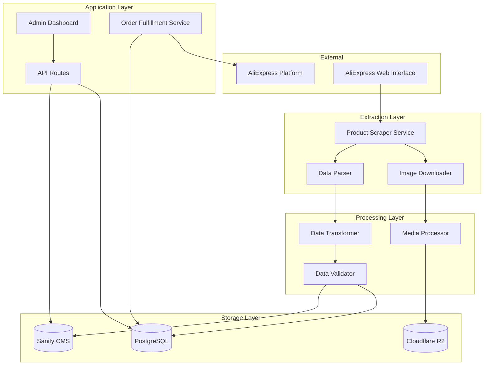
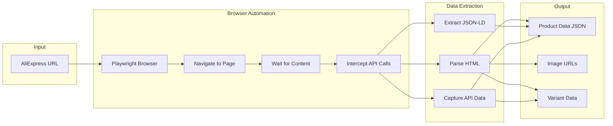
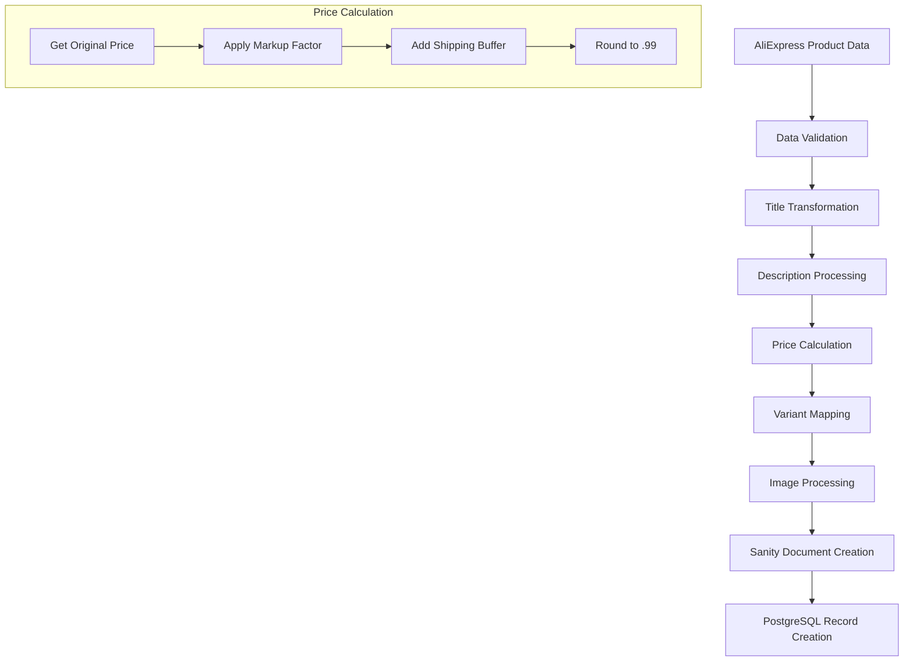
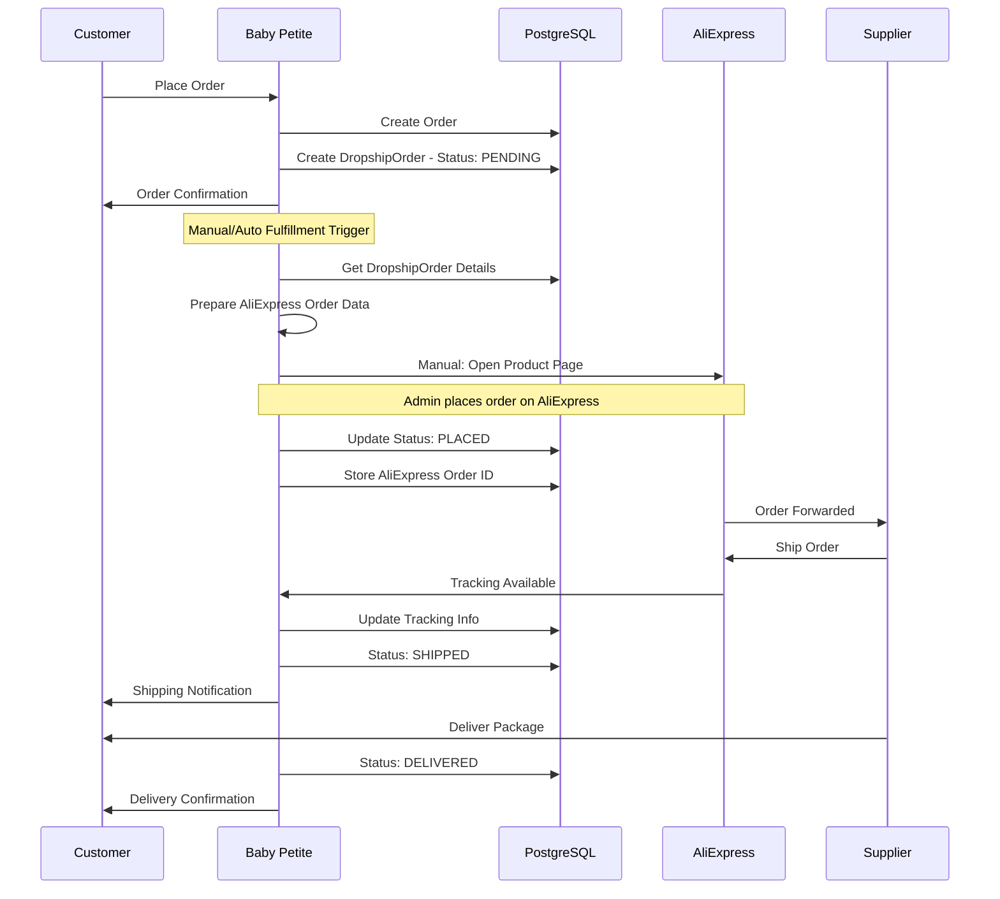
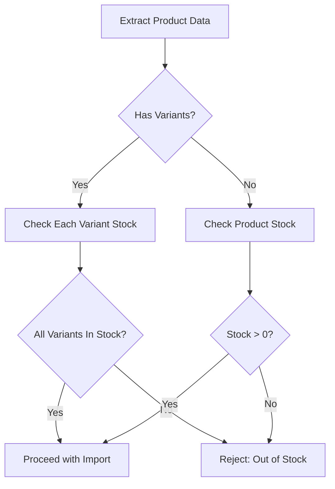

# AliExpress-to-Baby Petite Dropshipping Integration - v2.2 Implementation Plan

**Document Version:** 2.2  
**Date:** February 2026  
**Status:** Draft for Review  
**Project:** Baby Petite E-commerce Platform

---

## Executive Summary

This document outlines the technical implementation plan for integrating AliExpress product sourcing with the Baby Petite e-commerce platform. Version 2.2 focuses on core functionality with relaxed supplier vetting criteria, prioritizing product availability and basic quality metrics over communication quality, return policies, and response times.

---

## 1. System Architecture Overview

### 1.1 High-Level Architecture



### 1.2 Data Flow Summary

| Stage | Input | Output | Storage |
|-------|-------|--------|---------|
| Product Extraction | AliExpress URL | Raw product data | Temporary JSON |
| Data Transformation | Raw data | Structured product | Sanity + PostgreSQL |
| Image Processing | Original images | Processed images | Cloudflare R2 |
| Order Fulfillment | Baby Petite order | AliExpress order data | PostgreSQL |

---

## 2. Data Architecture

### 2.1 Sanity CMS Schema Extensions

Add the following fields to the existing [`product`](sanity/schemas/product.ts) schema:

```typescript
// New field group for sourcing
{
  name: 'sourcing',
  title: 'Sourcing',
}

// Source tracking object
defineField({
  name: 'sourceData',
  title: 'Source Data',
  type: 'object',
  group: 'sourcing',
  fields: [
    defineField({
      name: 'aliExpressProductId',
      title: 'AliExpress Product ID',
      type: 'string',
      description: 'Unique AliExpress product identifier for order fulfillment',
    }),
    defineField({
      name: 'aliExpressUrl',
      title: 'AliExpress URL',
      type: 'url',
      description: 'Original product URL on AliExpress',
    }),
    defineField({
      name: 'supplierId',
      title: 'Supplier ID',
      type: 'string',
      description: 'Reference to supplier in PostgreSQL database',
    }),
    defineField({
      name: 'originalPrice',
      title: 'Original Cost',
      type: 'number',
      description: 'Cost price in cents from AliExpress',
    }),
    defineField({
      name: 'originalCurrency',
      title: 'Original Currency',
      type: 'string',
      initialValue: 'USD',
    }),
    defineField({
      name: 'lastSynced',
      title: 'Last Synced',
      type: 'datetime',
    }),
    defineField({
      name: 'sourceStatus',
      title: 'Source Status',
      type: 'string',
      options: {
        list: [
          { title: 'Active', value: 'active' },
          { title: 'Unavailable', value: 'unavailable' },
          { title: 'Discontinued', value: 'discontinued' },
        ],
      },
    }),
  ],
})

// Variant mapping for AliExpress SKU tracking
defineField({
  name: 'variantMapping',
  title: 'Variant Mapping',
  type: 'array',
  group: 'sourcing',
  of: [
    {
      type: 'object',
      fields: [
        { name: 'localVariantSku', type: 'string', title: 'Local SKU' },
        { name: 'aliExpressSku', type: 'string', title: 'AliExpress SKU ID' },
        { name: 'aliExpressVariantName', type: 'string', title: 'AliExpress Variant Name' },
      ],
    },
  ],
})
```

### 2.2 Prisma Schema Extensions

Add the following models to [`prisma/schema.prisma`](prisma/schema.prisma):

```prisma
// ============================================
// DROPSHIPPING MODELS
// ============================================

/// AliExpress supplier information
model Supplier {
  id              String   @id @default(cuid())
  aliExpressId    String   @unique  // Store ID from AliExpress
  name            String
  storeUrl        String?
  rating          Float?   // Relaxed for v2.2 - optional
  totalOrders     Int      @default(0)
  status          SupplierStatus @default(ACTIVE)
  
  // Minimal tracking for v2.2
  lastOrderAt     DateTime?
  
  products        ProductSource[]
  dropshipOrders  DropshipOrder[]
  
  createdAt       DateTime @default(now())
  updatedAt       DateTime @updatedAt
  
  @@index([aliExpressId])
  @@index([status])
}

enum SupplierStatus {
  ACTIVE
  INACTIVE
  SUSPENDED
}

/// Links Baby Petite products to AliExpress source
model ProductSource {
  id                String   @id @default(cuid())
  
  // Link to Sanity product
  sanityProductId   String   @unique
  productSlug       String   // For quick lookups
  
  // AliExpress identifiers
  aliExpressProductId String
  aliExpressUrl     String
  aliExpressSku     String?  // Default SKU if no variants
  
  // Supplier relationship
  supplierId        String
  supplier          Supplier @relation(fields: [supplierId], references: [id])
  
  // Pricing
  originalPrice     Decimal  @db.Decimal(10, 2)  // Cost price
  originalCurrency  String   @default("USD")
  categoryId        String   // Link to category for markup
  category          Category @relation(fields: [categoryId], references: [id])
  
  // Source images for reference
  originalImageUrls String[]  // URLs to original AliExpress images
  
  // Sync tracking
  lastSyncedAt      DateTime @default(now())
  sourceStatus      SourceStatus @default(ACTIVE)
  inventoryStatus   InventoryStatus @default(AVAILABLE)
  
  // Variant mapping stored as JSON
  variantMapping    Json?    // Maps local SKUs to AliExpress SKUs
  
  // Relationships
  dropshipOrderItems DropshipOrderItem[]
  
  createdAt         DateTime @default(now())
  updatedAt         DateTime @updatedAt
  
  @@index([sanityProductId])
  @@index([aliExpressProductId])
  @@index([supplierId])
  @@index([sourceStatus])
  @@index([categoryId])
}

enum SourceStatus {
  ACTIVE
  UNAVAILABLE
  DISCONTINUED
  PRICE_CHANGED
}

enum InventoryStatus {
  AVAILABLE
  LOW_STOCK
  OUT_OF_STOCK
}

/// Tracks orders placed on AliExpress for fulfillment
model DropshipOrder {
  id                String   @id @default(cuid())
  
  // Link to main order
  orderId           String   @unique
  order             Order    @relation(fields: [orderId], references: [id])
  
  // AliExpress order tracking
  aliExpressOrderId String?  // Populated after placing order on AE
  aliExpressOrderStatus String?
  
  // Fulfillment tracking
  status            DropshipOrderStatus @default(PENDING)
  
  // Customer details for AliExpress order
  customerEmail     String
  customerPhone     String?
  shippingAddress   Json     // Full address for AE order
  
  // Tracking info from AliExpress
  trackingNumber    String?
  trackingUrl       String?
  carrier           String?
  estimatedDelivery DateTime?
  actualDelivery    DateTime?
  
  // Cost tracking
  totalCost         Decimal  @db.Decimal(10, 2)  // Amount paid to AliExpress
  shippingCost      Decimal  @db.Decimal(10, 2)  @default(0)
  
  // Timestamps
  placedAt          DateTime?  // When order was placed on AliExpress
  shippedAt         DateTime?
  deliveredAt       DateTime?
  
  items             DropshipOrderItem[]
  
  createdAt         DateTime @default(now())
  updatedAt         DateTime @updatedAt
  
  @@index([orderId])
  @@index([aliExpressOrderId])
  @@index([status])
}

enum DropshipOrderStatus {
  PENDING         // Needs to be placed on AliExpress
  PLACED          // Order placed on AliExpress
  CONFIRMED       // Supplier confirmed
  SHIPPED         // Shipped by supplier
  DELIVERED       // Delivered to customer
  CANCELLED       // Order cancelled
  REFUNDED        // Refund requested/processed
  ISSUE           // Problem requiring attention
}

/// Individual items in a dropship order
model DropshipOrderItem {
  id                String   @id @default(cuid())
  
  dropshipOrderId   String
  dropshipOrder     DropshipOrder @relation(fields: [dropshipOrderId], references: [id], onDelete: Cascade)
  
  productSourceId   String
  productSource     ProductSource @relation(fields: [productSourceId], references: [id])
  
  // Item details at time of order
  aliExpressSku     String
  quantity          Int
  unitCost          Decimal  @db.Decimal(10, 2)
  totalCost         Decimal  @db.Decimal(10, 2)
  
  // Link to original order item
  orderItemId       String
  
  createdAt         DateTime @default(now())
  
  @@index([dropshipOrderId])
  @@index([productSourceId])
}
```

### 2.3 Update Existing Order Model

Add relationship to the existing [`Order`](prisma/schema.prisma:418) model:

```prisma
model Order {
  // ... existing fields ...
  
  // Add dropshipping relationship
  dropshipOrder     DropshipOrder?
}
```

---

## 3. AliExpress Product Extraction Pipeline

### 3.1 Extraction Methodology

For v2.2, we will use a **hybrid approach** combining:

1. **Browser Automation (Puppeteer/Playwright)** - For dynamic content
2. **HTML Parsing (Cheerio)** - For static content extraction
3. **API Interception** - Capture network responses for structured data



### 3.2 Data Extraction Service Structure

```typescript
// src/services/aliexpress/scraper.ts

interface AliExpressProductData {
  // Basic info
  productId: string;
  title: string;
  description: string;
  
  // Pricing
  price: number;
  originalPrice?: number;
  currency: string;
  
  // Media
  images: string[];
  videos?: string[];
  
  // Variants
  variants: AliExpressVariant[];
  
  // Specifications
  specifications: Record<string, string>;
  
  // Shipping
  shippingOptions: ShippingOption[];
  
  // Supplier
  supplierId: string;
  supplierName: string;
  storeUrl: string;
  
  // Metadata
  productUrl: string;
  scrapedAt: Date;
}

interface AliExpressVariant {
  skuId: string;
  name: string;
  attributes: Record<string, string>;  // e.g., { color: 'Red', size: 'M' }
  price: number;
  stock: number;
  image?: string;
}
```

### 3.3 Required Dependencies

Add to [`package.json`](package.json):

```json
{
  "dependencies": {
    "playwright": "^1.x",
    "cheerio": "^1.x"
  }
}
```

### 3.4 Extraction Implementation Approach

```typescript
// src/services/aliexpress/scraper.ts

export class AliExpressScraper {
  private browser: Browser;
  
  async scrapeProduct(url: string): Promise<AliExpressProductData> {
    // 1. Launch browser with anti-detection measures
    // 2. Navigate to product page
    // 3. Wait for critical content
    // 4. Extract product ID from URL
    // 5. Intercept API calls for structured data
    // 6. Parse HTML for fallback data
    // 7. Extract images, variants, specifications
    // 8. Return structured data
  }
  
  private extractProductId(url: string): string {
    // Parse URL to extract product ID
    // Format: aliexpress.com/item/PRODUCT_ID.html
  }
  
  private async extractVariants(page: Page): Promise<AliExpressVariant[]> {
    // Find variant selector elements
    // Extract SKU mappings
    // Build variant combinations
  }
  
  private async downloadImages(urls: string[]): Promise<Buffer[]> {
    // Download images for processing
    // Store temporarily for AI pipeline
  }
}
```

---

## 4. Product Transformation Pipeline

### 4.1 Transformation Flow



### 4.2 Transformation Rules

| Source Field | Target Field | Transformation |
|--------------|--------------|----------------|
| `title` | `name` | Clean, remove brand names, optimize for SEO |
| `description` | `description` | Convert to Portable Text, rewrite for brand voice |
| `price` | `sourceData.originalPrice` | Convert to cents |
| `price * markup` | `price` | Apply category-based markup, convert to cents |
| `images[]` | `images[]` | Download, convert to WebP, upload to R2 |
| `variants` | `variantMapping` | Map AliExpress SKUs to local SKUs |
| `productId` | `sourceData.aliExpressProductId` | Direct copy |
| `productUrl` | `sourceData.aliExpressUrl` | Direct copy |

### 4.3 SKU Generation Strategy

```typescript
// Generate unique SKUs for Baby Petite products
function generateSKU(aliExpressProductId: string, variant?: AliExpressVariant): string {
  const prefix = 'KP';
  const productHash = hashProductId(aliExpressProductId).slice(0, 6);
  const variantCode = variant ? generateVariantCode(variant) : '00';
  return `${prefix}-${productHash}-${variantCode}`.toUpperCase();
}

function generateVariantCode(variant: AliExpressVariant): string {
  // Generate 2-character code based on variant attributes
  // e.g., Red + Medium = 'RM'
}
```

### 4.4 Price Calculation

```typescript
interface CategoryPricing {
  markupFactor: number;      // From category settings
  shippingBuffer: number;    // From category settings
  platformFees: number;      // Default: 0.05 (5%)
  roundToNearest: number;    // Default: 0.99
}

function calculateRetailPrice(
  costPrice: number,
  categoryPricing: CategoryPricing
): number {
  const markedUp = costPrice * categoryPricing.markupFactor;
  const withShipping = markedUp + categoryPricing.shippingBuffer;
  const withFees = withShipping * (1 + categoryPricing.platformFees);
  
  // Round to .99
  const rounded = Math.floor(withFees) + categoryPricing.roundToNearest;
  
  return Math.round(rounded * 100); // Convert to cents
}
```

**Note:** Markup factor is retrieved from the selected category's pricing configuration (see Section 13).

---

## 5. Order Fulfillment Workflow

### 5.1 Fulfillment Process Flow



### 5.2 Order Fulfillment Dashboard

The admin dashboard should display:

1. **Pending Orders** - Orders needing AliExpress placement
2. **Active Orders** - Orders placed but not yet delivered
3. **Tracking Updates** - Recent tracking number updates
4. **Issues** - Orders with problems requiring attention

### 5.3 Fulfillment Data Structure

```typescript
// When an order is placed, create fulfillment record
interface FulfillmentOrderData {
  orderId: string;
  orderNumber: string;
  customerEmail: string;
  customerPhone?: string;
  shippingAddress: {
    firstName: string;
    lastName: string;
    line1: string;
    line2?: string;
    city: string;
    state: string;
    zip: string;
    country: string;
    phone?: string;
  };
  items: Array<{
    productSourceId: string;
    aliExpressSku: string;
    aliExpressUrl: string;
    quantity: number;
    unitCost: number;
  }>;
}
```

### 5.4 Semi-Automated Fulfillment Process

For v2.2, we implement a **semi-automated** approach:

1. **Automatic Record Creation** - When order is placed, create `DropshipOrder` record
2. **Admin Dashboard** - Display pending orders with direct links to AliExpress products
3. **One-Click Copy** - Pre-formatted shipping details for easy paste into AliExpress
4. **Manual Order Placement** - Admin places order on AliExpress manually
5. **Tracking Entry** - Admin enters tracking number from AliExpress
6. **Status Sync** - System updates order status and notifies customer

---

## 6. API Endpoints

### 6.1 Product Import Endpoints

| Method | Endpoint | Description |
|--------|----------|-------------|
| POST | `/api/admin/import/preview` | Preview product data from AliExpress URL |
| POST | `/api/admin/import/product` | Import product from AliExpress |
| GET | `/api/admin/import/status/:id` | Check import job status |
| POST | `/api/admin/import/batch` | Batch import multiple products |

### 6.2 Supplier Management Endpoints

| Method | Endpoint | Description |
|--------|----------|-------------|
| GET | `/api/admin/suppliers` | List all suppliers |
| GET | `/api/admin/suppliers/:id` | Get supplier details |
| PUT | `/api/admin/suppliers/:id/status` | Update supplier status |

### 6.3 Fulfillment Endpoints

| Method | Endpoint | Description |
|--------|----------|-------------|
| GET | `/api/admin/fulfillment/pending` | Get pending fulfillment orders |
| GET | `/api/admin/fulfillment/:orderId` | Get fulfillment details |
| PUT | `/api/admin/fulfillment/:orderId/tracking` | Update tracking information |
| PUT | `/api/admin/fulfillment/:orderId/status` | Update fulfillment status |

---

## 7. Admin Dashboard Components

### 7.1 Product Import Interface

```
┌─────────────────────────────────────────────────────────────┐
│  Product Import                                             │
├─────────────────────────────────────────────────────────────┤
│  AliExpress URL: [________________________________] [Preview]│
│                                                             │
│  ┌─────────────────────────────────────────────────────┐   │
│  │ Preview Panel                                       │   │
│  │ ┌──────┐ Name: Baby Cotton Romper                   │   │
│  │ │ IMG  │ Cost: $5.99                                │   │
│  │ └──────┘ Variants: 3 colors, 5 sizes (156 units)   │   │
│  │          Supplier: Kids Fashion Store               │   │
│  └─────────────────────────────────────────────────────┘   │
│                                                             │
│  Category: [Select Category                    ▼]           │
│            Selected: Bodysuits & Rompers (2.8x markup)     │
│                                                             │
│  Calculated Price: $19.99                                   │
│                                                             │
│  [Cancel] [Import Product]                                  │
└─────────────────────────────────────────────────────────────┘
```

### 7.2 Fulfillment Dashboard

```
┌─────────────────────────────────────────────────────────────┐
│  Order Fulfillment                                          │
├─────────────────────────────────────────────────────────────┤
│  [Pending (5)] [Placed (3)] [Shipped (12)] [Issues (1)]    │
├─────────────────────────────────────────────────────────────┤
│  Order #KP-ABC123                                           │
│  Customer: John Doe                                         │
│  Items: 2 products                                          │
│  ┌─────────────────────────────────────────────────────┐   │
│  │ Product: Baby Romper - Red, 6M                      │   │
│  │ AliExpress: [Open Product Page] [Copy Address]      │   │
│  │ Cost: $5.99 | Qty: 1                                │   │
│  └─────────────────────────────────────────────────────┘   │
│                                                             │
│  Tracking: [________________] [Mark as Shipped]            │
└─────────────────────────────────────────────────────────────┘
```

---

## 8. Implementation Phases

### Phase 1: Data Architecture
- [ ] Add Sanity schema extensions for source tracking
- [ ] Add Prisma models for Supplier, ProductSource, DropshipOrder
- [ ] Add category pricing fields to Category model
- [ ] Run database migration
- [ ] Create TypeScript types for new models

### Phase 2: Extraction Pipeline
- [ ] Install Playwright and Cheerio dependencies
- [ ] Create AliExpress scraper service
- [ ] Implement product data extraction
- [ ] Implement variant parsing
- [ ] Add stock validation during extraction
- [ ] Add image download functionality

### Phase 3: Transformation & Import
- [ ] Create data transformation service
- [ ] Implement category-based price calculation
- [ ] Create image processing service (download, WebP conversion, R2 upload)
- [ ] Create Sanity document creation service
- [ ] Create PostgreSQL record creation service
- [ ] Build import preview API endpoint with category selection

### Phase 4: Admin Interface
- [ ] Create product import page with category selection
- [ ] Create supplier management page
- [ ] Create fulfillment dashboard
- [ ] Add tracking update functionality

### Phase 5: Order Fulfillment
- [ ] Create DropshipOrder on order placement
- [ ] Build fulfillment workflow UI
- [ ] Implement tracking sync
- [ ] Add customer notification triggers

---

## 9. Technical Considerations

### 9.1 Scraping Compliance

- Respect `robots.txt` directives
- Implement rate limiting between requests
- Use realistic browser fingerprints
- Cache results to minimize repeated requests
- Consider AliExpress API partnership for production

### 9.2 Error Handling

```typescript
enum ScrapingError {
  PRODUCT_NOT_FOUND = 'PRODUCT_NOT_FOUND',
  PRODUCT_UNAVAILABLE = 'PRODUCT_UNAVAILABLE',
  RATE_LIMITED = 'RATE_LIMITED',
  BLOCKED = 'BLOCKED',
  PARSE_ERROR = 'PARSE_ERROR',
}

enum ImportError {
  VALIDATION_FAILED = 'VALIDATION_FAILED',
  DUPLICATE_PRODUCT = 'DUPLICATE_PRODUCT',
  IMAGE_DOWNLOAD_FAILED = 'IMAGE_DOWNLOAD_FAILED',
  SANITY_ERROR = 'SANITY_ERROR',
  DATABASE_ERROR = 'DATABASE_ERROR',
}
```

### 9.3 Security Considerations

- Store AliExpress URLs and product IDs, not credentials
- Sanitize all imported content
- Validate image URLs before download
- Rate limit import API endpoints
- Admin-only access to import functionality

---

## 10. Testing Strategy

### 10.1 Unit Tests
- Price calculation functions
- SKU generation
- Data transformation logic
- Variant mapping

### 10.2 Integration Tests
- Scraper service with mock responses
- Import API endpoints
- Database operations
- Sanity CMS operations

### 10.3 E2E Tests
- Complete import workflow
- Order fulfillment workflow
- Tracking update flow

---

## 11. Future Enhancements (Post v2.2)

1. **Automated Order Placement** - Integrate with AliExpress API for automatic order placement
2. **Real-time Inventory Sync** - Periodic checks for stock availability
3. **Price Monitoring** - Alert when supplier prices change
4. **Multi-Supplier Support** - Add support for other platforms (Temu, CJ Dropshipping)
5. **Automated Tracking Sync** - Poll AliExpress for tracking updates

---

## 12. Design Decisions (Confirmed)

Based on stakeholder feedback, the following decisions have been made:

| Decision | Choice | Implementation Notes |
|----------|--------|---------------------|
| **Markup Strategy** | Configurable per category | Research market pricing for each category; store in category settings |
| **Image Handling** | Use original images | AI regeneration removed from v2.2 scope; download and store original images |
| **Fulfillment Automation** | Semi-automated | Product creation/deletion automatic; order placement manual |
| **Inventory Sync** | Check during import | Validate stock availability before import; reject out-of-stock products |
| **Category Mapping** | Manual assignment | Admin selects category during import preview |

---

## 13. Category-Based Pricing Configuration

### 13.1 Pricing Configuration Schema

Add to the existing [`Category`](prisma/schema.prisma:152) model:

```prisma
model Category {
  // ... existing fields ...
  
  // Dropshipping pricing configuration
  markupFactor      Float    @default(2.5)
  shippingBuffer    Decimal  @db.Decimal(10, 2) @default(3.00)
  minPrice          Decimal? @db.Decimal(10, 2)  // Minimum retail price
  maxPrice          Decimal? @db.Decimal(10, 2)  // Maximum retail price
  
  // Relationship to sourced products
  productSources    ProductSource[]
}
```

### 13.2 Recommended Category Markups (Market Research)

Based on typical children's clothing market analysis:

| Category | Recommended Markup | Notes |
|----------|-------------------|-------|
| Bodysuits & Rompers | 2.8x - 3.2x | High competition, volume-based |
| Dresses | 3.0x - 3.5x | Higher perceived value |
| Outerwear | 2.5x - 3.0x | Seasonal, higher price point |
| Sleepwear | 2.8x - 3.0x | Essential item |
| Accessories | 3.5x - 4.0x | Low cost, high margin potential |
| Shoes | 2.5x - 3.0x | Sizing complexity |
| Sets & Outfits | 2.8x - 3.2x | Bundle value |

### 13.3 Price Validation

```typescript
interface CategoryPricing {
  markupFactor: number;
  shippingBuffer: number;
  minPrice?: number;
  maxPrice?: number;
}

function validatePrice(
  retailPrice: number,
  categoryPricing: CategoryPricing
): { valid: boolean; message?: string } {
  if (categoryPricing.minPrice && retailPrice < categoryPricing.minPrice) {
    return { valid: false, message: `Price below minimum of $${categoryPricing.minPrice}` };
  }
  if (categoryPricing.maxPrice && retailPrice > categoryPricing.maxPrice) {
    return { valid: false, message: `Price above maximum of $${categoryPricing.maxPrice}` };
  }
  return { valid: true };
}
```

---

## 14. Simplified Image Pipeline (v2.2)

### 14.1 Image Processing Flow


### 14.2 Image Storage Structure

```
cloudflare-r2://baby-petite-products/
├── imported/
│   ├── {product-id}/
│   │   ├── primary.webp
│   │   ├── gallery-1.webp
│   │   ├── gallery-2.webp
│   │   └── ...
```

### 14.3 Image Processing Service

```typescript
// src/services/image-processor.ts

export class ImageProcessor {
  async processAliExpressImages(
    imageUrls: string[],
    productId: string
  ): Promise<ProcessedImages> {
    const processed: ProcessedImage[] = [];
    
    for (let i = 0; i < imageUrls.length; i++) {
      const url = imageUrls[i];
      
      // 1. Download image
      const buffer = await this.downloadImage(url);
      
      // 2. Validate and convert to WebP
      const webpBuffer = await this.convertToWebP(buffer);
      
      // 3. Upload to R2
      const filename = i === 0 ? 'primary' : `gallery-${i}`;
      const r2Url = await this.uploadToR2(webpBuffer, productId, filename);
      
      // 4. Create Sanity asset
      const sanityAsset = await this.createSanityImageAsset(r2Url);
      
      processed.push({
        url: r2Url,
        sanityAssetId: sanityAsset._id,
        isPrimary: i === 0,
      });
    }
    
    return { images: processed };
  }
}
```

---

## 15. Stock Validation During Import

### 15.1 Stock Check Flow



### 15.2 Stock Validation Logic

```typescript
interface StockValidation {
  isValid: boolean;
  availableVariants: AliExpressVariant[];
  outOfStockVariants: string[];
  message: string;
}

function validateStock(product: AliExpressProductData): StockValidation {
  if (product.variants.length > 0) {
    const inStock = product.variants.filter(v => v.stock > 0);
    const outOfStock = product.variants.filter(v => v.stock === 0);
    
    if (inStock.length === 0) {
      return {
        isValid: false,
        availableVariants: [],
        outOfStockVariants: outOfStock.map(v => v.name),
        message: 'All variants are out of stock',
      };
    }
    
    return {
      isValid: true,
      availableVariants: inStock,
      outOfStockVariants: outOfStock.map(v => v.name),
      message: outOfStock.length > 0 
        ? `${outOfStock.length} variant(s) out of stock, ${inStock.length} available`
        : 'All variants in stock',
    };
  }
  
  // Single product (no variants)
  return {
    isValid: product.stock > 0,
    availableVariants: [],
    outOfStockVariants: [],
    message: product.stock > 0 ? 'Product in stock' : 'Product out of stock',
  };
}
```

---

## 16. Manual Category Assignment UI

### 16.1 Category Selection During Import

```
┌─────────────────────────────────────────────────────────────┐
│  Import Preview                                             │
├─────────────────────────────────────────────────────────────┤
│  Product: Baby Cotton Romper                                │
│                                                             │
│  Category: [Select Category                    ▼]           │
│            ├─ Bodysuits & Rompers                           │
│            ├─ Dresses                                       │
│            ├─ Sleepwear                                     │
│            └─ ...                                           │
│                                                             │
│  Pricing:                                                   │
│  • Cost: $5.99                                              │
│  • Category Markup: 2.8x                                    │
│  • Calculated Retail: $19.99                                │
│                                                             │
│  Stock: 156 units available (3 variants)                    │
│                                                             │
│  [Cancel] [Import Product]                                  │
└─────────────────────────────────────────────────────────────┘
```

---

**Document Status:** Approved - Ready for Implementation  
**Updated:** February 2026
