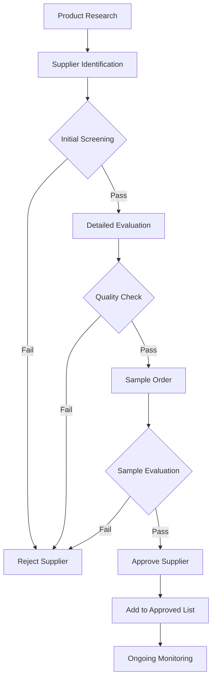
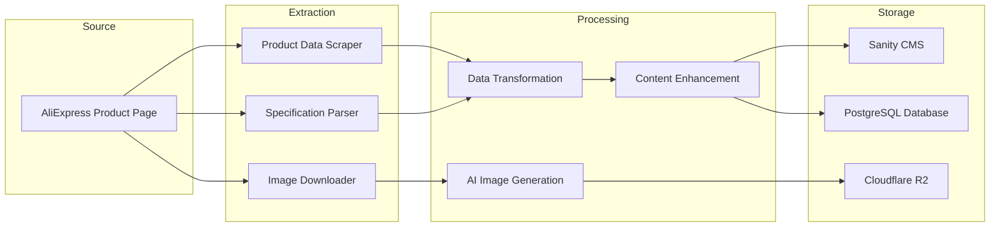
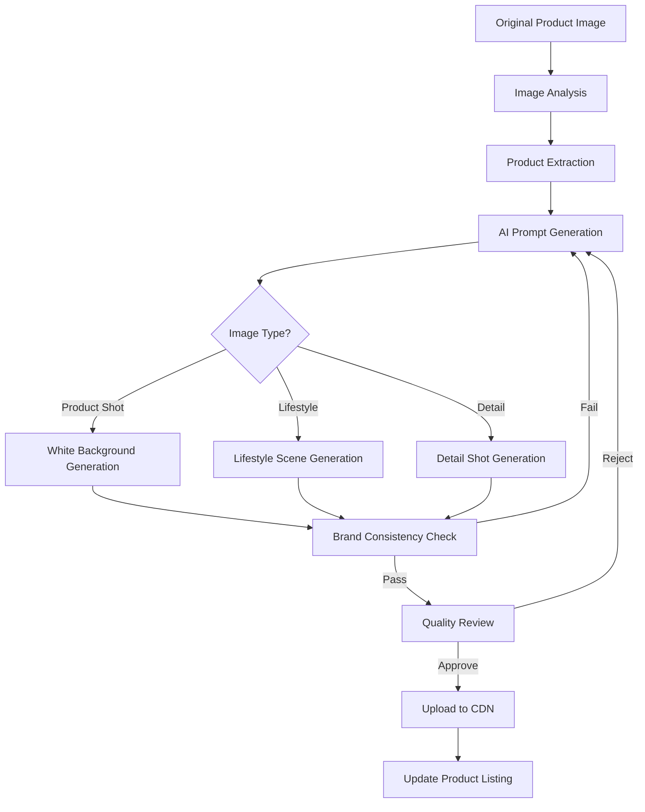
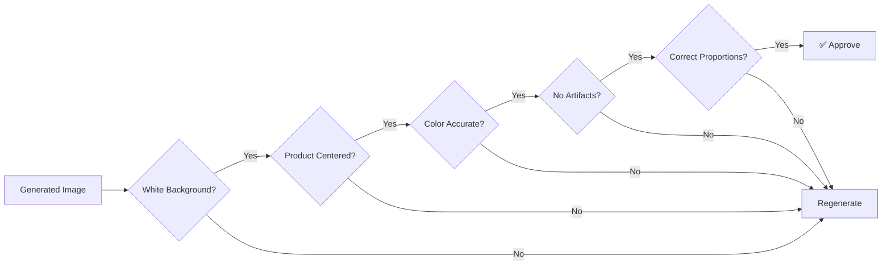
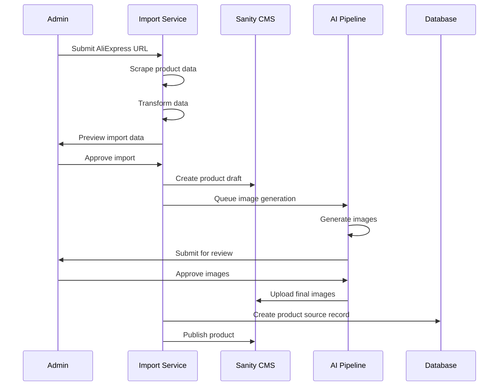

# Dropshipping Strategy: AliExpress Sourcing with AI Product Photography

**Document Version:** 1.0  
**Date:** February 2026  
**Status:** Draft - Pending Clarification  
**Project:** Kids Petite E-commerce Platform

---

## Executive Summary

This document outlines a comprehensive strategy for sourcing products from AliExpress for dropshipping, with a detailed workflow for leveraging AI image generation to recreate product photography. The strategy ensures cohesive visual identity and strict brand consistency across all store assets, aligned with the Kids Petite brand guidelines.

---

## 1. Current Project Context

### 1.1 Platform Overview

- **Brand:** Kids Petite - Children's clothing e-commerce platform
- **Tech Stack:** Next.js 15, Sanity CMS, PostgreSQL, Stripe, OpenAI
- **Design Philosophy:** High-density, minimalist interface with product-focused photography
- **Brand Colors:** White (#FFFFFF), Yellow (#FFD700), Gray scale
- **Photography Style:** Pure white backgrounds, product-centered, minimal props

### 1.2 Existing Infrastructure

| Component | Technology | Relevance to Dropshipping |
|-----------|------------|---------------------------|
| CMS | Sanity 3.x | Product content management |
| Database | PostgreSQL + Prisma | Product/inventory data |
| AI/ML | OpenAI 5.x | Image generation capabilities |
| CDN | Cloudflare | Image delivery optimization |
| Search | Algolia | Product discovery |

---

## 2. AliExpress Sourcing Strategy

### 2.1 Supplier Vetting Process



### 2.2 Supplier Evaluation Criteria

| Criterion | Weight | Evaluation Method |
|-----------|--------|-------------------|
| **Store Rating** | 20% | Minimum 4.5 stars, 95%+ positive feedback |
| **Response Time** | 15% | Average response under 24 hours |
| **Processing Time** | 20% | Ships within 3-5 business days |
| **Product Quality** | 25% | Sample order evaluation |
| **Communication** | 10% | English proficiency, professionalism |
| **Return Policy** | 10% | Accepts returns, clear refund process |

### 2.3 Product Selection Framework

**Category Focus:**
- Children's clothing (ages 0-8 years)
- Accessories (hats, socks, bibs)
- Nursery decor and essentials

**Product Criteria:**
- Minimum 50 orders (proven demand)
- 4.5+ star rating
- Multiple color/size variants available
- Clear product specifications
- High-quality original photography (for AI reference)

### 2.4 Pricing Strategy

```
Retail Price = (AliExpress Cost × Markup Factor) + Shipping Buffer + Platform Fees

Where:
- Markup Factor: 2.5x - 4x (based on product category)
- Shipping Buffer: $2-5 (for free shipping offers)
- Platform Fees: ~3% (Stripe) + ~2% (platform costs)
```

---

## 3. Product Listing Import Pipeline

### 3.1 Import Workflow Architecture



### 3.2 Data Extraction Process

**Step 1: Product Identification**
- AliExpress product URL input
- Product ID extraction
- Variant mapping (sizes, colors)

**Step 2: Data Scraping**
- Product title and description
- Price and compare-at price
- Specifications (material, dimensions, age range)
- Original images (for AI reference)
- Customer reviews (for quality insights)

**Step 3: Data Transformation**

| Source Field | Target Field | Transformation |
|--------------|--------------|----------------|
| Product Title | name | Clean, optimize for SEO |
| Description | description | Rewrite for brand voice |
| Price | price | Convert to cents, apply markup |
| Original Price | compareAtPrice | Convert to cents |
| SKU | sku | Generate unique SKU |
| Images | images | AI regeneration pipeline |
| Specifications | specifications | Parse and structure |

### 3.3 Sanity CMS Integration

**Product Schema Extensions:**

```typescript
// Additional fields for dropshipping
defineField({
  name: 'sourceData',
  title: 'Source Data',
  type: 'object',
  group: 'sourcing',
  fields: [
    defineField({
      name: 'aliExpressUrl',
      title: 'AliExpress URL',
      type: 'url',
    }),
    defineField({
      name: 'supplierId',
      title: 'Supplier ID',
      type: 'string',
    }),
    defineField({
      name: 'originalPrice',
      title: 'Original Cost',
      type: 'number',
    }),
    defineField({
      name: 'lastSynced',
      title: 'Last Synced',
      type: 'datetime',
    }),
    defineField({
      name: 'inventoryTracking',
      title: 'Inventory Tracking',
      type: 'string',
      options: {
        list: [
          { title: 'Manual', value: 'manual' },
          { title: 'Auto-sync', value: 'auto' },
        ],
      },
    }),
  ],
})
```

---

## 4. AI Image Generation Workflow

### 4.1 Image Generation Pipeline



### 4.2 AI Provider Selection

**Recommended Provider: OpenAI DALL-E 3**

| Provider | Pros | Cons | Recommendation |
|----------|------|------|----------------|
| **DALL-E 3** | High quality, good text understanding, API access | Higher cost, some style limitations | ✅ Primary |
| **Midjourney** | Excellent aesthetics, photorealistic | No official API, manual process | ⚠️ Backup |
| **Stable Diffusion** | Open source, customizable, cost-effective | Requires infrastructure, variable quality | ⚠️ Alternative |
| **Adobe Firefly** | Commercial safe, good integration | Limited photorealism | ⚠️ Consider |

### 4.3 Prompt Engineering Framework

**Base Prompt Template:**

```
Professional product photography of [PRODUCT_DESCRIPTION], 
pure white background (#FFFFFF), soft even lighting, 
product-centered composition, high resolution, 
commercial photography style, no shadows, 
no props, no text overlay, 
children's clothing category, 
[SIZE_REFERENCE if applicable]
```

**Lifestyle Prompt Template:**

```
Professional lifestyle photography of [PRODUCT_DESCRIPTION], 
child model (age [AGE]) wearing the product, 
minimal light gray studio background, 
natural soft lighting, candid expression, 
clean modern aesthetic, 
no text overlay, commercial photography style
```

**Detail Shot Template:**

```
Macro product photography detail shot of [PRODUCT_DETAIL], 
fabric texture close-up, pure white background, 
soft lighting, high resolution, 
commercial product photography style
```

### 4.4 Image Specifications

| Image Type | Dimensions | Format | Use Case |
|------------|------------|--------|----------|
| Primary | 800×800px | WebP | Product listing main image |
| Secondary | 600×800px | WebP | Product gallery |
| Thumbnail | 200×200px | WebP | Category pages, cart |
| Lifestyle | 1200×800px | WebP | Product page hero |
| Detail | 400×400px | WebP | Zoom/detail views |

---

## 5. Brand Consistency Guidelines

### 5.1 Visual Identity Requirements

**Background Standards:**
- Pure white (#FFFFFF) for all product shots
- No gradients or colored backgrounds
- Consistent lighting (soft, even, shadowless)

**Composition Rules:**
- Product centered in frame
- 10-15% padding around product
- Consistent angle across similar products
- Front-facing primary shot

**Color Accuracy:**
- True-to-life color representation
- No color enhancement or filters
- Multiple angles for color variants

### 5.2 AI Generation Quality Checklist



### 5.3 Quality Control Process

**Automated Checks:**
1. Background color validation (must be #FFFFFF)
2. Image dimensions verification
3. File size optimization
4. Format conversion (WebP)

**Manual Review:**
1. Product accuracy vs original
2. Color representation
3. Professional appearance
4. Brand alignment

---

## 6. Technical Implementation Requirements

### 6.1 New Components Required

| Component | Purpose | Technology |
|-----------|---------|------------|
| Product Import Service | Scrape and transform AliExpress data | Node.js, Cheerio |
| AI Image Pipeline | Generate and process images | OpenAI API, Sharp |
| Inventory Sync Service | Track supplier stock levels | Node.js, Cron |
| Quality Control Dashboard | Review generated images | React, Next.js |

### 6.2 Database Schema Extensions

```prisma
// Add to existing schema

model Supplier {
  id            String   @id @default(cuid())
  name          String
  aliExpressId  String   @unique
  rating        Float
  responseTime  Int      // hours
  status        SupplierStatus @default(ACTIVE)
  products      Product[]
  createdAt     DateTime @default(now())
  updatedAt     DateTime @updatedAt
}

enum SupplierStatus {
  ACTIVE
  INACTIVE
  SUSPENDED
}

model ProductSource {
  id              String   @id @default(cuid())
  productId       String
  product         Product  @relation(fields: [productId], references: [id])
  aliExpressUrl   String
  supplierId      String
  supplier        Supplier @relation(fields: [supplierId], references: [id])
  originalPrice   Int      // in cents
  originalImages  String[] // URLs to original images
  lastSynced      DateTime @default(now())
  inventoryStatus String
  createdAt       DateTime @default(now())
  updatedAt       DateTime @updatedAt
}

model GeneratedImage {
  id          String   @id @default(cuid())
  productId   String
  product     Product  @relation(fields: [productId], references: [id])
  type        ImageType
  prompt      String
  originalUrl String?  // Reference to source image
  generatedUrl String
  approved    Boolean  @default(false)
  createdAt   DateTime @default(now())
}

enum ImageType {
  PRIMARY
  SECONDARY
  LIFESTYLE
  DETAIL
  THUMBNAIL
}
```

### 6.3 API Endpoints Required

| Method | Endpoint | Description |
|--------|----------|-------------|
| POST | `/api/admin/import/product` | Import product from AliExpress URL |
| GET | `/api/admin/import/preview` | Preview product data before import |
| POST | `/api/admin/images/generate` | Generate AI images for product |
| POST | `/api/admin/images/approve` | Approve generated image |
| GET | `/api/admin/suppliers` | List approved suppliers |
| POST | `/api/admin/suppliers` | Add new supplier |
| GET | `/api/admin/sync/inventory` | Trigger inventory sync |

---

## 7. Operational Workflow

### 7.1 Product Import Process



### 7.2 Ongoing Maintenance

**Daily Tasks:**
- Monitor order fulfillment status
- Check supplier response times
- Review customer feedback

**Weekly Tasks:**
- Sync inventory levels
- Review generated image quality
- Update pricing based on supplier changes

**Monthly Tasks:**
- Supplier performance review
- Product catalog optimization
- AI prompt refinement

---

## 8. Risk Mitigation

### 8.1 Identified Risks

| Risk | Likelihood | Impact | Mitigation |
|------|------------|--------|------------|
| Supplier quality issues | Medium | High | Sample orders, rating monitoring |
| Shipping delays | High | Medium | Multiple suppliers, buffer times |
| AI image quality issues | Medium | Medium | Quality review process, prompt refinement |
| Inventory sync failures | Medium | High | Automated alerts, manual backup |
| IP concerns with AI images | Low | High | Use original product as reference only |

### 8.2 Contingency Plans

**Supplier Failure:**
- Maintain backup supplier list
- Keep 2-week safety stock for bestsellers
- Automated supplier switching

**AI Generation Issues:**
- Manual photography fallback
- Third-party image services
- Original image licensing (if permitted)

---

## 9. Open Questions for Clarification

Before finalizing this strategy, please provide input on the following:

### 9.1 Business Decisions

1. **Product Categories:** Should we focus exclusively on children's clothing, or expand to toys/accessories?

2. **Catalog Size:** What is the target number of products? (50, 500, 5000+)

3. **Pricing Strategy:** What markup factor should be applied? (2.5x, 3x, 4x)

4. **Target Markets:** Which regions will be served? (affects shipping, labeling requirements)

### 9.2 Technical Decisions

5. **AI Provider:** Is OpenAI DALL-E 3 acceptable, or is there a preference for another provider?

6. **Automation Level:** Should the import process be fully automated or require manual approval at each step?

7. **Image Types:** Do you need lifestyle images with child models, or product-only shots?

8. **Inventory Sync:** Should inventory sync with AliExpress be real-time or batched?

### 9.3 Resource Decisions

9. **Budget:** What is the budget for AI image generation per product?

10. **Human Review:** Will there be dedicated staff for image quality review, or is this automated?

---

## 10. Next Steps

Upon clarification of the above questions, the following actions will be taken:

1. Finalize supplier vetting criteria
2. Complete technical specifications for import pipeline
3. Develop AI prompt library for product categories
4. Create implementation roadmap
5. Define success metrics and KPIs

---

**Document Status:** Draft - Awaiting User Input  
**Next Review:** Upon user feedback
